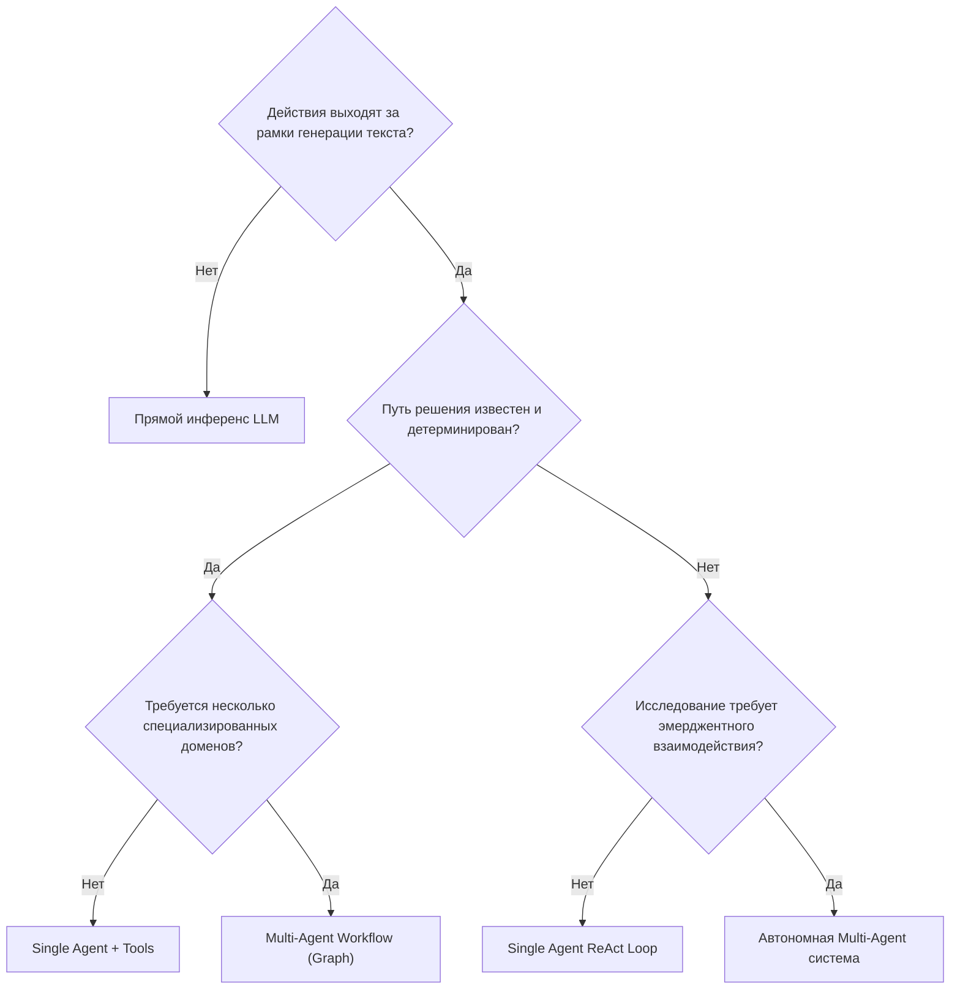
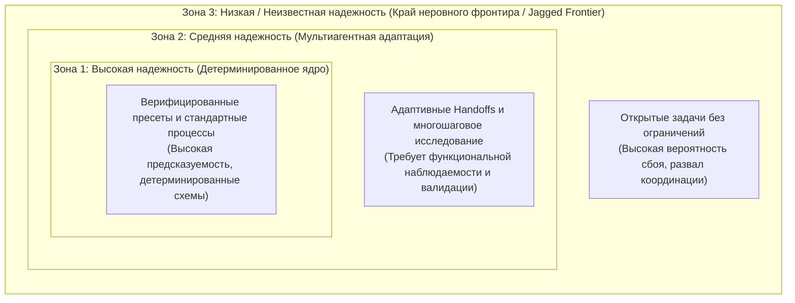

#review

## Table of Contents
- [[#Глава 1: Основы агентов и сложность]]
  - [[#1.1 Executive Overview]]
  - [[#1.2 Механика и топология]]
  - [[#1.3 Инженерные компромиссы (Trade-offs)]]
  - [[#1.4 Режимы сбоев и узкие места (Failure Modes & Bottlenecks)]]
  - [[#1.5 Фреймворк принятия решений (Decision Framework)]]
- [[#Глава 2: Мультиагентные паттерны (Multi-Agent Patterns)]]
  - [[#2.1 Executive Overview]]
  - [[#2.2 Механика и топология]]
    - [[#2.2.1 Паттерны рабочих процессов (Workflow Patterns: явный контроль)]]
    - [[#2.2.2 Автономные паттерны (Autonomous Patterns: эмерджентный контроль)]]
    - [[#2.2.3 Паттерны управления задачами (Task Management Patterns)]]
  - [[#2.3 Инженерные компромиссы (Trade-offs)]]
  - [[#2.4 Режимы сбоев и узкие места (Failure Modes & Bottlenecks)]]
  - [[#2.5 Фреймворк принятия решений (Decision Framework)]]
- [[#Глава 3: Принципы UX и проектирование делегирования (Delegation Design)]]
  - [[#3.1 Executive Overview]]
  - [[#3.2 Механика и топология]]
  - [[#3.3 Инженерные компромиссы (Trade-offs)]]
  - [[#3.4 Режимы сбоев и узкие места (Failure Modes & Bottlenecks)]]
  - [[#3.5 Фреймворк принятия решений (Decision Framework)]]
- [[#Vault Links]]

---

## Глава 1: Основы агентов и сложность

### 1.1 Executive Overview
Генеративные базовые модели (foundation models) превосходно справляются с синтезом текста и статическим извлечением знаний, но ломаются при столкновении с многошаговым выполнением задач, динамической обратной связью от среды или внешними побочными эффектами (side effects). Преодоление этих ограничений требует перехода от сырого инференса модели к агентным системам (agentic systems), связывающим reasoning-модели с детерминированными инструментами (tools) и памятью с сохранением состояния (stateful memory).

#### Иерархия сложности задач (Task Complexity Hierarchy)
Граница между архитектурами определяется операционной сложностью задачи:

| Уровень сложности | Архетип системы | Ключевые возможности | Вектор сбоя более низкого уровня |
| :--- | :--- | :--- | :--- |
| **Model-Level** | Прямой инференс LLM | Генерация текста, статическое параметрическое извлечение знаний | Неспособность верифицировать состояние в реальном времени, взаимодействовать с API или совершать проверяемые действия. |
| **Agent-Level** | Одиночный цикл агента (Single Agent Loop) | Reasoning, вызов инструментов (tool invocation), рабочая память (working memory) | Насыщение контекстного окна (context window) на многоэтапных рабочих процессах; когнитивное искажение одной роли (single-persona bias). |
| **Multi-Agent** | Распределенная агентная система (Distributed Agent System) | Специализация ролей, изоляция контекста, коллективное планирование | Дрейф контекста одиночного агента (context drift), неуправляемое разрастание промпта (prompt bloat), отсутствие изолированной доменной верификации. |

#### Драйверы сложности, требующие Multi-Agent систем
1. **Планирование (Decomposition)**: Задачи, требующие многоэтапной генерации направленного ациклического графа (DAG), разрешения зависимостей и динамического перепланирования на основе промежуточных результатов.
2. **Разнородная экспертиза (Diverse Expertise)**: Изоляция гетерогенных доменов (например, юридический комплаенс, верстка фронтенда, генерация SQL) в отдельные персоны со специализированными System prompt и жестко ограниченными схемами инструментов (tool schemas).
3. **Обширный контекст (Extensive Context)**: Рабочие процессы, превышающие объем рабочей памяти или пределы надежного внимания (attention limits) одного промпта, требующие локализованных границ контекста.
4. **Адаптивные решения (Adaptive Solutions)**: Недетерминированные проблемные области, где решения нельзя жестко закодировать и где они должны эволюционировать итеративно через обратную связь от компиляторов, линтеров или человека.

---

### 1.2 Механика и топология

#### Базовые возможности и трехкомпонентная модель (Tripartite Component Model)
Агент определяется четырьмя операционными возможностями:
- **Reason**: Синтезировать состояние, декомпозировать цели и оценивать гипотезы.
- **Act**: Выполнять детерминированные действия с внешними эффектами через интерфейсы инструментов (tools).
- **Communicate**: Обмениваться структурированными данными (payloads) с оператором-человеком или другими агентами.
- **Adapt**: Модифицировать стратегии выполнения на основе ошибок среды и циклов обратной связи.

Эти возможности опираются на три базовых компонента:
1. **Model**: Вероятностное ядро рассуждений (обычно LLM).
2. **Tools**: Типизированные операционные интерфейсы (API, базы данных, запуск bash-скриптов), обеспечивающие воздействие на внешнюю среду (environmental agency).
3. **Memory**: Эфемерные рабочие буферы (working memory внутри контекста) и долговременное хранилище (векторные базы данных, реляционный стейт).

#### Декомпозиция задач и жизненный цикл выполнения
Многошаговые инженерные задачи требуют структурированного разделения труда между специализированными агентами с объединением автоматизированного выполнения и валидации с участием человека (human-in-the-loop):
![[Screenshot 2026-09-06 at 17.13.10.png]]

#### Топологии оркестрации: Workflow против Autonomous
Координация системы разделяется на две отчетливые парадигмы управления:
- **Workflow Orchestration (определенный граф)**: Поток управления (control flow) явно запрограммирован в виде вычислительного графа. Переходы между узлами детерминированы или ограничены жесткими правилами.
- **Autonomous Orchestration (на базе AI)**: Поток управления динамически согласуется во время выполнения самой LLM на основе состояния диалога, вывода инструментов и прогресса выполнения задачи.
![[Screenshot 2026-09-06 at 17.18.38.png]]

---

### 1.3 Инженерные компромиссы (Trade-offs)

#### Изоляция контекста против задержки (Latency) и затрат на координацию
- **Изоляция границ контекста (Context Boundary Isolation)**: Разделение задач между специализированными агентами сохраняет компактность контекстных окон каждого агента, минимизируя разрастание промпта и размывание инструкций (instruction dilution).
- **Мультипликация задержки (Latency Multiplication)**: Каждый дополнительный вызов агента вносит последовательную сетевую задержку I/O и время генерации LLM, увеличивая общее сквозное время ответа (end-to-end latency).
- **Оверхед по токенам (Token Overhead)**: Передача состояния между агентами требует сериализации, десериализации и избыточного обрамления системными промптами (system prompt framing).

#### Автоматизация неявных знаний (Tacit Knowledge) против кодификации правил
Задачи, требующие неявных знаний (эвристики, чувство вкуса в дизайне, некодифицированная операционная интуиция), плохо поддаются статическим движкам правил. LLM-агенты приближенно воспроизводят неявные рассуждения за счет контекстных подсказок (few-shot), но ценой недетерминированного выполнения и постоянной необходимости в верификации.

#### Экономический арбитраж
Автоматизация на базе агентов работает по принципу арбитража времени:
- **Выполнение экспертом-человеком**: $30.00 – $100.00 в час с жесткими ограничениями пропускной способности.
- **Выполнение Multi-Agent системой**: $1.00 – $2.00 совокупных затрат на токены и вычисления на сложный прогон, работа 24/7 с мгновенной масштабируемостью.
- **Экономическое ограничение**: Когда затраты на токены и итерации восстановления после галлюцинаций превышают стоимость ручной сортировки человеком, мультиагентные архитектуры теряют экономический смысл.

---

### 1.4 Режимы сбоев и узкие места (Failure Modes & Bottlenecks)

> [!WARNING]
> - **Деградация внимания (Lost-in-the-Middle)**: Эмпирические исследования (Liu et al., 2024) показывают, что LLM надежно удерживают внимание на токенах в самом начале и в самом конце длинных контекстов, упуская информацию в середине. Одноагентные конфигурации, обрабатывающие массивные логи, страдают от тяжелой потери инструкций.
> - **Когнитивная перегрузка (Cognitive Overload)**: Согласно теории когнитивной нагрузки (Sweller, 1988), рабочая память LLM ломается, если ее перегрузить неразделенными схемами, историей задач и разнородными операционными правилами одновременно.
> - **Каскадные ошибки декомпозиции (Cascading Decomposition Errors)**: В многоэтапных планах задач галлюцинация или неверное предположение на начальном этапе сбора требований каскадно распространяется вниз по цепочке, в результате чего последующие агенты с высокой точностью выполняют ошибочные спецификации.
> - **Хрупкость контрактов инструментов (Tool Contract Fragility)**: Незначительные отклонения в выходных схемах инструментов приводят к сбоям парсинга, загоняя агентов в повторяющиеся циклы генерации ошибок, если не настроены явные промпты коррекции ошибок.

---

### 1.5 Фреймворк принятия решений (Decision Framework)

#### Дерево выбора архитектуры
Оценивайте архитектурную сложность по строгому дереву решений:

#### Критерии выбора
- **Когда использовать Multi-Agent подходы**:
  - Задачам требуются раздельные, конфликтующие персоны или специализированные System prompt (например, генератор против состязательного критика).
  - Объем контекста превышает пороги надежного внимания для одного промпта ($>32\text{k}$ активных токенов).
  - Подзадачи могут выполняться параллельно в изолированных средах.
  - Подкомпоненты развиваются независимо, имея собственные наборы инструментов и бенчмарки оценки.
- **Когда НЕ использовать Multi-Agent подходы**:
  - Детерминированные преобразования, реализуемые стандартным процедурным кодом.
  - Низкоконтекстные задачи, легко укладывающиеся в один промпт.
  - Системы, критичные к задержкам, где многошаговые переходы между LLM нарушают SLA ($<1000\text{ms}$).
  - Рабочие процессы без автоматических модульных тестов или программных валидаторов вывода.

---

## Глава 2: Мультиагентные паттерны (Multi-Agent Patterns)

### 2.1 Executive Overview
Мультиагентная оркестрация располагается на **спектре автономии (Autonomy Spectrum)** — от явного контроля со стороны разработчика (Workflow Patterns) до координации в рантайме под управлением моделей (Autonomous Patterns). Выбор точки на этом спектре определяет инженерный компромисс между детерминированной надежностью и адаптивностью к неопределенности.
![[Screenshot 2026-09-06 at 21.29.43.png]]

#### Сдвиг парадигмы относительно классических Workflow
1. **Семантический reasoning**: Переходы оценивают контекст на естественном языке, а не жесткие бинарные флаги.
2. **Динамическое построение DAG**: Пути выполнения могут генерироваться и перестраиваться прямо во время выполнения на основе промежуточных находок.
3. **Вероятностное выполнение**: Выводы узлов недетерминированы, что требует надежных guardrails и циклов валидации.
4. **Экономика токенов**: Передача состояния влечет финансовые и вычислительные затраты, пропорциональные длине контекста и числу агентов.

#### Примитивы вычислительного графа
- **Node (Узел)**: Дискретная вычислительная единица (отдельный агент, функция-инструмент или составная команда агентов). Узел принимает входную структуру данных, изменяет свое внутреннее состояние или область разделяемого состояния (scoped shared state) и возвращает выходные данные.
- **Edge (Ребро)**: Направленный канал, задающий поток управления между узлами. Ребра могут быть безусловными ($A \to B$) или условными ($A \to B \text{ if } \phi, \text{ else } C$), где предикат $\phi$ оценивает результаты узлов, флаги состояния, сигналы среды или вмешательство человека.

---

### 2.2 Механика и топология

#### 2.2.1 Паттерны рабочих процессов (Workflow Patterns: явный контроль)

##### Последовательные процессы (Sequential Workflows)
Линейные пайплайны, где вывод узла $N$ строго служит входом для узла $N+1$ ($A \to B \to C$). Применяются для детерминированных преобразований со строгими последовательными зависимостями (например: извлечение данных $\to$ суммаризация $\to$ форматирование вывода).

##### Условные процессы (Conditional Workflows: ветвление и циклы самовосстановления)
Пути выполнения динамически ветвятся на основе программных критериев или оценки LLM. Принципиально важно, что условные ребра открывают возможность циклических петель самовосстановления и исправления кода:
![[Screenshot 2026-09-06 at 21.33.28.png]]

##### Иерархические процессы и супервизоры (Hierarchical & Supervisor Workflows)
Центральный узел маршрутизации классифицирует входящие задачи и распределяет выполнение между специализированными подкомандами или подсупервизорами, изолируя конечных агентов (leaf agents) от высокоуровневого контекста:
![[Screenshot 2026-09-06 at 21.34.37.png]]

##### Параллельные процессы (Parallel Workflows: Fan-Out / Fan-In)
Независимые подзадачи выполняются параллельно по направленному ациклическому графу (DAG), сходясь в барьере синхронизации (fan-in node), который агрегирует и синтезирует результаты:
![[Screenshot 2026-09-06 at 21.36.17.png]]

---

#### 2.2.2 Автономные паттерны (Autonomous Patterns: эмерджентный контроль)

##### Инкапсуляция составного агента (Composite Agent Encapsulation)
Архитектурный примитив, применимый как к workflow, так и к автономным паттернам: любой узел в графе оркестрации внутри сам может быть Multi-Agent системой. Составной агент предоставляет единый контракт ввода-вывода одиночного агента родительскому графу, проводя внутренние мультиагентные согласования изолированно.

##### Оркестрация на основе плана (Plan-Based Orchestration)
Выделенный агент-планировщик (Planner) принимает высокоуровневое намерение пользователя, декомпозирует его в явный план (DAG подзадач) и динамически распределяет назначения агентам-специалистам, централизованно отслеживая состояние:
![[Screenshot 2026-09-06 at 21.39.41.png]]

##### Паттерн передачи управления (Handoff Pattern: пиринговое делегирование)
Агенты действуют с локализованной видимостью, напрямую передавая выполнение соседним агентам через вызовы инструментов (tool calls). Состояние и полезная нагрузка контекста явно передаются во время события handoff, что устраняет узкое место в виде центрального оркестратора:
![[Screenshot 2026-09-06 at 21.42.17.png]]

##### Паттерны диалогового взаимодействия (Conversation-Driven: групповой чат)
Агенты взаимодействуют через общую шину коммуникации, где сотрудничество возникает эмерджентно через поочередные реплики (turn-taking). Состояние неявно накапливается в общем транскрипте диалога:
![[Screenshot 2026-09-06 at 21.44.18.png]]

- **Круговой выбор реплик (Round-Robin Turn Selection)**: Агенты добавляют сообщения в статическом циклическом порядке ($A \to B \to C \to A$), пока не будет выполнен явный критерий завершения.
![[Screenshot 2026-09-06 at 21.45.16.png]]

- **Выбор реплик под управлением AI (AI-Driven Turn Selection)**: Выделенная LLM-селектор анализирует актуальную историю диалога и динамически выбирает наиболее подходящего следующего спикера на основе описания ролей и промежуточного прогресса.
![[Screenshot 2026-09-06 at 21.46.20.png]]

---

#### 2.2.3 Паттерны управления задачами (Task Management Patterns)

Сквозные операционные механизмы контроля, необходимые во всех мультиагентных топологиях для гарантии завершения и безопасности системы:

##### Механизмы остановки (Termination Controls)
- **Остановка по бюджету (Budget-Based Termination)**: Жесткие программные лимиты на физическое время (wall-clock time), стоимость API или максимальное число итераций (например, $\text{turn\_count} \le 10$).
- **Семантическая остановка (Semantic Termination)**: LLM-оценщик анализирует состояние системы на соответствие критериям завершения и генерирует детерминированный токен `TERMINATE`.
- **Внешнее прерывание (External Interrupt)**: Внеполосные сигналы, вызываемые вмешательством оператора-человека, обратными вызовами вебхуков или сторожевыми таймерами (timeout watchdogs).

##### Механизмы делегирования человеку (Human Delegation Controls)
- **Делегирование по правилам (Rule-Based Delegation)**: Жестко закодированные программные границы, немедленно приостанавливающие автономию агента и эскалирующие задачу на проверку человеку (например: финансовые транзакции $>\$10{,}000$, деструктивные операции с файловой системой или $\ge 3$ последовательных сбоев верификации).
- **Делегирование под управлением LLM (LLM-Based Delegation)**: Эскалация под управлением модели, когда агент оценивает метрики уверенности, фиксирует неоднозначность намерений пользователя или выявляет потенциальные нарушения политик и перенаправляет задачу оператору-человеку.

---

### 2.3 Инженерные компромиссы (Trade-offs)

#### Характеристики мультипаттерных систем
Систематическое сравнение по контролю выполнения, автономии агентов, предсказуемости и операционной сложности:

| Паттерн оркестрации | Механизм потока управления | Автономия | Контроль разработчика | Операционная сложность |
| :--- | :--- | :--- | :--- | :--- |
| **Sequential Workflow** | Линейная последовательность ($A \to B \to C$) | Низкая | Высокий | Низкая |
| **Conditional Workflow** | Логическое ветвление и циклы исправления | Низкая | Высокий | Низкая–Средняя |
| **Parallel Workflow** | Параллельное выполнение DAG (fan-out/in) | Низкая | Высокий | Средняя |
| **Supervisor Workflow** | Иерархическая классификация и роутинг | Низкая–Средняя | Высокий | Средняя |
| **Plan-Based Orchestration** | Централизованный динамический план и диспетчеризация | Средняя | Средний–Высокий | Средняя–Высокая |
| **Handoff Pattern** | Децентрализованное пиринговое делегирование через инструменты | Средняя | Средний | Низкая–Средняя |
| **Round-Robin Chat** | Фиксированная ротация очередности реплик | Низкая–Средняя | Высокий | Низкая |
| **AI-Driven Group Chat** | Динамический выбор спикера по контексту | Высокая | Низкий | Средняя–Высокая |

#### Экономика токенов и масштабирование сложности
- **Линейное масштабирование Workflows и Handoff ($O(N)$)**: В последовательных процессах, маршрутизации через супервизор и пиринговых handoff контекст секционирован. Каждый узел получает только ту нагрузку, которая необходима для его задачи. Суммарный расход токенов растет линейно с ростом числа шагов выполнения:
  $$\text{Tokens}_{\text{Workflow}} \sim \sum_{i=1}^{N} |C_i|$$
  где $|C_i|$ представляет ограниченный локальный контекст шага $i$.
- **Квадратичное масштабирование широковещательного группового чата ($O(N^2)$)**: В топологиях на основе диалога каждое сообщение транслируется всем участникам. При $K$ агентах и $N$ шагах диалога контекст накапливается квадратично, что ведет к экспоненциальному росту стоимости токенов и быстрому исчерпанию контекстного окна:
  $$\text{Tokens}_{\text{Chat}} \sim K \cdot \sum_{i=1}^{N} i \cdot |m| = O(K \cdot N^2)$$

#### Задержка (Latency) и оверхед координации
- **Параллельный Fan-Out**: Минимизирует физическую задержку за счет параллелизации вызовов API:
  $$\text{Latency} \approx \max(t_1, t_2, \dots, t_k) + t_{\text{combine}}$$
- **Диалоговый арбитраж**: Мультиплицирует задержку, требуя промежуточного шага оценки LLM перед каждым функциональным шагом выполнения агента.

---

### 2.4 Режимы сбоев и узкие места (Failure Modes & Bottlenecks)

> [!WARNING]
> - **Бесконечные диалоговые циклы (Conversational Infinite Loops)**: В открытых групповых чатах без строгой семантической остановки или лимитов бюджета агенты сваливаются в вежливые зацикливания (например, Агент А благодарит Агента Б, тот подтверждает слова Агента А до бесконечности), сжигая лимиты токенов без полезного результата.
> - **Расщепление логики (Split-Brain Logic) и конфликты рассуждений**: Исследования Cognition (Yan, 2025) показывают, что агенты с общей историей диалога часто приходят к взаимоисключающим локальным решениям из-за расхождения внутренних картин мира и отсутствия видимости скрытого хода рассуждений друг друга.
> - **Оркестратор как единая точка отказа (SPOF)**: В архитектурах Plan-Based центральный оркестратор становится критическим узким местом. Если контекстное окно планировщика переполняется или он генерирует невыполнимую декомпозицию, зависает вся система.
> - **Пинг-понг и взаимные блокировки при Handoff**: В пиринговых схемах handoff без централизованной таблицы маршрутизации агенты с пересекающимися или нечеткими зонами ответственности бесконечно перебрасывают задачу друг другу. Это купируется явным реестром обнаружения циклов, отслеживающим историю передач.

---

### 2.5 Фреймворк принятия решений (Decision Framework)

#### Матрица выбора паттерна
Выбирайте топологии исходя из структуры задачи и эксплуатационных ограничений:

| Характеристики задачи и ограничения | Рекомендуемый паттерн | Антипаттерн, которого следует избегать |
| :--- | :--- | :--- |
| **Известная последовательность, статические зависимости, требования аудита** | Sequential / Conditional Workflow | AI-Driven Group Chat |
| **Идеально параллельные задачи (embarrassingly parallel), сбор данных из нескольких источников** | Parallel DAG Workflow | Sequential Workflow |
| **Маршрутизация между отделами с четкими границами API** | Supervisor / Handoff Pattern | Shared Broadcast Chat |
| **Сложные открытые задачи, требующие динамического планирования** | Plan-Based Orchestration | Hard-coded Static Pipeline |
| **Быстрое прототипирование, генерация идей, дебаты** | Conversation-Driven Pattern | Rigid Sequential Pipeline |

#### Принципы продакшен-архитектуры гибридных систем
Продакшен-системы редко используют один паттерн оркестрации от начала до конца. Вместо этого применяется иерархическая композиция:
1. **Ядро системы как Workflow**: Используйте детерминированные рабочие процессы (Conditional/Supervisor) для высокоуровневых бизнес-пайплайнов и критичных зон безопасности.
2. **Автономия подзадач**: Встраивайте автономные паттерны (Plan-Based или Handoff) внутрь изолированных составных узлов там, где требуется динамический поиск решения.
3. **Барьер инкапсуляции**: Никогда не раскрывайте внутренние обсуждения автономного кластера подагентов родительскому графу процесса; возвращайте строго валидированные артефакты, соответствующие контракту схемы.

---

## Глава 3: Принципы UX и проектирование делегирования (Delegation Design)

### 3.1 Executive Overview
Мультиагентные системы знаменуют фундаментальный сдвиг от классического **Interface Design** (прямое манипулирование детерминированными элементами управления UI) к **Delegation Design** (формулирование намерений на естественном языке для автономных систем с огромным пространством действий). В традиционном ПО действия пользователя запускают детерминированную логику, заложенную программистом. В мультиагентных системах пользователи вынуждены доверять вероятностным рассуждениям моделей, недетерминированной генерации действий и многоагентной координации на протяжении длительного времени выполнения.

#### Эволюция парадигм программного обеспечения
Траектория развития разработки ПО сместила фокус управления с детерминированного кодирования правил к автономному действию:

| Парадигма ПО | Основной механизм | Первичные входные данные | Движок правил | Эксплуатационные характеристики |
| :--- | :--- | :--- | :--- | :--- |
| **Software 1.0** | Явная процедурная логика | Исходный код разработчиков | Компилятор | Детерминированный, высокопредсказуемый, нулевая адаптивность в рантайме. |
| **Software 2.0** | Машинное обучение / Deep learning | Обучающие данные + Ground truth метки | Обученные веса / Нейросети | Статистическое сопоставление паттернов, ограниченное обобщение, непрозрачная логика. |
| **Software 3.0+ (Chains)** | Prompt engineering и цепочечная оркестрация | Промпты на естественном языке + схемы | Foundation models (LLMs) | Динамические семантические рассуждения, гибкая обработка текста, вероятностный характер. |
| **Software 3.0+ (Autonomous Agents)** | Распределенные Multi-Agent системы | Описания целей + реестры инструментов | Команды автономных агентов | Эмерджентное планирование, пиринговое сотрудничество, высокая адаптивность, низкий детерминизм. |

*Ось инженерных компромиссов*: Переход от Software 1.0 к Software 3.0+ повышает адаптивность и скорость разработки, одновременно снижая детерминированность, предсказуемость и классическую наблюдаемость (observability).

![[Screenshot 2026-09-07 at 17.26.05.png]]

#### Модель двух персон: функциональная против архитектурной прозрачности
Продакшен Multi-Agent система должна одновременно удовлетворять два диаметрально противоположных профиля прозрачности и контроля:

| Измерение персоны | Конечный пользователь (напр., Джейн, бизнес-путешественник) | Разработчик / Оператор (напр., Майк, системный инженер) |
| :--- | :--- | :--- |
| **Основная цель** | Решать задачи верхнего уровня с минимальным когнитивным сопротивлением и без технического оверхеда. | Создавать, отлаживать, мониторить и оптимизировать мультиагентные топологии и контракты инструментов. |
| **Режим прозрачности** | **Функциональная прозрачность**: Высокоуровневые отчеты о прогрессе, объяснение логики результатов и простые элементы принятия решений. | **Архитектурная прозрачность**: Детализированные графы handoff, трейсы промптов, телеметрия токенов, атрибуция ошибок и дифы состояний. |
| **Потребности в контроле** | Подтверждение в один клик, превью последствий (impact preview) и мягкие подсказки для корректировки курса. | Прерывание отдельных агентов, пошаговое выполнение с точками останова (breakpoints), динамический роутинг топологии и ручное разрешение конфликтов. |
| **Толерантность к сбоям** | Нулевая терпимость к необъяснимым сбоям или неожиданным побочным эффектам. | Требует глубокой причинно-следственной атрибуции (изоляция галлюцинации отдельного агента от сбоя координации). |

---

### 3.2 Механика и топология

#### Парадокс надежности и границы возможностей (The Reliability Paradox)
Мультиагентные системы порождают **парадокс надежности**: система на базе передовых моделей способна справиться со сложной многоэтапной разработкой кода или бронированием составного путешествия, но может неожиданно сломаться на тривиальном сравнении чисел или форматировании данных. Это вызвано стохастичностью отдельных моделей, умноженной на сбои координации (неявные допущения в контексте, семантический дрейф и ошибки handoff).

Пространство возможностей системы состоит из трех концентрических операционных зон:

#### Четыре ключевых принципа проектирования UX Multi-Agent систем
Чтобы преодолеть парадокс надежности и обеспечить эффективное делегирование задач, системная архитектура должна воплощать четыре взаимосвязанных UX-принципа:
![[Screenshot 2026-09-07 at 17.36.58.png]]

#### Матрица стратегий реализации для двух персон
Реализация четырех принципов UX через интерфейс для двух персон:

| UX-принцип | Стратегии для конечного пользователя (Функциональная прозрачность) | Стратегии для разработчика / оператора (Архитектурная прозрачность) |
| :--- | :--- | :--- |
| **Обнаружение возможностей (Capability Discovery)** | • **Пресеты возможностей**: Готовые шаблоны задач, демонстрирующие надежные сценарии. • **Контекстные подсказки**: Автодополнение задач с учетом возможностей агентов. • **Индикаторы уверенности**: Понятные рейтинги вероятности успешного выполнения задачи. | • **Визуализация топологии**: Отображение графов агентов и доступа к инструментам в реальном времени. • **Бенчмарки паттернов**: Эмпирические метрики надежности по паттернам координации (Handoff против Chat). • **Энфорсеры границ**: Программные правила маршрутизации между одиночными и мультиагентными уровнями. |
| **Делегирование с учетом стоимости (Cost-Aware Delegation)** | • **Понятный язык последствий**: Человекочитаемые предупреждения перед выполнением побочных эффектов. • **3-уровневые шлюзы подтверждения**: Автовыполнение, постоведомление, предварительное согласование. • **Превью воздействия (Impact Previews)**: Отображение дельты финансовых затрат, изменений данных или календаря. | • **Моделирование затрат**: Алгоритмы динамической оценки токенов, задержки и финансовой стоимости. • **Конфигурация порогов**: Точечные бюджеты и лимиты безопасности для каждого агента. • **Настройка паттернов делегирования**: Привязка шлюзов подтверждения к показателям уверенности в рантайме. |
| **Наблюдаемость и происхождение (Observability & Provenance)** | • **Потоковое вещание активности**: Обновления о текущих действиях на естественном языке в реальном времени. • **Нарратив прогресса**: Высокоуровневый синтез, переводящий технические handoff агентов в понятную историю для пользователя. • **Причинно-следственная атрибуция**: Прямые понятные объяснения при сбое задачи или смене курса. | • **Распределенный трейсинг (Distributed Tracing)**: Сквозная телеметрия, связывающая промпты пользователя с вызовами инструментов агентами. • **Логи разрешения конфликтов**: Полная видимость дебатов агентов и голосований за консенсус. • **Атрибутивная отладка**: Изоляция сбоя промпта от ошибки схемы инструмента или ошибки маршрутизации. |
| **Прерываемость (Interruptibility)** | • **Прямые элементы управления**: Безусловные кнопки Пауза, Возобновить и Отмена. • **Умный ввод в курс дела (Smart Catch-Up)**: Контекстная сводка действий агента, совершенных в отсутствие пользователя. • **Недеструктивное управление**: Изменение требований к задаче на лету без полного перезапуска процесса. | • **Изоляция отдельных агентов**: Приостановка конкретных подчиненных агентов с сохранением состояния супервизора. • **Чекпоинты состояния**: Сериализация распределенной памяти агентов и логов коммуникации на диск. • **Переключение топологии в рантайме**: Горячая замена паттернов координации (например, переход от чата к супервизору) посреди задачи. |

#### Сравнение интерактивных и оффлайн-топологий
Multi-Agent системы функционируют в рамках двух разных парадигм, каждая из которых накладывает свои архитектурные и UX-ограничения:

| Архитектурное измерение | Интерактивный Multi-Agent UX | Оффлайн / Пакетный (Batch) Multi-Agent UX |
| :--- | :--- | :--- |
| **Модель взаимодействия** | Сотрудничество с человеком в реальном времени (human-in-the-loop) с синхронным обменом репликами. | Асинхронное фоновое выполнение без непрерывного контроля со стороны человека. |
| **Типичные сценарии** | Составление маршрута путешествия, совместные исследования, интерактивный ассистент по написанию кода. | Бэк-офисный разбор почты, пакетная сверка данных в CRM, ночная генерация аналитических отчетов. |
| **Фокус UX и системы** | • Низкая воспринимаемая задержка за счет потоковых индикаторов прогресса. • Мгновенное прерывание и отмена с нулевой задержкой. • Динамические подсказки и уточняющие вопросы на лету. • Превью стоимости токенов и последствий действий в реальном времени. | • Надежный мастер настройки спецификации задачи и валидации. • Детерминированные чекпоинты и автоматическое восстановление после сбоев. • Управление пакетным выполнением и телеметрия очереди. • Детальные пост-прогонные диффы, аудит и трейсы происхождения данных. |
| **Требования к персистентности состояния** | Эфемерное рабочее состояние в оперативной памяти с поддержкой быстрого отката/undo. | Надежное сохранение чекпоинтов в базе данных с возможностью «холодного» перезапуска при перезагрузке серверов. |

---

### 3.3 Инженерные компромиссы (Trade-offs)

#### Неровный фронтир (Jagged Frontier) и мультипликация сбоев координации
- **Неровный фронтир (Dell’Acqua et al., 2023)**: Возможности AI масштабируются неравномерно относительно сложности задачи. Агентная система может блестяще справиться с многомерными синтетическими рассуждениями, но споткнуться на детерминированной манипуляции со строками.
- **Мультипликация сбоев координации**: В мультиагентных архитектурах неровный фронтир умножается на границах взаимодействия агентов. Если Агент А действует внутри границ своих возможностей, но передает слегка неоднозначный результат Агенту Б, Агент Б оказывается за пределами своего надежного фронтира. Стандартная на первый взгляд задача разваливается из-за скрытого несовпадения контекста.

#### Экономика последствий действий против трения пользователя (User Friction)
Каждый шлюз подтверждения человеком защищает целостность системы, но вносит трение и задержку. Архитекторы системы должны калибровать процессы по 3-уровневой иерархии последствий:
- **Низкие последствия ($C_{\text{action}} < \theta_{\text{low}}$)**: Операции только для чтения, извлечение данных, локальные вычисления в scratchpad. Действие выполняется автономно; нулевое трение.
- **Средние последствия ($\theta_{\text{low}} \le C_{\text{action}} < \theta_{\text{high}}$)**: Обратимые побочные эффекты (например, черновик события в календаре, внутреннее сообщение команде). Действие выполняется автономно с немедленным асинхронным уведомлением пользователя.
- **Высокие последствия ($C_{\text{action}} \ge \theta_{\text{high}}$)**: Необратимые побочные эффекты (финансовые транзакции, выкатка в прод, внешние коммуникации, передача конфиденциальных данных). Выполнение останавливается; требуется прямое подтверждение человеком.

#### Оверхед чекпоинтов против восстанавливаемости системы
Обеспечение надежной прерываемости требует непрерывного создания снимков состояния (память, история шины сообщений, незавершенные промисы инструментов).
- **Частые снимки (Frequent Snapshotting)**: Гарантируют нулевую потерю прогресса при паузе или прерывании, но создают задержку и оверхед по I/O на каждом переходе между агентами.
- **Грубые снимки (Coarse Snapshotting)**: Минимизируют оверхед во время работы, но несут риск повторного выполнения недетерминированных или неидемпотентных вызовов инструментов при отмене или откате задачи.

---

### 3.4 Режимы сбоев и узкие места (Failure Modes & Bottlenecks)

> [!WARNING]
> - **Ловушка обнаружения возможностей (Capability Discovery Trap)**: Пользователи неверно оценивают неровный фронтир. Успех на первых задачах порождает необоснованное сверхдоверие, и пользователи делегируют критичные задачи, выходящие за край возможностей модели. Наоборот, тривиальный сбой на раннем этапе приводит к полному отказу от использования системы (недопонимание возможностей).
> - **Бесконтрольное выполнение высокорисковых действий**: Автономные циклы мультиагентной системы выполняют необратимые действия в реальном мире, минуя границы согласования. Происходит, когда категоризация последствий завязана на статические эвристики, пропускающие пограничные случаи (например, бронирование невозвратного авиабилета за $15{,}000).
> - **Коллапс прозрачности атрибуции (Opaque Attribution Collapse)**: При получении дефектного результата ни конечный пользователь, ни разработчик не могут понять, какой именно компонент дал сбой: сгаллюцинировал Агент А, супервизор ошибся с роутингом или шина коммуникации обрезала контекст?
> - **Рассинхронизация состояния при прерывании**: Пользователь прерывает кластер агентов в момент выполнения внешнего API-вызова инструмента. Если состояние агента откатывается, а мутация во внешнем API завершилась успехом, система переходит в рассогласованное состояние раскола (split-brain).

---

### 3.5 Фреймворк принятия решений (Decision Framework)

#### Выбор модальности: интерактивная против оффлайн
Выбирайте модальность функционирования исходя из толерантности к задержке, профиля последствий и доступности валидации:

| Характеристики задачи и ограничения | Рекомендуемая UX-модальность | Ключевое системное требование |
| :--- | :--- | :--- |
| **Высокая неоднозначность, меняющиеся требования, исследовательские решения** | **Интерактивный Multi-Agent** | Потоковая передача в реальном времени, прерывания с низкой задержкой, превью изменений. |
| **Массовые повторяющиеся задачи, детерминированные входы, строгие SLA** | **Оффлайн Multi-Agent** | Автоматические модульные тесты, сохранение чекпоинтов состояния, пакетная телеметрия. |
| **Высокие последствия каждого действия, необратимые внешние эффекты** | **Интерактивный Multi-Agent** | Обязательные предварительные шлюзы согласования человеком (HITL). |
| **Длительные операции (>15 минут), большой объем токенов** | **Оффлайн Multi-Agent** | Итоговые сводки аудита по завершении задачи, уведомления по email/webhook. |

#### Политика согласования делегированных действий

> [!DECISION]
> **Матрица уровней делегирования действий (Action Delegation Tiering Matrix)**:
> 1. **Tier 1 (Автоматическое выполнение)**: Действия без внешних побочных эффектов или полностью идемпотентные вызовы только на чтение (веб-поиск, запросы к БД, локальный анализ). Никогда не запрашивать подтверждение у пользователя.
> 2. **Tier 2 (Выполнить и уведомить)**: Обратимые мутации с ограниченной областью действия (черновик письма, резерв слота в календаре, создание временной ветки git). Выполнять автоматически, но мгновенно выводить нарратив о действии с окном отмены в 1 клик.
> 3. **Tier 3 (Требуется явное одобрение человека)**: Необратимые внешние эффекты, деструктивные мутации, финансовые транзакции, внешние коммуникации или любые действия, превышающие бюджетные лимиты. Выполнение ОБЯЗАНО остановиться до тех пор, пока человек явно не подтвердит конкретный diff или превью воздействия.

---

## Vault Links
- [[MOC AI Agents]]
