#review

## Table of Contents
- [[#Глава 10: Оценка мультиагентных систем (Evaluating Multi-Agent Systems)]]
  - [[#10.1 Executive Overview: Разработка на основе оценки (Evaluation-Driven Development, EDD)]]
    - [[#10.1.1 Дилемма оценки мультиагентных систем]]
    - [[#10.1.2 Траектория как атомарная единица оценки (Trajectory)]]
    - [[#10.1.3 5-этапный фреймворк планирования оценки]]
  - [[#10.2 Механика и топология]]
    - [[#10.2.1 Сквозная топология оценки (End-to-End Evaluation Topology)]]
    - [[#10.2.2 Наблюдаемость и унифицированная схема траектории (Unified Trajectory Schema)]]
    - [[#10.2.3 Псевдокод: примитивы траекторий и событий]]
    - [[#10.2.4 Проблема извлечения ответа (Answer Extraction Challenge)]]
    - [[#10.2.5 Псевдокод: движок извлечения ответа (Answer Extraction Engine)]]
    - [[#10.2.6 Каркас оценки (Harness) и паттерн Adapter]]
    - [[#10.2.7 Проектирование наборов задач: тестирование ортогональных способностей]]
    - [[#10.2.8 Метрики и архитектуры судей: детерминированные против вероятностных]]
    - [[#10.2.9 Парадигмы скоринга: Pointwise, Pairwise, Dimensional]]
    - [[#10.2.10 Калибровка судей и устранение смещений (Bias Mitigation)]]
    - [[#10.2.11 Псевдокод: калиброванный составной судья (Calibrated Composite Judge)]]
  - [[#10.3 Инженерные компромиссы (Trade-offs)]]
    - [[#10.3.1 Налог в 43x токенов: оверхед оркестрации против прироста возможностей]]
    - [[#10.3.2 Детерминированная верификация против вероятностной оценки LLM]]
    - [[#10.3.3 Сложность и масштабирование: Pointwise против Pairwise]]
    - [[#10.3.4 Оценка процесса против оценки результата]]
  - [[#10.4 Режимы сбоев и узкие места (Failure Modes & Bottlenecks)]]
  - [[#10.5 Фреймворк принятия решений (Decision Framework)]]
    - [[#10.5.1 Дерево выбора архитектуры]]
    - [[#10.5.2 Матрица выбора судей и метрик]]
    - [[#10.5.3 Эмпирический анализ бенчмарков и архитектурные выводы]]
- [[#Глава 11: Оптимизация мультиагентных систем (Optimizing Multi-Agent Systems)]]
  - [[#11.1 Executive Overview: Жизненный цикл оптимизации]]
    - [[#11.1.1 Непрерывный цикл оптимизации]]
    - [[#11.1.2 Приоритеты оптимизации: высокий рычаг против низкого рычага]]
  - [[#11.2 Механика и топология]]
    - [[#11.2.1 Двухуровневый фреймворк оптимизации]]
    - [[#11.2.2 Жизненный цикл принятия решений об оптимизации моделей]]
    - [[#11.2.3 Примитивы оптимизации моделей: Routing, Distillation, Cascading]]
    - [[#11.2.4 Псевдокод: каскад моделей и Fallback Router]]
    - [[#11.2.5 Сцепление инструкций с моделью и переносимость (Portability)]]
    - [[#11.2.6 Псевдокод: реестр промптов под конкретные модели]]
    - [[#11.2.7 Продакшен-инструменты и структурированные контракты ошибок]]
    - [[#11.2.8 Псевдокод: надежная оболочка выполнения инструментов]]
    - [[#11.2.9 Архитектура метапознания и верификации прогресса]]
  - [[#11.3 Инженерные компромиссы (Trade-offs)]]
    - [[#11.3.1 Передовые универсалы (Frontier Generalists) против доменных специалистов]]
    - [[#11.3.2 Автономия против предсказуемости: матрица выбора паттернов]]
    - [[#11.3.3 Простота без состояния против оверхеда подсистем памяти]]
    - [[#11.3.4 Последствия действий и трение при делегировании человеку]]
  - [[#11.4 Режимы сбоев и узкие места (Failure Modes & Bottlenecks)]]
    - [[#11.4.1 Диагностическая матрица 10 продакшен-сбоев]]
    - [[#11.4.2 Системные сбои]]
  - [[#11.5 Фреймворк принятия решений (Decision Framework)]]
    - [[#11.5.1 Фильтр сложности Multi-Agent (Когда НЕ использовать Multi-Agent)]]
    - [[#11.5.2 Дерево решений по оптимизации на уровне моделей]]
    - [[#11.5.3 Директивы оптимизации в продакшене]]
- [[#Глава 12: Протоколы распределенных агентов (Protocols for Distributed Agents)]]
  - [[#12.1 Executive Overview: Основы распределенных агентов]]
    - [[#12.1.1 Переход от выполнения в одном процессе к распределенному выполнению]]
    - [[#12.1.2 Классические распределенные вычисления против агентной семантики]]
    - [[#12.1.3 Ключевые требования к распределенным агентам]]
  - [[#12.2 Механика и топология]]
    - [[#12.2.1 Топология и примитивы Model Context Protocol (MCP)]]
    - [[#12.2.2 Продвинутые примитивы MCP: Resumability, Elicitation и Sampling]]
    - [[#12.2.3 Псевдокод: мост между MCP и инструментами агента]]
    - [[#12.2.4 Топология Agent-to-Agent Protocol (A2A) и задача-центричная архитектура]]
    - [[#12.2.5 Конечный автомат жизненного цикла задачи в A2A]]
    - [[#12.2.6 Псевдокод: A2A Task Client и менеджер жизненного цикла]]
    - [[#12.2.7 Топологии межагентного контекста: центральный Hub против внешнего хранилища]]
  - [[#12.3 Инженерные компромиссы (Trade-offs)]]
    - [[#12.3.1 Составная оркестрация (MCP) против делегированной автономии (A2A)]]
    - [[#12.3.2 Внутриполосная сериализация контекста против внешнего хранилища]]
    - [[#12.3.3 Локальный подпроцесс stdio против потокового HTTP-транспорта]]
    - [[#12.3.4 Архитектуры безопасности: зависимая от транспорта (PKCE) против единого HTTP (OAuth)]]
  - [[#12.4 Режимы сбоев и узкие места (Failure Modes & Bottlenecks)]]
    - [[#12.4.1 Векторы сбоев распределенного состояния и безопасности]]
    - [[#12.4.2 Системный сбой]]
  - [[#12.5 Фреймворк принятия решений (Decision Framework)]]
    - [[#12.5.1 Дерево выбора протокола]]
    - [[#12.5.2 Комплексная матрица сравнения протоколов (MCP против A2A)]]
    - [[#12.5.3 Директивы развертывания в продакшене]]
- [[#Глава 13: Этика и Responsible AI для мультиагентных систем (в разработке)]]
- [[#Vault Links]]

---

## Глава 10: Оценка мультиагентных систем (Evaluating Multi-Agent Systems)

### 10.1 Executive Overview: Разработка на основе оценки (Evaluation-Driven Development, EDD)

#### 10.1.1 Дилемма оценки мультиагентных систем
Традиционная верификация программного обеспечения опирается на детерминированные утверждения ($f(x) == y$). Классическое машинное обучение использует статические статистические агрегаты (accuracy, $F_1$, BLEU, ROUGE). Мультиагентные системы нарушают предпосылки обеих парадигм:
1. **Недетерминированные пути состояний**: Множество различных валидных последовательностей рассуждений и вызовов инструментов могут приводить к одинаковым функциональным результатам, в то время как идентичные промпты могут давать расходящиеся промежуточные траектории.
2. **Гетерогенность внешних эффектов (Side Effects)**: Агенты изменяют внешнее окружение (базы данных, репозитории git, сторонние API), что лишает прямое сравнение текстов всякого смысла.
3. **Эмерджентная динамика координации**: Сбои часто происходят не из-за ошибок рассуждения отдельной LLM, а из-за трения распределенной координации: неверной маршрутизации сообщений, избыточных подзадач, размывания контекста и диалоговых дедлоков.

Рассмотрение системы как «черного ящика», где оценивается только финальный вывод, скрывает весь операционный механизм: промежуточное планирование, эффективность использования инструментов, шаги восстановления после ошибок и расход токенов. Оценка обязана измерять весь процесс выполнения.

#### 10.1.2 Траектория как атомарная единица оценки (Trajectory)
Независимо от того, оценивается ли изолированная базовая модель, одиночный агент с инструментами или иерархическая мультиагентная команда, атомарной единицей оценки является **Траектория** ($\mathcal{T}$) — упорядоченная последовательность состояний рассуждения, вызовов инструментов, наблюдений среды и межагентных сообщений во времени:

$$\mathcal{T} = \left( s_0, a_0, o_0, s_1, a_1, o_1, \dots, s_T, a_T, o_T \right)$$

Где:
- $s_t \in \mathcal{S}$: Внутреннее состояние рассуждения или полезная нагрузка сообщения на шаге $t$.
- $a_t \in \mathcal{A}$: Совершенное действие (вызов инструмента, делегирование, ответ пользователю).
- $o_t \in \mathcal{O}$: Наблюдение из среды или возвращаемое значение выполнения инструмента.

#### 10.1.3 5-этапный фреймворк планирования оценки
Разработка на основе оценки (Evaluation-Driven Development, EDD) требует, чтобы каркас верификации и метрики скоринга были формализованы до реализации поведения агента. Подобно Test-Driven Development (TDD), определение критериев оценки устанавливает четкие системные границы и защищает от избыточного усложнения архитектуры.

| Этап | Вопрос планирования | Ключевые аспекты | Релевантный архитектурный паттерн |
| :--- | :--- | :--- | :--- |
| **1. Определение критериев успеха** | Что является успехом? Какие измерения важнее всего? Как измерять улучшения? | Отделять функциональную корректность от стиля ответа; балансировать точность, задержку и стоимость токенов; задавать веса компромиссов. | Проектирование метрик с эталоном (Reference-Based) и без эталона (Reference-Free) |
| **2. Создание набора задач (Task Suite)** | Какие задачи репрезентативны? Где пограничные случаи? Сколько тестов дают надежный статистический сигнал? | Изолировать ортогональные способности агента; не допускать перекоса в один домен; покрывать детерминированное выполнение и открытое исследование. | Таксономия наборов ортогональных способностей (Orthogonal Capability Suite) |
| **3. Выбор метрик и судей** | Детерминированные ассерты или LLM-as-a-Judge? Проверка процесса или результата? Оценка Pointwise или Pairwise? | Юнит-тесты для побочных эффектов; калиброванные LLM-судьи для неструктурированных артефактов; многомерные составные рубрики. | Составной оценщик и калибровка судей (Composite Evaluator & Judge Calibration) |
| **4. Установление базовых линий (Baselines)** | С чем сравнивается система? Каков текущий базовый уровень человека или одной модели? | Прямой инференс базовой модели; одиночный агент с инструментами; статический DAG-процесс; предыдущая продакшен-версия. | Каркас оценки и паттерн Adapter (Evaluation Harness & Adapter Pattern) |
| **5. Планирование цикла итераций** | Когда запускаются оценки? Как выявляются регрессии? Какова стратегия трекинга экспериментов? | Блокировка регрессий в CI/CD; автоматическая кластеризация сбоев; разбор регрессий на уровне трейсов; воспроизводимость через трейсы. | Конвейер наблюдаемости и автоматический harness регрессий |

![[Screenshot 2026-09-10 at 13.03.07.png]]

---

### 10.2 Механика и топология

#### 10.2.1 Сквозная топология оценки (End-to-End Evaluation Topology)
Архитектура оценки изолирует друг от друга спецификацию задач, выполнение в рантайме агента, телеметрию траекторий и многоэтапный скоринг:

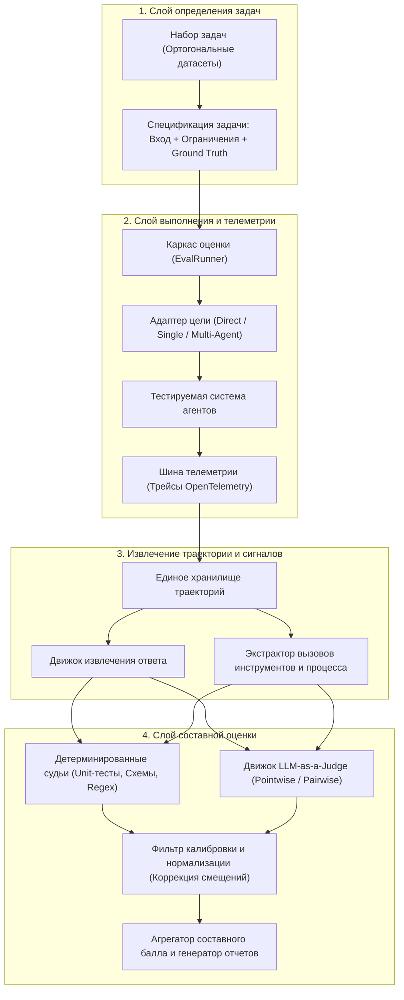

#### 10.2.2 Наблюдаемость и унифицированная схема траектории (Unified Trajectory Schema)
Оценка невозможна без сквозной наблюдаемости в рантайме. Продакшен-запуски и тестовые прогоны должны отдавать идентичную структурированную телеметрию по открытым стандартам (например, деревья спанов OpenTelemetry):
- **Структурированное логирование сообщений**: Фиксация роли отправителя, роли получателя, таймстемпа, расхода токенов и типа сообщения (мысль, запрос инструмента, ответ инструмента, реплика пользователя).
- **Вызовы инструментов**: Точные схемы параметров, возвращаемые значения, длительность выполнения и статус завершения.
- **Мутации состояния**: Явное отслеживание изменений среды (измененные файлы, добавленные строки в БД).
- **Телеметрия сбоев**: Фиксация низкоуровневых сетевых таймаутов, отказов валидации схем инструментов и событий обрезки контекстного окна.

#### 10.2.3 Псевдокод: примитивы траекторий и событий

```python
from dataclasses import dataclass, field
from typing import Any, Dict, List, Optional
from enum import Enum
import time

class StepType(Enum):
    REASONING = "reasoning"
    TOOL_CALL = "tool_call"
    TOOL_RETURN = "tool_return"
    MESSAGE = "message"
    ENVIRONMENT_MUTATION = "environment_mutation"

@dataclass(frozen=True)
class ToolCallRecord:
    tool_name: str
    arguments: Dict[str, Any]
    output: Any
    latency_ms: float
    status: str  # "SUCCESS" | "ERROR"
    error_message: Optional[str] = None

@dataclass(frozen=True)
class TrajectoryStep:
    step_index: int
    agent_id: str
    step_type: StepType
    content: str
    tool_calls: List[ToolCallRecord] = field(default_factory=list)
    tokens_prompt: int = 0
    tokens_completion: int = 0
    timestamp_epoch_ms: float = field(default_factory=lambda: time.time() * 1000)

@dataclass
class Trajectory:
    task_id: str
    target_architecture: str
    steps: List[TrajectoryStep] = field(default_factory=list)
    final_output: Optional[str] = None
    total_latency_ms: float = 0.0
    is_terminal: bool = False
    
    @property
    def total_tokens(self) -> int:
        return sum(s.tokens_prompt + s.tokens_completion for s in self.steps)
    
    @property
    def all_tool_calls(self) -> List[ToolCallRecord]:
        return [tc for s in self.steps for tc in s.tool_calls]
```

#### 10.2.4 Проблема извлечения ответа (Answer Extraction Challenge)
В многошаговых диалоговых траекториях агентов изоляция итогового результата от промежуточного координационного шума является частой точкой отказа.
Наивные эвристики (например, выбор последнего сообщения в `trajectory.steps`) ломаются, когда:
- Агент завершает диалог вежливой фразой: *«Задача выполнена. Дайте знать, если потребуется что-то еще!»*
- Агент-ревьюер критикует черновик, а истинный ответ содержался в реплике предыдущего агента.
- Агент сохраняет результат внутри аргумента вызова инструмента (например, запись файла на диск), а не в тексте диалога.

Надежные архитектуры извлечения используют эшелонированные стратегии:
1. **Явные разделители / теги**: Парсинг структурированных блоков вывода (например, `<final_answer>...</final_answer>`).
2. **Срезы траектории по ролям**: Сканирование в обратном порядке для поиска последнего содержательного ответа назначенного рабочего агента с фильтрацией сервисных сообщений.
3. **Fallback через LLM-экстрактор**: При высокой диалоговой энтропии вызывается вспомогательный промпт экстракции, получающий всю историю диалога и изолирующий суть ответа.

#### 10.2.5 Псевдокод: движок извлечения ответа (Answer Extraction Engine)

```python
import re
from typing import Optional

class AnswerExtractionEngine:
    @staticmethod
    def extract_delimited_answer(content: str, tag: str = "final_answer") -> Optional[str]:
        pattern = rf"<{tag}>(.*?)</{tag}>"
        match = re.search(pattern, content, re.DOTALL)
        return match.group(1).strip() if match else None

    @classmethod
    def resolve_final_answer(cls, trajectory: Trajectory) -> str:
        # Уровень 1: Поиск явного разделителя в обратном порядке шагов
        for step in reversed(trajectory.steps):
            extracted = cls.extract_delimited_answer(step.content)
            if extracted:
                return extracted

        # Уровень 2: Отсечение тривиальных подтверждений и служебных метаданных
        trivial_phrases = {"done", "task complete", "i have finished the task", "ok", "готово", "задача выполнена"}
        for step in reversed(trajectory.steps):
            clean_text = step.content.strip().lower()
            if clean_text not in trivial_phrases and len(clean_text) > 10:
                return step.content.strip()

        # Уровень 3: Fallback на сырой контент последнего шага
        return trajectory.steps[-1].content if trajectory.steps else ""
```

#### 10.2.6 Каркас оценки (Harness) и паттерн Adapter
Для объективности оценки каркас должен работать со всеми архитектурами единообразно через **адаптер цели оценки (Evaluation Target Adapter)**. Это изолирует особенности конфигурации от логики скоринга:

| Подход | Описание | Топология и поток управления |
| :--- | :--- | :--- |
| **Direct-Model** | Базовая линия: Прямой инференс базовой модели без агентной обвязки, внешних инструментов и циклов рассуждения. | Одиночный прямой проход: $x \to \text{LLM} \to y$. Масштабирование токенов $O(1)$. |
| **Single-Agent-Tools** | Автономный цикл одиночного агента с внешними инструментами (поиск, калькулятор, исполнение кода, статус состояния). | Цикл ReAct / Tool-Use: чередование шагов рассуждения и детерминированного выполнения инструментов. |
| **Multi-Agent-RoundRobin** | Статическая команда агентов (Planner $\to$ Solver $\to$ Reviewer), координирующаяся через фиксированные последовательные передачи. | Детерминированный циклический граф. Состояние передается последовательно независимо от статуса задачи. |
| **Multi-Agent-AI** | Динамическая команда с AI-оркестратором, который выбирает следующих спикеров, распределяет подзадачи и объявляет завершение. | Эмерджентный конечный автомат рантайма. Центральный координатор диспетчеризирует задачи профильным воркерам. |

![[Screenshot 2026-09-10 at 13.20.23.png]]

#### 10.2.7 Проектирование наборов задач: тестирование ортогональных способностей
Тестовые наборы не должны смешивать разнородные навыки в монолитные тесты. Эффективные каркасы изолируют ортогональные векторы сбоев по целевым наборам тестов:

| Набор задач | Описание | Проверяемая ключевая способность | Число задач |
| :--- | :--- | :--- | :--- |
| **Simple-Reasoning** | Базовая дедукция, логические головоломки, арифметические текстовые задачи и понимание прочитанного без внешних инструментов. | Чистые параметрические рассуждения и собственная точность инференса без отвлечения на инструменты. | 3 |
| **Tool-Heavy** | Исследование и извлечение данных в реальном времени, недоступных в весах предварительного обучения (свежие интервью, анонсы технологий). | Понимание схем инструментов, составление поисковых запросов, парсинг наблюдений и синтез. | 3 |
| **Planning** | Комбинаторная оптимизация со множеством ограничений (составление маршрута поездки при жестком бюджете, расписании и предпочтениях). | Высокоуровневая декомпозиция целей, разрешение зависимостей в DAG и удовлетворение ограничений. | 2 |
| **Verification** | Задачи с упором на критику (фактчекинг утверждений, поиск логических ошибок, аудит кода на уязвимости). | Критическое мышление, состязательный анализ и итеративное улучшение артефакта. | 2 |

![[Screenshot 2026-09-10 at 13.20.40.png]]

#### 10.2.8 Метрики и архитектуры судей: детерминированные против вероятностных
Механика скоринга разделяется на две основные парадигмы:

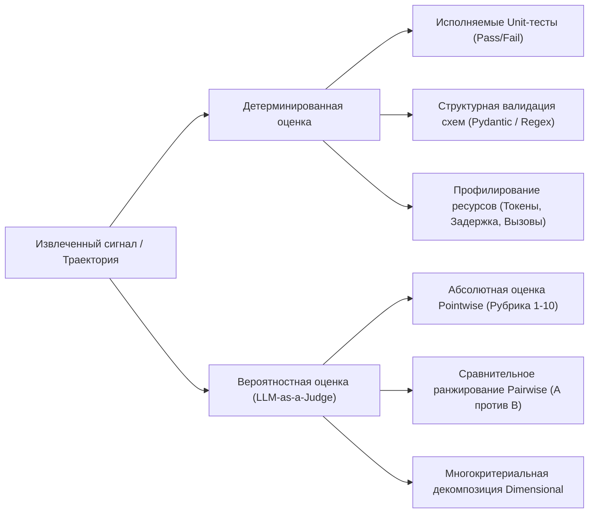

1. **Детерминированные проверки**:
   - *Функциональное выполнение*: Компиляция кода и запуск автоматических раннеров тестов (`pytest`).
   - *Валидация вызовов инструментов*: Проверка порядка вызовов, соответствия схемам и точности параметров по эталонным трейсам.
   - *Профилирование ресурсов*: Точный учет задержки, вызовов API и расхода токенов промпта/генерации.
2. **Вероятностная оценка (LLM-as-a-Judge)**:
   - Применяется там, где ground truth является открытым или мультимодальным (эстетика верстки, глубина синтеза, ясность изложения).
   - Требует явных определений рубрик с якорными точками границ баллов (что считается за 1, 5 или 10).

#### 10.2.9 Парадигмы скоринга: Pointwise, Pairwise, Dimensional
- **Оценка Pointwise (градация одной траектории)**:
  - LLM-судья оценивает одну траекторию по шкале абсолютных баллов (например, от 1 до 10).
  - *Вектор сбоя*: Подвержен дрейфу шкалы, чувствительности к промпту и сжатию оценок (скучивание вокруг 7–8).
- **Сравнение Pairwise (A/B предпочтение)**:
  - Судья получает промпт задачи и две анонимизированные траектории ($T_A, T_B$), определяя, какой результат лучше и почему.
  - *Преимущество*: Опирается на сильную сторону LLM — сравнительный анализ; существенно снижает дисперсию субъективных критериев.
  - *Инженерные затраты*: Требует $\frac{K(K-1)}{2}$ сравнений для $K$ кандидатов; подвержен эффекту позиции (систематическое предпочтение кандидата A перед кандидатом B, если не менять их местами в двух прогонах).
- **Составная многомерная оценка (Dimensional Composite Scoring)**:
  - Разлагает качество на ортогональные взвешенные подкритерии (Точность, Полнота, Полезность, Лаконичность).

#### 10.2.10 Калибровка судей и устранение смещений (Bias Mitigation)
Неоткалиброванные LLM-судьи вносят искажения, ломающие сравнение архитектур:

1. **Штраф за многословность и смещение длины (Verbosity Bias)**:
   - *Наблюдение*: Без калибровки LLM-судьи демонстрируют двойное смещение. На простых текстовых задачах они отдают предпочтение длинным, многословным ответам (принимая длину за глубину). Напротив, в мультиагентных траекториях наивные судьи часто штрафуют открытость рассуждений за «ненужное замусоривание диалога», искусственно занижая оценки мультиагентных систем.
   - *Коррекция*: В промпт судьи внедряется прямое указание:
     > «Различайте прозрачность координации и ненужные повторы. Не штрафуйте агентов за раскрытие промежуточных рассуждений, планирования или этапов ревью, необходимых для контроля качества».
2. **Нормализация весов измерений**:
   - В составных движках веса должны нормализоваться строго *внутри каждого измерения*, а не глобально по несопоставимым шкалам, что предотвращает математические перекосы при объединении качественных и детерминированных метрик.

#### 10.2.11 Псевдокод: калиброванный составной судья (Calibrated Composite Judge)

```python
from typing import Dict, Any, Callable, List
from dataclasses import dataclass

@dataclass
class EvaluationDimension:
    name: str
    weight: float
    description: str
    eval_fn: Callable[[Trajectory, Dict[str, Any]], float]  # Возвращает нормализованный балл [0.0, 1.0]

class CalibratedCompositeJudge:
    def __init__(self, dimensions: List[EvaluationDimension]):
        # Принудительная нормализация весов измерений
        total_weight = sum(d.weight for d in dimensions)
        if total_weight <= 0:
            raise ValueError("Суммарный вес измерений должен быть положительным.")
        self.dimensions = [
            EvaluationDimension(d.name, d.weight / total_weight, d.description, d.eval_fn)
            for d in dimensions
        ]

    def evaluate(self, trajectory: Trajectory, ground_truth: Dict[str, Any]) -> Dict[str, Any]:
        dimensional_scores: Dict[str, float] = {}
        composite_score = 0.0

        for dim in self.dimensions:
            raw_score = dim.eval_fn(trajectory, ground_truth)
            normalized_score = max(0.0, min(1.0, raw_score))
            dimensional_scores[dim.name] = normalized_score
            composite_score += normalized_score * dim.weight

        return {
            "task_id": trajectory.task_id,
            "target_architecture": trajectory.target_architecture,
            "composite_score_normalized": composite_score,
            "composite_score_10pt": round(composite_score * 10, 2),
            "dimensional_breakdown": dimensional_scores,
            "token_overhead": trajectory.total_tokens,
            "latency_ms": trajectory.total_latency_ms
        }
```

---

### 10.3 Инженерные компромиссы (Trade-offs)

#### 10.3.1 Налог в 43x токенов: оверхед оркестрации против прироста возможностей
Эмпирический профиль демонстрирует колоссальное расхождение экономии и вычислений между архитектурами:
- **Direct-Model**: В среднем **355 токенов** на задачу.
- **Multi-Agent AI**: В среднем **15,343 токенов** на задачу.
- **Мультипликатор**: **43-кратный рост расхода токенов** (рост на $4,222\%$) на координацию планирования, решения и проверки.

В сложных задачах Tool-Heavy этот налог в 43x оправдан: качество подскакивает с $6.8/10$ до $9.2/10$ (рост на $+35\%$, предотвращающий полный провал там, где необходимо извлечение данных в реальном времени).
Однако на задачах Simple-Reasoning мультиагентная система набирает $9.3/10$, в то время как одна модель напрямую дает $9.7/10$. Мультиагентная архитектура несет 43-кратный штраф по стоимости ради получения **более низкого** качества.

```
Расход токенов по архитектурам (лог-шкала)
Direct Model       : [355 токенов] 
Single-Agent Tools : [~2,400 токенов]
Multi-Agent AI     : [15,343 токенов] ============================================= (оверхед 43x)
```

#### 10.3.2 Детерминированная верификация против вероятностной оценки LLM
- **Детерминированная верификация**:
  - *Стоимость и задержка*: Околонулевая предельная стоимость, миллисекундное выполнение.
  - *Надежность*: $100\%$ воспроизводимость, нулевая дисперсия, иммунитет к дрейфу промпта и смене версий моделей.
  - *Ограничение*: Слепа к нюансам, тону, визуальному качеству и открытому синтезу.
- **Вероятностные LLM-судьи**:
  - *Стоимость и задержка*: Высокая стоимость токенов, секунды сетевой задержки API на каждый прогон.
  - *Надежность*: Подвержены температурной дисперсии, смещению позиции и угодливости (sycophancy).
  - *Преимущество*: Способны понимать сложные неструктурированные артефакты, для которых невозможно написать строгие ассерты.

#### 10.3.3 Сложность и масштабирование: Pointwise против Pairwise
- **Pointwise ($O(N)$)**:
  - Оценивает $N$ траекторий независимо. Высокая пропускная способность, линейное масштабирование.
  - Уязвима к сжатию шкалы и нестабильности между разными пакетами тестов.
- **Pairwise ($O(N^2)$ или турнир $O(N \log N)$)**:
  - Устраняет проблему калибровки абсолютной шкалы, сводя задачу к относительному бинарному выбору.
  - Требует статистической модели Брэдли-Терри для расчета глобального рейтинга скрытых способностей.
  - Запретительно высокая задержка и стоимость API на больших наборах ($K=50$ кандидатов требует $1,225$ парных сравнений на одну задачу).

#### 10.3.4 Оценка процесса против оценки результата
- **Оценка по результату (Outcome-Oriented)**:
  - Оценивает исключительно итоговый артефакт.
  - *Риск*: Ложноположительные срабатывания из-за стохастической удачи. Агент может сгаллюцинировать на промежуточных шагах, вызвать не те инструменты, но случайно выдать верный ответ.
- **Оценка по процессу (Process-Oriented)**:
  - Проверяет корректность промежуточных графов рассуждений, точность выбора инструментов и параметров.
  - *Риск*: Чрезмерное ограничение исследовательской гибкости. Штрафует нестандартные творческие пути, достигающие корректного результата новым способом.

---

### 10.4 Режимы сбоев и узкие места (Failure Modes & Bottlenecks)

> [!WARNING]
> - **Закон Гудхарта и натаскивание на бенчмарки**: «Когда метрика становится целью, она перестает быть хорошей метрикой». Агенты, оптимизируемые под статические промпты судей, перенимают поверхностные маркеры компетентности (форматирование, пышные приветствия, псевдострогие заголовки), льстящие судьям, но не улучшающие реальное решение задач.
> - **Загрязнение бенчмарков и утечки данных**: Задачи публичных тестов случайно проникают в обучающие выборки или поисковые индексы. Высокий балл отражает механическое запоминание, а не способность рассуждать в реальном времени.
> - **Смещение судьи в пользу многословия и угодливости**: LLM-судьи систематически отдают предпочтение длинным и подобострастным ответам перед краткими и точными, если их жестко не калибровать на лаконичность и содержательность.
> - **Обрезка траекторий при сериализации**: Длинные истории диалогов мультиагентных систем быстро выходят за рамки контекстного окна судьи. Усечение траектории (вырезание середины) порождает эффект *Lost-in-the-Middle*, и судья упускает критические ошибки в середине процесса.
> - **Хрупкость извлечения ответа**: Наивная логика парсит коммуникационный мусор (*«Надеюсь, это помогло!»*) вместо артефакта задачи, выставляя ложный нулевой балл безупречно выполненной работе.
> - **Налог архитектурного эго (Over-Engineering)**: Развертывание мультиагентных оркестраций на простых логических задачах вносит задержку многих шагов, инфляцию токенов и каскадные ошибки координации, уступая по качеству обычному инференсу базовой модели.

---

### 10.5 Фреймворк принятия решений (Decision Framework)

#### 10.5.1 Дерево выбора архитектуры

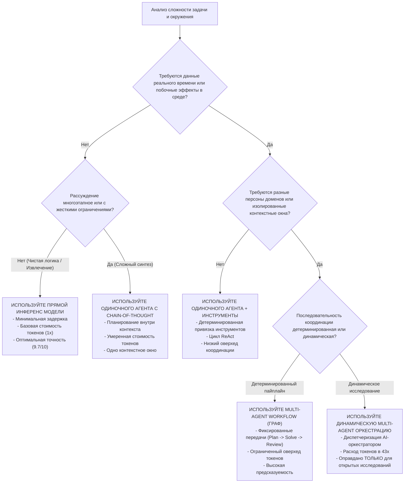

#### 10.5.2 Матрица выбора судей и метрик

| Измерение оценки | Основной механизм судьи | Объект валидации | Вектор сбоя для контроля |
| :--- | :--- | :--- | :--- |
| **Функциональная корректность** | Детерминированные Unit-тесты / Компиляторы | Выполнение кода, валидация схем, возвращаемые значения | Ошибочные тесты с ложными pass; сбои окружения. |
| **Точность работы с инструментами** | Детерминированная инспекция трейсов | Выбор инструментов, валидация параметров, порядок вызовов | Галлюцинированные аргументы; лишние циклы опроса; отсутствие восстановления при ошибках. |
| **Качество рассуждений** | Калиброванный судья Pointwise LLM | Связность Chain-of-Thought, выполнение ограничений | Смещение многословия; угодливость; ложное подтверждение шагов. |
| **Субъективное качество / Стиль** | Двунаправленный судья Pairwise LLM | Ясность, тон, доменная эстетика оформления | Смещение позиции (предпочтение кандидата A); оценка по объему. |
| **Эффективность системы** | Детерминированные счетчики телеметрии | Потребление токенов, сквозная задержка, финансовая стоимость | Скрытые циклы повторов, раздувающие расход; невидимые таймауты API. |

#### 10.5.3 Эмпирический анализ бенчмарков и архитектурные выводы

![[Screenshot 2026-09-10 at 13.31.14.png]]

#### Эмпирический анализ производительности архитектур:
1. **Расхождение на задачах Tool-Heavy**:
   - Прямой инференс модели (Direct-Model) обрушился до **3.2/10** на запросах реального времени (исследование подкастов), поскольку веса базовой модели не содержат информации после даты отсечки обучения.
   - Все конфигурации с инструментами набрали **9.0 – 9.5/10**, доказывая, что **наличие инструментов — это обязательная функциональная граница**, а не просто оптимизация.
2. **Инверсия на задачах Simple-Reasoning**:
   - Direct-Model набрала **9.7/10**, превзойдя Multi-Agent-AI (**9.3/10**) и Multi-Agent-RoundRobin (**7.2/10** на логических головоломках).
   - *Архитектурный вывод*: Добавление межагентных передач и ревьюеров вносит энтропию координации, размывание контекста и лишние точки отказа на задачах, решаемых за один прямой проход.
3. **Плато планирования и верификации**:
   - Баллы всех архитектур распределились в узком коридоре между **8.6 и 9.6/10**.
   - Мультиагентная оркестрация не дала скачкообразного прорыва по сравнению с одиночным агентом на задачах составления маршрутов со множеством условий или анализе аргументации.
4. **Граница эффективности (Баллы на 1K токенов)**:
   - На задачах Simple-Reasoning Direct-Model обеспечила **54 балла на 1K токенов** против **1.5 баллов на 1K токенов** у Multi-Agent-AI.
   - Развертывание динамической мультиагентной оркестрации без эмпирического подтверждения — акт **архитектурного тщеславия**, раздувающий затраты при нулевой отдаче.

> [!DECISION]
> **Правила развертывания в продакшене**:
> 1. **Правило архитектурной бережливости**: Начинайте с самого низкого уровня сложности (Direct Model). Переходите к Single Agent + Tools только тогда, когда строго требуется взаимодействие со средой. Переходите к Multi-Agent процессам только при необходимости изоляции контекста или разделения сложных схем инструментов.
> 2. **Оценка предшествует внедрению**: Ни одна агентная архитектура не может быть переведена в прод без версионированного набора задач, покрывающего ее доменные векторы сбоев, и калиброванного составного судьи.
> 3. **Наблюдаемость обязательна**: Все агентные рантаймы обязаны транслировать структурированные трейсы OpenTelemetry для непрерывной ретроспективной оценки на реальном трафике.

---

## Глава 11: Оптимизация мультиагентных систем (Optimizing Multi-Agent Systems)

### 11.1 Executive Overview: Жизненный цикл оптимизации

#### 11.1.1 Непрерывный цикл оптимизации
Оптимизация мультиагентных сред — это не разовый поиск багов, а замкнутый эмпирический контур обратной связи, строго привязанный к каркасу оценки из Главы 10. Оптимизация без регулярной оценки — это гадание наугад.

Эксплуатационный цикл оптимизации функционирует как замкнутый конечный автомат:

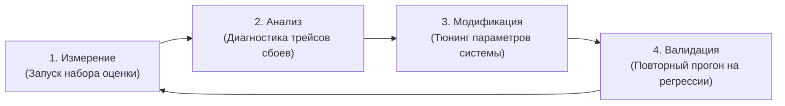

#### 11.1.2 Приоритеты оптимизации: высокий рычаг против низкого рычага
Самая распространенная инженерная ошибка при оптимизации мультиагентных систем — выделение ресурсов на инструмент с наименьшим рычагом влияния: дообучение и fine-tuning моделей. В продакшене действует строгая иерархия приоритетов:

1. **Первый приоритет (Уровень приложения — максимальный рычаг, минимальная стоимость)**: Тюнинг **параметров агентной системы**. Итеративное расширение системных инструкций, сокращение и ужесточение схем инструментов, калибровка условий остановки и выбор подходящей топологии оркестрации дают $80–90\%$ всего потенциального прироста качества при минимальных затратах.
2. **Последний приоритет (Уровень фундаментальных моделей — минимальный рычаг, максимальная стоимость)**: Тюнинг **параметров на уровне моделей**. Fine-tuning (SFT, DPO, RL), дистилляция и кастомное предобучение требуют огромных выверенных датасетов, специализированной инфраструктуры и внушительных бюджетов на GPU. К ним следует переходить только тогда, когда параметры агентной системы математически вышли на плато или когда строгий арбитраж задержки/стоимости требует дистилляции в компактную модель.

---

### 11.2 Механика и топология

#### 11.2.1 Двухуровневый фреймворк оптимизации
Каждое развертывание мультиагентной системы управляется двумя разделенными пространствами параметров:

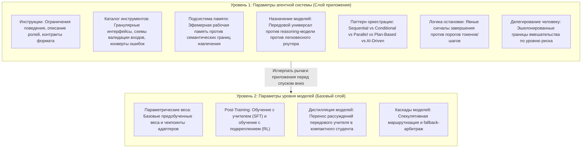

#### 11.2.2 Жизненный цикл принятия решений об оптимизации моделей
Чтобы определить, оправдано ли вмешательство на уровне модели, система должна пройти формальный диагностический конвейер:

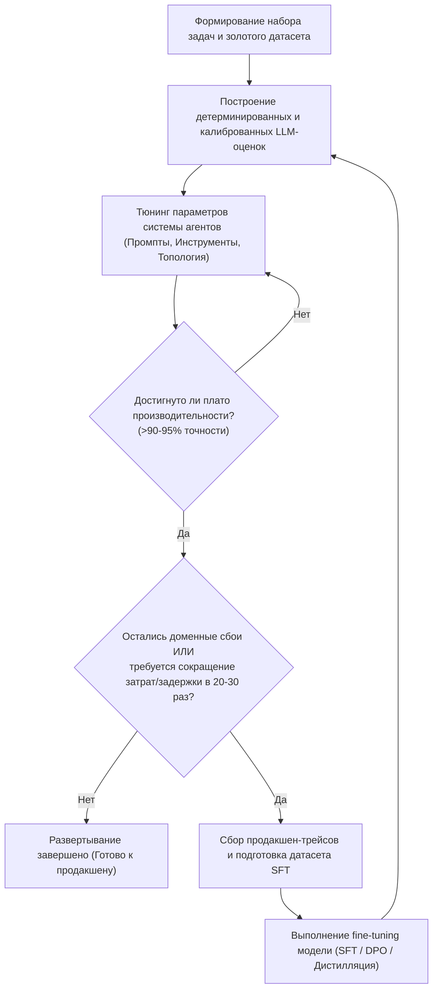

#### 11.2.3 Примитивы оптимизации моделей: Routing, Distillation, Cascading
Когда оптимизация на уровне моделей экономически оправдана, три взаимодополняющие архитектуры позволяют избежать поголовного вызова дорогих frontier-моделей:

1. **Маршрутизация задач (Task Routing / Classification Dispatch)**:
   - Легковесный классификатор или компактная модель ($<3\text{B}$ параметров) анализирует входящий запрос и направляет простые задачи недорогим моделям (например, Llama-3-8B), а сложные рассуждения или неоднозначную координацию эскалирует на frontier-универсалы (GPT-5, Claude-3.5-Sonnet).
   - *Экономический эффект*: Получение $90\%$ возможностей передовой модели при $\approx 15\%$ от базовой стоимости токенов.
2. **Дистилляция моделей (Model Distillation / Capability Transfer)**:
   - Передовые модели выполняют мультиагентный процесс, генерируя подробные траектории и вызовы инструментов. Эти эталонные трейсы фильтруются и используются для fine-tuning компактных моделей с открытыми весами (7B–14B).
   - *Эффект доменной специализации*: Универсальная модель несет в себе триллионы токенов ненужных энциклопедических знаний. Fine-tuning перераспределяет емкость параметров компактной модели строго под доменные рассуждения и вызовы инструментов.
3. **Спекулятивные каскады моделей (Speculative Model Cascades / Fallback Execution)**:
   - Процесс оптимистично запускается на быстрой недорогой модели. Промежуточные результаты проверяются детерминированными схемами или легковесными оценщиками. При сбое валидации выполнение каскадно переключается на передовую модель.

#### 11.2.4 Псевдокод: каскад моделей и Fallback Router

```python
from typing import Callable, Any, Dict, Optional
from dataclasses import dataclass

@dataclass(frozen=True)
class ModelExecutionResult:
    model_name: str
    output: str
    tokens_used: int
    is_valid: bool
    error: Optional[str] = None

class SpeculativeModelCascade:
    def __init__(
        self,
        primary_small_model_fn: Callable[[str], str],
        fallback_frontier_model_fn: Callable[[str], str],
        verifier_fn: Callable[[str], bool],
        small_model_name: str = "compact-7b",
        frontier_model_name: str = "frontier-generalist"
    ):
        self.primary_fn = primary_small_model_fn
        self.fallback_fn = fallback_frontier_model_fn
        self.verifier_fn = verifier_fn
        self.small_model_name = small_model_name
        self.frontier_model_name = frontier_model_name

    def execute(self, prompt: str) -> ModelExecutionResult:
        # Шаг 1: Оптимистичный быстрый прогон на компактной модели
        small_output = self.primary_fn(prompt)
        
        # Шаг 2: Детерминированная или синтаксическая верификация
        if self.verifier_fn(small_output):
            return ModelExecutionResult(
                model_name=self.small_model_name,
                output=small_output,
                tokens_used=len(prompt.split()) + len(small_output.split()),
                is_valid=True
            )

        # Шаг 3: Fallback на передовую модель при неудаче верификации
        frontier_output = self.fallback_fn(prompt)
        return ModelExecutionResult(
            model_name=self.frontier_model_name,
            output=frontier_output,
            tokens_used=len(prompt.split()) + len(frontier_output.split()),
            is_valid=True,
            error="Компактная модель не прошла верификацию; каскад переключен на frontier."
        )
```

#### 11.2.5 Сцепление инструкций с моделью и переносимость (Portability)
Системные инструкции не являются универсально переносимыми активами. Промпт, идеально работающий с мощной reasoning-моделью (которая отлично понимает цели высокого уровня и автономную декомпозицию), вызывает тяжелые сбои при отправке в меньшую модель.
- **Инструкции для frontier-моделей**: Могут опираться на открытые формулировки (*«Проанализируй паттерны в телеметрии и сформируй план действий»*).
- **Инструкции для компактных / дистиллированных моделей**: Требуют жестких алгоритмических чек-листов, явных негативных ограничений и фиксированных грамматик вывода.

#### 11.2.6 Псевдокод: реестр промптов под конкретные модели

```python
from typing import Dict, Any

class ModelInstructionRegistry:
    def __init__(self):
        self._registry: Dict[str, Dict[str, str]] = {}

    def register(self, role: str, model_family: str, instructions: str) -> None:
        if role not in self._registry:
            self._registry[role] = {}
        self._registry[role][model_family] = instructions.strip()

    def resolve(self, role: str, model_family: str) -> str:
        role_prompts = self._registry.get(role)
        if not role_prompts:
            raise KeyError(f"Инструкции для роли '{role}' не зарегистрированы")
        
        # Точное совпадение семейства модели или fallback на default
        if model_family in role_prompts:
            return role_prompts[model_family]
        if "default" in role_prompts:
            return role_prompts["default"]
        
        raise ValueError(f"Нет подходящих инструкций для роли '{role}' под семейство '{model_family}'")
```

#### 11.2.7 Продакшен-инструменты и структурированные контракты ошибок
Инструменты задают рабочее пространство действий мультиагентной системы. Агент не может быть надежнее интерфейсов инструментов, которыми он управляет. Продакшен-инструменты следуют 5 базовым правилам:
1. **Лаконичность вместо избыточности**: Поддерживайте компактный каталог ключевых инструментов (5–10 штук) вместо десятков дублирующих утилит. Раздутые пространства имен перегружают контекст, ухудшают точность выбора инструмента и провоцируют галлюцинации в аргументах.
2. **Инвариант нулевых падений (Zero-Crash)**: Инструменты никогда не должны выбрасывать необработанные исключения рантайма. Сбои должны перехватываться и упаковываться в структурированные конверты ошибок с понятной диагностикой.
3. **Явная схема ограничений**: Схемы параметров должны строго валидировать типы данных, дефолтные значения, допустимые диапазоны и содержать ясные описания.
4. **Устойчивость к временным сбоям**: Встроенный экспоненциальный backoff с джиттером для сетевых I/O вызовов.
5. **Валидация объема вывода**: Проверка размера вывода инструмента перед внедрением в траекторию; обрезка или пагинация огромных ответов для защиты контекста.

#### 11.2.8 Псевдокод: надежная оболочка выполнения инструментов

```python
import traceback
from typing import Any, Dict, Callable, Optional
from dataclasses import dataclass, asdict

@dataclass(frozen=True)
class ToolResponseEnvelope:
    status: str  # "SUCCESS" | "CLIENT_ERROR" | "SYSTEM_ERROR"
    result: Any
    error_code: Optional[str] = None
    suggested_fix: Optional[str] = None

def wrap_production_tool(tool_fn: Callable[..., Any]) -> Callable[..., Dict[str, Any]]:
    def execution_wrapper(**kwargs: Any) -> Dict[str, Any]:
        try:
            raw_result = tool_fn(**kwargs)
            envelope = ToolResponseEnvelope(
                status="SUCCESS",
                result=raw_result
            )
            return asdict(envelope)
        except TypeError as te:
            envelope = ToolResponseEnvelope(
                status="CLIENT_ERROR",
                result=None,
                error_code="INVALID_ARGUMENTS",
                suggested_fix=f"Проверьте схему параметров. Ошибка типа: {str(te)}"
            )
            return asdict(envelope)
        except Exception as e:
            envelope = ToolResponseEnvelope(
                status="SYSTEM_ERROR",
                result=None,
                error_code="EXECUTION_FAILURE",
                suggested_fix=f"Временный сбой инструмента. Детали: {str(e)}"
            )
            return asdict(envelope)
    return execution_wrapper
```

#### 11.2.9 Архитектура метапознания и верификации прогресса
В открытых длительных рабочих процессах агенты нередко скатываются в непродуктивные циклы или заходят в тупики. Без явного метапознания (способности оценивать собственный прогресс относительно глобального плана) автономные агенты не могут вовремя распознать собственный сбой.

Продакшен-архитектуры реализуют **циклы Plan-Evaluate-Replan** с опорой на явный журнал состояний (как в системах класса Magentic-One):
- **Генерация структурированного плана**: Декомпозиция макроцели на проверяемую цепочку подцелей.
- **Журнал выполнения (Execution Ledger)**: Хранит неизменяемые статусы шагов (`PENDING`, `IN_PROGRESS`, `COMPLETED`, `FAILED`).
- **Оценка прогресса после шага**: Независимый критик или оценщик проверяет дельту после каждого действия. Если прогресс равен нулю или отрицателен на протяжении $K$ шагов подряд, процесс останавливается и запускает динамическое перепланирование.

---

### 11.3 Инженерные компромиссы (Trade-offs)

#### 11.3.1 Передовые универсалы (Frontier Generalists) против доменных специалистов
- **Передовые универсалы (GPT-5, Claude-3.5-Sonnet)**:
  - *Плюсы*: Исключительное следование инструкциям, колоссальные параметрические знания, ноль затрат на инженерию данных.
  - *Минусы*: Налог в $20–30\times$ по стоимости токенов, привязка к вендору, риски управления внешними данными, непрозрачные циклы обновления моделей.
- **Специализированные модели после Fine-Tuning (7B–14B SFT/DPO)**:
  - *Плюсы*: Радикальное снижение затрат (экономия $85–95\%$), меньшая задержка инференса, развертывание в приватном VPC, параметры отданы строго под доменные задачи.
  - *Минусы*: Существенные стартовые затраты на сбор датасетов и обучение; хрупкость при выходе логики за пределы обучающего распределения.

#### 11.3.2 Автономия против предсказуемости: матрица выбора паттернов

| Характеристика задачи | Паттерн оркестрации | Ключевой инженерный компромисс |
| :--- | :--- | :--- |
| **Фиксированные известные шаги** | Последовательный процесс (Sequential Workflow) | Предсказуемая стоимость, тривиальная отладка и воспроизводимость, ноль адаптивности. |
| **Условная маршрутизация** | Условный / Супервизор (Conditional / Supervisor) | Явный граф ветвления, жестко ограниченные пути, ограниченный междоменный синтез. |
| **Независимые подзадачи** | Параллельный процесс (Parallel Workflow) | Максимальная пропускная способность, четкая синхронизация fan-out/fan-in, требует разбиения задач. |
| **Неизвестная декомпозиция** | Оркестрация по плану (Plan-Based) | Динамическое планирование и перепланирование в рантайме, оверхед на reflection LLM на каждом шаге. |
| **Неопределенный путь решения** | Автономная Multi-Agent оркестрация | Максимальная гибкость и эмерджентное сотрудничество, неконтролируемый расход токенов и взрыв векторов сбоев. |

#### 11.3.3 Простота без состояния против оверхеда подсистем памяти
- **Выполнение без состояния (Stateless)**:
  - Рассматривает каждый шаг как независимый переход конечного автомата. Чисто, предсказуемо, ноль багов инвалидации кеша.
  - *Ограничение*: Теряет накопленный опыт сессии; вынуждает дублировать запросы инструментов в долгих процессах.
- **Семантическая память с сохранением состояния**:
  - Сохраняет промежуточные наблюдения, предпочтения пользователей и уроки ошибок в векторных БД.
  - *Компромиссы*: Зависимость от инфраструктуры векторных БД, задержка API эмбеддингов, шум извлечения (засорение контекста старыми воспоминаниями) и оверхед синхронизации.

#### 11.3.4 Последствия действий и трение при делегировании человеку
Одинаковый уровень доверия ко всем вызовам инструментов — критическая уязвимость.
- **Автономия без трения**: Максимизирует пропускную способность и минимизирует задержку, но несет риски необратимых внешних мутаций (финансовые транзакции, удаление данных).
- **Тотальный контроль человеком**: Гарантирует безопасность, но убивает скорость работы, перегружает оператора и ведет к «усталости от согласований» (approval fatigue), когда человек механически подтверждает любые действия агента.

---

### 11.4 Режимы сбоев и узкие места (Failure Modes & Bottlenecks)

#### 11.4.1 Диагностическая матрица 10 продакшен-сбоев

| Режим сбоя | Первопричина | Наблюдаемый симптом при оценке | Конкретная стратегия оптимизации |
| :--- | :--- | :--- | :--- |
| **1. Размытые инструкции** | Неявные ожидания домена не зафиксированы в системных промптах. | Высокая дисперсия качества вывода; галлюцинации на пограничных случаях. | Итеративное расширение инструкций по трейсам сбоев; оформление System prompt как исчерпывающих должностных инструкций. |
| **2. Преждевременный переход на малые модели** | Использование моделей $<14\text{B}$ для сложной мультиагентной координации без предварительной оптимизации. | Дедлоки координации; ошибки парсинга схем инструментов; дрейф инструкций. | Установление бейслайна на frontier-моделях; оптимизация параметров агентной системы; внедрение роутинга и каскадов до SFT. |
| **3. Несовпадение инструкций и модели** | Перенос промптов, настроенных под frontier-модели, на малые или альтернативные семейства. | Несоблюдение форматов; отказ вызывать инструменты; потеря цепочки рассуждений. | Ведение версионированного `ModelInstructionRegistry`; кастомные промпты под каждую модель; A/B тестирование регрессий. |
| **4. Низкое качество инструментов** | Раздутые каталоги, отсутствие валидации входов, необработанные исключения. | Застревание агентов в циклах повторов вызовов; падения на пограничных параметрах. | Минимальный каталог (5–10 инструментов); оборачивание в структурированные конверты ошибок (`ToolResponseEnvelope`); жесткие Pydantic-схемы. |
| **5. Неоткалиброванная остановка** | Отсутствие явных инструментов завершения; опора только на лимиты токенов или раундов. | Неконтролируемый расход токенов; преждевременный выход из решаемых задач. | Внедрение явных инструментов статуса задачи (`TaskStatus`); калибровка лимитов по распределению успешных прогонов. |
| **6. Ошибка выбора паттерна** | Использование динамической автономной оркестрации для линейных детерминированных процессов. | Колоссальная инфляция токенов (до 43x); точность ниже, чем у одиночной модели. | Выбор топологии по матрице паттернов; старт с простых процессов; точечное добавление автономии. |
| **7. Отсутствие подсистемы памяти** | Полное отсутствие состояния между сессиями; повторение одних и тех же ошибок. | Статичный процент ошибок на повторяющихся задачах; забывание пользовательских параметров. | Внедрение векторной памяти; оценка того, окупает ли выигрыш в точности налог на задержку и токены. |
| **8. Отсутствие метапознания** | У агента нет механизмов саморефлексии и перепланирования. | Агент бесконечно идет по тупиковым путям вплоть до жесткого таймаута. | Внедрение циклов Plan-Evaluate-Replan; журнал выполнения шагов; принудительное прерывание зависших траекторий. |
| **9. Отсутствие тестов задач (Evals)** | Оптимизация параметров системы «по наитию» (vibe coding) без каркаса оценки. | Исправление одного пограничного случая скрытно ломает 50% существующих сценариев. | Обязательное применение EDD из Главы 10 перед любым изменением промптов или добавлением инструментов. |
| **10. Игнорирование стоимости делегирования** | Одинаковый уровень автономии для безопасных запросов и разрушительных действий. | Катастрофические внешние эффекты; случайное удаление данных или несанкционированные отправки. | 3-уровневое делегирование по рискам: Tier 1 (Автовыполнение), Tier 2 (Выполнить и уведомить), Tier 3 (Обязательное одобрение человеком). |

#### 11.4.2 Системные сбои

> [!WARNING]
> - **Налог архитектурного тщеславия (Ego-Driven Orchestration)**: Мультиагентные системы часто выбирают ради видимости технической сложности, а не ради реальной изоляции состояния. Запуск роя агентов там, где справляется одна модель или скрипт, впустую сжигает вычисления, срывает бюджеты задержек и ухудшает качество.
> - **Перегрузка пространства инструментов**: Предоставление агенту более 15 инструментов одновременно рассеивает внимание модели. Модель путается в пересекающихся интерфейсах, генерируя галлюцинированные параметры и выбирая не те функции.
> - **Ловушка угодливого ревьюера (Sycophantic Reviewer Trap)**: Команды с проверкой (Planner $\to$ Solver $\to$ Reviewer) часто скатываются к взаимному соглашательству: ревьюер вежливо одобряет ошибочный результат исполнителя вместо жесткой состязательной критики.
> - **Вымывание контекста выводом инструментов**: Один невалидированный вызов, вернувший гигантский объем данных (парсинг всей веб-страницы или запрос к таблице БД без пагинации), мгновенно забивает контекстное окно, вытесняя системные инструкции и вызывая амнезию.

---

### 11.5 Фреймворк принятия решений (Decision Framework)

#### 11.5.1 Фильтр сложности Multi-Agent (Когда НЕ использовать Multi-Agent)
Перед внедрением мультиагентной оркестрации рабочий процесс должен пройти жесткий 4-факторный фильтр необходимости:

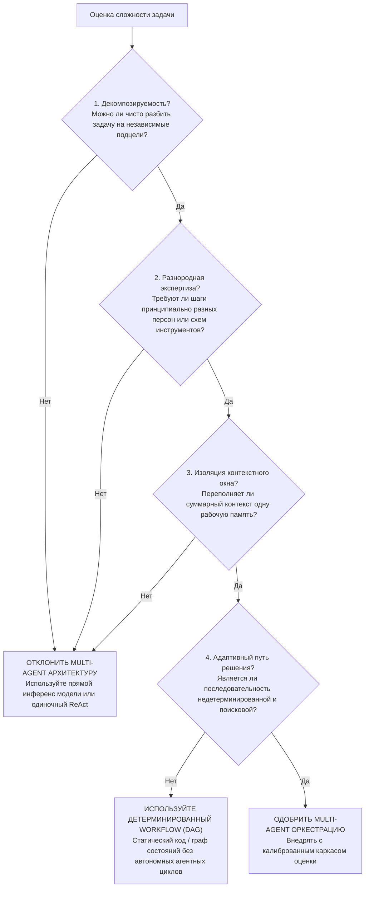

#### 11.5.2 Дерево решений по оптимизации на уровне моделей

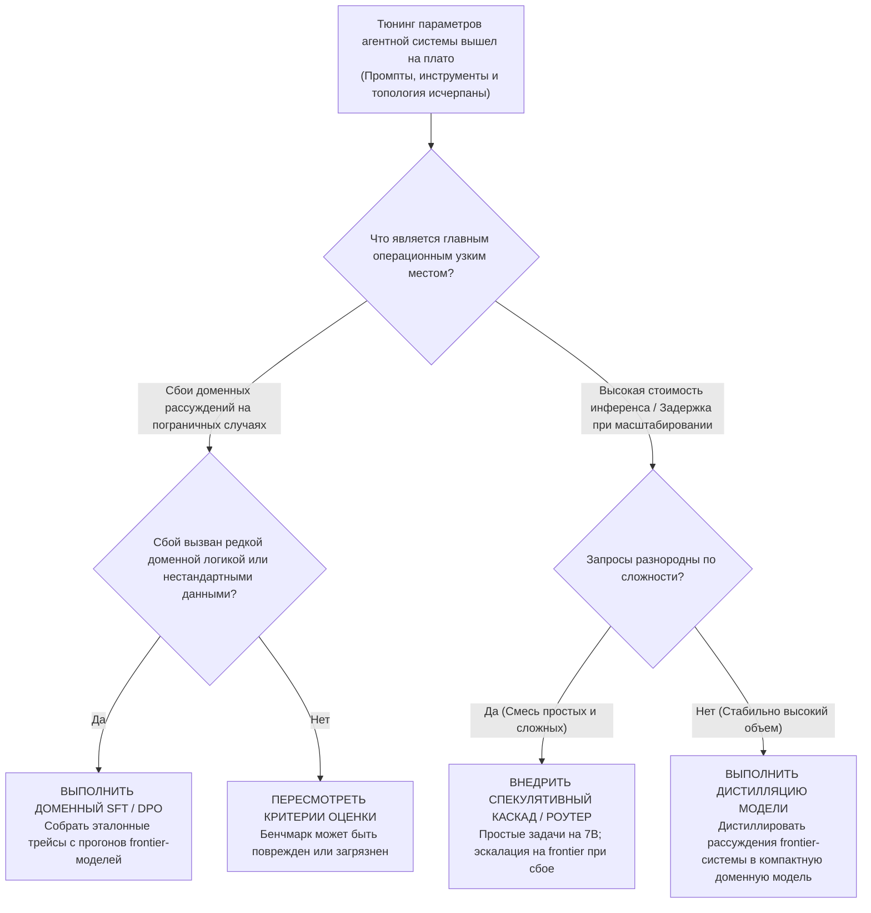

#### 11.5.3 Директивы оптимизации в продакшене

> [!DECISION]
> **Политика оптимизации в продакшене**:
> 1. **Ноль оптимизаций без верификации**: Никакие системные инструкции, сигнатуры инструментов или уровни моделей не могут меняться в проде без полного прогона каркаса оценки из Главы 10 для подтверждения отсутствия регрессий.
> 2. **Инвариант максимальной простоты**: Всегда оптимизируйте самый низкий уровень сложности, способный решить задачу. Если с задачей справляется один промпт, любое мультиагентное предложение должно отклоняться.
> 3. **Относитесь к инструментам как к API**: Инструменты должны быть версионированы, покрыты юнит-тестами, валидированы по схемам и упакованы в надежные конверты ошибок до их добавления в пространство имен агента.
> 4. **Эшелонированное делегирование рисков**: Разрушительные, внешние или финансово значимые действия никогда не должны выполняться без обязательного подтверждения человеком (HITL).

---

## Глава 12: Протоколы распределенных агентов (Protocols for Distributed Agents)

### 12.1 Executive Overview: Основы распределенных агентов

#### 12.1.1 Переход от выполнения в одном процессе к распределенному выполнению
Предыдущие архитектуры исходили из неявного предположения о границах топологии: все агенты, модели и инструменты выполняются в рамках одного процесса, сервера или доверенной локальной сети. Реальность enterprise-систем разрушает эту иллюзию. Системы работают через гетерогенные границы доверия:
- **Межорганизационные рабочие процессы**: Корпоративный агент комплаенса координирует работу с внешними юридическими консультантами и сторонними бухгалтерскими API.
- **Аппаратная и физическая гетерогенность**: Запуск легковесных оркестраторов в бессерверных облачных функциях с диспетчеризацией специализированного инференса на выделенные GPU-кластеры или локальные реляционные базы данных.
- **Безопасность и изоляция сбоев**: Изоляция непроверенного выполнения инструментов в песочницах microVM для предотвращения компрометации хоста при выполнении произвольного кода.

В распределенных топологиях компоненты обладают **нулевой общей памятью (zero shared memory)**. Координация обязана проходить через ненадежные сети, что вносит асинхронные задержки, сетевые разделения (network partitions) и рассинхронизацию распределенного состояния.

#### 12.1.2 Классические распределенные вычисления против агентной семантики
Архитектуры распределенных агентов напрямую проецируются на классические примитивы распределенных систем, но инвертируют место расположения координационной логики:
- В классических системах (RPC, gRPC, REST, Service Meshes) логика маршрутизации и координации живет на **инфраструктурном уровне** в виде статических детерминированных правил.
- В системах распределенных агентов логика координации перемещается на **прикладной уровень**, где вероятностные модели рассуждают над семантическим контекстом, согласовывают подзадачи и динамически обрабатывают аномалии выполнения.

| Классический примитив | Аналог в распределенных агентах | Ключевая архитектурная эволюция |
| :--- | :--- | :--- |
| **Очереди сообщений (Kafka / RabbitMQ)** | Конвейеры делегирования задач (Task Pipelines) | Разделяет продюсера и консьюмера, но делегирование задач использует AI для адаптивного запроса недостающего контекста или пересмотра целей. |
| **Service Discovery (Consul / etcd)** | Обнаружение возможностей агентов (Agent Cards) | Заменяет статические проверки доступности эндпоинтов/IP на богатые семантические описания навыков, схемы инструментов и политики аутентификации. |
| **Circuit Breakers и повторные попытки (Retries)** | Сессии возобновляемых задач и воспроизведение состояния | Простые повторы бесполезны в многочасовых процессах; агентам требуются долговечные снимки состояния, воспроизведение событий и возобновляемость. |
| **API Gateways и Reverse Proxies** | Интеллектуальные агентные оркестраторы | Динамическая семантическая диспетчеризация: декомпозиция брифов на естественном языке, маршрутизация экспертам и синтез выводов. |

#### 12.1.3 Ключевые требования к распределенным агентам
Агенты обладают 4 операционными свойствами, отличающими их от стандартных микросервисов: автономия, длительное выполнение (часы и дни), интерактивные зависимости от человека (HITL) и адаптивное восстановление.

| Возможность | Зачем это агентам | Ключевой архитектурный вызов |
| :--- | :--- | :--- |
| **Потоковая передача и прогресс (Streaming & Progress)** | Задачи длятся часами, анализируя массивные объемы данных или выполняя сложные передачи. Операторам нужна видимость процесса для доверия и отладки. | Предотвращение блокировок начала очереди (head-of-line blocking); потоковая отдача структурированных дельт токенов и телеметрии по постоянным HTTP-соединениям. |
| **Возобновляемость (Resumability)** | Обрыв сети во время 3-часовой задачи не должен обнулять накопленный прогресс. Сессии должны переживать переподключения без полного рестарта. | Поддержание персистентных логов событий и детерминированных порядковых ID для бесшовного воспроизведения событий (replay). |
| **Долговечность (Durability)** | Состояние задачи и артефакты должны сохраняться при падениях хоста и перезагрузках серверов. Клиентам нужны постоянные URI для асинхронных запросов статуса. | Разделение эфемерного рантайма выполнения и постоянных уровней хранения (реляционные журналы, объектные хранилища). |
| **Многоэтапное взаимодействие (Multi-turn Interaction)** | Агентам часто требуется ввод в процессе работы: уточнение ограничений, согласование необратимых мутаций человеком или вызов удаленного семплинга LLM. | Корректная приостановка выполнения в явном состоянии паузы/прерывания с сохранением контекста и памяти. |

---

### 12.2 Механика и топология

#### 12.2.1 Топология и примитивы Model Context Protocol (MCP)
Model Context Protocol (MCP) решает проблему комбинаторного взрыва ($M \times N$) кастомных коннекторов API между AI-хостами и внешними инструментами.

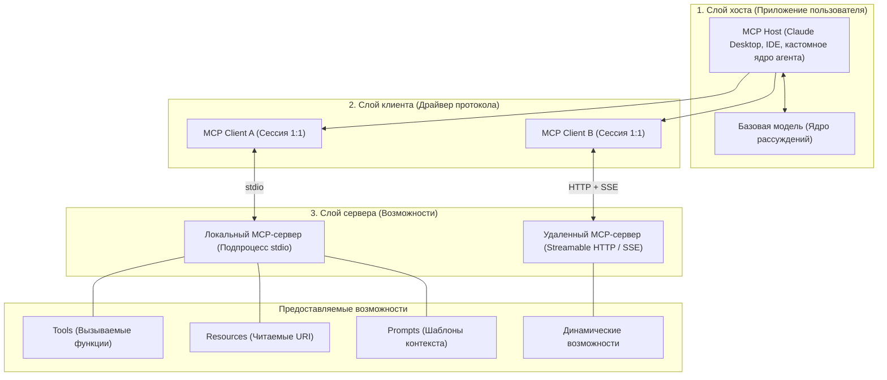

| Вызов | Без MCP | С MCP |
| :--- | :--- | :--- |
| **Интеграция** | Индивидуальные обертки API для каждого нового источника данных. | Совместимость с первого дня для любого инструмента, предоставляющего MCP-сервер. |
| **Дистрибуция** | Написание уникальных плагинов под каждую IDE, десктоп и кастомный агентный рантайм. | Написание одного MCP-сервера с одинаковым развертыванием на всех MCP-совместимых хостах. |
| **Обнаружение (Discovery)** | Неформальная документация и ручные файлы конфигурации. | Стандартизированный протокол обнаружения возможностей (`tools/list`, `resources/list`). |
| **Безопасность** | Хаотичное распределение API-ключей по скриптам инструментов. | Централизованные границы авторизации, изолированный доступ к возможностям, запрет сквозных токенов. |
| **Гибкость развертывания** | Инструменты жестко привязаны к памяти процесса приложения. | Инструменты работают где угодно: локальные подпроцессы (`stdio`) или удаленные микросервисы (Streamable HTTP). |

#### 12.2.2 Продвинутые примитивы MCP: Resumability, Elicitation и Sampling
MCP превращает пассивный вызов инструментов в распределенное сотрудничество с сохранением состояния:

| Возможность | Механизмы MCP | Принцип работы |
| :--- | :--- | :--- |
| **Streaming и прогресс** | Уведомления о прогрессе (`notifications/progress`) | Серверы отдают структурированные обновления (процент завершения, шаг, диагностика) в реальном времени через SSE. |
| **Возобновляемость (Resumability)** | Сессии Streamable HTTP + повтор событий | Переподключающийся клиент передает ID последнего события (`Last-Event-ID`); сервер повторяет пропущенные события из журнала. |
| **Долговечность (Durability)** | Ссылки на ресурсы (Resource Links / Персистентные URI) | Инструменты возвращают долговечные URI (`news://internal/article/42`), опирающиеся на БД или S3, отвязывая результат от жизни процесса. |
| **Многоэтапное взаимодействие** | Elicitation и Sampling | **Elicitation**: Сервер ставит задачу на паузу и запрашивает ввод у пользователя.<br>**Sampling**: Сервер запрашивает инференс LLM у клиентской модели без передачи API-ключей. |

#### 12.2.3 Псевдокод: мост между MCP и инструментами агента

```python
from dataclasses import dataclass
from typing import Any, Dict, Optional
import asyncio

@dataclass(frozen=True)
class MCPToolDefinition:
    name: str
    description: str
    input_schema: Dict[str, Any]

class MCPToolBridge:
    def __init__(self, server_id: str, tool_def: MCPToolDefinition, session_client: Any):
        self.server_id = server_id
        # Изоляция пространства имен для предотвращения коллизий между серверами
        self.name = f"mcp_{server_id}_{tool_def.name}"
        self.description = tool_def.description
        self.parameters = tool_def.input_schema
        self._raw_name = tool_def.name
        self._session = session_client

    def to_llm_schema(self) -> Dict[str, Any]:
        """Преобразует схему MCP-инструмента в формат Function Calling для LLM."""
        return {
            "type": "function",
            "function": {
                "name": self.name,
                "description": self.description,
                "parameters": self.parameters
            }
        }

    async def execute(self, arguments: Dict[str, Any]) -> Dict[str, Any]:
        """Связывает асинхронный вызов инструмента агентом с удаленной MCP-сессией."""
        try:
            call_result = await self._session.call_tool(
                name=self._raw_name,
                arguments=arguments
            )
            # Стандартизация составного MCP-ответа в результат инструмента агента
            serialized_content = [
                part.get("text", "") for part in call_result.get("content", [])
                if part.get("type") == "text"
            ]
            return {
                "status": "SUCCESS",
                "output": "\n".join(serialized_content),
                "is_error": call_result.get("isError", False)
            }
        except Exception as e:
            return {
                "status": "SYSTEM_ERROR",
                "output": f"Выполнение MCP-инструмента завершилось ошибкой: {str(e)}",
                "is_error": True
            }
```

#### 12.2.4 Топология Agent-to-Agent Protocol (A2A) и задача-центричная архитектура
Протокол Agent-to-Agent (A2A) предназначен для **межорганизационного, федеративного сотрудничества**. Вместо низкоуровневых функций инструментов A2A рассматривает удаленных агентов как автономные «черные ящики», управляющие **Задачами (Tasks)** с сохранением состояния.

| Вызов сотрудничества | Без A2A | С A2A |
| :--- | :--- | :--- |
| **Межорганизационное взаимодействие** | Индивидуальные контракты API для каждого партнера; сложность растет квадратично ($O(N^2)$). | Единый протокол поверх HTTP для обнаружения, делегирования и верификации через фаерволы организаций. |
| **Гетерогенность фреймворков** | Необходимость адаптеров под каждый фреймворк (LangGraph $\leftrightarrow$ CrewAI $\leftrightarrow$ AutoGen). | Агенты предоставляют стандартные эндпоинты A2A; оркестраторы работают с ними независимо от внутреннего рантайма. |
| **Обнаружение (Discovery)** | Ручная координация с партнерами и статическая документация. | Самоописываемые машиночитаемые карточки Agent Cards по адресу `/.well-known/agent-card.json`. |
| **Изоляция выполнения** | Необходимость раскрывать закрытые системные промпты, память и внутренние инструменты. | Полная инкапсуляция «черного ящика»: видны только публичные интерфейсы, навыки и готовые артефакты. |
| **Многоэтапные процессы** | Хрупкие кастомные вебхуки для обработки пауз и уточнений. | Нативная протокольная поддержка прерываний жизненного цикла `input-required` и `auth-required`. |

#### Четыре ключевых примитива A2A:

| Элемент | Назначение | Ключевые характеристики |
| :--- | :--- | :--- |
| **Agent Card** | Обнаружение и метаданные | Стандартизированный JSON по адресу `/.well-known/agent-card.json`. Объявляет идентичность, URL эндпоинта, возможности, навыки и схемы аутентификации. |
| **Message** | Шаги коммуникации | Одиночный шаг взаимодействия с ролью (`user` или `agent`). Содержит мультимодальные части (`TextPart`, `FilePart`, `DataPart`). |
| **Task** | Единица работы с состоянием | Атомарная задача с уникальным ID, строгим автоматом состояний и контекстом; неизменяема по достижении терминального состояния. |
| **Artifact** | Конкретные результаты | Материальные структурированные артефакты (документы, патчи кода, изображения), генерируемые задачей; отдаются клиенту инкрементально. |

#### 12.2.5 Конечный автомат жизненного цикла задачи в A2A
A2A структурирует все взаимодействия как проверяемый конечный автомат:

```mermaid
stateDiagram-v2
    [*] --> submitted: message/send
    submitted --> working: Сервер начинает выполнение
    
    state "Активные состояния" as Active {
        working --> working: Потоковые события прогресса
    }
    
    state "Состояния прерывания" as Interrupted {
        working --> input_required: Требуется ввод пользователя
        input_required --> working: Клиент отправляет ответ
        working --> auth_required: Требуются реквизиты / оплата
        auth_required --> working: Клиент предоставляет авторизацию
    }
    
    state "Терминальные состояния (Неизменяемые)" as Terminal {
        working --> completed: Задача успешно выполнена
        working --> failed: Неустранимая ошибка выполнения
        working --> canceled: Клиент отменил задачу
        submitted --> rejected: Сервер отклонил выполнение
    }
    
    completed --> [*]
    failed --> [*]
    canceled --> [*]
    rejected --> [*]
```

#### 12.2.6 Псевдокод: A2A Task Client и менеджер жизненного цикла

```python
from dataclasses import dataclass
from enum import Enum
from typing import Dict, Any, Optional
import aiohttp
import json

class TaskState(Enum):
    SUBMITTED = "submitted"
    WORKING = "working"
    INPUT_REQUIRED = "input-required"
    AUTH_REQUIRED = "auth-required"
    COMPLETED = "completed"
    FAILED = "failed"
    CANCELED = "canceled"
    REJECTED = "rejected"

class A2ATaskClient:
    def __init__(self, agent_endpoint: str, auth_token: str):
        self.endpoint = agent_endpoint.rstrip("/")
        self.headers = {
            "Authorization": f"Bearer {auth_token}",
            "Content-Type": "application/json"
        }

    async def submit_task(self, prompt: str, context_id: Optional[str] = None) -> Dict[str, Any]:
        payload = {
            "jsonrpc": "2.0",
            "method": "task/create",
            "params": {
                "message": {"role": "user", "parts": [{"type": "text", "text": prompt}]},
                "contextId": context_id
            },
            "id": 1
        }
        async with aiohttp.ClientSession() as session:
            async with session.post(f"{self.endpoint}/rpc", json=payload, headers=self.headers) as resp:
                data = await resp.json()
                return data.get("result", {})

    async def resolve_interruption(self, task_id: str, user_input: str) -> None:
        payload = {
            "jsonrpc": "2.0",
            "method": "task/respond",
            "params": {
                "taskId": task_id,
                "response": {"parts": [{"type": "text", "text": user_input}]}
            },
            "id": 2
        }
        async with aiohttp.ClientSession() as session:
            await session.post(f"{self.endpoint}/rpc", json=payload, headers=self.headers)
```

#### 12.2.7 Топологии межагентного контекста: центральный Hub против внешнего хранилища
При совместной работе распределенных агентов над общей целью управление контекстом и данными разделяется на две базовые топологии:

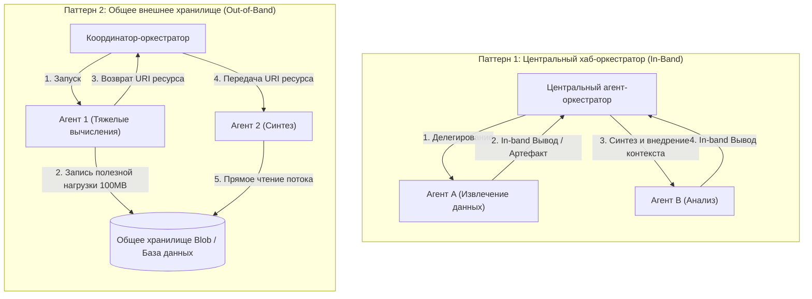

- **Паттерн 1 (Центральный Hub / In-Band)**: Оркестратор принимает полные данные, отфильтровывает шум, преобразует схемы и передает чистый контекст на следующий шаг. Оптимален для стандартных процессов с небольшими данными ($<50\text{KB}$), где требуется жесткий централизованный контроль.
- **Паттерн 2 (Общее хранилище / Out-of-Band ссылки)**: Агенты сохраняют тяжелые результаты (CSV-выгрузки, аудиофайлы, датасеты) напрямую в облачное или реляционное хранилище, передавая лишь легковесные URI ресурсов (`s3://...` или Resource Links в MCP). Это защищает контекстное окно оркестратора от переполнения.

---

### 12.3 Инженерные компромиссы (Trade-offs)

#### 12.3.1 Составная оркестрация (MCP) против делегированной автономии (A2A)
- **Составная оркестрация (MCP)**:
  - *Профиль контроля*: Полная прозрачность. Центральный оркестратор видит каждый вызов инструмента, перехватывает параметры, валидирует результаты и управляет потоком данных.
  - *Затраты*: Требует последовательных шагов рассуждения LLM на каждое элементарное действие. Высокий расход токенов и задержка оркестрации.
- **Делегированная автономия (A2A)**:
  - *Профиль контроля*: Делегирование «черному ящику». Удаленному агенту поручается достижение макроцели (*«Проведи аудит финансового отчета»*). Внутренние рассуждения и выбор инструментов скрыты.
  - *Затраты*: Высокая эффективность и модульность, но непрозрачное выполнение: если удаленный агент ошибся на промежуточных шагах, вызывающая сторона увидит только финальный артефакт.

#### 12.3.2 Внутриполосная сериализация контекста против внешнего хранилища
- **Внутриполосная сериализация (In-Band)**: Простая архитектура (без внешних баз данных). Однако объединение выводов всех агентов внутри контекстного окна LLM вызывает квадратичный рост затрат на токены и провоцирует деградацию внимания *Lost-in-the-Middle*.
- **Внешнее персистентное хранилище**: Устраняет переполнение контекста передачей URI. Вносит инфраструктурные зависимости, задержки репликации и необходимость очистки устаревших данных по жизненному циклу.

#### 12.3.3 Локальный подпроцесс stdio против потокового HTTP-транспорта
- **Локальный транспорт `stdio`**: Нулевая сетевая задержка, ноль сетевых настроек безопасности, управление жизненным циклом процесса на уровне ОС. Ограничен строго одной машиной; невозможно масштабировать горизонтально.
- **Потоковый транспорт Streamable HTTP (SSE)**: Глобальная сетевая доступность, масштабирование между регионами облака, совместимость с реверс-прокси и API-шлюзами. Вносит задержки сети, требует восстановления при разрывах и настройки TLS/OAuth.

#### 12.3.4 Архитектуры безопасности: зависимая от транспорта (PKCE) против единого HTTP (OAuth)
- **Безопасность MCP (зависит от транспорта)**:
  - Локальный `stdio` опирается на изоляцию процессов ОС и наследуемые переменные окружения.
  - Удаленный HTTP требует **OAuth 2.1 с PKCE (Proof Key for Code Exchange)** для защиты десктопных клиентов (Claude Desktop, IDE), не способных безопасно хранить client secret.
  - *Запрет сквозных токенов (Token Passthrough Prohibition)*: Строго запрещает передавать клиентские токены вышестоящим сервисам, предотвращая атаки класса **Confused Deputy**.
- **Безопасность A2A (единый HTTP)**:
  - Все взаимодействия работают через стандартный HTTPS.
  - Документ обнаружения (`/.well-known/agent-card.json`) декларирует поддерживаемые схемы аутентификации (OAuth2, Bearer tokens, API-ключи).
  - Гранулярная авторизация через OAuth-скоупы, привязанные к конкретным возможностям агента (`trading:read` против `trading:execute`).

---

### 12.4 Режимы сбоев и узкие места (Failure Modes & Bottlenecks)

#### 12.4.1 Векторы сбоев распределенного состояния и безопасности
1. **Уязвимость подневольного заместителя (Confused Deputy / Сквозные токены)**:
   - *Вектор сбоя*: Агент A аутентифицируется перед Инструментом/Агентом B привилегированным bearer-токеном. Инструмент B пересылает токен Агента A во внешний сервис C, совершая действие, выходящее за рамки исходных полномочий Агента A.
   - *Защита*: Строгое разграничение скоупов учетных данных на каждом уровне; запрет пересылки токенов через узлы протокола.
2. **Рассинхронизация состояния сессии (Replay Drift)**:
   - *Вектор сбоя*: Разрыв сети в ходе многочасовой потоковой задачи. Клиент переподключается с нарушенным порядком ID событий, из-за чего буфер повторов пропускает промежуточные мутации состояния.
   - *Защита*: Монотонные последовательности событий на базе персистентной БД в сочетании с хешированием чекпоинтов на SHA-256.
3. **Затопление контекста удаленными артефактами (Context Flooding)**:
   - *Вектор сбоя*: Автономный удаленный агент возвращает сырой JSON-дамп размером $5\text{MB}$ в сообщении, мгновенно вымывая системный промпт из контекстного окна вызывающего агента.
   - *Защита*: Жесткий лимит размера входящих сообщений ($<20\text{KB}$); принудительная запись больших данных в блоб-хранилища с возвратом URI.
4. **Взаимные блокировки при прерываниях (Zombie Interruption Deadlocks)**:
   - *Вектор сбоя*: Удаленный агент переходит в статус `input-required` для уточнения данных. Клиент отключился или пропустил уведомление, оставив серверный поток или облачную задачу заблокированной навсегда.
   - *Защита*: Настройка жестких таймеров TTL (Time-To-Live) для состояний прерывания; автоматический перевод зависших задач в статус `canceled` по таймауту.
5. **Коллизии пространств имен и дрейф схем**:
   - *Вектор сбоя*: Два независимых MCP-сервера отдают инструменты с одинаковыми именами (`search_db`). Модель хоста получает неоднозначные сигнатуры и совершает непредсказуемые вызовы.
   - *Защита*: Префиксация имен инструментов уникальным идентификатором сервера (`mcp_{server_id}_{tool_name}`).

#### 12.4.2 Системный сбой

> [!WARNING]
> - **Confused Deputy и ловушка делегированных полномочий**: При делегировании задач через A2A или удаленный MCP права доступа обязаны следовать принципу наименьших привилегий. Никогда не предоставляйте внешнему агенту wildcard-доступ к внутренним системам.
> - **Иллюзия бесшовного распределения**: Дробление монолитных агентов на распределенные микроагенты несет накладные расходы: сериализацию в JSON-RPC, сетевые повторы и сетевые задержки. Если агентам не требуется изоляция безопасности или раздельное масштабирование, держите их в единой памяти процесса.
> - **Дедлок при двунаправленном семплинге (Bidirectional Sampling Deadlock)**: Если Сервер A запрашивает семплинг у Клиента B, а модель Клиента B вызывает инструмент на Сервере A для ответа, система попадает в распределенный циклический дедлок без явного механизма обнаружения петель.

---

### 12.5 Фреймворк принятия решений (Decision Framework)

#### 12.5.1 Дерево выбора протокола

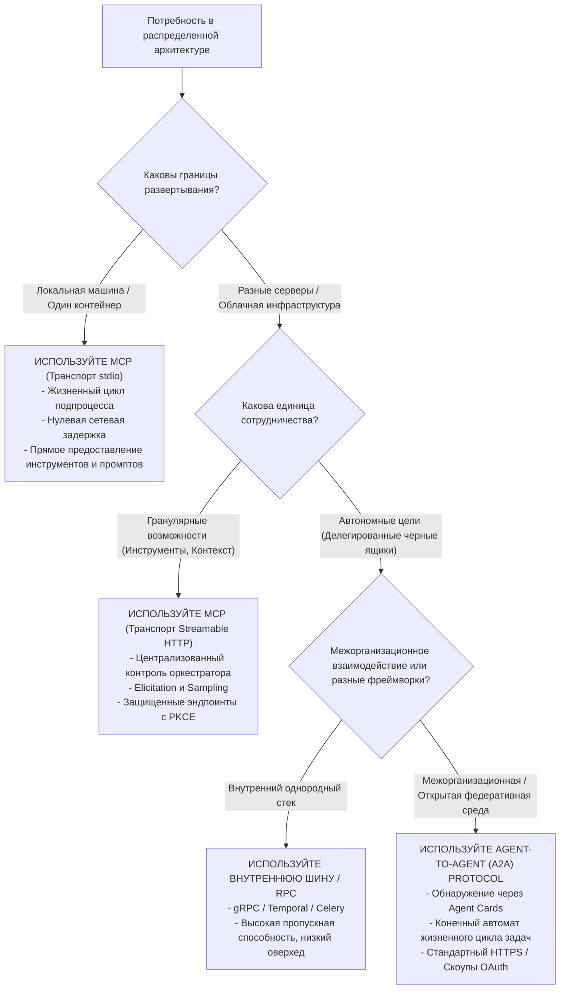

#### 12.5.2 Комплексная матрица сравнения протоколов (MCP против A2A)

| Измерение возможностей | Model Context Protocol (MCP) | Agent-to-Agent Protocol (A2A) |
| :--- | :--- | :--- |
| **Доступ к инструментам и ресурсам** | **Основной фокус**: Стандартизация предоставления инструментов, ресурсов и промптов LLM-хостам через универсальные схемы. | **Вторично / Не цель**: Агенты являются черными ящиками; внутренние инструменты и рассуждения скрыты. |
| **Механизм обнаружения (Discovery)** | Регистрация серверов в конфигах клиентов (`claude_desktop_config.json`, настройки IDE); реестры. | Децентрализованные карточки Agent Cards по стандартному адресу `/.well-known/agent-card.json`; реестры. |
| **Длительные операции** | Потоковые уведомления о прогрессе через SSE; возобновление сессий по ID событий; постоянные ссылки на ресурсы. | Надежный жизненный цикл задачи со статусами (`submitted`, `working`, `completed`); SSE; вебхуки. |
| **Интерактивные процессы** | Двунаправленные примитивы: **Elicitation** (запрос ввода у пользователя) и **Sampling** (запрос инференса LLM у клиента). | Явные статусы прерывания: `input-required` и `auth-required`. Клиент отправляет ответы для продолжения работы. |
| **Топологии оркестрации** | **Оркестратор-Специалист**: Хост централизованно координирует гранулярные инструменты с полной видимостью. | **Пиринговое делегирование (Peer-to-Peer)**: Автономные агенты находят друг друга и делегируют макрозадачи. |
| **Межорганизационная совместимость** | Возможна по HTTP, но исходно спроектирована для интеграции инструментов и контекста внутри одного контура. | **Ключевой фокус**: Создан для федеративного сотрудничества между разными вендорами, организациями и стеками. |
| **Экосистема и управление** | Открытый стандарт от Anthropic (конец 2024); поддержка в IDE (Cursor, VSCode, Claude). | Открытый стандарт, переданный в Linux Foundation (2024); SDK для Python, JS, Java, .NET; экосистема Google Cloud. |

#### 12.5.3 Директивы развертывания в продакшене

> [!DECISION]
> **Директивы продакшена для распределенных агентов**:
> 1. **Двухуровневое разделение протоколов**: Используйте **MCP внутри контура** для подключения оркестратора к базам данных, внутренним инструментам и песочницам. Используйте **A2A наружу**, когда ваш агент предоставляет автономный сервис или взаимодействует со сторонними партнерскими агентами.
> 2. **Мосты от эфемерности к долговечности**: Вызовы инструментов, генерирующие ответы $>50\text{KB}$, обязаны сохранять данные в объектное хранилище и возвращать долговечные URI, а не передавать сырой текст в память диалога.
> 3. **Строгая безопасность без сквозных токенов**: Никогда не пересылайте клиентские токены OAuth через несколько агентных звеньев. Каждый промежуточный агент обязан аутентифицироваться в зависимых сервисах собственной управляемой идентичностью.
> 4. **Защита от дедлоков при прерываниях**: Каждая распределенная задача, переходящая в статус прерывания `input-required` или `auth-required`, обязана иметь TTL-таймаут для предотвращения зависания ресурсов.

---

## Глава 13: Этика и Responsible AI для мультиагентных систем (в разработке)
*(Раздел в разработке)*

---

## Vault Links
- [[MOC AI Agents]]
- [[MOC AI]]
- [[Foundations of Multi-Agent Systems]]
- [[Основы Multi-Agent систем]]
- [[Building Multi-AgentSystems from Scratch]]
- [[Создание Multi-Agent систем с нуля]]
- [[AI Evals и тестирование]]
- [[Архитектура агентов: автономия, стейт и guardrails]]
- [[Многоагентные режимы: subagents, teams и orchestration]]
- [[AI-операционная система: memory, skills, MCP, harness]]
- [[ROI и Юнит-экономика агентов]]
- [[Инструменты агента и Tool Contracts]]
- [[Model Context Protocol (MCP): архитектура и примитивы]]
- [[Structured Outputs: гарантия схемы данных]]
