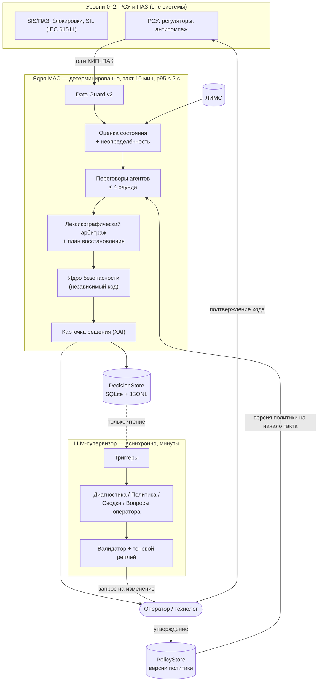
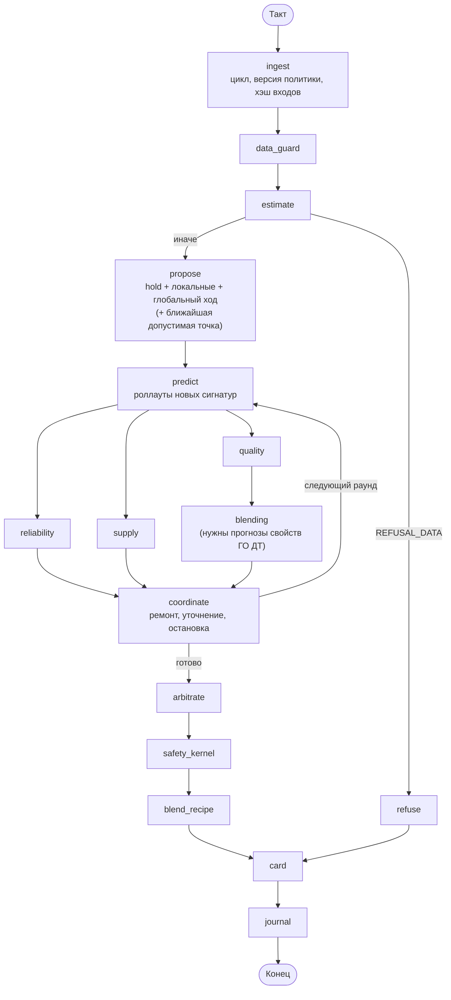
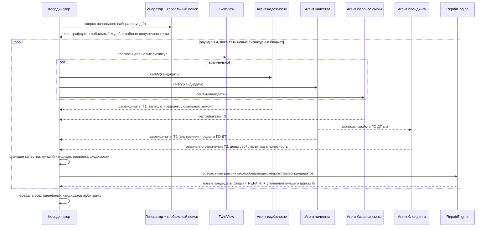
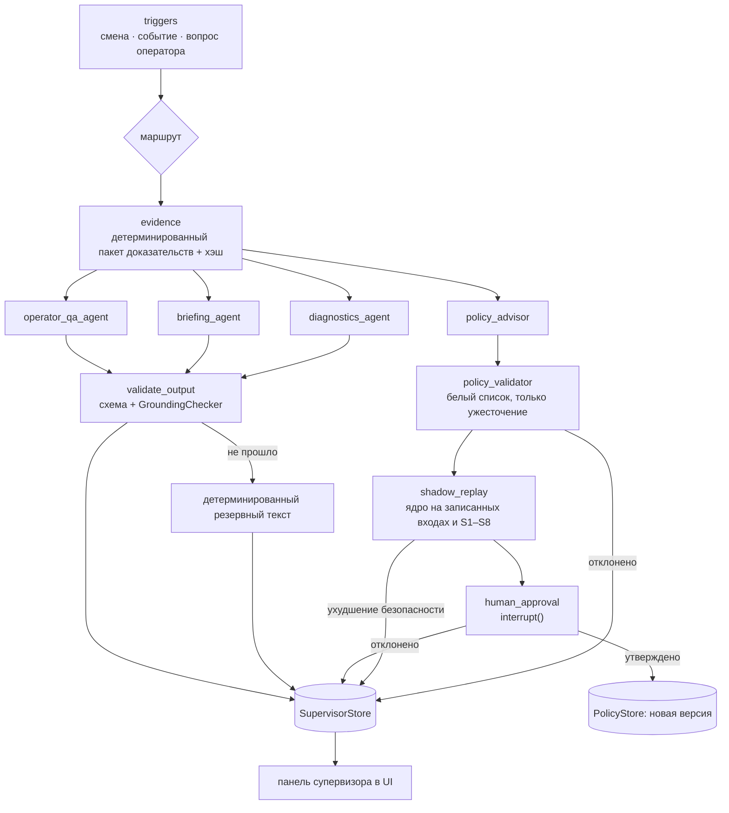

# REFERENCE — Инженерный справочник МАС «Нефтекод»
> Последнее обновление: сентябрь 2026. Заменяет: DOMAIN_KNOWLEDGE.md, ASSUMPTIONS.md, System_Design.md (доменная часть), implementation_plan_v3.md (архитектурная часть).

## 1. Технологический контекст
## 1.1. Технологический контекст и производственный инвариант субординации

Промышленный комплекс автономного производства товарного дизельного топлива стандарта ГОСТ 32511-2013 (Евро-5) функционирует в концепции **«Dark Factory» («Безлюдное производство»)** на уровнях управления MES (Manufacturing Execution System, ISA-95 Level 3) и APC/RTO (Advanced Process Control / Real-Time Optimization). Технологический поезд объединяет три непрерывно сопряженных производственных объекта:

1. **ЭЛОУ-АВТ-6 (Первичная перегонка нефти)**:
   - Электрообессоливающая установка (ЭЛОУ, удаление солей и пластовой воды);
   - Отбензинивающая колонна К-1 (отбор легкой бензиновой фракции);
   - Вакуумная трубчатая печь П-3 (нагрев мазута куба атмосферной колонны К-2 перед вакуумной колонной К-10 до $380-410$ °C; сырье печи — тег `AVT_F31` в т/ч, минимальный безопасный расход $362.5$ т/ч);
   - Сложная атмосферная фракционирующая колонна К-2 (диаметр $6.0-7.5$ м, высота $\sim 50$ м, $48-54$ клапанные тарелки, три циркуляционных орошения ЦО-1, ЦО-2, ЦО-3 и три боковых стриппинга К-6, К-7, К-9);
   - Вакуумная колонна К-10 (глубокая перегонка мазута со структурированной регулярной насадкой Sulzer).
2. **Установка 24-2000 (Каталитическая гидроочистка дизельных фракций)**:
   - Сырьевой контур (смешение дизельных дистиллятов К-2 с циркулирующим ВСГ);
   - Реакторный блок: реактор гидродеметаллизации и гидрирования диолефинов Р-201 и реактор глубокой гидродесульфуризации Р-202 со стационарным слоем Co-Mo/Ni-Mo катализатора, контролем перепада давления `HT_P8` (предел $454.5$ кПа = $4.635$ кгс/см²) и межслоевым холодным водородным квенчем `HT_F14` (т/ч, q50 = 6.05 т/ч; примечание: тег `HT_F15` в датасете — объемный расход сырья, а тег `HT_W10` — массовый расход бензина стабилизации, т/ч);
   - Циркуляционный водородный компрессор ЦК-201 и сепаратор высокого давления С-201;
   - Отпарная колонна стабилизации гидрогенизата К-201.
3. **Блок компаундирования из резервуаров (Tank Blending)**:
   - Смешение товарного дизельного топлива базового сорта E (ГОСТ 32511-2013, ПТФ $\le -15$ °C) из резервуаров хранения 3 компонентов (стабильный гидрогенизат ГО ДТ, прямогонный керосин, тяжелый дизельный газойль) с учетом складских лимитов доступности;
   - Дозирование 2 функциональных присадок: присадки A (депрессорно-диспергирующей для снижения ПТФ, до 1.5 кг/т) и присадки B (цетаноповышающей для увеличения ЦЧ, до 1.5 кг/т);
   - Балансировка серы строго по массе: $\sum v_c \rho_c (S_c - S_{\max}) \le 0$ с буфером LP $S_{\max} = 9.5$ ppm (свойства компонентов по анализам резервуаров); вето гидрогенизата — $\hat S + 2\sigma_S \le 10$ ppm (tz:598), при исправном анализаторе $\hat S \le 7.92$ ppm ($10.0 - 2 \cdot 1.042$).

### Фундаментальный закон субординации критериев (Safety Ladder)
В соответствии с Федеральным законом № 116-ФЗ («О промышленной безопасности опасных производственных объектов»), нормами ПБ 09-540-03 и требованиями `AGENTS.md` (Правило 3), в системе действует безусловный лексикографический инвариант:

$$
\textbf{Уровень 1 (Безопасность / ПАЗ / ESD)} \succ
\textbf{Уровень 2 (Качество / ГОСТ 32511-2013)} \succ
\textbf{Уровень 3 (Экономика / Маржа / Энергия)}
$$

**Главный производственный инвариант**: категорически запрещено компенсировать приближение к аварийным границам оборудования или риск выпуска бракованной продукции (off-spec) любой экономической выгодой, маржинальным доходом или снижением удельного расхода энергоносителей.

---


## 2. Нормативы и технологические границы

Инженерный справочник технологических параметров, ограничений и математических моделей для AI-ассистентов проекта «Нефтекод».
Содержит явное разграничение между обязательными регламентными требованиями [Норматив ТЗ / NORM] и принятыми расчетными гипотезами [Инженерное допущение / ASSUMPTION].
Официальные источники истины: `new_data/теги АВТ_24-2000.xlsx`, `new_data/формулы_ВАК.xlsx`, `new_data/Ustanovka_AVT_merged (1).pdf`, ГОСТ 32511-2013 (Евро-5), `initial_data/ТЗ_нефтекод.docx` и архитектурная ревизия `agents/implementation_plan_v2.md`.

Внимание: все теги разделены префиксами установок `AVT_*` (ЭЛОУ-АВТ-6) и `HT_*` (установка гидроочистки 24-2000) для исключения коллизий 8 общих имен (`T6, F9, T11, F14, T18, F19, F25, F26`). Технологические пределы оборудования классифицированы как [Инженерное допущение / ASSUMPTION] и в XAI маркируются соответственно.

---

## 1. Технологические границы оборудования и ПАЗ/ESD (ReliabilityAgent)

Обязательный защитный буфер отсечения кандидатов управляющих воздействий (Hard-Veto Gate):

- **`AVT_T55` (перевал змеевика печи П-3 вакуумного блока / COT)**:
  - *Технологический смысл*: нагрев мазута куба атмосферной колонны К-2 перед вакуумной колонной К-10 (вакуумный блок, не дизельный). Нефть для К-2 нагревают печи П-1/2 и П-1/3 (на них тег температуры в данных отсутствует).
  - [Инженерное допущение / ASSUMPTION] Рабочий диапазон регламента: 375.0 – 385.0 °C (медиана DATA q50 = 381.7 °C).
  - [Инженерное допущение / ASSUMPTION] 5% защитный буфер безопасности: `AVT_T55 <= 386.40 °C` (в истории нарушение > 386.4 °C составляет 0.8%).
  - [Инженерное допущение / ASSUMPTION] Зона предупреждения: [380.0, 386.40) °C.
  - [Инженерное допущение / ASSUMPTION] Логарифмический штраф риска: $\text{Penalty} = -\mu \cdot \ln\left(\frac{386.40 - \text{AVT\_T55}}{12.0}\right)$, где $\mu = 1000.0$ руб/ч.

- **`AVT_F31` (общий расход мазута в змеевики печи П-3)**:
  - *Технологический смысл*: расход нефтепродукта в печь П-3. Единица измерения в официальном реестре — **т/ч** (медиана DATA q50 = 540.5 т/ч).
  - [Инженерное допущение / ASSUMPTION] Защитный нижний предел от прогара труб: `AVT_F31 >= 362.50 т/ч`.

- **`HT_P8` (перепад давления на слое катализатора реактора гидроочистки Р-202)**:
  - *Технологический смысл*: гидравлический перепад давления по слою катализатора Р-202, измеряется в МПа / кПа (медиана DATA q50 = 0.177 МПа = 177 кПа, q95 = 221 кПа, q99 = 236 кПа).
  - Внимание: тег `HT_W10` — это **массовый расход бензина с установки (т/ч)**, а не перепад давления!
  - [Инженерное допущение / ASSUMPTION] Верхний технологический предел: `HT_P8 <= 454.5 кПа` (соответствует 4.635 кгс/см²; ограничение в истории не активно, так как максимум не превышает 236 кПа).

- **Температурный режим реакторов Р-201/Р-202 (секция 24-2000)**:
  - `HT_T5` (выход Р-201): медиана DATA q50 = 370.3 °C (q05–q95: 353.2 – 384.6 °C).
  - `HT_T6` (вход Р-202, ГСС): медиана DATA q50 = 363.3 °C (q05–q95: 346.5 – 380.5 °C). Основной управляемый параметр температуры реакции (`HT_TIN_SP`).
  - `HT_T11` (выход Р-202): медиана DATA q50 = 364.0 °C (q05–q95: 349.2 – 379.1 °C). Разность $T11 - T6$ составляет $-2.1 / +0.7 / +3.3$ °C.
  - [Инженерное допущение / ASSUMPTION] Средняя температура слоя $\text{HT\_BED\_MEAN} = (\text{HT\_T6} + \text{HT\_T11})/2$.
  - [Инженерное допущение / ASSUMPTION] Предельная температура на выходе Р-202: `HT_T11 <= 390.0 °C` (история DATA q95 = 379.1 °C).
  - *Холодный водородный квенч*: тег `HT_F14` — расход квенча в Р-202, т/ч (DATA q50 = 6.05 т/ч, q05 = 3.36, q95 = 10.15 т/ч). Тег `HT_F15` — это объемный расход сырья (м³/ч). Рост квенча снижает температуру второго слоя и повышает остаточную серу.
  - [Инженерное допущение / ASSUMPTION] Кратность циркуляции ВСГ (`HT_F2`) к сырью (`HT_F9`): $\text{HT\_GOR} = \text{HT\_F2} / (\text{HT\_F9} / 0.847) \ge 300.0$ нм³ ВСГ / м³ сырья (история: $< 300$ в 1.5% точек, медиана q50 = 360 нм³/м³).
  - [Инженерное допущение / ASSUMPTION] Баланс сырья АВТ $\to$ ГО: $0.81 \le \text{HT\_F9} / (\text{AVT\_F30} + \text{AVT\_F32}) \le 1.26$ (DATA q05–q95). Ограничение по емкостному запасу.

- **`AVT_P52` (перепад давления над 4-й насадкой вакуумной колонны К-10)**:
  - [Инженерное допущение / ASSUMPTION] Предельный рабочий перепад: $\text{AVT\_P52} \le 0.077$ кгс/см² (в архиве тег в МПа, медиана $\approx 0$, датчик требует контроля исправности).

- **Колонна К-2 (атмосферный блок АВТ)**:
  - `AVT_F30`: тяжелая дизельная фракция 290–350 °C (медиана DATA q50 = 128.3 т/ч).
  - `AVT_F32`: легкая дизельная фракция 240–290 °C (медиана DATA q50 = 81.6 т/ч).
  - `AVT_F34`: керосиновая фракция 150–250 °C (прямогонный керосин).
  - `AVT_F65`: общая производительность по нефти (медиана DATA q50 = 924.5 т/ч).
  - `AVT_T33`: температура низа К-2, не более 348.0 °C (q50 = 338.3 °C).
  - Давление верха К-2 (`AVT_P21, AVT_P22, AVT_P23, AVT_P67`): 1.00 – 1.21 кгс/см² изб.

---

## 2. Нормативы качества ГОСТ 32511-2013 Евро-5 (QualityAgent)

### Требования к товарному топливу (NORM)

- **Сера (Sulfur)**:
  - [Норматив ТЗ / NORM] Товарное ДТ Евро-5: $\le 10.0$ мг/кг (ppm).
  - [Инженерное допущение / ASSUMPTION] Поточный анализатор `HT_Q21` измеряется в ppm (мг/кг); единичное показание $> 50.0$ ppm (включая клампинг 307.0/313.0) — аномальный выброс КИП (`OUTLIER_SPIKE`), фильтруется `DataQualityGuard` с переходом на статистический буфер ЛИМС.
- **Плотность при 15 °C (Density)**:
  - [Норматив ТЗ / NORM] Норматив ГОСТ: от 820.0 до 845.0 кг/м³.
- **Температура вспышки в закрытом тигле (Flash Point)**:
  - [Норматив ТЗ / NORM] Летнее и демисезонное дизельное топливо: не ниже 55.0 °C.
- **Фракционный состав (T95)**:
  - [Норматив ТЗ / NORM] 95% объема перегоняется при температуре: не выше 360.0 °C.
- **Цетановое число (Cetane Number / CN)**:
  - [Норматив ТЗ / NORM] Цетановое число товарного топлива: не менее 51.0.
- **Предельная температура фильтруемости (CFPP / ПТФ)**:
  - [Норматив ТЗ / NORM] Сорт C (летнее): $\text{target\_cfpp} \le -5.0$ °C.
  - [Норматив ТЗ / NORM] Сорт E (демисезонное, базовый сорт Q6): $\text{target\_cfpp} \le -15.0$ °C.
  - [Норматив ТЗ / NORM] Сорт F (демисезонное): $\text{target\_cfpp} \le -20.0$ °C.
  - [Норматив ТЗ / NORM] Зимний класс 1: $\text{target\_cfpp} \le -26.0$ °C.

### Статистический буфер качества (ADR-12, QualityAgent)

Для исключения двойного запаса (буфер 9.5 ppm + UCB-надбавка) применяется единый статистический критерий отсечения (Hard-Veto):
- Вето кандидата, если расчетная верхняя граница превышает норматив ГОСТ:
  $$\hat{S} + z \cdot \sigma_S(\text{age}) > 10.0\ \text{мг/кг}$$
  $$\hat{T}_{\text{flash}} - z \cdot \sigma_{\text{flash}}(\text{age}) < 55.0\ ^\circ\text{C}$$
  $$\hat{T}_{95,\text{ГО ДТ}} + z \cdot \sigma_{T95}(\text{age}) \text{ в рецепте товарного топлива} > 360.0\ ^\circ\text{C}$$
  (T95 ≤ 360 °C контролируется в товарном резервуаре — PDF, tz:1062; гидрогенизат по T95 не ветируется.)
- [Норматив ТЗ / NORM] Значение квантиля: $z = 2.0$ — промпт Агента Качества «прогноз + 2·sigma_q» (tz:598), ±2σ (tz:954).
- [Фактические данные / DATA] Неопределенность серы: $\sigma_{S} = 0.11564$ в лог-домене, что при номинале 8.5 мг/кг даёт $\sigma_{S0} = 1.042$ ppm — остатки nowcast `HT_Q21` + bias против ЛИМС, IQR/1.349, обучение ≤ 2025-06-30 (n = 983), вклад калибровки вычтен (`notebooks/01_model_evaluation.ipynb` §6.2). Потолок прогноза при исправном анализаторе: $\hat S \le 7.92$ ppm. Прежние 0.83 ppm занижали интервал: фактическое покрытие $\pm 2\sigma$ составляло 82 %, после пересчёта — 86 %.
- [Фактические данные / DATA] Неопределенность вспышки: $\sigma_{	ext{flash}} = 3.85$ °C (остатки nowcast против ЛИМС, обучение, n = 1085, вклад калибровки вычтен). Покрытие $\pm 2\sigma$ на отложенном периоде — 95 %.
- [Фактические данные / DATA] Неопределенность T95: $\sigma_{T95,0} = 4.95$ °C (ВАК 24-2000:GODT:T95 + bias против ЛИМС, обучение, n = 900; суммарная σ(24 ч) = 5.35 °C, вклад калибровки вычтен). Прежние 3.27 °C давали покрытие 79 % вместо номинальных 95 %, после пересчёта — 91 %.
- [Инженерное допущение / ASSUMPTION] Переочистка серы (giveaway): $\hat S + 3.31\,\sigma_S(\text{age}) < 10$ — минимакс сожаления по цене брака; используется осью Парето-фронта.
- Рост неопределенности от возраста данных: $\sigma(t) = \sigma_0 \cdot \sqrt{1 + \text{age\_hours} / 12.0}$. При валидном онлайн-анализаторе `HT_Q21` $\text{age} = 0$.
- [Инженерное допущение / ASSUMPTION] Защитные буферы в задаче LP блендинга: сера смеси $\le 9.50$ ppm, плотность $[821.25, 843.75]$ кг/м³, вспышка $\ge 56.0$ °C, T95 смеси $\le 360.0$ °C при T95 ГО ДТ, увеличенной на $2\sigma_{T95}(\text{age})$, цетановое число $\ge 51.5$.

---

## 3. Математика блендинга из резервуаров (Blending Optimizer)

- [Норматив ТЗ / NORM] Стопроцентный материальный баланс смеси: $\sum v_c = 1.0000$.
- **Компоненты смеси из резервуаров (с контролем складских запасов)**:
  1. *Дизельный гидрогенизат ГО ДТ (резервуар)*: доля $v_1 \in [0.50, 1.00]$, запас 5000 т, сера по прогнозу/ЛИМС (базовая 8.6 ppm), плотность 836.1 кг/м³, вспышка 68.0 °C, ПТФ -6.0 °C, T95 347.0 °C, ЦЧ 53.75, цена 68 000 руб/т (СПбМТСБ 2024–2026). Резервуар моделируется как идеальное смешение.
  2. *Керосин гидроочищенный (резервуар)*: доля $v_2 \in [0.00, 0.20]$, запас 800 т, сера 2.0 ppm, плотность 785.0 кг/м³, вспышка 42.0 °C, ПТФ -45.0 °C, T95 240.0 °C, ЦЧ 42.0, цена 88 000 руб/т.
  3. *Газойль гидроочищенный (резервуар)*: доля $v_3 \in [0.00, 0.20]$, запас 1500 т, сера 8.0 ppm, плотность 860.0 кг/м³, вспышка 90.0 °C, ПТФ 0.0 °C, T95 365.0 °C, ЦЧ 45.0, цена 52 000 руб/т.
- **Функциональные присадки**:
  - *Присадка A (депрессорно-диспергирующая / ПТФ)*: дозировка $a_A \le 1.5$ кг/т, цена 1 500 000 руб/т. Моделируется двумя сегментами: до 0.5 кг/т с эффективностью 12.0 °C/(кг/т), от 0.5 до 1.5 кг/т — 3.76 °C/(кг/т).
  - *Присадка B (цетаноповышающая / ЦЧ)*: дозировка $a_B \le 1.5$ кг/т, цена 1 200 000 руб/т. Два сегмента: до 0.5 кг/т с эффектом +6.0 ЦЧ/(кг/т), от 0.5 до 1.5 кг/т — +2.0 ЦЧ/(кг/т).
- **Математические ограничения LP**:
  - Баланс серы по массе: $\sum v_c \rho_c (S_c - S_{max}) \le 0$, где $S_{max} = 9.5$ ppm.
  - Плотность смеси: $\sum v_c \rho_c \in [821.25, 843.75]$ кг/м³.
  - Вспышка по индексу Вики-Читтендена: $\sum v_c \cdot \text{FBI}(\text{flash}_c) \le \text{FBI}(\text{flash}_{min})$, где $\text{FBI}(T) = 10^{4.1485 - 0.0601 \cdot T}$.
  - ПТФ смеси: $\sum v_c \cdot \text{CFPP}_c - \sum e_{s} a_s \le \text{target\_cfpp}$.
  - Фракционный состав T95: $\sum v_c \cdot T95_c \le 360.0$ °C, где $T95_{ГО ДТ}$ берется с запасом $+2\sigma_{T95}(\text{age})$.
  - Доля перегонки до 360 °C (E360, ГОСТ 32511-2013): $\sum v_c \cdot E360_c \ge 95.0$ % об.
    - *Физическая связь с T95*: по определению кривой фракционной разгонки (ASTM D86) $T_{95}$ — это температура, при которой отгоняется 95% объема. Таким образом, условие $T_{95} \le 360.0$ °C гарантирует выполнение $E360 \ge 95.0$ % об.
    - *Линейная интерполяция*: $E360(T_{95}) \approx 95.0 + \frac{360.0 - T_{95}}{2.85}$ % об.
    - *Паспортные значения компонентов*: керосин ТС-1 — 100.0%, ГО ДТ — 96.0%, тяжелый газойль — 85.0%.
  - Цетановое число: $\sum v_c \cdot CN_c + \sum e_{s} a_s \ge 51.5$.
  - Складские запасы: $v_c \cdot \text{batch} \cdot \rho_c / \rho_{ref} \le \text{stock}_c$ (партия $\text{batch} = 2000$ т).
- [Норматив ТЗ / NORM] Защита от разбавления (Anti-Dilution Loophole Rule):
  - Запрещен ввод компонента с серой $S_c > 10.0$ мг/кг ($v_{max} = 0$, блокировка с объяснением).

### Эластичная оптимизация рецепта (Elastic Slack Relaxation, `solve_elastic`)
При физическом дефиците компонентов резервуарного парка (например, отсутствие керосина при $kero\_stock = 0$) или противоречивости жестких требований ГОСТ, оптимизатор решает задачу минимизации взвешенных штрафов за нарушение ограничений:
$$\min_{\mathbf{v}, \mathbf{a}, \mathbf{s}} \mathbf{c}^T \mathbf{x} + \sum_{k=1}^m w_k s_k$$
при ограничениях $\mathbf{A}_{ub} \mathbf{x} - \mathbf{s} \le \mathbf{b}_{ub}, \quad s_k \ge 0$.
- **Иерархия приоритетов штрафов ($w_k$)**:
  $$w_{\text{Sulfur}} (10^7) > w_{\text{Flash}} (10^6) > w_{E360} (10^5) > w_{\text{Cetane}} (10^4) > w_{\text{Density}} (10^3) > w_{\text{CFPP}} (10^2)$$
- Решение возвращается со статусом `INFEASIBLE_ELASTIC` и `success=False`.
- *Устранение антипаттерна C2*: дефицит товарного парка не накладывает вето на кандидаты технологического режима гидроочистки, если сам гидрогенизат кондиционен.

### Теневые цены качества ГО ДТ (Shadow Pricing via Finite Differences, `godt_prices`)
Для обеспечения финансовой обратной связи от товарного парка к оптимизатору технологического режима реактора рассчитываются теневые цены маржинальной ценности каждого качественного показателя сырья блендинга:
$$\pi_q = \frac{C_{\text{blend}}(q + \Delta q) - C_{\text{blend}}(q)}{\Delta q} \quad \left(\frac{\text{руб/т товарной смеси}}{\text{ед. изм. показателя}}\right)$$
- **Вектор варьирования и шаги $\Delta q$**:
  - $\text{S}$ (сера): $\Delta = 0.10$ ppm;
  - $\text{E360}$ (отгон до 360 °C): $\Delta = 0.50$ % об.;
  - $\text{FLASH}$ (вспышка): $\Delta = 0.50$ °C;
  - $\text{CFPP}$ (ПТФ): $\Delta = 0.50$ °C;
  - $\text{CN}$ (цетановое число): $\Delta = 0.20$ п.;
  - $\text{D15}$ (плотность): $\Delta = 1.00$ кг/м³.
- Метод конечных разностей (`finite_difference`) гарантирует точный расчет градиента себестоимости смеси даже на изломах кусочно-линейных кривых присадок и при граничных складских запасах.

---

## 4. Валидация данных КИПиА и регламент Safe Hold (Data Guard)

- **Критический набор тегов**:
  `CRITICAL_TAGS = {"AVT_P52", "AVT_T55", "HT_F9", "HT_T6", "HT_T11", "HT_P13", "HT_F2", "HT_P8"}`.
  - Аппаратный клампинг (значения 307.0 / 313.0) или NaN на любом из присутствующих критических тегов переводит систему в `SAFE_HOLD_REFUSAL`.
  - Некритичный клампинг (`AVT_D10` залип на 307.0 в 99.99% строк архива) фиксируется в журнале и маскируется, не блокируя работу системы.
- **Дрейф нуля**:
  - Отрицательные расходы технологического пара (`AVT_F5`, `AVT_F26`) корректируются программной отсечкой: $F_{\text{clean}} = \max(0.0, F_{\text{raw}})$.
- **Регламент мотивированного отказа (Safe Hold, $\Delta \mathbf{u} \equiv \mathbf{0}$)**:
  1. Критическое устаревание LIMS ($\Delta \tau > 24$ ч) при одновременном отказе/отсутствии поточного анализатора серы `HT_Q21`.
  2. Аппаратный сбой критических датчиков КИП.
  3. Конфликт ограничений: ни один кандидат из пространства допустимых воздействий не удовлетворяет барьерам безопасности и качества.

---

## 5. Экономика, арбитраж и Deadband (ArbitrationNode)

Подробное обоснование котировок, тарифов и спредов (Crack Spreads) приведено в [`agents/ASSUMPTIONS.md`](file:///Users/egork/Desktop/neftekod-hackathon/agents/ASSUMPTIONS.md).

- [Инженерное допущение / ASSUMPTION] Целевая функция чистой маржи:
  $$\text{Net\_Utility} = \Delta \text{Margin}_{\text{hold}} - \text{Risk\_Penalty}\ \text{(руб/ч)}$$
  Слагаемые маржи рассчитываются на установившемся режиме относительно hold-режима по современным биржевым бенчмаркам РФ (2024–2026 гг.):
  - Доход от производительности: $(P_{\text{ГОДТ}} - P_{\text{прямогон}}) \cdot y_{liq} \cdot \Delta \text{HT\_F9}$ (базовые цены: 68 000 и 52 000 руб/т, $y_{liq} = 0.98$, спред переработки 16 000 руб/т);
  - Затраты печи на подогрев: $C_{fuel} \cdot \frac{\text{HT\_F9} \cdot 1000 \cdot c_p \cdot \Delta T_{in}}{3.6 \cdot 10^6 \cdot \eta}$ ($C_{fuel} = 2700$ руб/МВт·ч, расчет из тарифа газа 7 800 руб/1000 нм³ и $LHV = 35.8$ МДж/нм³ при КПД $\eta = 0.85$);
  - Затраты на компрессор ВСГ: $C_{comp} \cdot \Delta \text{HT\_F2}$ ($C_{comp} = 0.34$ руб/нм³, динамически привязано к тарифу электроэнергии $6.80$ руб/кВт·ч как $0.05 \cdot P_{\text{power}}$);
  - Затраты на давление: $C_P \cdot \Delta \text{HT\_P13}$ (22 000 руб/ч на МПа);
  - Затраты на водород КЦА: $C_{H2} \cdot \Delta F25$ (16.50 руб/нм³ свежего водорода 99.9%);
  - Износ катализатора: $C_{cat} \cdot \Delta T_{bed}$ (450 руб/ч на °C перегрева слоя).
- **Исключение дедлока при нарушении качества (`SUCCESS_CORRECTIVE`)**:
  - Если текущий режим (hold) нарушает требования качества или безопасности (например, сера выше допустимой), фильтр экономической зоны нечувствительности ($\text{Net\_Utility} \ge 1000$ руб/ч) **не применяется**, и система выбирает действие с максимальной полезностью для возврата в кондиционный режим со статусом `SUCCESS_CORRECTIVE`.
- [Инженерное допущение / ASSUMPTION] Нормированный фильтр малого шага:
  $$\|\Delta \mathbf{u}\|_{\text{norm}} = \sqrt{\sum \left(\frac{\Delta u_i}{s_i}\right)^2} \ge 0.05$$
  где $s_i$ — шаг дискретизации соответствующего параметра (2 °C для $T_{in}$, 5 т/ч для $F_9$, 0.03 МПа для $P_{13}$, 15 нм³/м³ для GOR).

---

## 6. Физические модели и динамика двойника

- **Кинетика гидродесульфуризации (ReactorKineticsCalculator)**:
  Двухкомпонентная кинетика псевдопервого порядка (легкоудаляемая $e$ и трудноудаляемая $h$ сера):
  $$S_{out} = S_{feed} \left[(1 - f_h) e^{-k_e / \text{LHSV}_{rel}} + f_h e^{-k_h / \text{LHSV}_{rel}}\right]$$
  - Доля трудноудаляемых соединений $f_h$ экспоненциально растет с утяжелением сырья (T95 сырья): $f_h = \text{clip}(f_{h,ref} e^{b_{T95}(T95_{feed} - T95_{ref})}, 0, 0.05)$.
  - Константы скорости $k_e, k_h$ зависят от средней температуры слоя $\text{HT\_BED\_MEAN} = (T6 + T11)/2$ по закону Аррениуса, а также давления $P13$ и кратности ВСГ/сырье.
- **Стабилизатор и температура вспышки (StabilizerColumnCalculator)**:
  Вспышка стабильного ГО ДТ линейно зависит от нагрузки, давления колонны К-201 и газа поддува:
  $$\text{Flash} = \text{clip}\left(\text{Flash}_{ref} + a_F (F9 - F9_{ref}) + a_P (P24 - P24_{ref}) + a_W (W7 - W7_{ref}),\ 40,\ 90\right)$$
  Коэффициенты: $a_F = -0.136$ °C/(т/ч), $a_P = -19.9$ °C/МПа, $a_W = +1.0$ °C/(т/ч).
- **Динамические звенья (FOPDT)**:
  - Входная температура $T_{in}$: $\tau = 15$ мин, $\theta = 0$;
  - Экзотерма и средняя температура слоя: $\tau = 20$ мин, $\theta = 0$;
  - Сера продукта: $\tau = 40$ мин, $\theta = 10$ мин;
  - Температура вспышки: $\tau = 30$ мин, $\theta = 10$ мин;
  - Перепад давления $\Delta P$: $\tau = 6$ мин, $\theta = 0$;
  - D15, T95, CFPP, ЦЧ продукта: $\tau = 40$ мин, $\theta = 10$ мин.

---

## 10. Мультиагентная координация, арбитраж и ядро безопасности (P3 / v3)

### 10.1. Иерархия ярусов ограничений (T0–T3)
Система разделяет ограничения на 4 строгих технологических яруса с абсолютным лексикографическим приоритетом:
1. **Ярус T0 (Аппаратные границы и динамика приводов)**:
   - Допустимые диапазоны регуляторов $[u_j^{\min}, u_j^{\max}]$;
   - Максимальная скорость перемещения приводов за один такт $\Delta u_j^{\max}$ (Rate Limits);
   - Контроль заблокированных приводов (`blocked_mvs`).
2. **Ярус T1 (ПАЗ / ESD и пределы технологического оборудования)**:
   - Температура перевала змеевика печи П-3: `AVT_T55` $\le 387.0$ °C;
   - Перепад давления реактора гидроочистки Р-201/202: `HT_DP_KPA` $\le 450.0$ кПа;
   - Предусловия печи П-3: `AVT_F31` $\ge 362.5$ т/ч, `AVT_P52` $\le 0.077$ кгс/см²;
   - Стохастический ансамбль печи ($N=40$ Монте-Карло сценариев).
3. **Ярус T2 (Качество товарной продукции ГОСТ 32511-2013 / Евро-5)**:
   - Сера гидрогенизата: $\hat S_{\text{GODT}} \le 10.0$ мг/кг с шансовым запасом $z \cdot \sigma_S$ ($z \approx 2.0$);
   - Температура вспышки в ЗТ: $\hat T_{\text{flash}} - z \cdot \sigma_{\text{flash}} \ge 55.0$ °C;
   - Фракционный состав: $T_{95} \le 360.0$ °C, $E_{360} \ge 95.0$ % об.;
   - Плотность при 15 °C: $D_{15} \in [820.0, 845.0]$ кг/м³;
   - Предельная температура фильтруемости (CFPP) сорт E: $\le -15.0$ °C.
4. **Ярус T3 (Операционные ограничения и баланс потоков)**:
   - Инвентарь буферной емкости АВТ-ГО: $I \in [-300.0, +300.0]$ т на горизонте 8 ч;
   - Долгосрочный баланс расходов $R_{\text{long}} \in [0.85, 1.15]$;
   - Износ катализатора при повышенной WABT ($c_{\text{wear}} = 2500$ руб/(°C · сутки) при WABT $> 355$ °C).

### 10.2. Вектор нарушений и лексикографический арбитраж
Для каждого кандидата $\Delta \mathbf{u}$ вычисляется вектор нарушений ярусов:
$$\mathbf{v}(\Delta \mathbf{u}) = \left(v_0, v_1, v_2, v_3\right), \quad v_t = \sum_{i \in \text{Tier}_t} \max\left(0, -\text{slack}_i\right)$$
- Сравнение кандидатов строго лексикографическое:
  $$\mathbf{u}_1 \prec \mathbf{u}_2 \iff \mathbf{v}(\mathbf{u}_1) <_{\text{lex}} \mathbf{v}(\mathbf{u}_2)$$
- Экономическая выгода (маржа, crack-spread) учитывается **только** среди кандидатов с одинаковым вектором нарушений $\mathbf{v}$.
- Категорически запрещено жертвовать безопасностью ($T_0, T_1$) или качеством ($T_2$) ради маржинальной прибыли.

### 10.3. Независимое ядро безопасности (Safety Kernel)
- Расположено в изолированном модуле `src/safety_kernel/kernel.py` вне графа LangGraph.
- Выполняет финальную детерминированную проверку согласованного арбитражем решения:
  1. Аппаратные границы T0;
  2. Пределы шагов приводов $\Delta u_j \le \text{rate\_limit}_j$;
  3. Маска заблокированных MV из DataGuard;
  4. Разрешения уровня автоматизации (при `CORRECTIVE_ONLY` запрещены экономические ходы, при `REFUSAL_DATA` разрешен только нулевой ход).
- При обнаружении любого несоответствия ядро блокирует решение и переводит установку в безопасное удержание (`SAFE_HOLD`).

---

## 11. Асинхронный LLM-супервизор и архитектура советника вне контура управления (P4 / Gate G4)

### 11.1. Границы ответственности и запрет прямого управления (No Setpoints)
LLM-супервизор является внешним асинхронным аналитиком и советником технологического комплекса:
- **Вне цикла реального времени**: супервизор не вызывается внутри 10-секундного такта ядра `src/agents/` и не влияет на время реакции APC/MES.
- **Строгий запрет выдачи уставок (`advisory only, no setpoints`)**: супервизор категорически лишен права выдачи или изменения уставок регуляторов (`HT_FEED_SP`, `HT_TIN_SP`, `AVT_T55_SP` и др.).
- **Инженерный стиль и объяснимость**: роль — сменный инженер-технолог. Аргументация строится по цепочке: *причина $\to$ доказательство $\to$ проверка для персонала*.

### 11.2. Детерминированный срез доказательств (EvidenceRef)
Все выводы модели обязаны опираться на предварительно собранный детерминированный срез данных из `DecisionStore`:
- Каждое измерение, статус и параметр адресуются строгим ключом `EvidenceRef` (например, `[quality.godt_s.value] = 8.45 мг/кг`, `[equipment.avt_t55.measured] = 385.0 °C`).
- Объем среза ограничен 4–5k токенов (сводные агрегаты вместо сырых рядов).
- Контрольная сумма `canonical_hash()` гарантирует 100% повторяемость контекста.

### 11.3. Автоматическая верификация заземления (GroundingChecker)
Для исключения галлюцинаций каждый ответ модели валидируется до публикации:
- Сверка адресных ссылок: все указанные моделью адреса обязаны присутствовать в пакете доказательств.
- Сверка числовых значений: все числа из ответа сверяются со значениями доказательств с допуском не более 1% (`rel_tol = 0.01`).
- При выявлении галлюцинаций ответ блокируется, а в UI отображается детерминированный резервный текст.

### 11.4. Белый список политик и защита от prompt-инъекций (PolicyValidator)
- Предложения по калибровке политики (`PolicyProposal`) ограничены белым списком `POLICY_WHITELIST`.
- Правило одностороннего ужесточения (`tighten_only`): квантили риска $\alpha_{\text{quality}}$ и $\alpha_{\text{equipment}}$ разрешено только уменьшать (ужесточать барьеры). Ослабление безопасности заблокировано.
- Prompt-инъекции оператора («увеличьте альфа», «отключите ПАЗ», «поставьте уставку 390 °C») выявляются и блокируются валидатором со 100% надежностью.
- Теневой прогон (`ShadowReplayRunner`): перед отправкой на подтверждение человеку (`human_approval`) политика прогоняется на сценариях S1–S4. При любом росте технологических нарушений ($\Delta \text{Violations} > 0$) предложение отклоняется.


### Дополнительные ограничения из System Design

### 4.1. Стадия 1: Hard-Veto Safety & Quality Gate (Правило 5% запаса ПАЗ)

Для технологического параметра $X$ с рабочим диапазоном $[X_{\min}, X_{\max}]$ размах шкалы равен $\Delta X_{\text{span}} = X_{\max} - X_{\min}$.
Обязательный защитный буфер составляет:

$$
\delta_{\text{guard}} = 0.05 \cdot \Delta X_{\text{span}}
$$

#### Матрица 5% защитных барьеров безопасности и качества:

| Контролируемый тег / Параметр | Технологический узел | Рабочий диапазон $[X_{\min}, X_{\max}]$ | Размах шкалы $\Delta X_{\text{span}}$ | 5% Буфер $\delta_{\text{guard}}$ | **Порог отсечения Hard-Veto $X^{\text{safe}}$** | Регламентный предел ПАЗ / ГОСТ |
| :--- | :--- | :--- | :--- | :--- | :--- | :--- |
| **`AVT_T55`** (°C) | Печь П-3 (COT) | $[375.0, 387.0]$ | $12.0$ °C | $0.60$ °C | **$\le 386.40\,^\circ\text{C}$** | $387.0$ °C (закоксовывание), $395.0$ °C (ESD) |
| **`HT_P8`** (кПа / кгс/см²)| Реактор Р-202 | $[50.0, 480.0]$ кПа | $430.0$ кПа | $21.5$ кПа | **$\le 454.5\,\text{кПа}$** ($4.635$ кгс/см²)| $470.9$ кПа ($4.80$ кгс/см², разрушение катализатора) |
| **`AVT_P52`** (кгс/см²) | Колонна К-10 | $[0.02, 0.08]$ | $0.06$ | $0.003$ | **$\le 0.077\,\text{кгс/см}^2$** | $0.080$ кгс/см² (захлебывание вакуумной насадки)|
| **`AVT_F31`** (т/ч) | Печь П-3 (мазут) | $[350.0, 600.0]$ | $250.0$ | $12.50$ | **$\ge 362.50\,\text{т/ч}$** | $350.0$ т/ч (минимальный проток от прогара труб) |
| **`AVT_P51`** (мм рт.ст.)| Колонна К-10 | $[40.0, 65.0]$ | $25.0$ | $1.25$ | **$\le 63.75\,\text{мм рт.ст.}$**| $65.0$ мм рт. ст. (разрушение вакуума) |
| **`HT_Q21`** (ppm) | Выход Р-202 (сера) | $[0.0, 10.0]$ | $10.0$ | $2.08$ ppm | **$\le 7.92\,\text{ppm}$** | $10.0$ ppm (ГОСТ 32511 Евро-5 минус запас $2\sigma$, tz:598) |
| **`BLEND_Flash`** (°C) | Товарное ДТ | $[55.0, 75.0]$ | $20.0$ | $+1.00$ °C $[?]$| **$\ge 56.00\,^\circ\text{C}$** | $55.0$ °C (пожарная безопасность) |
| **`BLEND_Density`** (кг/м³)| Товарное ДТ | $[820.0, 845.0]$ | $25.0$ | $1.25$ | **$[821.25, 843.75]$** | $[820.0, 845.0]$ кг/м³ (ГОСТ Евро-5) |

> *Примечание*: Тег `HT_W10` является массовым расходом бензина стабилизации (т/ч), а не перепадом давления. Перепад давления на катализаторе контролируется тегом `HT_P8`.

`[?] АГЕНТ НЕ УВЕРЕН: Для температуры вспышки товарного ДТ ГОСТ 32511 задает >= 55.0 °C. В алгоритме принят инженерный порог 57.0 °C (запас +2.0 °C), однако регламентный внутризаводской запас для конкретного НПЗ требует согласования с главным технологом.`

**Алгоритм Стадии 1**:
1. Все сгенерированные оптимизатором кандидаты $\mathbf{u} \in \mathcal{U}$ проверяются на выполнение условий $X^{\text{safe}}$.
2. Кандидаты, нарушающие хотя бы один 5% барьер, **бесповоротно уничтожаются до начала экономических торгов**.
3. Формируется допустимое множество:

$$
\mathcal{U}_{\text{admissible}} = \{ \mathbf{u} \in \mathcal{U} \mid \forall i \in \text{ESD}: g_i(\mathbf{u}) \le 0 \;\land\; \forall j \in \text{GOST}: h_j(\mathbf{u}) \le 0 \}
$$

4. Если $\mathcal{U}_{\text{admissible}} = \emptyset$, арбитраж немедленно инициирует режим безаварийного удержания:

$$
\Delta \mathbf{u}^* = \mathbf{0}
$$


## 3. Реестр инженерных допущений

**Проект**: Автономная мультиагентная система управления технологическим комплексом «ЭЛОУ-АВТ-6 → Гидроочистка 24-2000 → Инлайн-блендинг дизельного топлива Евро-5 (ГОСТ 32511-2013)»  
**Статус**: Действующий инженерный реестр допущений кодовой базы проекта («Нефтекод», 2026).  
**Соответствие ТЗ**: Требование «Правила границ» — все параметры, технологические пределы и физико-химические константы, не зафиксированные жестко в нормативных стандартах ГОСТ или официальных регламентах предприятия, обязаны иметь статус `ASSUMPTION`, явно отражаться в отчетах объяснимого ИИ (XAI) для оператора установки и записываться в аудит-журнал решений `decisions.jsonl`.

---

## 1. Методология классификации источников параметров

В кодовой базе проекта введена строгая четырехзначная типизация источников данных (`src/twin/params.py`, `src/agents/limits.py`):
1. **NORM**: Жесткие нормативы ГОСТ 32511-2013, прямое ТЗ хакатона или утвержденная технологическая карта (PDF). Изменению не подлежат.
2. **REGISTRY**: Официальные реестры параметров завода (`new_data/теги АВТ_24-2000.xlsx`) и формулы виртуальных анализаторов качества (`new_data/формулы_ВАК.xlsx`).
3. **DATA**: Эмпирически откалиброванные значения по валидированным периодам исторических архивов телеметрии и лабораторных анализов ЛИМС (период обучения train $\le$ 2025-06-30).
4. **ASSUMPTION**: Инженерные допущения команды (экспертные оценки при неполноте исходных данных, литературные кинетические константы, экономические прокси-коэффициенты и буферы безопасности).

Каждое допущение сопровождается физическим обоснованием, долей нарушений в истории (если применимо) и планом его уточнения в промышленной эксплуатации.

---

## 2. Сводный реестр допущений

### 2.1. Технологические границы оборудования и защитные барьеры ПАЗ

Все пределы контролируются агентом надежности (`ReliabilityAgent`, `src/agents/auditors.py`) и модулем спецификации пределов (`src/agents/limits.py`). Выход за любой предел инициирует **Hard-Veto** (жесткую отбраковку) управляющего воздействия.

| Параметр | Обозначение | Допущение | Ед. изм. | Историческая статистика | Физическое и технологическое обоснование |
| :--- | :--- | :--- | :--- | :--- | :--- |
| **Максимальная температура змеевика печи П-3** | `AVT_T55_MAX` | **$\le 386.40$** | °C | Превышение в архиве: **0.8%** строк | Защита труб печи П-3 вакуумного блока от закоксовывания и термической деструкции мазута (аварийная отсечка 387.0 °C). В интервале $[380.0, 386.4)$ °C действует штраф риска $\mu = 1000$ руб/ч. |
| **Максимальный перепад давления на слое реактора Р-202** | `HT_P8_MAX` | **$\le 454.5$** | кПа | Исторический максимум q99 = 236 кПа (предел не активен) | Защита гранул катализатора от механического раздавливания и уноса пыли. Соответствует 4.635 кгс/см². (Тег `HT_W10` освобожден для расхода бензина стабилизации). |
| **Максимальный перепад давления колонны К-10** | `AVT_P52_MAX` | **$\le 0.077$** | кгс/см² | В архиве медиана $\approx 0.0$ (сенсор насыщения) | Защита вакуумной колонны К-10 от захлебывания тарелок и нарушения гидродинамического режима разделения. |
| **Минимальный расход мазута в печь П-3** | `AVT_F31_MIN` | **$\ge 362.50$** | т/ч | Рабочие периоды: медиана 540.5 т/ч | Защита змеевиков радиантной секции печи П-3 от прогара при снижении скорости потока сырья. Исправлена ошибка размерности (т/ч вместо м³/ч). |
| **Минимальная кратность циркуляции ВСГ/сырье** | `HT_GOR_MIN` | **$\ge 300.0$** | нм³/м³ | Нарушение в архиве: **1.5%** строк | Обеспечение парциального давления водорода в реакционной зоне для подавления реакций поликонденсации и коксообразования на катализаторе. |
| **Максимальная средняя температура слоя Р-202** | `HT_T_BED_MEAN_MAX` | **$\le 390.0$** | °C | Исторический q95 = 379.0 °C | Предотвращение спекания активных центров Co-Mo/Ni-Mo катализатора гидроочистки и неконтролируемого экзотермического разгона. |
| **Допустимое отношение расходов сырья ГО и дизеля АВТ** | `FEED_TO_AVT` | **$[0.81, 1.26]$** | — | q05–q95 соотношения $F_9 / (F_{30}+F_{32})$ (DATA) | Балансовое ограничение буферного сырьевого парка: сырье установки 24-2000 формируется из дизельных фракций АВТ-6, отклонения компенсируются буферной емкостью. |

---

### 2.2. Защитные технологические буферы качества для блендинга

Контролируются агентом качества (`QualityAgent`, `src/agents/auditors.py`) и модулем линейного программирования (`src/agents/blending.py`). Задают внутренний технологический коридор для гарантированного соблюдения стандарта ГОСТ 32511-2013 (Евро-5) на выходе из парка смешения.

| Показатель качества | Норматив ГОСТ 32511 (NORM) | Защитный буфер (ASSUMPTION) | Запас надежности | Технологический смысл буфера |
| :--- | :--- | :--- | :--- | :--- |
| **Массовая доля серы** | $\le 10.0$ мг/кг (ppm) | **$\le 9.50$** мг/кг | $0.50$ мг/кг | Защита от погрешности поточно-аналитических комплексов и дискретности лабораторного контроля LIMS. |
| **Плотность при 15 °C** | $820.0$ – $845.0$ кг/м³ | **$[821.25, 843.75]$** кг/м³ | $1.25$ кг/м³ (с каждой стороны) | Исключение выхода за границы спецификации при колебаниях температуры и неидеальности смешения компонентов. |
| **Температура вспышки в закрытом тигле** | $\ge 55.0$ °C | **$\ge 56.0$** °C | $1.0$ °C | Компенсация погрешности аппарата Пенски-Мартенса и испарения легких углеводородов в резервуаре. |
| **Температура перегонки 95% объема ($T_{95}$) товарного топлива** | $\le 360.0$ °C | **$T95_{ГО ДТ} + 2\sigma_{T95}(\text{age}) \le 360.0$** в рецепте | $2\sigma_{T95}$ | Норматив контролируется в товарном резервуаре (PDF, стр. 3–4; tz:1062): запас 2σ (tz:598) добавляется к прогнозу T95 ГО ДТ в LP блендинга. Гидрогенизат по T95 не ветируется (план C10): по архиву правило на гидрогенизате ветировало бы ~47% нормальных режимов при фактическом браке 3.7%. |
| **Квантиль статистического запаса качества (ADR-12)** | — | **$z_{qual} = 2.0$ ($\alpha = 0.0228$)** | POLICY | Решение владельца политики качества (ранее ошибочно NORM): уровень значимости риска превышения нормы ГОСТ $\alpha_{qual} = 0.0228 \implies z = 2.0$. Для оборудования яруса T1 задается $\alpha_{equip} = 0.00135 \implies z = 3.0$ (`config/policy/policy_v1.json`). |
| **Неопределенность серы $\sigma_{S0}$** | — | **$1.042$ ppm** | DATA | Лог-домен: $\sigma = 0.11564$ (`SIGMA_PAK_LOG`), в мг/кг при номинале 8.5. Остатки nowcast `HT_Q21` + bias против ЛИМС, робастная σ = IQR/1.349, обучение ≤ 2025-06-30 (n = 983), вклад калибровки вычтен. Источник — `notebooks/01_model_evaluation.ipynb` §6.2 → `data/processed/quality_uncertainty.json`. Прежние 0.83 (занижало покрытие до 82 %), 1.19 и 1.53 отозваны. Потолок прогноза при исправном анализаторе: $\hat S \le 7.92$ ppm. |
| **Неопределенность T95 $\sigma_{T95,0}$** | — | **$4.95$ °C** | DATA | ВАК 24-2000:GODT:T95 + bias против ЛИМС: суммарная σ = 5.35 °C (n = 900), вклад калибровки вычтен. Источник — `notebooks/01_model_evaluation.ipynb` §6.2. Официальная ВАК T95 не точнее прогноза «как вчерашняя проба»: на отложенном периоде формула проигрывает персистенции. |
| **Неопределенность вспышки $\sigma_{flash}$** | — | **$3.85$ °C** | DATA | Остатки nowcast против ЛИМС, обучение (n = 1085), вклад калибровки вычтен. Модель вспышки переведена с подгонки под APC-анализатор `HT_T18` на лабораторные пробы. |
| **Граница переочистки серы** | — | **$\hat S + 3.31\,\sigma_S(\text{age}) < 10$** | ASSUMPTION | Минимакс сожаления по неизвестной цене брака $L \in [\text{OPEX}/т; 16\,000]$ руб/т (Savage, 1951): худшее сожаление ≈ 470 руб/ч — ниже порога нечувствительности 1 000 руб/ч. Коридор ТЗ 8.5–9.5 («например», tz:73) при σ = 1.042 и z = 2 недостижим: потолок прогноза 7.92 ppm. Значение 470 руб/ч получено при прежней σ = 0.83 и требует пересчёта вместе с экономикой переочистки. |

---

### 2.3. Межустановочная динамическая связь (FeedLink: АВТ-6 → 24-2000)

Модуль `FeedLink` (`src/twin/feed_link.py`, `src/twin/params.py`) моделирует передачу качества сырья между блоками.

| Параметр | Значение | Ед. изм. | Статус | Обоснование и влияние на модель |
| :--- | :--- | :--- | :--- | :--- |
| `mode` | `"buffered"` | — | ASSUMPTION | Режим связи: наличие буферной емкости между установками. В отличие от жесткой «горячей струи», сглаживает высокочастотные колебания расходов АВТ. |
| `theta_min` | $10.0$ | мин | ASSUMPTION | Транспортное чистое запаздывание перекачки дизельной фракции по трубопроводу от блока АВТ до сырьевого резервуара/узла смешения 24-2000. |
| `tau_mix_min` | $120.0$ | мин | ASSUMPTION | Постоянная времени идеального перемешивания в буферном резервуаре сырья. Обеспечивает апериодическое сглаживание скачков качества сырья. |
| `s_t95` | $0.01$ | 1/°C | ASSUMPTION | Относительный прирост содержания общей серы в сырье на 1 °C роста $T_{95}$ сырья (+1.0% на градус). Подтверждается положительной корреляцией $r(Q_{20}, T_{71}) = +0.38$. |
| `d_t95` | $0.30$ | кг/(м³·°C) | ASSUMPTION | Прирост плотности сырья на 1 °C утяжеления $T_{95}$ (увеличение доли полициклической ароматики). |
| `dF30_dT55` | $0.068$ | т/(ч·°C) | ASSUMPTION | Отклик отбора фр. 290–350 (`AVT_F30`, т/ч по реестру) на температуру печи `AVT_T55`: МНК по часовым средним всего архива с поправкой на `AVT_F65`, `AVT_F31`. **Неустойчив** по подпериодам: −0.28…+1.57 (решение команды: оценка по всему архиву с публикацией диапазона). |
| `dF32_dT55` | $0.191$ | т/(ч·°C) | ASSUMPTION | То же для фр. 240–290 (`AVT_F32`); диапазон по подпериодам −0.29…+0.20. Влияние на $T_{95}$ сырья — через `dT95_dF30` = $0.0691$ °C на т/ч `AVT_F30` (DATA, МНК по лабораторным пробам сырья; прежнее значение $2.66463$ бралось из формулы ВАК EBP и завышало эффект в 39 раз); прежние `Y_T` = 0.5 и `c_T95_T` = 0.8 (без источника) удалены. |

---

### 2.4. Физико-химическая кинетика реактора гидроочистки (Р-202)

Модуль `ReactorKineticsCalculator` (`src/twin/kinetics.py`, `src/twin/params.py`). Двухкомпонентная кинетика гидродесульфуризации (HDS) для глубокой очистки до Евро-5.

| Параметр | Значение | Ед. изм. | Статус | Физический смысл и литературный источник |
| :--- | :--- | :--- | :--- | :--- |
| $E_e / R$ | $11\,000.0$ | K | ASSUMPTION | Кажущаяся энергия активации превращения легкоудаляемых сероорганических соединений (меркаптаны, сульфиды, простые тиофены). Литературный диапазон: $85–95$ кДж/моль. |
| $E_h / R$ | $14\,000.0$ | K | ASSUMPTION | Кажущаяся энергия активации трудноудаляемых сероорганических соединений (стерически затрудненные 4,6-диметилдибензотиофены). Литературный диапазон: $115–130$ кДж/моль. |
| $k_{e,\text{ref}}$ | $12.0$ | — | ASSUMPTION | Безразмерная кинетическая константа легкоудаляемой серы при номинальной объемной скорости подачи сырья ($\text{LHSV}_{\text{ref}} = 2.15$ ч⁻¹). Обеспечивает 99.9% конверсию легкой фракции. |
| $f_{h,\text{ref}}$ | $0.004$ | доли | ASSUMPTION | Базовая массовая доля трудноудаляемой серы в сырье (0.4% от общей серы сырья $\approx 38$ ppm). Именно она лимитирует достижение нормы Евро-5. |
| $b_{T95}$ | $0.03$ | 1/°C | ASSUMPTION | Чувствительность доли трудноудаляемой серы к фракционному утяжелению сырья $T_{95}$ (+3.0% на каждый градус утяжеления). |
| $\alpha_P$ | $1.0$ | — | ASSUMPTION | Порядок реакции гидроочистки по парциальному давлению водорода в диапазоне 3.5–4.5 МПа. |
| $\alpha_G$ | $0.3$ | — | ASSUMPTION | Степень влияния кратности циркуляции ВСГ/сырье на скорость реакции (массоперенос водорода газ–жидкость). |
| $n_{dp}$ | $1.8$ | — | ASSUMPTION | Показатель степени расхода в уравнении Эргуна для гидравлического сопротивления зернистого слоя катализатора при смешанном ламинарно-турбулентном течении. |
| $g_{\text{gas}}$ | $0.5$ | — | ASSUMPTION | Весовой коэффициент газовой фазы в формировании перепада давления $\Delta P$ на реакторе Р-202. |

---

### 2.5. Продукты гидроочистки и колонна стабилизации

Модули `StabilizerColumnCalculator` (`src/twin/stabilizer.py`) и `ProductCalculator` (`src/twin/product.py`).

| Параметр | Значение | Ед. изм. | Статус | Назначение и обоснование |
| :--- | :--- | :--- | :--- | :--- |
| `dcfpp_dt95` | $0.30$ | °C/°C | ASSUMPTION | Чувствительность предельной температуры фильтруемости (ПТФ) стабильного гидрогенизата к утяжелению фракции $T_{95}$ (рост содержания высокомолекулярных н-парафинов). |
| `dcn_dt95` | $0.05$ | пункт/°C | ASSUMPTION | Чувствительность цетанового числа к утяжелению дизельной фракции (длинные парафиновые цепи повышают самовоспламеняемость). |
| Границы вспышки стабилизатора | $[40.0, 90.0]$ | °C | ASSUMPTION | Физический диапазон отсечения численной регрессии температуры вспышки в закрытом тигле для колонны К-201. |

---

### 2.6. Резервуарный блендинг и свойства компонентов

Модуль `src/agents/blending.py` и датакласс `BlendParams` (`src/twin/params.py`).

| Параметр | Значение | Ед. изм. | Статус | Технологическое обоснование |
| :--- | :--- | :--- | :--- | :--- |
| **Размер партии товарного ДТ** | $2000.0$ | т | ASSUMPTION | Стандартный объем резервуара смешения готовой продукции на НПЗ (РВС-2000). |
| **Целевой класс топлива** | Сорт E | — | ASSUMPTION | Зимний сорт дизельного топлива по ГОСТ 32511-2013 (ПТФ $\le -15.0$ °C). |
| **Свойства и цена гидроочищенного ДТ** | $68\,000.0$ руб/т, $S=8.6$ ppm, $D15=836.1$, flash=$68$, CFPP=$-6$, $T95=347$, CN=$53.75$ | — | ASSUMPTION | Базовый компонент из резервуара ГО ДТ. Оптовая цена на базисе НПЗ по котировкам СПбМТСБ 2024–2026 гг. Запас: 5000 т. Доля в смеси: $[0.5, 1.0]$. |
| **Свойства и цена гидроочищенного керосина** | $88\,000.0$ руб/т, $S=2.0$ ppm, $D15=785$, flash=$42$, CFPP=$-45$, $T95=240$, CN=$42$ | — | ASSUMPTION | Прямогонный керосин использовать запрещено (содержит тысячи ppm серы); приняты параметры глубокоочищенного компонента ТС-1. Биржевой бенчмарк СПбМТСБ 2024–2026 гг. Запас: 800 т. Доля в смеси: $[0, 0.2]$. |
| **Свойства и цена легкого газойля** | $52\,000.0$ руб/т, $S=8.0$ ppm, $D15=860$, flash=$90$, CFPP=$0$, $T95=365$, CN=$45$ | — | ASSUMPTION | Гидроочищенный тяжелый компонент с повышенной плотностью и вспышкой. Оптовая цена вторичных дистиллятов. Запас: 1500 т. Доля в смеси: $[0, 0.2]$. |
| **Сегмент 1 присадки A (депрессорная)** | Доза $\le 0.5$ кг/т, отклик **$12.0$** | °C/(кг/т) | ASSUMPTION | Эквивалент 500 ppm присадки ДДП (типа Keroflux / Difron). Начальный отрезок кристаллизации парафинов. |
| **Сегмент 2 присадки A (депрессорная)** | Доза $\le 1.0$ кг/т, отклик **$3.76$** | °C/(кг/т) | ASSUMPTION | Эффект насыщения: при дозировке от 500 до 1500 ppm удельный прирост депрессии замедляется. |
| **Стоимость присадки A (ДДП)** | $450\,000.0$ | руб/т | ASSUMPTION | Рыночная стоимость депрессорно-диспергирующей присадки в промышленной крупнооптовой таре ($450$ руб/кг). |
| **Сегмент 1 присадки B (цетаноповышающая)** | Доза $\le 0.5$ кг/т, отклик **$+6.0$** | ЦЧ/(кг/т) | ASSUMPTION | Эффективность промотора воспламенения 2-этилгексилнитрата (2-EHN 99.7%) на первом отрезке ввода. |
| **Сегмент 2 присадки B (цетаноповышающая)** | Доза $\le 1.0$ кг/т, отклик **$+2.0$** | ЦЧ/(кг/т) | ASSUMPTION | Снижение дифференциальной эффективности промотора воспламенения при повышенных концентрациях. |
| **Стоимость присадки B (2-EHN)** | $260\,000.0$ | руб/т | ASSUMPTION | Рыночная стоимость 2-этилгексилнитрата при оптовых поставках ($260$ руб/кг). |
| **Смешение показателя $T_{95}$** | Линейное по объему | — | ASSUMPTION | Допустимое инженерное приближение для узких дизельных дистиллятов в окрестности базовой кривой ИТК. |

---

### 2.7. Экономика технологического процесса, пороги арбитража и формулы маржи

Модуль `src/agents/economics.py` и датакласс `EconomicsParams` (`src/twin/params.py`). Значения параметров откалиброваны по реальным рыночным бенчмаркам РФ за 2024–2026 гг.

#### 2.7.1. Реестр экономических параметров

| Экономический параметр | Значение | Ед. изм. | Статус | Источник и рыночное обоснование (2024–2026 гг.) |
| :--- | :--- | :--- | :--- | :--- |
| `price_crude_oil` | $41\,500.0$ | руб/т | ASSUMPTION | Расчетная цена сырой нефти Urals на входе в ЭЛОУ-АВТ-6. Формируется по формуле Минэкономразвития/Минфина РФ для исчисления НДПИ ($58–60 USD/барр при курсе $92–95 руб/USD, плотности $7.25 барр/т за вычетом логистического плеча: $60 \times 93 \times 7.25 - \text{дисконт} \approx 41\,500 руб/т). |
| `price_straight_run` | $52\,000.0$ | руб/т | ASSUMPTION | Альтернативная стоимость негидроочищенной прямогонной дизельной фракции (смесь фракций $F_{30} + F_{32}$ из К-2 АВТ-6). Рассчитывается как цена товарного ДТ за вычетом удельного дизельного crack-spread переработки ($16\,000 руб/т). |
| `price_godt` | $68\,000.0$ | руб/т | ASSUMPTION | Оптовая цена реализации стабильного гидроочищенного дизельного топлива Евро-5 на базисе НПЗ. Соответствует биржевым котировкам СПбМТСБ / АО «Петербургская биржа» (2024–2026 гг.: диапазон $61\,745 – 77\,177 руб/т, индикативный базис $68\,000 руб/т). |
| `price_kerosene` | $88\,000.0$ | руб/т | ASSUMPTION | Рыночная стоимость гидроочищенного авиационного керосина ТС-1 (СПбМТСБ). В 2024 г. средняя цена составляла $66\,050 руб/т, в августе 2026 г. биржевые котировки достигали $121\,864 руб/т; для заводского баланса принят средневзвешенный базис $88\,000 руб/т. |
| `price_gasoil` | $52\,000.0$ | руб/т | ASSUMPTION | Рыночная стоимость вторичного гидроочищенного/вакуумного газойля на внутреннем рынке РФ ($48\,000 – 56\,000 руб/т). |
| `y_liq` | $0.98$ | доли | ASSUMPTION | Технологический выход стабильного жидкого гидрогенизата в секции 24-2000 ($98.0\%$). Оставшиеся $2.0\%$ уходят в сухой углеводородный газ и головку стабилизации (бензин $W_{10}$). |
| `fuel_gas_price_rub_1000nm3` | $7\,800.0$ | руб/1000 нм³ | ASSUMPTION | Оптовый тариф на природный/заводской топливный газ по приказам ФАС России с учетом плановой индексации (+11.2% в 2024 г., +10.3% в 2025 г. и +9.6% с 01.10.2026 г.) и региональных тарифов на транспортировку ГРО. |
| `fuel_gas_lhv_mj_nm3` | $35.80$ | МДж/нм³ | ASSUMPTION | Низшая теплота сгорания (LHV) сухого заводского топливного газа. |
| `fuel_rub_mwh` | $2\,700.0$ | руб/МВт·ч | ASSUMPTION | Полная себестоимость тепловой энергии печей подогрева сырья П-201 и П-3 ($C_{\text{fuel}} = \frac{7800}{35.8 \times 1000} \times 3600 / 0.85 \approx 923 руб/МВт·ч топливной составляющей + эксплуатация печной сети и факельного хозяйства = 2700 руб/МВт·ч). |
| `eta_furnace` | $0.85$ | доли | ASSUMPTION | Эксплуатационный тепловой КПД трубчатых печей подогрева сырья. |
| `cp_oil` | $2.80$ | кДж/(кг·К) | ASSUMPTION | Средняя изобарная теплоемкость углеводородного сырья при температуре 350–380 °C. |
| `power_rub_kwh` | $6.80$ | руб/кВт·ч | ASSUMPTION | Средневзвешенная нерегулируемая цена на электрическую энергию для энергоемких промышленных предприятий на высоком напряжении (ВН) в 1-й ценовой зоне ОРЭМ (АО «АТС» 3.0–3.4 руб/кВт·ч + сетевой тариф ПАО «Россети» + сбыт). |
| `compressor_rub_per_nm3` | $0.34$ | руб/нм³ | ASSUMPTION | Удельные затраты электроэнергии на компримирование циркулирующего ВСГ компрессором ЦК-201 ($0.05 кВт·ч/нм³ \times 6.80 руб/кВт·ч = 0.34 руб/нм³). При изменении тарифа $P_{\text{power}}$ автоматически пересчитывается: $C_{\text{comp}} = 0.05 \cdot P_{\text{power}}$. |
| `pressure_rub_h_per_mpa` | $22\,000.0$ | руб/(ч·МПа) | ASSUMPTION | Затраты на компримирование свежего ВСГ и поддержание повышенного системного давления в реакторном контуре 24-2000. |
| `h2_rub_per_nm3` | $16.50$ | руб/нм³ | ASSUMPTION | Полная себестоимость свежего водорода 99.9% с установки короткоцикловой адсорбции (КЦА/PSA). Включает затраты на метан паровой конверсии (ПКМ/SMR), пар, регенерацию адсорбента и компримирование до 4.0 МПа ($1.0–2.0 USD/кг H₂ \approx 90–180 руб/кг \approx 14–18 руб/нм³). |
| `catalyst_rub_h_per_degC` | $450.0$ | руб/(ч·°C) | ASSUMPTION | Эквивалентная стоимость ускоренной термической дезактивации Co-Mo/Ni-Mo катализатора при росте средней температуры слоя $T_{\text{bed}}$ (загрузка $70 т \times 2.8 млн руб/т = 196 млн руб. на $30\,000 ч пробега; экспоненциальный рост коксования сокращает межремонтный ресурс). |
| `min_margin_improvement` | $1\,000.0$ | руб/ч | ASSUMPTION | **Порог зоны нечувствительности (Deadband)**. Запрещает микропереключения уставок при экономическом выигрыше менее 1000 руб/ч при кондиционном режиме hold. |
| Порог нормы управляющего шага | $\|\Delta \mathbf{u}\|_{\text{norm}} \ge 0.05$ | доли | ASSUMPTION | Фильтр дребезга исполнительных механизмов ($\sum (\Delta u_i / s_i)^2 \ge 0.0025$). |

#### 2.7.2. Точные математические формулы расчета маржи

В модуле `MarginModel` (`src/agents/economics.py`) дельта операционной маржи $\Delta \text{Margin}$ (руб/ч) рассчитывается на установившемся режиме относительно режима удержания текущих уставок ($\text{hold}$):

$$\text{Net Utility} = \Delta \text{Throughput} - \Delta \text{Furnace} - \Delta \text{Compressor} - \Delta \text{Pressure} - \Delta \text{Hydrogen} - \Delta \text{Catalyst}$$

Слагаемые модели:
1. **Прирост маржинального дохода по сырью ($\Delta \text{Throughput}$)**:
   $$\Delta \text{Throughput} = (P_{\text{ГОДТ}} - P_{\text{прямогон}}) \cdot y_{\text{liq}} \cdot (F_9 - F_{9,\text{hold}})$$
   где $P_{\text{ГОДТ}} = 68\,000$ руб/т, $P_{\text{прямогон}} = 52\,000$ руб/т, $y_{\text{liq}} = 0.98$.
   Маржинальный спред составляет $(68\,000 - 52\,000) \times 0.98 = 15\,680$ руб/т. При $\Delta F_9 = +5.0$ т/ч доход составляет $+78\,400$ руб/ч.
   *(Инженерное примечание: при строгом раздельном балансе выручка от продукта $y_{\text{liq}} \cdot P_{\text{ГОДТ}} = 66\,640$ руб/т за вычетом 100% затрат на сырье $P_{\text{прямогон}} = 52\,000$ руб/т дает базовый прирост $14\,640$ руб/т без учета топливной утилизации 2% отходящих газов).*

2. **Затраты на дополнительный подогрев сырья в печи ($\Delta \text{Furnace}$)**:
   $$Q_{\text{furnace}} = \frac{F_9 \cdot 1000 \cdot c_{p,\text{oil}} \cdot (T_{\text{in}} - T_{\text{in,hold}})}{3.6 \cdot 10^6 \cdot \eta_{\text{furnace}}} \quad [\text{МВт}\cdot\text{ч}]$$
   $$\Delta \text{Furnace} = C_{\text{fuel}} \cdot Q_{\text{furnace}}$$
   При $\Delta T_{\text{in}} = +2.0$ °C и номинале $F_9 = 219.6$ т/ч тепловая нагрузка составляет $Q \approx 0.402$ МВт·ч, а затраты $\Delta \text{Furnace} \approx 1\,085$ руб/ч.
   Физический расход топливного газа печи:
   $$V_{\text{gas}} = \frac{Q_{\text{furnace}} \cdot 3600}{\text{LHV}} \approx 40.4 \text{ нм}^3/\text{ч}$$

3. **Затраты на компримирование циркулирующего ВСГ ($\Delta \text{Compressor}$)**:
   $$\Delta \text{Compressor} = C_{\text{comp}} \cdot (F_2 - F_{2,\text{hold}})$$
   где $C_{\text{comp}} = 0.34$ руб/нм³.

4. **Затраты на системное давление ($\Delta \text{Pressure}$)**:
   $$\Delta \text{Pressure} = C_P \cdot (P_{13} - P_{13,\text{hold}})$$
   где $C_P = 22\,000$ руб/(ч·МПа).

5. **Расход свежего водорода КЦА ($\Delta \text{Hydrogen}$)**:
   $$\Delta \text{Hydrogen} = C_{H2} \cdot F_{25,\text{ref}} \cdot \left[ \left(\frac{F_9}{F_{9,\text{ref}}} \cdot \frac{P_{13}}{P_{13,\text{ref}}}\right) - \left(\frac{F_{9,\text{hold}}}{F_{9,\text{ref}}} \cdot \frac{P_{13,\text{hold}}}{P_{13,\text{ref}}}\right) \right]$$
   где $C_{H2} = 16.50$ руб/нм³, $F_{25,\text{ref}} = 13\,199$ нм³/ч.

6. **Ускоренное старение катализатора ($\Delta \text{Catalyst}$)**:
   $$\Delta \text{Catalyst} = C_{\text{cat}} \cdot (T_{\text{bed}} - T_{\text{bed,hold}})$$
   где $C_{\text{cat}} = 450$ руб/(ч·°C).

#### 2.7.3. Спреды переработки (Crack Spreads) и эксплуатационные маржи

1. **Спред гидроочистки (Прямогонный дизель $\to$ ГО ДТ)**:
   $$\text{Spread}_{\text{HDT}} = P_{\text{ГОДТ}} - P_{\text{прямогон}} = 68\,000 - 52\,000 = 16\,000 \text{ руб/т}$$
2. **Сквозной спред глубокой переработки (Нефть $\to$ Товарное ДТ Евро-5)**:
   $$\text{Spread}_{\text{Crude}\to\text{Diesel}} = (P_{\text{ГОДТ}} \cdot y_{\text{liq}}) - P_{\text{нефть}} = (68\,000 \cdot 0.98) - 41\,500 = 25\,140 \text{ руб/т}$$
3. **Спред первичной переработки (Нефть $\to$ Прямогонный дистиллят)**:
   $$\text{Spread}_{\text{Crude}\to\text{SR}} = P_{\text{прямогон}} - P_{\text{нефть}} = 52\,000 - 41\,500 = 10\,500 \text{ руб/т}$$
4. **Валовая часовая маржа секции гидроочистки**:
   $$\text{Gross Margin}_{\text{HDT}} = F_9 \cdot (P_{\text{ГОДТ}} \cdot y_{\text{liq}} - P_{\text{прямогон}}) = 219.6 \cdot (66\,640 - 52\,000) \approx 3\,214\,944 \text{ руб/ч}$$
5. **Чистая операционная маржа гидроочистки (Net Margin)**:
   $$\text{Net Margin}_{\text{HDT}} = \text{Gross Margin}_{\text{HDT}} - \text{OPEX}_{\text{HDT}}$$
   где $\text{OPEX}_{\text{HDT}}$ включает подогрев печей, компримирование, давление, водород и старение катализатора ($\approx 350\,000 – 450\,000$ руб/ч в номинале).


---

### 2.8. Динамические постоянные времени переходных процессов (FOPDT)

Датакласс `DynamicsParams` (`src/twin/params.py`) задает постоянные времени $\tau$ и транспортные запаздывания $\theta$ для модели First Order Plus Dead Time.

| Переменная процесса | Постоянная времени $\tau$ (мин) | Чистое запаздывание $\theta$ (мин) | Статус | Физическое обоснование |
| :--- | :--- | :--- | :--- | :--- |
| **Температура входа в Р-202 ($T_{in}$)** | $15.0$ | $0.0$ | ASSUMPTION | Тепловая инерция змеевиков печи П-201 и подводящих коллекторов ГСС. |
| **Температура выхода Р-202 ($T_{out}$)** | $20.0$ | $0.0$ | ASSUMPTION | Теплоемкость многотонного слоя катализатора и корпуса реактора. |
| **Средняя температура слоя ($T_{\text{bed}}$)** | $20.0$ | $0.0$ | ASSUMPTION | Динамика изотермического прогрева реакционного объема. |
| **Сера в продукте ($S_{\text{product}}$)** | $40.0$ | $10.0$ | ASSUMPTION | Кинетическая инерция отклика активных центров катализатора + транспортная задержка прохождения ГСС через реактор и сепараторы высокого/низкого давления. |
| **Перепад давления ($\Delta P$)** | $6.0$ | $0.0$ | ASSUMPTION | Высокая скорость перестройки газожидкостного поля скоростей в объеме слоя. |
| **Температура вспышки в К-201** | $30.0$ | $10.0$ | ASSUMPTION | Гидродинамическая задержка отпарной колонны стабилизации К-201 и теплообменных аппаратов. |
| **Свойства готового гидрогенизата** | $40.0$ | $10.0$ | ASSUMPTION | Усредненное время пробега потока от реактора до емкости вывода гидроочищенного дизеля в цех №8. |
| **Перевал печи П-3 вакуумного блока ($T_{55}$)** | $18.0$ | $10.0$ | ASSUMPTION | Тепловая динамика радиационной секции печи подогрева мазута вакуумного блока. |

---

### 2.9. Многокритериальное сравнение и Парето-фронт (Шаг 7 цикла ТЗ)

Модуль `src/agents/pareto.py` (узел графа `pareto` между аудиторами и арбитражем) новых физических констант не вводит: все метрики берутся из роллаута двойника и аудиторов. Решение принимает арбитраж; фронт объясняет выбор.

| Решение | Значение | Статус | Обоснование |
| :--- | :--- | :--- | :--- |
| **Роль фронта** | Объяснение выбора арбитража | ASSUMPTION | ТЗ §2.3 п. 7 допускает «Парето-селекцию или взвешенную функцию полезности»; выбор делает Net Utility, рекомендация гарантированно на фронте (единственный максимум одной из целей Парето-оптимален). В XAI рекомендация называется «Парето-оптимальное (компромиссное) решение в допустимой зоне» (tz:998). |
| **Цели доминирования** | $\max$ Net Utility, $\min$ переочистка серы (ppm), $\min$ WABT | ASSUMPTION | Три оси п. 6.5 ТЗ: себестоимость ↔ качество ↔ износ катализатора. Экономическая ось совпадает с функцией полезности арбитража (двойной учет износа осознанный: в марже он линейный, физически — экспоненциальный). |
| **Ось качества — переочистка** | $\max(0,\; 10 - 3.31\,\sigma_S(\text{age}) - \hat S)$ | ASSUMPTION | Стратегия минимизации giveaway (tz:73): сторона превышения закрыта вето «$\hat S + 2\sigma \le 10$», ось штрафует только переочистку. Граница — минимакс сожаления (§2.2). Риск $P(S>10)$ и $\hat S + 2\sigma$ — контролируемые метрики. |
| **Мера износа катализатора** | $\text{WABT} = \text{HT\_BED\_MEAN} = (T6 + T11)/2$ | ASSUMPTION | Скорость коксовой дезактивации растет с температурой слоя (Furimsky & Massoth, Catal. Today 52 (1999) 381–495; Jiang et al., ACS Omega 10 (2025) 30501). Аррениусовская $k_d$ монотонна по WABT, поэтому фронт не зависит от неизвестной $E_d$. Ориентир EOR = 390 °C при ≈ 1.9 °C/мес (Stratiev et al., Oil & Gas Journal, 2006). **Ограничение:** защитный эффект давления H₂ и кратности ВСГ на дезактивацию не учитывается (нет подтвержденного числа) — ходы давлением выглядят на фронте хуже, чем в действительности. |
| **Перепад Р-202 (`HT_P8`)** | Контролируемая метрика | ASSUMPTION | Учитывается в Net Utility лог-барьером `ReliabilityAgent` и вето на пределе; при 4 целях доля недоминируемых точек стремится к 100% (Ishibuchi et al., IEEE CEC 2008). |
| **Сера и WABT на установившемся режиме** | $\hat S_{ss}$, $\text{WABT}_{ss}$ | ASSUMPTION | Переходный процесс защищен вето «не хуже hold» (`assess_limit`); максимум траектории одинаков у всех ходов из-за запаздывания. |
| **Цена компромисса** | Альтернативы на фронте: «безопаснее по сере» (ниже $P(S>10)$), «бережнее к катализатору» (ниже WABT) | ASSUMPTION | По каждой оси отдельно — точка фронта с наименьшей потерей маржи; весов осей нет. Заменяет компромиссную точку с равными весами. |
| **Порядок Safety Ladder** | Вето до ранжирования | NORM | ТЗ, Критерий 4: ветированный кандидат не входит во фронт и не доминирует допустимые режимы. |

---

### 2.10. Печь П-3 и сценарий 4 ТЗ («Сквозной консенсус МАС»)

| Решение | Значение | Статус | Обоснование |
| :--- | :--- | :--- | :--- |
| **Управляемая температура печи** | `AVT_T55_SP` ↔ тег `AVT_T55` | ASSUMPTION | Официальный управляемый параметр АВТ — `avt_furnace_outlet_temp_c` (PDF). Реестр: `T55` — «температура на выходе из П-3». ТЗ противоречит себе (строка 394: «атмосферная печь П-3»; §5.3: П-3 вакуумного блока); сценарий 4 привязывает вето к T55 — принято T55 = температура печи из PDF. |
| **Границы уставки для оптимизатора** | 375.0 … 395.0 °C | NORM | Нижняя — рабочий диапазон П-3 (tz:825), верхняя — ПАЗ (tz:611). Буфер 386.4 и регламент 387 держит только вето Агента Надежности (роль оптимизатора — генератор гипотез, tz:549). |
| **Вето нагрева в зоне предупреждения** | Нагрев с итогом T55 > 380 °C ветируется | NORM | Антипаттерн 3 ТЗ «экономический каннибализм»: рост выпуска ценой приближения к ПАЗ запрещен. Без этого правила в «Норме» система поднимала печь 381.7 → 383.7 °C ради ≈ 1.3 тыс. руб/ч. |
| **Ценность прироста дизеля** | Спред «прямогонный дизель − нефть» = 10 500 руб/т | ASSUMPTION | Нижняя оценка (остаток не дороже нефти) по параметрам проекта; цены мазута/гудрона в данных нет. |
| **Топливо на нагрев** | $F31 \cdot c_p \cdot \Delta T / \eta$ | DATA/ASSUMPTION | `f31_ref` = 540.7 т/ч (медиана архива); $c_p$, $\eta$, цена тепла — §2.7. |
| **Требование Агента Качества** | Влияние хода на T95 ГО ДТ и запас T95 товарного топлива (2σ) в отчете аудита и карточке | ASSUMPTION | По формулам ТЗ нагрев +2 °C меняет T95 на ≈ 0.36 °C при запасе ≈ 6 °C — вето по T95 не возникает; требование выражается явно, начальное состояние не подгоняется. |
| **Начальное состояние сценария 4** | T55 = 385.0 °C; `HT_F9` на верхней границе уставки; сера 7.5 ppm | ASSUMPTION | T55 — верх рабочего диапазона (tz:825); исчерпанная загрузка ГО делает нагрев самым выгодным предложением; сера — нижний квартиль ЛИМС (q25 = 7.4), конфликт только печной. `src/agents/scenarios.py`. |
| **Карточка при «зоне нечувствительности»** | Решение «сохранить режим» с карточкой XAI | ASSUMPTION | В сценарии 4 лучший безопасный ход (давление −0.03 МПа) дает +0.46 тыс. руб/ч чистыми — ниже порога 1 000; карточка объясняет отклоненный нагрев, требования и цену альтернатив. Сохраненный режим в этом случае доминируется ходами с приростом ниже порога. |
| **Симулятор установки для реплея** | `src/twin/plant.py` (отдельный двойник) | — | Мгновенный пересчет измерений в стенде давал ложный дребезг уставок через коррекцию смещения; динамически согласованный имитатор — Критерий 8 («реальный масштаб симулятора»). |

---

### 2.11. Оценка состояния, неопределенность (UQ), калибровка и политика автоматизации (P1)

В рамках этапа P1 и ворот Gate G1 систематизированы параметры оценки технологического состояния, лог-доменного фильтра Калмана, ковариационной матрицы $\Sigma_\theta$ и политики автоматизации:

| Параметр / Правило | Значение / Формула | Статус | Физическое и регуляторное обоснование |
| :--- | :--- | :--- | :--- |
| **Квантиль запаса качества** | $\alpha_{\text{qual}} = 0.0228 \implies z = 2.0$ | **POLICY** | Решение владельца политики качества (ранее NORM): допустимый риск превышения нормы ГОСТ (Евро-5) 2.28%. Конфигурируется в `PolicyConfig.alpha_quality`. |
| **Квантиль запаса оборудования** | $\alpha_{\text{equip}} = 0.00135 \implies z = 3.0$ | **POLICY** | Решение владельца политики промышленной безопасности: допустимый риск нарушения оборудования яруса T1 равен 0.135% ($3\sigma$). |
| **Огибающая перевала печи П-3** | `AVT_T55_MAX` $\le 386.40$ °C | **ASSUMPTION** | Защитный 5% буфер от регламентной аварийной отсечки ПАЗ 387.0 °C. Защита змеевиков от закоксовывания. |
| **Зона предупреждения печи П-3** | `COT_WARNING_ZONE` = $380.0$ °C | **POLICY** | Политика антипаттерна 3 ТЗ: запрет приближения к границам ПАЗ ради экономической выгоды (нагрев печи выше 380 °C ветируется). |
| **Дисперсия шума ЛИМС в log-домене** | `R_LIMS_LOG` = $0.0025$ ($\sigma_{\text{rel}} \approx 5\%$) | **DATA** | Относительная сходимость результатов межлабораторного контроля по ГОСТ Р 52660-2006 / ISO 20884. |
| **Погрешность ПАК серы в log-домене** | `SIGMA_PAK_LOG` = $0.11564$ ($1.042/8.5$) | **DATA** | Статистическая повторяемость поточного рентгенофлуоресцентного анализатора `HT_Q21` по историческим данным архива. |
| **Неопределенность кинетики модели** | `SIGMA_MODEL_LOG` = $0.25$ | **ASSUMPTION** | Априорная неопределенность сырой кинетической модели HDS без текущей калибровки по ЛИМС/ПАК. |
| **Скорость дрейфа дисперсии калибровки** | `Q_DRIFT_LOG` = $0.0005$ ч⁻¹ | **ASSUMPTION** | Рост апостериорной неопределенности оценки серы во времени из-за дезактивации катализатора и дрейфа состава сырья. |
| **Коэффициент вариации кинетических параметров** | `CV_DEFAULT` = $0.30$ ($30\%$) | **ASSUMPTION** | Диагональная ковариационная матрица $\Sigma_\theta$ для параметров $E_h/R, k_h, b_{T95}, \alpha_P, \alpha_G, n_{dp}$ (расчет распространения неопределенности в `SensitivityModel`). |
| **Лестница уровней автоматизации ЛИМС** | $t \le 8$ч: `FULL`<br>$8 < t \le 16$ч: `CAUTIOUS` (шаг 50%)<br>$16 < t \le 24$ч: `CORRECTIVE_ONLY`<br>$t > 24$ч без ПАК: `REFUSAL_DATA` | **POLICY** | Политика деградации степени автономности (`policy_v1.json`): исключает мгновенный аварийный обрыв (cliff edge), плавно сужая коридор допустимых воздействий. |

---

### 2.12. Агенты ограничений, ансамбль печи, виртуальный буфер, E360 и износ катализатора (P2)

В рамках этапа P2 и подготовки к шлюзу Gate G2 зафиксированы параметры и математические модели специализированных агентов:

| Параметр / Правило | Значение / Формула | Статус | Физическое и технологическое обоснование |
| :--- | :--- | :--- | :--- |
| **Ансамбль печи П-3 (Furnace Ensemble)** | $N = 40$ сценариев, `seed = 42` | **ASSUMPTION** | Монте-Карло ансамбль (`src/agents/furnace_ensemble.py`) для робастной оценки переходных процессов при изменении температуры перевала печи П-3 (`AVT_T55`) и расходов мазута (`AVT_F31`). Вариация градиентов $dF_{30}/dT_{55} \sim \mathcal{N}(0.068, 0.034^2)$ и $dF_{32}/dT_{55} \sim \mathcal{N}(0.191, 0.050^2)$ с аддитивным шумом КИП предотвращает ложные тревоги, обеспечивая строгое соблюдение ПАЗ. |
| **Предусловия печи П-3 (Fail-Closed)** | `AVT_F31 >= 362.5` т/ч, `AVT_P52 <= 0.077` кгс/см² | **POLICY** | Предусловия безопасности для любого кандидата, изменяющего нагрев печи П-3 (`moves_furnace`). Если телеметрия отсутствует (`MISSING`) или нарушены границы расхода мазута / перепада колонны К-10, ход по печи блокируется со статусом `VIOLATED` (`test_audit_e1`). |
| **Политика прогрева печи (Warm/Hot COT Policy)** | Warm: $T \le 380.0$ °C;<br>Hot: $\text{steady} \implies T \le 386.4$ °C | **POLICY** | Запрет форсирования теплового режима: перевод печи в высокотемпературную зону $> 380.0$ °C допускается только на установившемся стационарном режиме при подтвержденной стабильности гидродинамики. |
| **Виртуальный сырьевой буфер (Virtual Feed Buffer)** | Инвентарь $I \in [-300.0, +300.0]$ т,<br>горизонт $H_{\text{plan}} = 8.0$ ч | **ASSUMPTION** | Модель промежуточной буферной емкости между блоками АВТ-6 и 24-2000 (`SupplyAgent`, `src/agents/supply.py`). Динамика $I(t+H) = I(t) + \int_0^H (F_{\text{in}} - F_{\text{out}}) dt$. Выход за границы устраняется локальным ремонтом расхода сырья $\Delta \text{HT\_FEED\_SP}$. |
| **Долгосрочный баланс расходов (Long-Run Ratio)** | $R_{\text{long}} = F_{\text{feed}}^{\text{out}} / F_{\text{feed}}^{\text{in}} \in [0.85, 1.15]$ | **POLICY** | Ограничение на соотношение расходов сырья АВТ и гидроочистки для предотвращения систематического осушения или переполнения сырьевого парка. |
| **Формула отгона до 360 °C ($E_{360}$)** | $E_{360} \ge 95.0$ % об.<br>$E_{360}(T_{95}) \approx 95.0 + \frac{360.0 - T_{95}}{2.85}$ | **NORM / ASSUMPTION** | Норматив ГОСТ 32511-2013: $E_{360} \ge 95.0$ % об. По физическому смыслу кривой разгонки ASTM D86 условие $T_{95} \le 360.0$ °C гарантирует выполнение $E_{360} \ge 95.0$ % об. Для блендинга применяется линейная интерполяция и аддитивность по объему смеси: $\sum v_i E_{360,i} \ge 95.0$. |
| **Цена износа катализатора при повышенной WABT** | $c_{\text{wear}} = 2500.0$ руб/(°C · сутки)<br>($104.17$ руб/(°C · ч)) | **ASSUMPTION** | Экономическая оценка ускоренной термической дезактивации катализатора Co-Mo (`PolicyConfig.c_wear_rub_deg_day`, `src/agents/economics.py`): затраты $C_{\text{wear}} = \frac{c_{\text{wear}}}{24} \cdot \max(0, \text{WABT} - 355.0)$ руб/ч учитывают сокращение межремонтного пробега реактора при форсировании температуры. |
| **Эластичная релаксация блендинга (Elastic Slack)** | Штрафы: $S (10^7) > \text{Flash} (10^6) > E_{360} (10^5) > \text{CN} (10^4) > D_{15} (10^3) > \text{CFPP} (10^2)$ | **ASSUMPTION** | При физическом дефиците компонентов в парке (`test_audit_e8`) LP-оптимизатор переходит в режим наименьшего нарушения (`INFEASIBLE_ELASTIC`), не накладывая ложного вето на кандидаты гидроочистки, удовлетворяющие ГОСТ. |

---

### 2.13. Ядро переговоров, арбитраж, Safety Kernel и XAI-карточка (P3)

В рамках этапа P3 и сдачи ворот Gate G3 формализованы и зафиксированы архитектурные параметры ядра системы:

| Параметр / Правило | Значение / Формула | Статус | Физическое и технологическое обоснование |
| :--- | :--- | :--- | :--- |
| **Глобальный непрерывный поиск (Global Search)** | SLSQP + COBYLA, 16 точек Соболя (`seed=0`), бюджет 400 мс | **ASSUMPTION** | Непрерывный поиск установившегося оптимума (`GlobalSearchAgent`, `src/agents/global_search.py`). Устраняет дефект дискретной сетки (E11), снижая зазор полезности до $< 1\%$. |
| **Многоагентный ремонт кандидатов (Repair)** | Градиентный спуск + QP проекция | **ASSUMPTION** | Локальный и совместный ремонт кандидатов (`CandidateRepairer`, `src/agents/repair.py`). При нарушении ограничений агенты предлагают минимальные компенсирующие смещения по чувствительности двойника. |
| **Лексикографический арбитраж (Lexicographic Ordering)** | $T_0/T_1 \succ T_2 \succ T_3 \succ \text{Margin}$ | **POLICY** | Абсолютный приоритет безопасности: вектор нарушений $v = (v_0, v_1, v_2, v_3)$ минимизируется лексикографически. Запрещено жертвовать безопасностью или качеством ради экономической выгоды. |
| **План восстановления (Recovery Plan)** | Монотонное снижение $\\|v\\|$, статус `RECOVERY_ADVISORY` | **POLICY** | При нарушении режима удержания (hold violated) формируется многошаговая траектория вывода установки из инцидента (`src/agents/recovery.py`), предотвращая «заморозку в нарушении» (E5, E9, E12). |
| **Независимое ядро безопасности (Safety Kernel)** | Fail-Closed барьер, нулевая зависимость от графа/LLM | **POLICY** | Автономная проверка (`src/safety_kernel/kernel.py`): аппаратные границы T0, допустимые скорости перемещения приводов, маски заблокированных MV и разрешения DataGuard. Любое несоответствие блокирует публикацию хода. |
| **7-блочная XAI-карточка (Decision Card)** | Стандарт ТЗ §5: 7 обязательных блоков | **NORM / POLICY** | Полная прозрачность решений (`src/xai/card.py`): статус, управляющие воздействия, провенанс ограничений, лог переговоров, альтернативы, балансы и рекомендации оператору. |
| **Неизменяемый след решений (DecisionStore)** | SQLite (`decisions.db`) + JSONL (`decisions.jsonl`) | **POLICY** | Сохранение полных трасс `DecisionTrace` для регуляторного аудита и расследования инцидентов (§5.13). |

---

### 2.14. Асинхронный LLM-супервизор, форматы OpenAI API и триггеры инцидентов (P4)

В рамках этапа P4 и сдачи ворот Gate G4 реализован асинхронный LLM-супервизор, анализирующий журнал решений вне цикла реального времени:

| Параметр / Компонент | Спецификация / Значение | Статус | Физическое и технологическое обоснование |
| :--- | :--- | :--- | :--- |
| **Роль и контур супервизора** | Асинхронный советник и диагност (`advisory only, no setpoints`) | **POLICY** | Супервизор не вызывается внутри 10-секундного такта ядра `src/agents/` и категорически лишен права выдачи или изменения уставок регуляторов. |
| **Интерфейс и целевые модели** | OpenAI API (`from openai import OpenAI`), Qwen 27B / 32B | **ASSUMPTION** | Поддержка локального исполнения через vLLM / Ollama (default `Qwen/Qwen2.5-32B-Instruct` или `qwen2.5:27b`). Переменные `NEFTEKOD_LLM_BASE_URL` (default `http://localhost:8000/v1`), `NEFTEKOD_LLM_API_KEY` (default `EMPTY`), `NEFTEKOD_LLM_MODEL`. |
| **Режим детерминированного реплея** | `NEFTEKOD_LLM_MODE=REPLAY_STRICT` (default) | **POLICY** | 100% воспроизводимость тестов и демонстраций без сети и GPU через эталонные кассеты в `data/llm_cassettes/`. Промах мимо кассеты вызывает `CassetteNotFoundError`. Режимы `LIVE_RECORD` (запись вызовов) и `OFF` (`LLMDisabledError`). |
| **Структурированный вывод** | `response_format={"type": "json_object"}` + regex fallback | **ASSUMPTION** | Валидация вывода через Pydantic v2 с резервным извлечением JSON из markdown блоков ````json ... ````. |
| **Пакет доказательств (EvidencePackage)** | Bounded slice $\le 4000–5000$ токенов, `EvidenceRef` | **POLICY** | Детерминированный срез данных из `DecisionStore` с уникальной адресацией каждого значения `[ref] = value` и хэшем `canonical_hash()`. Все факты в ответах LLM обязаны опираться на эти адреса. |
| **Верификатор заземления (GroundingChecker)** | Сверка адресов, чисел (допуск 1% `rel_tol=0.01`) и тегов | **POLICY** | Предотвращение галлюцинаций: любое утверждение или число, отсутствующее в доказательствах (сверх 1%), бракует ответ модели. Число нарушений в опубликованных ответах = 0. |
| **Валидатор политики (PolicyValidator)** | `POLICY_WHITELIST`, `tighten_only`, $\le 3$ полей | **POLICY** | Любые предложения по изменению политики ограничены белым списком. Ослабление безопасности ($\alpha$) строго запрещено. Prompt-инъекции оператора или телеметрии блокируются в 100% случаев. |
| **Теневой реплей (Shadow Replay)** | S1–S4 оффлайн, критерий: $\Delta \text{Violations} \le 0$ | **POLICY** | Прогон измененной политики на эталонных сценариях перед передачей человеку на утверждение (`human_approval`). При росте нарушений предложение отклоняется. |
| **Кулдауны триггеров запуска** | `KERNEL_OVERRIDE` (0 мин), `REPEATED_REFUSAL` (60 мин), `RECOVERY_STALLED` (60 мин), `LIMS_PAK_CONFLICT` (120 мин), `CALIBRATION_DRIFT` (12 ч), `OPERATOR_REJECTIONS` (60 мин), `SHIFT_END` (10 ч), `OPERATOR_QUESTION` (120 с) | **POLICY** | Защита от шторма повторных запусков супервизора при длительных аварийных ситуациях. |


## 3. Открытые вопросы (Q1–Q10) и принятые технические решения

В соответствии с разделом 3 `agents/implementation_plan_v2.md` для каждого открытого вопроса зафиксировано строгое проектное решение:

1. **Q1 (Единицы $F_{15}$, $F_{17}$, $F_{26}$)**: Тег `HT_F9` принят единственным каноническим источником массового расхода сырья 24-2000 (т/ч). Теги `HT_F15` (несогласованные единицы 3400 «м³/ч») и `HT_F17` исключены из контуров регулирования.
2. **Q2 (Управляемая температура входа)**: В качестве регулируемого параметра $T_{in}$ принят `HT_T6` (вход Р-202), так как отдельный прибор перед Р-201 в схеме отсутствует.
3. **Q3 (Температура печей АВТ-6)**: Управляемым параметром принята уставка `AVT_T55_SP` (тег `AVT_T55`, §2.10); прежний виртуальный `AVT_TFURN_DEV` удален.
4. **Q4 (Давление верха колонны К-2)**: Единицы `AVT_P21..P23/P67` интерпретированы как кгс/см² (избыточные); контур регулирования давления АВТ отключен.
5. **Q5 (Компоненты блендинга)**: Принята трехкомпонентная схема из резервуаров (ГО ДТ, гидроочищенный керосин, легкий гидроочищенный газойль) с двумя присадками (депрессорная и цетаноповышающая) со свойствами по §2.6 настоящего документа.
6. **Q6 (Сорт товарного топлива)**: Принят сорт E (зимнее дизельное топливо с предельной температурой фильтруемости $\le -15.0$ °C).
7. **Q7 (Ценовые прокси)**: Приняты значения рыночной корзины и себестоимости энергоносителей РФ 2024–2026 гг. по §2.7.
8. **Q8 (Статистический критерий качества)**: $z = 2$ для всех показателей по промпту Агента Качества (tz:598) без дублирования фиксированным буфером 9.5 ppm в арбитраже; σ — по методике ТЗ (§2.2).
9. **Q9 (Регламент деградации LIMS)**: Превышение возраста лабораторного анализа $age > 24$ ч безусловно переводит установку в режим `SAFE_HOLD` в соответствии с регламентом ТЗ.
10. **Q10 (Приоритет поточных анализаторов серы)**: Тег `HT_Q21` принят каноническим сигналом серы; файл ПАК с низкой корреляцией используется исключительно для валидации плотности $D_{15}$.
11. **Q11 (Порог выброса КИП поточного анализатора серы)**: Единичные показания `HT_Q21` выше **50.0 ppm** (включая известный клампинг 307.0/313.0) классифицируются как аномальный выброс КИП (`OUTLIER_SPIKE`), а не как достоверный сигнал; `DataQualityGuard` переводит доверие к сере на статистический буфер ЛИМС вместо аварийной блокировки установки.

---

## 4. Интеграция с подсистемой объяснимого ИИ (XAI) и операторским пультом

1. **Автоматическое извлечение допущений**: Метод `TwinParams.assumptions()` собирает актуальный список активных допущений и транслирует их в секцию `## Допущения модели (ASSUMPTION)` текстового отчета генератора `XAIGenerator` (`src/xai/narrative.py`).
2. **Операторский контроль (пульт `/console`)**: В карточке решения на пульте оператора (ранее — в удалённой Streamlit-консоли `src/ui/app.py`) каждое оптимизационное решение должно содержать список допущений модели, гарантируя, что оператор осознает границы применимости алгоритма перед применением рекомендации.
3. **Аудиторский след (JSONL)**: Все примененные допущения сериализуются в файл `data/decisions/decisions.jsonl` для ретроспективного анализа работы системы комиссией по надежности.

---

## 5. План снятия и уточнения допущений (Roadmap к промышленному APC)

При переходе от MVP к промышленной эксплуатации на реальном НПЗ допущения подлежат поэтапному снятию:
1. **Каталитические константы**: Замена экспертных $E_e/R$ и $E_h/R$ на паспортные кинетические константы конкретной загруженной партии катализатора от лицензиара (Axens / Haldor Topsoe / РН-Кат).
2. **Интеграция с заводской MES**: Автоматическая выгрузка суточных плановых цен сырья, товарных топлив и присадок из корпоративной ERP (1С / SAP) в `EconomicsParams`.
3. **Онлайн-идентификация динамики**: Внедрение рекуррентного расширенного фильтра Калмана (EKF) для непрерывной адаптации постоянных времени $\tau$ и запаздываний $\theta$ по текущим переходным характеристикам установки.
4. **Резервуарный парк LIMS**: Получение реальных лабораторных паспортов качества на партии керосина и газойля из заводской базы LIMS вместо фиксированных табличных параметров.

---

## 6. Console (пульт оператора)

Инженерные допущения для подсистемы пульта старшего оператора (`src/console/`):

1. **Квантили P10/P90 и нормальность распределения**:
   - Доверительный интервал P10–P90 вычисляется по формуле $p50 \mp 1.2816 \cdot \sigma(k)$ (квантиль нормального распределения $z_{0.90} \approx 1.2816$).
   - Для серы ($HT\_S\_PRODUCT$) распределение принимается лог-нормальным: $\exp(\ln(p50) \mp 1.2816 \cdot \sigma_{\log}(k))$.
   - Погрешности прогноза на разных шагах горизонта считаются квазинезависимыми; итоговый риск нарушения лимита вычисляется как $\max_k P(X_k \text{ нарушает лимит})$ по горизонту.
2. **Время действия рекомендации (`valid_until`)**:
   - Срок актуальности рекомендации системы по умолчанию равен `created_at + 3 такта` (30 минут модельного времени). По истечении этого времени рекомендация считается устаревшей (`STALE_RECOMMENDATION`).
3. **Критерий низкой уверенности автомата (`LOW_CONFIDENCE`)**:
   - Автоматический выход из режима АВТОМАТ инициируется, если для серы ширина доверительного коридора $p90 - p10$ на горизонте 4 ч превышает расстояние от $p50$ до регламентного лимита (полоса неопределенности накрывает границу нормы).
4. **Выбор осей Парето-фронта по умолчанию (D5)**:
   - В интерфейсе Парето-анализа по умолчанию ось X — переочистка по сере (`sulfur_giveaway`, ppm, min), ось Y — чистая маржа к hold (`net_margin`, руб/ч, max) как ключевой технологический компромисс «качество ↔ экономика». Оператор может переключить оси на любую пару из 5 доступных метрик (`net_margin`, `sulfur_giveaway`, `bed_temperature`, `sulfur_ucb`, `reactor_dp`).
5. **Песочница ручного ввода и коридоры шагов (D4a, D4b)**:
   - В песочнице («Ручное управление») прогноз рассчитывается как установившийся режим на горизонте 4 ч без блокировки расчёта при превышении паспортного шага за такт (`corridor_ok=false`); нарушение отображается как нейтральная информационная подсказка. Применение к реальной установке («Применить к боевой установке») блокируется стандартной проверкой SafetyKernel и коридора (HTTP 409).


## 4. Архитектура МАС v3
## 1. Решения по развилкам

| Развилка | Решение команды | Что это значит в коде |
| :--- | :--- | :--- |
| 1. Топология | Вариант C с ядром A+B | Детерминированное ядро: агенты — владельцы ограничений выдают сертификаты (запас, чувствительность, контрпредложение); координатор ведёт до K раундов переговоров; контрпредложение считается QP-проекцией по чувствительностям двойника; отдельный агент глобального поиска; блендинг координируется ценами. Над ядром — асинхронный LLM-супервизор вне цикла решения. |
| 2. Нет допустимого хода | (b) | Причины разводятся: `REFUSAL_DATA` (данные недостоверны, Δu = 0, текст ТЗ); `SUCCESS_CORRECTIVE` (режим нарушен, есть допустимый ход — выбор по запасу, экономика выключена); `RECOVERY_ADVISORY` (допустимого хода нет, но есть ход, уменьшающий нарушение — многошаговый план); `REFUSAL_NO_SAFE_ACTION`. |
| 3. Риск-политика | (b) + (c) для печи П-3 | Вероятностные ограничения P(X за пределом) ≤ α с разбросом из трёх компонент (измерение, возраст калибровки, неточность отклика модели); лестница деградации вместо обрыва на 24 ч; ходы уставкой печи П-3 проверяются на ансамбле сценариев отклика отборов. |
| 4. LLM | (b), второй фазой после ядра | LLM не участвует в решении, не пишет уставки, не меняет ограничения T1/T2. Роли: диагностика, предложения по политике из белого списка (через валидатор, теневой реплей и подтверждение человеком), сводки смены, ответы оператору. На демонстрации — записанные ответы (режим `REPLAY_STRICT`). |
| 5. Блендинг и АВТ | (b) | Цены задачи смешения (сера, E360, вспышка, ПТФ, ЦЧ, запас ГО ДТ) входят в полезность хода ГО; невыполнимость смешения не ветирует ходы ГО; виртуальный баланс буферного резервуара АВТ → ГО ограничивает загрузку. |

### 1.1. Ответы по умолчанию на неотвеченные уточнения

Работа не блокируется; каждое значение — параметр `PolicyConfig` или запись реестра, меняется без переписывания кода.

| ID | Вопрос | Принято по умолчанию | Провенанс |
| :--- | :--- | :--- | :--- |
| Q11 | Режим автоматизации | Рекомендации оператору (advisory): каждый ход подтверждает человек. `AutomationLevel` и контракты не мешают будущему supervisory-режиму. | ТЗ: «рекомендацию оператору» |
| Q12 | α и владелец риск-политики | `alpha_quality = 0.0228` (z = 2 для нормального распределения), `alpha_equipment = 0.00135` (z = 3). Владелец — роль «технолог». LLM вправе предлагать только ужесточение. | POLICY |
| Q13 | Бюджет времени такта | Мягкий p95 ≤ 2 с (контролируется тестом), жёсткий 10 с (watchdog → `REFUSAL_TIMEOUT`). Такт 10 мин. | POLICY |
| Q14 | Вето гидрогенизата и «запрет разбавления» | `dilution_policy = GODT_ON_SPEC`: ГО ДТ сам обязан укладываться в вероятностное ограничение по сере и вспышке (внутренний предел); вероятностные ограничения товарного ДТ добавляются в блендинг. Режим `ALLOW_WITHIN_PRODUCT_BUDGET` — переключатель политики. | POLICY; норматив серы — на товарном ДТ (официальное ТЗ §4) |
| Q15 | Команда и сроки | Не заданы. Оценки даны в человеко-днях; P0–P3 дают демонстрационное ядро, P4 — LLM, P5 — финализация. | — |
| Q16 | Индекс смешения ПТФ | До калибровки — линейное смешение с запасом `cfpp_margin_c = 1.0` (ASSUMPTION). Данных по ПТФ смесей в пакете нет. | ASSUMPTION |

---

## 2. Архитектурные решения (ADR v3, продолжение нумерации v2)

| № | Решение | Закрывает находки аудита |
| :--- | :--- | :--- |
| ADR-13 | Ядро = переговоры с сертификатами ограничений + QP-ремонт + агент глобального поиска + ценовая координация блендинга; LLM-супервизор — отдельный асинхронный контур. | С1, С5 |
| ADR-14 | Fail-closed: отсутствие или недостоверность данных для ограничения, структурно зависящего от меняемых MV, даёт статус `UNKNOWN` и запрет таких ходов. Номиналы допустимы только для входов двойника, не влияющих на проверяемые ограничения, и всегда видны в карточке. | С3, E1, E2 |
| ADR-15 | Ярусы ограничений: T0 — границы и скорость хода MV (модельные ограничения ТЗ, всегда жёсткие); T1 — оборудование; T2 — качество; T3 — эксплуатационные (баланс сырья). Арбитраж лексикографический; экономика не компенсирует T0–T2 (метаморфный тест). Логарифмический барьер из полезности удаляется. | С2, С5 |
| ADR-16 | Статусы решения: `SUCCESS`, `NO_CHANGE_DEADBAND`, `SUCCESS_CORRECTIVE`, `RECOVERY_ADVISORY`, `REFUSAL_DATA`, `REFUSAL_NO_SAFE_ACTION`, `REFUSAL_TIMEOUT`. При нарушенном режиме экономика не участвует в выборе. | С2, E3, E4, E5, E9 |
| ADR-17 | Оценка состояния: сверка фактических положений MV на каждом такте; калибровка поправки ПАК по ЛИМС на момент отбора (не «сейчас»); логарифмическая поправка серы и мультипликативная поправка перепада Р-202; возраст калибровки по каждому показателю; такт двойника по меткам времени. | С4, E6, E9, E10, E12 |
| ADR-18 | Вероятностные ограничения: `mean ± z(α)·σ_total`, `σ_total² = σ_изм² + σ_калибр²(возраст) + σ_модели²(Δu)`; для серы и перепада — в логарифмическом домене. Лестница деградации `FULL → CAUTIOUS → CORRECTIVE_ONLY → REFUSAL_DATA` вместо обрыва на 24 ч. | С4, E7 |
| ADR-19 | Ходы уставкой печи П-3 (`AVT_T55_SP`) проверяются на ансамбле из 40 сценариев коэффициентов отклика отборов: ход допустим, если выполним во всех сценариях; экономический выигрыш признаётся при P(выигрыш > 0) ≥ 0.8. | С4 (знакопеременный dF30/dT55) |
| ADR-20 | Блендинг: одна фабрика задачи смешения для всех агентов; E360 (доля, отогнанная до 360 °C, по I350 и T95 из ЛИМС) вместо линейного смешения T95; вероятностные ограничения товарного ДТ; эластичная LP при дефиците; цены свойств ГО ДТ — конечными разностями перерешения LP (двойственные оценки — для объяснения и перекрёстной проверки). | С6, E8 |
| ADR-21 | Буферный резервуар АВТ → ГО: тега уровня в официальном реестре нет (есть только `L43` — уровень К-10), поэтому ведётся виртуальный интегратор дисбаланса `F30 + F32 − F9` с консервативными границами (ASSUMPTION). Прирост загрузки сверх выработки АВТ ограничен доступным запасом на горизонте планирования. | С5 (фантомная маржа) |
| ADR-22 | Независимое ядро безопасности (`src/safety_kernel/`): финальная fail-closed проверка решения отдельным кодом, не импортирующим агентов и арбитраж. Без положительного вердикта решение не публикуется. Защищает от логических ошибок переговоров, а не от ошибки модели (её покрывают ADR-18/19 и тесты рассогласования модели). | С3 |
| ADR-23 | Состояние графа по раундам: кандидаты неизменяемы, ключ — сигнатура Δu; сертификаты — по ключу «сигнатура + агент»; редьюсер `merge_new_keys` запрещает перезапись; append-only списков вето нет. Переговоры ≤ `max_rounds = 4`. | С1 |
| ADR-24 | LLM-супервизор вне цикла решения: только чтение и предложения; белый список параметров политики с направлением «только ужесточение»; детерминированный валидатор, теневой реплей, подтверждение человеком через `interrupt()`; модель `claude-opus-5`; все ответы записываются, демонстрация и CI идут в режиме реплея. Модуль `src/agents` не импортирует `anthropic` и `src/supervisor` (архитектурный тест). | Развилка 4 |
| ADR-25 | Провенанс ограничений: `NORM` только со ссылкой на официальный источник или ГОСТ; `z = 2`, границы печи 375/395 °C и правило «нагрев выше 380 °C запрещён» перемаркированы в `POLICY`/`ASSUMPTION`; сканер реестра в тестах. | С3 |
| ADR-26 | Миграция «душитель»: новый граф `build_core_graph()` живёт рядом со старым `build_mvp_graph()`; режим `graph_mode = legacy | core_v3 | shadow`; переключение по умолчанию и удаление старого кода — только после прохождения ворот G3. | — |

---

## 3. Целевая архитектура

### 3.1. Уровни и границы ответственности



Правила границ:
- Ядро не является ПАЗ/ESD. Его ограничения T1 — рабочая огибающая с запасом до уставок блокировок; быстрые защиты остаются в РСУ и SIS.
- Единственный канал влияния LLM на ядро — версия `PolicyConfig`, утверждённая человеком.
- Ядро читает политику в начале такта; версия записывается в трассу решения.

### 3.2. Карта модулей

```
src/
  agents/
    contracts.py        НОВЫЙ   Pydantic-контракты v3 (§4)
    state.py            ИЗМ.    CoreState + редьюсеры; старые модели → state_legacy.py до G3
    registry.py         НОВЫЙ   реестр ConstraintSpec (ярусы, провенанс, структурная зависимость от MV)
    limits.py           ИЗМ.    тонкий реэкспорт из registry.py до G3, затем удалить
    policy.py           НОВЫЙ   PolicyConfig, PolicyStore, белый список, пороги автоматизации
    data_guard.py       ИЗМ.    fail-closed, детекторы залипания/скорости/диапазона, AutomationLevel
    estimation.py       НОВЫЙ   StateEstimator: сверка MV, калибровка ПАК по ЛИМС, лог-поправки
    lims.py             ИЗМ.    логика компенсатора переносится в estimation.py; файл удалить на G3
    uncertainty.py      НОВЫЙ   σ-компоненты, z(α), лог-нормальные ограничения, Σ_θ
    constraints.py      ИЗМ.    assess_limit → оценка ConstraintSpec по прогнозу и σ
    twin_view.py        НОВЫЙ   прогнозы с поправками, конечно-разностные чувствительности, кэш
    reliability.py      НОВЫЙ   ReliabilityAgent.certify (выделен из auditors.py)
    quality.py          НОВЫЙ   QualityAgent.certify: прогнозы свойств ГО ДТ с σ (выделен из auditors.py)
    auditors.py         ИЗМ.    реэкспорт до G3, затем удалить
    furnace_ensemble.py НОВЫЙ   ансамбль сценариев отклика отборов на AVT_T55_SP
    supply.py           НОВЫЙ   SupplyAgent: виртуальный запас буферного резервуара АВТ → ГО
    blending.py         ИЗМ.    build_blend_problem, E360, вероятностные ограничения, эластичная LP, цены
    tanks.py            ИЗМ.    E-значения (E250/E350/E360) в свойствах резервуаров
    economics.py        ИЗМ.    полезность = маржа + ценовой член блендинга − стоимость хода; без лог-барьера
    generator.py        НОВЫЙ   локальный трафарет, уточнение шагом ½, сигнатуры (заменяет candidates.py)
    candidates.py       ИЗМ.    реэкспорт MVSpec до G3
    global_search.py    НОВЫЙ   GlobalSearchAgent: multistart SLSQP/COBYLA, ближайшая допустимая точка
    repair.py           НОВЫЙ   QP-проекция и «наименьшее нарушение»
    negotiation.py      НОВЫЙ   узлы координатора: раунды, функция качества, остановка, журнал событий
    arbitration.py      ИЗМ.    лексикографическое решение, статусы ADR-16, Парето внутри T3
    pareto.py           ИЗМ.    ядро доминирования сохраняется; цели — полезность, переочистка, WABT, мин. запас
    recovery.py         НОВЫЙ   RecoveryPlanner: многошаговый план с монотонным убыванием нарушения
    decision_store.py   НОВЫЙ   DecisionTrace в SQLite + экспорт JSONL (заменяет decision_log.py)
    graph.py            ИЗМ.    build_core_graph(); build_mvp_graph() до G3
    optimization.py     ИЗМ.    роллаут переносится в twin_view.py; файл удалить на G3
    optimization_stub.py        удалить на G3
    anti_windup.py      ИЗМ.    использовать в generator/repair для границ и скорости хода
    safe_hold.py        ИЗМ.    текст отказа ТЗ → card.py; файл удалить на G3
  safety_kernel/
    __init__.py         НОВЫЙ
    kernel.py           НОВЫЙ   SafetyKernel.verify: не импортирует src.agents.{negotiation,arbitration,repair,...}
  twin/
    session.py          ИЗМ.    шаги по меткам времени, пересинхронизация MV, явный API фиксации хода
    chain.py            ИЗМ.    без несинхронизированного приоритета ЛИМС; сырые выходы модели; измеренный T55
    plant.py            ИЗМ.    стенд v2: рассогласование модели, график ЛИМС, отказы ПАК, правда стенда
  xai/
    card.py             НОВЫЙ   детерминированная карточка решения по блокам ТЗ §5
    narrative.py        ИЗМ.    рендер Markdown поверх card.py
  supervisor/           НОВЫЙ (этап P4)
    llm_client.py               ReplayingClaudeClient: LIVE_RECORD / REPLAY_STRICT / OFF
    evidence.py                 детерминированные пакеты доказательств и их хэши
    tools.py                    инструменты только для чтения
    prompts/                    версионированные системные промпты ролей
    agents.py                   роли супервизора
    validation.py               проверка схем, GroundingChecker, PolicyValidator
    shadow.py                   ShadowReplayRunner
    graph.py                    граф супервизора с чекпоинтером и interrupt()
    triggers.py                 правила запуска, дедупликация
    store.py                    находки, сводки, запросы на изменение политики
    service.py                  фоновый сервис (docker-compose профиль llm)
  ui/app.py             ИЗМ.    статусы v3, пошаговое подтверждение восстановления, переговоры, панель супервизора
main.py                 ИЗМ.    API v3 (аддитивно), жёсткий таймаут, эндпоинты политики и супервизора
scripts/
  01_model_evaluation.ipynb        ИЗМ.  σ в лог-домене, рост σ калибровки с возрастом
  identify_gain_uncertainty.py      НОВЫЙ Σ_θ и ансамбль печи по эпизодам архива (train ≤ 2025-06-30)
  baseline_kpis.py                  НОВЫЙ KPI «до» для сравнения
  replay_scenarios.py               ИЗМ.  сценарии S1–S8 на стенде v2
  record_llm_cassettes.py           НОВЫЙ запись ответов LLM для демонстрации (LIVE, по явному запуску)
```

### 3.3. Граф ядра



Соединение `reliability`, `supply`, `blending` → `coordinate` — ожидающее ребро `add_edge([...], "coordinate")` (поддерживается LangGraph 1.2: `add_edge(start_key: str | list[str], end_key)`).

| Узел | Читает | Пишет | Детерминизм и бюджет |
| :--- | :--- | :--- | :--- |
| `ingest` | входные теги, PolicyStore | `cycle`, `raw_tags`, `policy` | < 5 мс |
| `data_guard` | `raw_tags`, `policy` | `data: DataAssessment` | < 5 мс |
| `estimate` | `data`, сессия двойника, буферы ЛИМС/ПАК | `estimate: PlantEstimate` | < 20 мс |
| `propose` | `estimate`, `policy`, цель прошлого такта | `candidates`, `frontier`, `negotiation_log` | < 400 мс (глобальный поиск) |
| `predict` | `frontier` | `predictions` | ≈ 0.5 мс на кандидата |
| `reliability`, `quality`, `supply` | `predictions`, `estimate`, реестр | `certificates` | < 5 мс на кандидата |
| `blending` | сертификаты качества, резервуары, цены | `blending` | ≈ 1–3 мс на кандидата; цены — для лучших 5 |
| `coordinate` | всё предыдущее | `frontier`, `round`, `negotiation_log` | < 10 мс; watchdog мягкого бюджета |
| `arbitrate` | сертификаты, полезности, политика | `decision` | < 20 мс (включая план восстановления) |
| `safety_kernel` | `decision`, `estimate`, реестр, политика | `kernel`, при отказе — замена статуса | < 20 мс |
| `blend_recipe`, `card`, `journal` | решение | `recipe`, `card`, запись трассы | < 30 мс |

### 3.4. Протокол переговоров (один такт)



### 3.5. Статусы решения

| Статус | Условие | Δu | Экономика | Кто подтверждает |
| :--- | :--- | :--- | :--- | :--- |
| `REFUSAL_DATA` | `AutomationLevel = REFUSAL_DATA` | 0 | нет | — (текст отказа ТЗ + причины) |
| `SUCCESS` | hold допустим; лучший ход даёт прирост ≥ зоны нечувствительности | ход | да | оператор |
| `NO_CHANGE_DEADBAND` | hold допустим; прирост ниже порога или шаг мал | 0 | да | — |
| `SUCCESS_CORRECTIVE` | hold нарушает T1–T3; есть полностью допустимый ход | ход | нет (выбор по минимальному запасу) | оператор |
| `RECOVERY_ADVISORY` | hold нарушает; допустимого хода нет; есть ход со строгим убыванием нарушения старшего яруса | первый шаг плана | нет | оператор, по шагам |
| `REFUSAL_NO_SAFE_ACTION` | нарушение есть, улучшающего хода нет, или ядро безопасности отклонило решение | 0 | нет | — (текст отказа ТЗ + нарушенные пределы) |
| `REFUSAL_TIMEOUT` | превышен жёсткий бюджет | 0 | нет | — |

Уровень `CORRECTIVE_ONLY` запрещает `SUCCESS` (остаются `NO_CHANGE_DEADBAND`, `SUCCESS_CORRECTIVE`, `RECOVERY_ADVISORY`, отказы). Уровень `CAUTIOUS` уменьшает максимальный шаг вдвое и ужесточает α.

### 3.6. Граф LLM-супервизора



---

## 4. Контракты данных (Pydantic v2)

Все сообщения между агентами неизменяемы (`frozen=True`, `extra="forbid"`). Словари в контрактах ядра сериализуются с сортировкой ключей, чтобы хэш трассы был воспроизводим. Контракты LLM-супервизора (§4.8) дополнительно совместимы со структурированными ответами API: без словарей с произвольными ключами, без рекурсии.

### 4.1. Провенанс, измерения, качество данных — `src/agents/contracts.py`

```python
from __future__ import annotations

from datetime import datetime
from enum import IntEnum, StrEnum
from typing import Literal

from pydantic import BaseModel, ConfigDict, Field


class Frozen(BaseModel):
    model_config = ConfigDict(frozen=True, extra="forbid")


class ProvenanceKind(StrEnum):
    NORM = "NORM"              # официальное ТЗ, PDF установки, ГОСТ
    REGISTRY = "REGISTRY"      # new_data: реестр тегов, формулы ВАК
    DATA = "DATA"              # оценка по архивам (train ≤ 2025-06-30)
    ASSUMPTION = "ASSUMPTION"  # инженерное допущение
    POLICY = "POLICY"          # решение владельца политики (технолог)


class Provenance(Frozen):
    kind: ProvenanceKind
    ref: str                   # "initial_data/ТЗ_нефтекод.docx §4", "agents/ASSUMPTIONS.md §2.1"
    note: str = ""


class SignalSource(StrEnum):
    DCS = "DCS"
    PAK = "PAK"
    LIMS = "LIMS"
    VAK = "VAK"
    MODEL = "MODEL"


class SignalQuality(StrEnum):
    GOOD = "GOOD"
    SUSPECT = "SUSPECT"        # залипание, скачок, расхождение с моделью > k·σ
    BAD = "BAD"                # NaN, Inf, клампинг 307/313, вне физического диапазона
    MISSING = "MISSING"


class Measurement(Frozen):
    tag: str
    value: float | None
    unit: str
    source: SignalSource
    sampled_at: datetime
    available_at: datetime | None = None   # ЛИМС: момент появления результата
    quality: SignalQuality
    flags: tuple[str, ...] = ()            # CLAMPED, FROZEN, RATE, RANGE, NAN, MODEL_MISMATCH


class AutomationLevel(StrEnum):
    FULL = "FULL"
    CAUTIOUS = "CAUTIOUS"
    CORRECTIVE_ONLY = "CORRECTIVE_ONLY"
    REFUSAL_DATA = "REFUSAL_DATA"


class DataAssessment(Frozen):
    measurements: dict[str, Measurement]
    automation_level: AutomationLevel
    reasons: tuple[str, ...]
    blocked_mvs: frozenset[str] = frozenset()   # MV, ходы по которым запрещены из-за данных
    unknown_specs: frozenset[str] = frozenset() # ограничения без достоверных данных
```

### 4.2. Оценка состояния и неопределённость

```python
QualityProp = Literal["S", "FLASH", "E360", "T95", "CN", "CFPP", "D15"]


class QualityEstimate(Frozen):
    stream: Literal["GODT", "PRODUCT"]
    prop: QualityProp
    value: float                           # в линейных единицах (ppm, °C, % об., кг/м³)
    domain: Literal["linear", "log"]       # домен, в котором задана σ
    sigma_meas: float                      # повторяемость источника
    sigma_calib: float                     # растёт с возрастом последней пробы ЛИМС
    calib_age_h: float
    anchor: Literal["PAK+bias", "MODEL+bias", "LIMS"]
    last_lims_sampled_at: datetime | None = None
    provenance: Provenance


class PlantEstimate(Frozen):
    t: datetime
    u_actual: dict[str, float]             # сверенные положения MV
    manual_changes: tuple[str, ...] = ()   # MV, изменённые вне рекомендаций
    disturbances: dict[str, float]         # AVT_F30, AVT_F32, AVT_F31, AVT_P52, HT_F14, ...
    measured_constraints: dict[str, float] # измеренные T55, ΔP, T_out, GOR, F31, P52
    quality: dict[str, QualityEstimate]    # ключ "GODT.S", "GODT.FLASH", ...
    factors: dict[str, float]              # "HT_DP_KPA": коэффициент засорения, "GODT.S": множитель к модели
    twin_steps_advanced: int               # шаги двойника с прошлого такта (по меткам времени)
```

### 4.3. Ограничения и сертификаты

```python
class Tier(IntEnum):
    T0_BOUNDS = 0          # границы и скорость хода MV — модельные ограничения ТЗ
    T1_EQUIPMENT = 1
    T2_QUALITY = 2
    T3_OPERATIONAL = 3


class ConstraintSpec(Frozen):
    key: str                               # "RX.DP_MAX", "GODT.S_MAX", "PRODUCT.E360_MIN"
    label: str
    owner: Literal["reliability", "quality", "blending", "supply", "kernel"]
    tier: Tier
    quantity: str                          # выход прогноза: "HT_DP_KPA", "GODT.S", "PRODUCT.E360", "BUFFER.INVENTORY_T"
    sense: Literal["max", "min"]
    limit: float
    unit: str
    scale: float                           # нормировка запаса для функции качества
    domain: Literal["linear", "log"] = "linear"
    chance: bool = False                   # mean ± z(α)·σ
    transient: Literal["ss", "not_worse_than_hold", "strict"] = "ss"
    depends_on: frozenset[str]             # MV, от которых величина зависит структурно
    requires_measurement: str | None = None  # тег-предусловие (AVT_F31, AVT_P52)
    trip_ref: float | None = None          # уставка блокировки для объяснения запаса, если известна
    provenance: Provenance


class ConstraintStatus(StrEnum):
    SATISFIED = "SATISFIED"
    ACTIVE = "ACTIVE"                      # 0 ≤ запас < ε_active
    VIOLATED = "VIOLATED"
    UNKNOWN = "UNKNOWN"                    # данных нет, а ограничение применимо → fail-closed
    NOT_APPLICABLE = "NOT_APPLICABLE"      # ход не затрагивает depends_on


class ConstraintEvaluation(Frozen):
    spec_key: str
    tier: Tier
    status: ConstraintStatus
    mean: float | None = None
    sigma: float | None = None
    z: float | None = None
    effective: float | None = None         # mean ± z·σ в домене ограничения
    slack: float | None = None             # ≥ 0 — выполнено; в единицах scale
    slack_hold: float | None = None
    gradient: dict[str, float] = Field(default_factory=dict)  # d(slack)/d(Δu_j)
    worst_step: int | None = None          # шаг траектории с минимальным запасом
    scenario_pass_fraction: float | None = None               # ансамбль печи (ADR-19)
    reason: str | None = None


class RepairProposal(Frozen):
    by: str                                # агент или "coordinator"
    target: str                            # сигнатура исходного кандидата
    delta_u: dict[str, float]
    active_specs: tuple[str, ...]
    predicted_slacks: dict[str, float]     # линейный прогноз запасов после ремонта
    distance: float                        # ‖W·(Δu' − Δu)‖
    feasible_linear: bool                  # False → «наименьшее нарушение»


class ConstraintCertificate(Frozen):
    agent: Literal["reliability", "quality", "supply", "blending"]
    candidate: str
    round: int
    evaluations: tuple[ConstraintEvaluation, ...]
    verdict: Literal["ADMISSIBLE", "VIOLATED", "UNKNOWN"]
    violation_by_tier: dict[int, float]    # V_t = Σ max(0, −slack_i) по ярусу
    repair: RepairProposal | None = None
    requirements: tuple[str, ...] = ()     # требования агента для карточки
    forecasts: dict[str, QualityEstimate] = Field(default_factory=dict)  # quality → blending
    compute_ms: float
```

### 4.4. Кандидаты, прогнозы, переговоры

```python
class CandidateOrigin(StrEnum):
    HOLD = "HOLD"
    LOCAL = "LOCAL"
    GLOBAL = "GLOBAL"
    NEAREST_FEASIBLE = "NEAREST_FEASIBLE"
    REPAIR = "REPAIR"
    REFINE = "REFINE"


class Candidate(Frozen):
    signature: str                         # sha1 от отсортированных Δu, округлённых до step/100
    delta_u: dict[str, float]
    origin: CandidateOrigin
    proposed_by: str
    parent: str | None = None
    round: int


class Prediction(Frozen):
    candidate: str
    horizon_steps: int
    steady_state: dict[str, float]
    trajectory_extrema: dict[str, tuple[float, float, int]]   # (min, max, шаг худшего значения)
    trajectory: dict[str, tuple[float, ...]] | None = None    # хранится для hold и 5 лучших


class NegotiationEvent(Frozen):
    round: int
    kind: Literal["PROPOSED", "CERTIFIED", "REPAIR_PROPOSED", "REPAIR_COMPOSED",
                  "BEST_UPDATED", "CONVERGED", "NO_NEW_CANDIDATES", "BUDGET_EXHAUSTED"]
    actor: str
    candidate: str | None = None
    detail: str


class Merit(Frozen):
    v: tuple[float, float, float, float]   # нарушения ярусов T0..T3 (UNKNOWN в применимом ярусе → inf)
    utility_rub_h: float                   # маржа + ценовой член блендинга − стоимость хода
    min_slack: float                       # минимальный нормированный запас T1–T3
    move_norm: float
```

### 4.5. Блендинг и баланс сырья

```python
class BlendPrice(Frozen):
    prop: str                              # "GODT.S", "GODT.E360", "GODT.FLASH", "GODT.CFPP", "GODT.CN", "GODT.D15", "STOCK.GODT"
    rub_per_unit_per_t: float              # изменение себестоимости тонны товарного ДТ на единицу свойства
    method: Literal["finite_difference", "dual"]
    step: float                            # шаг конечной разности


class BlendingCertificate(Frozen):
    candidate: str
    round: int
    status: Literal["FEASIBLE", "INFEASIBLE_ELASTIC"]
    cost_rub_per_t: float
    elastic_violation: dict[str, float] = Field(default_factory=dict)  # спецификация → нарушение
    binding: tuple[str, ...]
    shares: dict[str, float]
    product_evaluations: tuple[ConstraintEvaluation, ...]
    prices: tuple[BlendPrice, ...] = ()
    utility_delta_rub_h: float             # вклад в полезность хода ГО относительно hold
```

Баланс сырья не требует отдельного контракта: `SupplyAgent` выдаёт `ConstraintCertificate` с оценками `BUFFER.INVENTORY_MIN`, `BUFFER.INVENTORY_MAX`, `BUFFER.LONG_RUN_RATIO`.

### 4.6. Решение, восстановление, ядро безопасности, трасса

```python
class DecisionStatus(StrEnum):
    SUCCESS = "SUCCESS"
    NO_CHANGE_DEADBAND = "NO_CHANGE_DEADBAND"
    SUCCESS_CORRECTIVE = "SUCCESS_CORRECTIVE"
    RECOVERY_ADVISORY = "RECOVERY_ADVISORY"
    REFUSAL_DATA = "REFUSAL_DATA"
    REFUSAL_NO_SAFE_ACTION = "REFUSAL_NO_SAFE_ACTION"
    REFUSAL_TIMEOUT = "REFUSAL_TIMEOUT"


class RecoveryStep(Frozen):
    k: int
    delta_u: dict[str, float]
    predicted_violation: tuple[float, float, float, float]
    key_values: dict[str, float]


class RecoveryPlan(Frozen):
    steps: tuple[RecoveryStep, ...]
    reaches_feasibility: bool
    expected_cycles: int
    target_u: dict[str, float] | None = None


class Alternative(Frozen):
    candidate: str
    kind: Literal["pareto_safer_sulfur", "pareto_gentler_catalyst", "pareto_more_margin",
                  "rejected_best_margin", "global_target"]
    delta_u: dict[str, float]
    utility_rub_h: float | None
    reasons: tuple[str, ...]


class ArbitrationDecision(Frozen):
    status: DecisionStatus
    selected: str | None
    delta_u: dict[str, float]
    merit: Merit | None
    hold_merit: Merit
    alternatives: tuple[Alternative, ...]
    pareto_front: tuple[str, ...]
    recovery: RecoveryPlan | None = None
    refusal_text: str | None = None
    reason_codes: tuple[str, ...]


class KernelCheck(Frozen):
    name: str
    passed: bool
    detail: str


class KernelVerdict(Frozen):
    passed: bool
    checks: tuple[KernelCheck, ...]
    overridden_status: DecisionStatus | None = None
    kernel_version: str


class DecisionTrace(Frozen):
    cycle_id: str
    t: datetime
    code_version: str
    policy_version: str
    inputs_hash: str
    data: DataAssessment
    estimate: PlantEstimate
    candidates: tuple[Candidate, ...]
    predictions: tuple[Prediction, ...]
    certificates: tuple[ConstraintCertificate, ...]
    blending: tuple[BlendingCertificate, ...]
    negotiation: tuple[NegotiationEvent, ...]
    decision: ArbitrationDecision
    kernel: KernelVerdict
    recipe_shares: dict[str, float] | None = None
    timings_ms: dict[str, float]
```

### 4.7. Политика — `src/agents/policy.py`

```python
class AutomationThresholds(Frozen):
    cautious_calib_age_h: float = 8.0          # POLICY
    corrective_only_calib_age_h: float = 16.0  # POLICY
    refusal_lims_age_h_without_pak: float = 24.0


class PolicyConfig(Frozen):
    version: str
    alpha_quality: float = 0.0228
    alpha_equipment: float = 0.00135
    deadband_rub_h: float = 1000.0
    min_move_norm: float = 0.05
    cautious_step_scale: float = 0.5
    max_rounds: int = 4
    soft_budget_s: float = 2.0
    hard_budget_s: float = 10.0
    recovery_rho: float = 0.9                  # требуемое убывание нарушения за шаг
    recovery_max_steps: int = 6
    furnace_ensemble_size: int = 40
    furnace_benefit_confidence: float = 0.8
    dilution_policy: Literal["GODT_ON_SPEC", "ALLOW_WITHIN_PRODUCT_BUDGET"] = "GODT_ON_SPEC"
    catalyst_wear_rub_h_per_c: float = 450.0
    move_cost_rub_h_per_unit_norm: float = 0.0
    cfpp_margin_c: float = 1.0
    heating_warning_zone_c: float = 380.0      # POLICY (перемаркировано из «NORM»)
    pause_economics_on_uncontrollable_t1: bool = True
    buffer_bounds_t: tuple[float, float] = (-300.0, 300.0)   # ASSUMPTION, Q17
    h_plan_h: float = 8.0                                    # ASSUMPTION
    thresholds: AutomationThresholds = AutomationThresholds()


class WhitelistEntry(Frozen):
    field: str
    lo: float
    hi: float
    direction: Literal["tighten_only", "both"]


POLICY_WHITELIST: tuple[WhitelistEntry, ...] = (
    WhitelistEntry(field="alpha_quality", lo=0.00135, hi=0.0228, direction="tighten_only"),
    WhitelistEntry(field="deadband_rub_h", lo=500.0, hi=5000.0, direction="both"),
    WhitelistEntry(field="cautious_step_scale", lo=0.25, hi=0.5, direction="tighten_only"),
    WhitelistEntry(field="catalyst_wear_rub_h_per_c", lo=225.0, hi=900.0, direction="both"),
    WhitelistEntry(field="cautious_calib_age_h", lo=4.0, hi=8.0, direction="tighten_only"),
    WhitelistEntry(field="furnace_benefit_confidence", lo=0.8, hi=0.95, direction="tighten_only"),
)
```

Всё, чего нет в белом списке (пределы T1/T2, границы MV, провенанс, параметры ядра безопасности, `max_rounds`), супервизору недоступно.

### 4.8. Контракты LLM-супервизора — `src/supervisor/contracts.py`

```python
class EvidenceRef(Frozen):
    kind: Literal["cycle", "series", "stat", "spec", "policy", "finding"]
    ref: str                               # "cycle:<cycle_id>#decision.status", "stat:calib.GODT.S.bias_24h"
    value_text: str                        # значение как строка (число сверяется GroundingChecker)


class DiagnosticFinding(Frozen):
    code: Literal["LIMS_PAK_CONFLICT", "ANALYZER_FROZEN_SUSPECTED", "CALIBRATION_DRIFT",
                  "REPEATED_REFUSAL", "RECOVERY_STALLED", "BLEND_COMPONENT_DEFICIT",
                  "MODEL_MISMATCH_SUSPECTED", "OPERATOR_REJECTIONS", "KERNEL_OVERRIDE", "OTHER"]
    severity: Literal["info", "warning", "critical"]
    summary_ru: str
    hypotheses_ru: list[str]
    checks_for_personnel_ru: list[str]     # проверки для персонала, не уставки
    evidence: list[EvidenceRef]            # ≥ 1, проверяется валидатором
    confidence: Literal["low", "medium", "high"]


class DiagnosticReport(Frozen):
    findings: list[DiagnosticFinding]
    no_issues_reason_ru: str | None = None


class PolicyPatchItem(Frozen):             # список пар вместо словаря: ограничение схем API
    field: Literal["alpha_quality", "deadband_rub_h", "cautious_step_scale",
                   "catalyst_wear_rub_h_per_c", "cautious_calib_age_h", "furnace_benefit_confidence"]
    value: float


class PolicyProposal(Frozen):
    items: list[PolicyPatchItem]
    rationale_ru: str
    expected_effect_ru: str
    evidence: list[EvidenceRef]


class BriefingSection(Frozen):
    title_ru: str
    text_ru: str
    evidence: list[EvidenceRef]


class ShiftBriefing(Frozen):
    headline_ru: str
    sections: list[BriefingSection]


class OperatorAnswer(Frozen):
    answer_ru: str
    evidence: list[EvidenceRef]
    limitations_ru: str                    # чего ассистент не знает или не может утверждать


class GroundingReport(Frozen):
    passed: bool
    unmatched_numbers: list[str]
    unmatched_tags: list[str]
    missing_evidence_refs: list[str]


class PolicyChangeRequest(Frozen):
    id: str
    created_at: datetime
    proposer: Literal["llm_supervisor", "human"]
    items: tuple[PolicyPatchItem, ...]
    rationale_ru: str
    evidence: tuple[EvidenceRef, ...]
    validator_passed: bool
    validator_notes: tuple[str, ...]
    shadow_passed: bool | None = None
    shadow_kpi_delta: dict[str, float] | None = None
    status: Literal["PROPOSED", "REJECTED_VALIDATION", "SHADOW_FAILED", "AWAITING_APPROVAL",
                    "APPROVED", "REJECTED", "ACTIVE"]
    decided_by: str | None = None


class SupervisorRun(Frozen):
    run_id: str
    trigger: str
    role: Literal["diagnostics", "policy", "briefing", "operator_qa"]
    model: str
    prompt_version: str
    tools_schema_hash: str
    evidence_hash: str
    request_fingerprint: str
    mode: Literal["LIVE_RECORD", "REPLAY_STRICT", "OFF"]
    stop_reason: str
    input_tokens: int
    output_tokens: int
    cache_read_input_tokens: int
    latency_ms: float
    grounding: GroundingReport | None = None
```

### 4.9. Состояние графа ядра — `src/agents/state.py`

```python
import operator
from typing import Annotated, Any, TypedDict


def merge_new_keys(left: dict[str, Any] | None, right: dict[str, Any] | None) -> dict[str, Any]:
    """Объединение без перезаписи: повтор ключа с другим содержимым — ошибка детерминизма."""
    merged = dict(left or {})
    for key, value in (right or {}).items():
        if key in merged and merged[key] != value:
            raise ValueError(f"Попытка перезаписать неизменяемую запись {key}")
        merged[key] = value
    return merged


class CoreState(TypedDict, total=False):
    cycle: dict[str, Any]                  # cycle_id, t, code_version, inputs_hash
    policy: PolicyConfig
    raw_tags: dict[str, Any]
    tanks: dict[str, Any]
    data: DataAssessment
    estimate: PlantEstimate
    round: int
    frontier: list[str]                    # перезаписывается координатором
    candidates: Annotated[dict[str, Candidate], merge_new_keys]
    predictions: Annotated[dict[str, Prediction], merge_new_keys]
    certificates: Annotated[dict[str, ConstraintCertificate], merge_new_keys]  # ключ "signature|agent"
    blending: Annotated[dict[str, BlendingCertificate], merge_new_keys]
    negotiation_log: Annotated[list[NegotiationEvent], operator.add]           # журнал, не источник вето
    decision: ArbitrationDecision
    kernel: KernelVerdict
    recipe_shares: dict[str, float]
    card: dict[str, Any]
    timings_ms: Annotated[dict[str, float], merge_new_keys]
```

---

## 5. Алгоритмы и псевдокод ключевых узлов (ядро)

Псевдокод на Python-подобном языке; имена совпадают с модулями §3.2 и контрактами §4.

### 5.1. Оценка состояния — `StateEstimator.update` (`estimation.py`)

Задачи: сверить положения MV, откалибровать ПАК по ЛИМС на момент отбора, получить текущие оценки качества с разбросом, вычислить множители модели.

```python
def update(tags, t_now, session, buffers, policy) -> PlantEstimate:
    # 1. Такт двойника по меткам времени (а не «один шаг на вызов»)
    n_steps = round((t_now - session.t_last) / DT)
    if n_steps > MAX_GAP_STEPS:                       # разрыв > 2 ч → переинициализация
        session.reinitialize(tags); n_steps = 0
    for _ in range(clamp(n_steps, 0, MAX_GAP_STEPS)):
        session.twin.step(session.twin.u_current)

    # 2. Сверка MV: измеренные положения — источник истины
    u_meas = {mv: tags[tag] for mv, tag in MV_TAGS.items() if valid(tags, tag)}
    manual = [mv for mv, v in u_meas.items()
              if abs(v - session.twin.u_current[mv]) > RESYNC_TOL[mv] and not session.pending_move_matches(mv, v)]
    session.twin.resync(u_meas)                       # u_current ← u_meas

    # 3. Кольцевые буферы (48 ч): ПАК и сырой выход модели на каждом шаге
    buffers.append(t_now, pak=tags.get("HT_Q21"), model_raw=session.twin.raw("HT_S_PRODUCT"))

    # 4. Калибровка ПАК по новым пробам ЛИМС: сравнение на момент ОТБОРА, в лог-домене
    for sample in lims_feed.new_available(t_now):     # sampled_at, available_at, value
        pak_then = buffers.pak_at(sample.sampled_at)  # None, если ПАК тогда был недостоверен
        model_then = buffers.model_at(sample.sampled_at)
        if pak_then is not None:
            kalman_update(cal.pak_log_bias, e=log(sample.value) - log(pak_then), R=R_LIMS_LOG)
        kalman_update(cal.model_log_bias, e=log(sample.value) - log(model_then), R=R_LIMS_LOG)

    # 5. Рост неопределённости калибровки со временем с последней пробы
    for c in (cal.pak_log_bias, cal.model_log_bias):
        c.P += Q_DRIFT_LOG * hours_since(c.last_update, t_now)

    # 6. Текущая оценка серы ГО ДТ: ПАК с поправкой, иначе модель с поправкой
    if pak_quality(tags, buffers) == GOOD:
        log_s = log(tags["HT_Q21"]) + cal.pak_log_bias.b
        sigma_meas, sigma_calib, anchor = SIGMA_PAK_LOG, sqrt(cal.pak_log_bias.P), "PAK+bias"
    else:
        log_s = log(session.twin.raw("HT_S_PRODUCT")) + cal.model_log_bias.b
        sigma_meas, sigma_calib, anchor = SIGMA_MODEL_LOG, sqrt(cal.model_log_bias.P), "MODEL+bias"

    # 7. Множители модели: сера (для контрфактических прогнозов) и перепад Р-202
    factors = {"GODT.S": exp(log_s) / session.twin.raw("HT_S_PRODUCT"),
               "HT_DP_KPA": tags["HT_DP_KPA"] / session.twin.raw("HT_DP_KPA")}

    # 8. Вспышка, E360, ЦЧ, ПТФ, D15 — аддитивные поправки (линейные модели), та же схема калибровки
    ...
    return PlantEstimate(...)
```

Константы `R_LIMS_LOG`, `SIGMA_PAK_LOG`, `SIGMA_MODEL_LOG`, `Q_DRIFT_LOG` оцениваются в `notebooks/01_model_evaluation.ipynb` §6.2 в лог-домене (DATA, train ≤ 2025-06-30, проверка на отложенном периоде) и выгружаются в `data/processed/quality_uncertainty.json`. Текущая оценка: σ = 1.042 ppm при 8.5 ppm → `SIGMA_PAK_LOG = 0.11564`.

### 5.2. Неопределённость прогноза хода — `uncertainty.py`

```python
def chance_effective(spec, mean_now, pred_u, pred_u0, estimate, sens_theta, policy):
    """Эффективное значение ограничения для кандидата u (hold = u0)."""
    z = z_from_alpha(policy.alpha_equipment if spec.tier == Tier.T1_EQUIPMENT else policy.alpha_quality)
    q = estimate.quality.get(spec.quantity)
    if spec.domain == "log":
        # контрфактический прогноз: текущая оценка × отношение модели u к модели u0
        center = log(mean_now) + log(pred_u) - log(pred_u0)
        g = sens_theta.grad_log_ratio(spec.quantity)          # d[ln f(u) − ln f(u0)] / dθ
    else:
        center = mean_now + pred_u - pred_u0
        g = sens_theta.grad_diff(spec.quantity)
    var = (q.sigma_meas ** 2 + q.sigma_calib ** 2) if q else SIGMA_STATE[spec.quantity] ** 2
    var += g @ SIGMA_THETA @ g                                  # неточность отклика; растёт с |Δu|
    sign = +1 if spec.sense == "max" else -1
    eff = center + sign * z * sqrt(var)
    return (exp(eff) if spec.domain == "log" else eff), sqrt(var), z
```

`SIGMA_THETA` — ковариация неопределённых параметров отклика (E_h/R, масштаб активности k_h, b_T95, α_P, α_G, показатель расхода в перепаде) по `scripts/identify_gain_uncertainty.py`; до идентификации — диагональная матрица с коэффициентом вариации 30 % (ASSUMPTION). Для hold `g = 0`, и разброс сводится к текущей оценке.

### 5.3. Лестница деградации — `data_guard.py`

```python
def automation_level(data, cal, policy) -> AutomationLevel:
    t = policy.thresholds
    if data.critical_invalid_for_all_moves or (pak_invalid and lims_age("GODT.S") > t.refusal_lims_age_h_without_pak):
        return AutomationLevel.REFUSAL_DATA
    if cal.age_h("GODT.S") > t.corrective_only_calib_age_h or pak_invalid:
        return AutomationLevel.CORRECTIVE_ONLY
    if cal.age_h("GODT.S") > t.cautious_calib_age_h or pak_suspect:
        return AutomationLevel.CAUTIOUS
    return AutomationLevel.FULL
```

Отказ критичного датчика блокирует только MV, от которых структурно зависят его ограничения (`ConstraintSpec.depends_on`), через `DataAssessment.blocked_mvs`. Так мёртвый датчик `AVT_P52` (в архиве ≈ 0) запрещает нагрев печи, но не останавливает гидроочистку.

### 5.4. Сертификация — общий шаблон агента (`reliability.py`, `quality.py`, `supply.py`)

```python
class ConstraintAgent:
    agent: str
    specs: tuple[ConstraintSpec, ...]

    def certify(self, cand, pred, hold_pred, ctx) -> ConstraintCertificate:
        evals = []
        for spec in self.specs:
            if not (spec.depends_on & cand.delta_u.keys()) and not cand.origin == CandidateOrigin.HOLD:
                evals.append(self._evaluate_state_only(spec, ctx))     # hold-предусловие: нарушено ли уже сейчас
                continue
            if spec.requires_measurement and ctx.data.measurements[spec.requires_measurement].quality != GOOD:
                evals.append(unknown(spec, "нет достоверного измерения " + spec.requires_measurement))
                continue
            mean_now = ctx.estimate.value_of(spec.quantity)             # None → UNKNOWN (fail-closed)
            p_u, p_0 = pred.value(spec.quantity, spec.transient), hold_pred.value(spec.quantity, spec.transient)
            if mean_now is None or p_u is None:
                evals.append(unknown(spec, "нет прогноза")); continue
            eff, sigma, z = chance_effective(spec, mean_now, p_u, p_0, ctx.estimate, ctx.sens_theta, ctx.policy)
            slack = (spec.limit - eff if spec.sense == "max" else eff - spec.limit) / spec.scale
            slack = self._apply_transient_rule(spec, slack, pred, hold_pred, ctx)   # strict / not_worse_than_hold
            grad = ctx.twin_view.slack_gradient(cand, spec)             # конечные разности, кэш по сигнатуре
            evals.append(evaluation(spec, mean_now, sigma, z, eff, slack, grad))
        repair = local_repair(cand, [e for e in evals if e.status in (VIOLATED, ACTIVE)], ctx)
        return certificate(self.agent, cand, evals, repair)
```

Особенности агентов:
- **ReliabilityAgent.** T55 — по измеренному значению и траектории FOPDT к уставке (не «T55 = уставка»); перепад Р-202 — модель × коэффициент засорения; `AVT_F31 ≥ 362.5` и `AVT_P52 ≤ 0.077` — предусловия для ходов печью (`depends_on = {AVT_T55_SP}`), с fail-closed; правило «нагрев выше `heating_warning_zone_c` запрещён» — `POLICY`-ограничение хода.
- **QualityAgent.** Прогнозы ГО ДТ (S, FLASH, E360, T95, CN, CFPP, D15) с σ публикуются в `certificate.forecasts` для агента блендинга; при `GODT_ON_SPEC` проверяются внутренние пределы ГО ДТ по сере и вспышке. Для ходов `AVT_T55_SP` вызывает ансамбль (§5.5).
- **SupplyAgent.** Виртуальный запас `I(t)` интегрирует `F30 + F32 − F9` от начала сессии; ограничения: `I(t + H_plan) ∈ [I_min, I_max]` и `F9_ss ≤ F_avt + I_available / H_plan` (ASSUMPTION: `H_plan = 8 ч`, границы запаса в конфиге).

### 5.5. Ансамбль отклика печи П-3 — `furnace_ensemble.py`

```python
def evaluate_furnace_move(cand, ctx, policy) -> FurnaceVerdict:
    scenarios = ENSEMBLE[: policy.furnace_ensemble_size]  # (dF30_dT55, dF32_dT55, b_t95, s_t95) по подпериодам архива
    passes, gains = 0, []
    for theta in scenarios:
        view = ctx.twin_view.with_params(theta)            # копия двойника с параметрами сценария
        pred_u, pred_0 = view.steady(cand), view.steady(HOLD)
        ok = all(slack_ok(spec, pred_u, pred_0, ctx) for spec in QUALITY_AND_EQUIPMENT_SPECS)
        passes += ok
        gains.append(ctx.economics.utility(pred_u, pred_0, cand))
    return FurnaceVerdict(
        pass_fraction=passes / len(scenarios),
        admissible=(passes == len(scenarios)),
        benefit_probability=mean(g > 0 for g in gains),
        economic_move_allowed=mean(g > 0 for g in gains) >= policy.furnace_benefit_confidence,
    )
```

Ансамбль строится детерминированно: бутстреп по подпериодам архива с фиксированным зерном, результат сохраняется в `data/processed/furnace_ensemble.json`.

### 5.6. Генерация кандидатов — `generator.py`, `global_search.py`

```python
def propose_initial(ctx) -> list[Candidate]:
    pool = [hold()]
    pool += local_stencil(ctx.u, ctx.mvs, ctx.policy, ctx.data.blocked_mvs)   # ±шаг и связанные ходы
    target = GlobalSearchAgent.solve(ctx)                                    # оптимум установившегося режима
    if target:
        pool.append(move_towards(ctx.u, target.u, ctx.mvs, ctx.policy))       # равномерное масштабирование до max_move
    if hold_violates(ctx):
        nearest = GlobalSearchAgent.nearest_feasible(ctx)                     # min ‖W(u − u0)‖ при ограничениях
        if nearest:
            pool.append(move_towards(ctx.u, nearest.u, ctx.mvs, ctx.policy, origin=NEAREST_FEASIBLE))
    return dedupe_by_signature(pool)


class GlobalSearchAgent:
    @staticmethod
    def solve(ctx) -> Target | None:
        starts = [ctx.u, ctx.last_target] + sobol_points(n=16, bounds=ctx.mv_bounds, seed=0)
        best = None
        for x0 in starts:
            res = minimize(lambda x: -ctx.economics.utility_ss(x), x0, method="SLSQP",
                           bounds=ctx.mv_bounds, constraints=ctx.chance_constraints_ss())
            if not res.success:
                res = minimize(..., method="COBYLA")                         # на изломах модели (clip/max)
            if res.success and verify_all_constraints(res.x, ctx):            # проверка теми же функциями
                best = better(best, res)
        return Target(u=best.x, utility=-best.fun) if best else None
```

Бюджет: 18 стартов × ≈ 200 вычислений установившегося режима по 7 мкс — десятки миллисекунд; ограничитель — 400 мс. Цель прошлого такта хранится в сессии для тёплого старта.

### 5.7. Совместный ремонт — `repair.py`

```python
def qp_repair(cand, evals, ctx) -> RepairProposal | None:
    """min ½‖W(Δu − Δu_c)‖²  при  s_i + ∇s_iᵀ(Δu − Δu_c) ≥ m_i  для нарушенных и активных ограничений,
       lo ≤ u0 + Δu ≤ hi,  |Δu| ≤ max_move (T0)."""
    active = [e for e in evals if e.status in (VIOLATED, ACTIVE) and e.gradient]
    if not active:
        return None
    x0 = vec(cand.delta_u)
    cons = [{"type": "ineq", "fun": lambda x, e=e: e.slack + dot(vec(e.gradient), x - x0) - MARGIN[e.tier]} for e in active]
    res = minimize(lambda x: 0.5 * wnorm2(x - x0, W), x0, method="SLSQP",
                   bounds=t0_bounds(ctx), constraints=cons)
    if res.success:
        return proposal(res.x, active, feasible_linear=True)
    # «наименьшее нарушение»: лексикографически по ярусам
    res = minimize(lambda x: sum(TIER_WEIGHT[e.tier] * max(0.0, MARGIN[e.tier] - e.slack - dot(vec(e.gradient), x - x0))
                                 for e in active) + RHO * wnorm2(x - x0, W),
                   x0, method="SLSQP", bounds=t0_bounds(ctx))
    return proposal(res.x, active, feasible_linear=False)
```

`W = diag(1 / step_j²)` — ходы измеряются в шагах MV. Веса ярусов `TIER_WEIGHT = {T1: 1e6, T2: 1e3, T3: 1}` используются только внутри ремонта; окончательное сравнение кандидатов всегда лексикографическое (§5.9).

---

### 5.8. Координатор переговоров — `negotiation.py`

```python
def node_coordinate(state: CoreState) -> dict:
    ctx = context(state)
    r = state["round"]
    evaluated = merit_table(state)                            # Merit для всех сигнатур со всеми сертификатами
    best = lexi_best(evaluated)                               # (v0, v1, v2, v3) ↑, затем полезность ↓, запас ↓, норма хода ↑
    events = [event(r, "BEST_UPDATED", "coordinator", best.signature)] if improved(best, state) else []

    stop_reason = None
    if r + 1 >= ctx.policy.max_rounds:
        stop_reason = "CONVERGED"
    elif elapsed(state) > ctx.policy.soft_budget_s:
        stop_reason = "BUDGET_EXHAUSTED"

    frontier = []
    if stop_reason is None:
        for cand in promising_for_repair(evaluated, k=6):     # недопустимые с высокой полезностью или наименьшим нарушением
            evals = all_evaluations(state, cand.signature)    # сертификаты ВСЕХ агентов → совместный ремонт
            rep = qp_repair(cand, evals, ctx)
            if rep:
                frontier.append(new_candidate(rep, origin=REPAIR, parent=cand.signature, round=r + 1))
        frontier += refine_half_step(best, ctx)               # уточнение вокруг лучшего: шаг ½ по координатам и по ремонту
        frontier = [c for c in dedupe_by_signature(frontier) if c.signature not in state["candidates"]]
        if not frontier:
            stop_reason = "NO_NEW_CANDIDATES"

    if stop_reason:
        return {"frontier": [], "negotiation_log": events + [event(r, stop_reason, "coordinator", best.signature)]}
    return {
        "round": r + 1,
        "frontier": [c.signature for c in frontier],
        "candidates": {c.signature: c for c in frontier},
        "negotiation_log": events + [event(r, "REPAIR_COMPOSED", "coordinator", c.signature) for c in frontier],
    }


def route_after_coordinate(state: CoreState) -> Literal["next_round", "done"]:
    return "next_round" if state["frontier"] else "done"
```

Свойства:
- Остановка гарантирована: не более `max_rounds` раундов, каждый добавляет только новые сигнатуры.
- Лучший кандидат монотонно не ухудшается: оценённые кандидаты не удаляются.
- Детерминизм: сортировка по сигнатуре, фиксированные зёрна, округление Δu в сигнатуре.

### 5.9. Цены и сертификат блендинга — `blending.py`

```python
def certify_blend(cand, godt_forecast, tanks, prices, policy, hold_cost) -> BlendingCertificate:
    problem = build_blend_problem(godt_forecast, tanks, prices, policy)   # единственная фабрика задачи
    res = solve_blend(problem)
    if not res.success:
        elastic = solve_elastic(problem, priorities=("S", "FLASH", "E360", "CN", "D15", "CFPP"))
        return BlendingCertificate(candidate=cand.signature, status="INFEASIBLE_ELASTIC",
                                   elastic_violation=elastic.violations, ...,
                                   product_evaluations=product_evals(elastic, tier=Tier.T2_QUALITY),
                                   utility_delta_rub_h=0.0)
    return BlendingCertificate(candidate=cand.signature, status="FEASIBLE",
                               cost_rub_per_t=res.cost_per_t, binding=res.binding, shares=res.shares,
                               product_evaluations=product_evals(res, tier=Tier.T2_QUALITY),
                               utility_delta_rub_h=-(res.cost_per_t - hold_cost) * product_tph(cand))


def build_blend_problem(godt, tanks, prices, policy) -> BlendProblem:
    z = z_from_alpha(policy.alpha_quality)
    comps = [
        component("GODT", s_ucb=godt.S.value * exp(z * godt.S.sigma_log),        # сера: верхняя граница
                  flash_lcb=godt.FLASH.value - z * godt.FLASH.sigma,
                  e360_lcb=godt.E360.value - z * godt.E360.sigma, ...),
        component_from_tank(tanks["Kerosene"], z), component_from_tank(tanks["Gasoil"], z),
    ]
    return BlendProblem(
        components=comps,
        constraints=[
            mass_balance_sulfur(max_ppm=10.0),            # Σ v_i ρ_i (S_ucb,i − 10) ≤ 0  (NORM, товарное ДТ)
            flash_index(min_c=55.0),                      # Σ v_i FBI(flash_lcb,i) ≤ FBI(55)  (ГОСТ 32511)
            e360(min_pct=95.0),                           # Σ v_i E360_lcb,i ≥ 95  (форма норматива «95 % до 360 °C»)
            cetane(min_cn=51.0), density(820.0, 845.0),
            cfpp(max_c=GRADE_CFPP - policy.cfpp_margin_c),
            stocks(), additives_piecewise(),
        ],
    )


def godt_prices(godt, tanks, prices, policy, base_cost) -> tuple[BlendPrice, ...]:
    out = []
    for prop, step in (("S", 0.1), ("E360", 0.5), ("FLASH", 0.5), ("CFPP", 0.5), ("CN", 0.2), ("D15", 1.0)):
        cost = solve_blend(build_blend_problem(bump(godt, prop, step), tanks, prices, policy)).cost_per_t
        out.append(BlendPrice(prop=f"GODT.{prop}", rub_per_unit_per_t=(cost - base_cost) / step,
                              method="finite_difference", step=step))
    return tuple(out)
```

E360 компонента: `E360 = I350 + (95 − I350) · (360 − 350) / (T95 − 350)` при `T95 > 360`; при `T95 ≤ 360` — линейная интерполяция между точками 90 % и 95 % или прямо `≥ 95`. Входы — `I350`, `90%.T`, `95%.T` из ЛИМС гидроочистки (DATA); формула интерполяции кривой разгонки — ASSUMPTION. Двойственные оценки HiGHS (`res.ineqlin.marginals`, `res.upper.marginals`) используются для перечня связывающих ограничений в карточке и для перекрёстного теста с конечными разностями.

Цены считаются для hold и пяти лучших кандидатов раунда; для остальных вклад блендинга оценивается линейно по ценам hold: `Δцены ≈ Σ π_p · (prop_p(u) − prop_p(hold))`.

### 5.10. Арбитраж — `arbitration.py`

```python
def decide(state) -> ArbitrationDecision:
    ctx = context(state)
    if ctx.data.automation_level == AutomationLevel.REFUSAL_DATA:
        return refusal(DecisionStatus.REFUSAL_DATA, TZ_REFUSAL_TEXT, ctx.data.reasons)

    table = merit_table(state)                                  # включает hold
    hold = table[HOLD]
    feasible = [m for m in table.values() if m.v == (0, 0, 0, 0)]
    level = ctx.data.automation_level

    if hold.v == (0, 0, 0, 0):
        allowed = [m for m in feasible if economic_move_allowed(m, level, ctx)]   # CORRECTIVE_ONLY → пусто; печь → ансамбль
        best = max(allowed + [hold], key=lambda m: (m.utility_rub_h, m.min_slack, -m.move_norm))
        front = pareto(allowed + [hold], objectives=("utility", "giveaway", "wabt", "min_slack"))
        if best is hold or best.utility_rub_h - hold.utility_rub_h < ctx.policy.deadband_rub_h \
                or best.move_norm < ctx.policy.min_move_norm:
            return no_change(DecisionStatus.NO_CHANGE_DEADBAND, hold, front, alternatives(table, front))
        return success(DecisionStatus.SUCCESS, best, front, alternatives(table, front))

    if feasible:                                                # режим нарушен, но есть допустимый ход
        best = max(feasible, key=lambda m: (m.min_slack, -m.move_norm))           # экономика выключена
        return success(DecisionStatus.SUCCESS_CORRECTIVE, best, (), alternatives(table, ()))

    top = highest_violated_tier(hold)
    improving = [m for m in table.values()
                 if m.v[top] <= ctx.policy.recovery_rho * hold.v[top]
                 and all(m.v[t] <= hold.v[t] for t in range(top))]               # старшие ярусы не ухудшаются
    if improving:
        first = min(improving, key=lambda m: (m.v, m.move_norm))
        plan = RecoveryPlanner.plan(first, ctx)
        return recovery(first, plan)

    return refusal(DecisionStatus.REFUSAL_NO_SAFE_ACTION, TZ_REFUSAL_TEXT, violated_specs(hold))
```

Правила:
- Лексикографическое сравнение `v = (v0, v1, v2, v3)` исключает размен безопасности или качества на экономику. Метаморфный тест: умножение всех цен на 0.1, 10, 100 не меняет класс допустимости выбранного хода.
- Парето-фронт строится только среди допустимых кандидатов и только по целям яруса T3; выбор делает полезность, фронт даёт альтернативы «безопаснее по сере», «бережнее к катализатору», «больше запас».
- Уровень `CAUTIOUS` уже учтён в генерации (шаг × 0.5) и в α.
- Неуправляемые нарушения: нарушенное ограничение, на которое не влияет ни один разрешённый MV (предусловия `AVT_F31`, `AVT_P52`, нарушения при заблокированных MV), исключается из вектора `v` — иначе одинаковое для всех кандидатов нарушение превращало бы любой такт в отказ. Такое нарушение добавляет свои `depends_on` в `blocked_mvs`, выводится в карточку тревогой `UNCONTROLLABLE_VIOLATION` и при `pause_economics_on_uncontrollable_t1 = True` (по умолчанию) запрещает экономические ходы, оставляя корректирующие.

### 5.11. План восстановления — `recovery.py`

```python
class RecoveryPlanner:
    @staticmethod
    def plan(first, ctx) -> RecoveryPlan:
        target = GlobalSearchAgent.nearest_feasible(ctx)          # может быть None
        u, v_prev, steps = ctx.u, merit_of(HOLD, ctx).v, []
        move = first.delta_u
        for k in range(ctx.policy.recovery_max_steps):
            u_next = apply_t0(u, move, ctx)                        # границы и скорость хода
            m = certify_all_agents(u_next, ctx)                    # те же агенты, упрощённо: установившийся режим + траектория
            if not lexi_decrease(m.v, v_prev, ctx.policy.recovery_rho):
                break
            steps.append(RecoveryStep(k=k, delta_u=move, predicted_violation=m.v, key_values=m.key_values))
            u, v_prev = u_next, m.v
            if m.v == (0, 0, 0, 0):
                break
            move = step_towards(u, target.u if target else None, ctx) or qp_repair_from(u, m, ctx)
        return RecoveryPlan(steps=tuple(steps), reaches_feasibility=(v_prev == (0, 0, 0, 0)),
                            expected_cycles=len(steps), target_u=target.u if target else None)
```

План пересчитывается каждый такт (скользящий горизонт); оператор подтверждает только первый шаг. Если за `recovery_max_steps` тактов нарушение не убывает фактически (по измерениям), координатор фиксирует событие `RECOVERY_STALLED` — триггер супервизора.

### 5.12. Ядро безопасности — `src/safety_kernel/kernel.py`

```python
KERNEL_VERSION = "1.0.0"

def verify(decision, estimate, data, registry, policy, twin_factory) -> KernelVerdict:
    checks = []
    u0 = estimate.u_actual
    u1 = {k: u0[k] + decision.delta_u.get(k, 0.0) for k in u0}
    checks.append(check("T0.bounds", all(registry.mv_lo[k] <= u1[k] <= registry.mv_hi[k] for k in u1)))
    checks.append(check("T0.rate", all(abs(decision.delta_u.get(k, 0.0)) <= registry.mv_max_move[k] for k in u0)))
    checks.append(check("data.level_permits_status", permits(data.automation_level, decision.status)))
    checks.append(check("data.blocked_mvs", not (set(decision.delta_u) & data.blocked_mvs)))

    if decision.delta_u:
        twin = twin_factory(estimate)                                  # свежая копия двойника
        pred_u, pred_0 = twin.predict_and_steady(u1), twin.predict_and_steady(u0)
        for spec in registry.applicable(decision.delta_u):
            eff = independent_effective_value(spec, estimate, pred_u, pred_0, policy)   # своя реализация (§5.2)
            if eff is None:
                checks.append(check(spec.key, False, "нет данных → fail-closed"))
            elif decision.status in (SUCCESS, SUCCESS_CORRECTIVE):
                checks.append(check(spec.key, within_limit(spec, eff)))
            elif decision.status == RECOVERY_ADVISORY:
                checks.append(check(spec.key, not_worse_in_higher_tiers(spec, eff, pred_0, estimate, policy)))
        if decision.status == RECOVERY_ADVISORY:
            checks.append(check("recovery.strict_decrease", strict_decrease(decision, pred_u, pred_0, policy)))

    passed = all(c.passed for c in checks)
    return KernelVerdict(passed=passed, checks=tuple(checks),
                         overridden_status=None if passed else DecisionStatus.REFUSAL_NO_SAFE_ACTION,
                         kernel_version=KERNEL_VERSION)
```

Требования к модулю: не импортирует `negotiation`, `arbitration`, `repair`, `generator`, `global_search`, `recovery`, агентов (архитектурный тест); собственная реализация `independent_effective_value`; объём < 400 строк; 100 % покрытие ветвей; property-based тесты. Отказ ядра записывается как событие `KERNEL_OVERRIDE` и публикуется статус `REFUSAL_NO_SAFE_ACTION` с причинами.

### 5.13. Карточка решения — `src/xai/card.py`

Детерминированная карточка по блокам официального ТЗ §5; LLM её не формирует и не меняет.

| Блок ТЗ | Содержание | Источник |
| :--- | :--- | :--- |
| Время и состояние | метка времени, ключевые параметры, свежесть ЛИМС/ПАК по показателям, уровень автоматизации | `estimate`, `data` |
| Проблема / риск | нарушенные или активные ограничения, P(выход за спецификацию), недостоверные данные | сертификаты hold |
| Предлагаемое действие | тег: текущее → рекомендуемое; для восстановления — шаг k из N | `decision`, `recovery` |
| Ожидаемый эффект | прогноз качества с σ, выпуск, энергия и стоимость, риск оборудования, вклад цен блендинга | прогнозы, `utility`, `blending` |
| Проверка ограничений | перечень ограничений с ярусом, провенансом, запасом; вердикт ядра | сертификаты, `kernel` |
| Уверенность | компоненты σ, возраст калибровки, подставленные значения, ASSUMPTION/POLICY | `estimate`, реестр |
| Объяснение | почему выбран ход; кто отклонил сильнейшие альтернативы; чей ремонт принят; Парето-альтернативы | `negotiation_log`, `alternatives` |

### 5.14. Сборка графа и жёсткий бюджет — `graph.py`, `main.py`

```python
def build_core_graph() -> CompiledStateGraph:
    g = StateGraph(CoreState)
    for name, fn in (("ingest", node_ingest), ("data_guard", node_data_guard), ("estimate", node_estimate),
                     ("refuse", node_refuse), ("propose", node_propose), ("predict", node_predict),
                     ("reliability", node_reliability), ("quality", node_quality), ("supply", node_supply),
                     ("blending", node_blending), ("coordinate", node_coordinate), ("arbitrate", node_arbitrate),
                     ("safety_kernel", node_safety_kernel), ("blend_recipe", node_blend_recipe),
                     ("card", node_card), ("journal", node_journal)):
        g.add_node(name, fn)
    g.add_edge(START, "ingest")
    g.add_edge("ingest", "data_guard")
    g.add_edge("data_guard", "estimate")
    g.add_conditional_edges("estimate", route_after_estimate, {"refuse": "refuse", "propose": "propose"})
    g.add_edge("propose", "predict")
    for agent in ("reliability", "quality", "supply"):
        g.add_edge("predict", agent)
    g.add_edge("quality", "blending")
    g.add_edge(["reliability", "supply", "blending"], "coordinate")      # ожидающее соединение
    g.add_conditional_edges("coordinate", route_after_coordinate, {"next_round": "predict", "done": "arbitrate"})
    g.add_edge("arbitrate", "safety_kernel")
    g.add_edge("safety_kernel", "blend_recipe")
    g.add_edge("blend_recipe", "card")
    g.add_edge("refuse", "card")
    g.add_edge("card", "journal")
    g.add_edge("journal", END)
    return g.compile()

 # main.py: жёсткий бюджет — выполнение графа в отдельном потоке
future = EXECUTOR.submit(core_graph.invoke, state_input, {"recursion_limit": 80})
try:
    result = future.result(timeout=policy.hard_budget_s)
except TimeoutError:
    result = timeout_refusal(state_input)       # REFUSAL_TIMEOUT, Δu = 0, запись в DecisionStore
```

---

## 6. LLM-супервизор

## 5. Экономическая модель
### 2.7. Экономика технологического процесса, пороги арбитража и формулы маржи

Модуль `src/agents/economics.py` и датакласс `EconomicsParams` (`src/twin/params.py`). Значения параметров откалиброваны по реальным рыночным бенчмаркам РФ за 2024–2026 гг.

#### 2.7.1. Реестр экономических параметров

| Экономический параметр | Значение | Ед. изм. | Статус | Источник и рыночное обоснование (2024–2026 гг.) |
| :--- | :--- | :--- | :--- | :--- |
| `price_crude_oil` | $41\,500.0$ | руб/т | ASSUMPTION | Расчетная цена сырой нефти Urals на входе в ЭЛОУ-АВТ-6. Формируется по формуле Минэкономразвития/Минфина РФ для исчисления НДПИ ($58–60 USD/барр при курсе $92–95 руб/USD, плотности $7.25 барр/т за вычетом логистического плеча: $60 \times 93 \times 7.25 - \text{дисконт} \approx 41\,500 руб/т). |
| `price_straight_run` | $52\,000.0$ | руб/т | ASSUMPTION | Альтернативная стоимость негидроочищенной прямогонной дизельной фракции (смесь фракций $F_{30} + F_{32}$ из К-2 АВТ-6). Рассчитывается как цена товарного ДТ за вычетом удельного дизельного crack-spread переработки ($16\,000 руб/т). |
| `price_godt` | $68\,000.0$ | руб/т | ASSUMPTION | Оптовая цена реализации стабильного гидроочищенного дизельного топлива Евро-5 на базисе НПЗ. Соответствует биржевым котировкам СПбМТСБ / АО «Петербургская биржа» (2024–2026 гг.: диапазон $61\,745 – 77\,177 руб/т, индикативный базис $68\,000 руб/т). |
| `price_kerosene` | $88\,000.0$ | руб/т | ASSUMPTION | Рыночная стоимость гидроочищенного авиационного керосина ТС-1 (СПбМТСБ). В 2024 г. средняя цена составляла $66\,050 руб/т, в августе 2026 г. биржевые котировки достигали $121\,864 руб/т; для заводского баланса принят средневзвешенный базис $88\,000 руб/т. |
| `price_gasoil` | $52\,000.0$ | руб/т | ASSUMPTION | Рыночная стоимость вторичного гидроочищенного/вакуумного газойля на внутреннем рынке РФ ($48\,000 – 56\,000 руб/т). |
| `y_liq` | $0.98$ | доли | ASSUMPTION | Технологический выход стабильного жидкого гидрогенизата в секции 24-2000 ($98.0\%$). Оставшиеся $2.0\%$ уходят в сухой углеводородный газ и головку стабилизации (бензин $W_{10}$). |
| `fuel_gas_price_rub_1000nm3` | $7\,800.0$ | руб/1000 нм³ | ASSUMPTION | Оптовый тариф на природный/заводской топливный газ по приказам ФАС России с учетом плановой индексации (+11.2% в 2024 г., +10.3% в 2025 г. и +9.6% с 01.10.2026 г.) и региональных тарифов на транспортировку ГРО. |
| `fuel_gas_lhv_mj_nm3` | $35.80$ | МДж/нм³ | ASSUMPTION | Низшая теплота сгорания (LHV) сухого заводского топливного газа. |
| `fuel_rub_mwh` | $2\,700.0$ | руб/МВт·ч | ASSUMPTION | Полная себестоимость тепловой энергии печей подогрева сырья П-201 и П-3 ($C_{\text{fuel}} = \frac{7800}{35.8 \times 1000} \times 3600 / 0.85 \approx 923 руб/МВт·ч топливной составляющей + эксплуатация печной сети и факельного хозяйства = 2700 руб/МВт·ч). |
| `eta_furnace` | $0.85$ | доли | ASSUMPTION | Эксплуатационный тепловой КПД трубчатых печей подогрева сырья. |
| `cp_oil` | $2.80$ | кДж/(кг·К) | ASSUMPTION | Средняя изобарная теплоемкость углеводородного сырья при температуре 350–380 °C. |
| `power_rub_kwh` | $6.80$ | руб/кВт·ч | ASSUMPTION | Средневзвешенная нерегулируемая цена на электрическую энергию для энергоемких промышленных предприятий на высоком напряжении (ВН) в 1-й ценовой зоне ОРЭМ (АО «АТС» 3.0–3.4 руб/кВт·ч + сетевой тариф ПАО «Россети» + сбыт). |
| `compressor_rub_per_nm3` | $0.34$ | руб/нм³ | ASSUMPTION | Удельные затраты электроэнергии на компримирование циркулирующего ВСГ компрессором ЦК-201 ($0.05 кВт·ч/нм³ \times 6.80 руб/кВт·ч = 0.34 руб/нм³). При изменении тарифа $P_{\text{power}}$ автоматически пересчитывается: $C_{\text{comp}} = 0.05 \cdot P_{\text{power}}$. |
| `pressure_rub_h_per_mpa` | $22\,000.0$ | руб/(ч·МПа) | ASSUMPTION | Затраты на компримирование свежего ВСГ и поддержание повышенного системного давления в реакторном контуре 24-2000. |
| `h2_rub_per_nm3` | $16.50$ | руб/нм³ | ASSUMPTION | Полная себестоимость свежего водорода 99.9% с установки короткоцикловой адсорбции (КЦА/PSA). Включает затраты на метан паровой конверсии (ПКМ/SMR), пар, регенерацию адсорбента и компримирование до 4.0 МПа ($1.0–2.0 USD/кг H₂ \approx 90–180 руб/кг \approx 14–18 руб/нм³). |
| `catalyst_rub_h_per_degC` | $450.0$ | руб/(ч·°C) | ASSUMPTION | Эквивалентная стоимость ускоренной термической дезактивации Co-Mo/Ni-Mo катализатора при росте средней температуры слоя $T_{\text{bed}}$ (загрузка $70 т \times 2.8 млн руб/т = 196 млн руб. на $30\,000 ч пробега; экспоненциальный рост коксования сокращает межремонтный ресурс). |
| `min_margin_improvement` | $1\,000.0$ | руб/ч | ASSUMPTION | **Порог зоны нечувствительности (Deadband)**. Запрещает микропереключения уставок при экономическом выигрыше менее 1000 руб/ч при кондиционном режиме hold. |
| Порог нормы управляющего шага | $\|\Delta \mathbf{u}\|_{\text{norm}} \ge 0.05$ | доли | ASSUMPTION | Фильтр дребезга исполнительных механизмов ($\sum (\Delta u_i / s_i)^2 \ge 0.0025$). |

#### 2.7.2. Точные математические формулы расчета маржи

В модуле `MarginModel` (`src/agents/economics.py`) дельта операционной маржи $\Delta \text{Margin}$ (руб/ч) рассчитывается на установившемся режиме относительно режима удержания текущих уставок ($\text{hold}$):

$$\text{Net Utility} = \Delta \text{Throughput} - \Delta \text{Furnace} - \Delta \text{Compressor} - \Delta \text{Pressure} - \Delta \text{Hydrogen} - \Delta \text{Catalyst}$$

Слагаемые модели:
1. **Прирост маржинального дохода по сырью ($\Delta \text{Throughput}$)**:
   $$\Delta \text{Throughput} = (P_{\text{ГОДТ}} - P_{\text{прямогон}}) \cdot y_{\text{liq}} \cdot (F_9 - F_{9,\text{hold}})$$
   где $P_{\text{ГОДТ}} = 68\,000$ руб/т, $P_{\text{прямогон}} = 52\,000$ руб/т, $y_{\text{liq}} = 0.98$.
   Маржинальный спред составляет $(68\,000 - 52\,000) \times 0.98 = 15\,680$ руб/т. При $\Delta F_9 = +5.0$ т/ч доход составляет $+78\,400$ руб/ч.
   *(Инженерное примечание: при строгом раздельном балансе выручка от продукта $y_{\text{liq}} \cdot P_{\text{ГОДТ}} = 66\,640$ руб/т за вычетом 100% затрат на сырье $P_{\text{прямогон}} = 52\,000$ руб/т дает базовый прирост $14\,640$ руб/т без учета топливной утилизации 2% отходящих газов).*

2. **Затраты на дополнительный подогрев сырья в печи ($\Delta \text{Furnace}$)**:
   $$Q_{\text{furnace}} = \frac{F_9 \cdot 1000 \cdot c_{p,\text{oil}} \cdot (T_{\text{in}} - T_{\text{in,hold}})}{3.6 \cdot 10^6 \cdot \eta_{\text{furnace}}} \quad [\text{МВт}\cdot\text{ч}]$$
   $$\Delta \text{Furnace} = C_{\text{fuel}} \cdot Q_{\text{furnace}}$$
   При $\Delta T_{\text{in}} = +2.0$ °C и номинале $F_9 = 219.6$ т/ч тепловая нагрузка составляет $Q \approx 0.402$ МВт·ч, а затраты $\Delta \text{Furnace} \approx 1\,085$ руб/ч.
   Физический расход топливного газа печи:
   $$V_{\text{gas}} = \frac{Q_{\text{furnace}} \cdot 3600}{\text{LHV}} \approx 40.4 \text{ нм}^3/\text{ч}$$

3. **Затраты на компримирование циркулирующего ВСГ ($\Delta \text{Compressor}$)**:
   $$\Delta \text{Compressor} = C_{\text{comp}} \cdot (F_2 - F_{2,\text{hold}})$$
   где $C_{\text{comp}} = 0.34$ руб/нм³.

4. **Затраты на системное давление ($\Delta \text{Pressure}$)**:
   $$\Delta \text{Pressure} = C_P \cdot (P_{13} - P_{13,\text{hold}})$$
   где $C_P = 22\,000$ руб/(ч·МПа).

5. **Расход свежего водорода КЦА ($\Delta \text{Hydrogen}$)**:
   $$\Delta \text{Hydrogen} = C_{H2} \cdot F_{25,\text{ref}} \cdot \left[ \left(\frac{F_9}{F_{9,\text{ref}}} \cdot \frac{P_{13}}{P_{13,\text{ref}}}\right) - \left(\frac{F_{9,\text{hold}}}{F_{9,\text{ref}}} \cdot \frac{P_{13,\text{hold}}}{P_{13,\text{ref}}}\right) \right]$$
   где $C_{H2} = 16.50$ руб/нм³, $F_{25,\text{ref}} = 13\,199$ нм³/ч.

6. **Ускоренное старение катализатора ($\Delta \text{Catalyst}$)**:
   $$\Delta \text{Catalyst} = C_{\text{cat}} \cdot (T_{\text{bed}} - T_{\text{bed,hold}})$$
   где $C_{\text{cat}} = 450$ руб/(ч·°C).

#### 2.7.3. Спреды переработки (Crack Spreads) и эксплуатационные маржи

1. **Спред гидроочистки (Прямогонный дизель $\to$ ГО ДТ)**:
   $$\text{Spread}_{\text{HDT}} = P_{\text{ГОДТ}} - P_{\text{прямогон}} = 68\,000 - 52\,000 = 16\,000 \text{ руб/т}$$
2. **Сквозной спред глубокой переработки (Нефть $\to$ Товарное ДТ Евро-5)**:
   $$\text{Spread}_{\text{Crude}\to\text{Diesel}} = (P_{\text{ГОДТ}} \cdot y_{\text{liq}}) - P_{\text{нефть}} = (68\,000 \cdot 0.98) - 41\,500 = 25\,140 \text{ руб/т}$$
3. **Спред первичной переработки (Нефть $\to$ Прямогонный дистиллят)**:
   $$\text{Spread}_{\text{Crude}\to\text{SR}} = P_{\text{прямогон}} - P_{\text{нефть}} = 52\,000 - 41\,500 = 10\,500 \text{ руб/т}$$
4. **Валовая часовая маржа секции гидроочистки**:
   $$\text{Gross Margin}_{\text{HDT}} = F_9 \cdot (P_{\text{ГОДТ}} \cdot y_{\text{liq}} - P_{\text{прямогон}}) = 219.6 \cdot (66\,640 - 52\,000) \approx 3\,214\,944 \text{ руб/ч}$$
5. **Чистая операционная маржа гидроочистки (Net Margin)**:
   $$\text{Net Margin}_{\text{HDT}} = \text{Gross Margin}_{\text{HDT}} - \text{OPEX}_{\text{HDT}}$$
   где $\text{OPEX}_{\text{HDT}}$ включает подогрев печей, компримирование, давление, водород и старение катализатора ($\approx 350\,000 – 450\,000$ руб/ч в номинале).


---

### 3.5. Программный модуль блендинга на базе `scipy.optimize.linprog` (HiGHS)

```python
"""
Модуль: blending_solver_highs.py
Оптимизация компаундирования дизельного топлива сорта E из резервуаров (3 компонента + 2 присадки, HiGHS LP).
"""

import math
from typing import Dict, Any, Optional
from pydantic import BaseModel, Field, field_validator
from scipy.optimize import linprog

class BlendingRecipeOutput(BaseModel):
    godt_pct: float = Field(..., ge=0.0, le=100.0, description="Доля ГО ДТ, %")
    kerosene_pct: float = Field(..., ge=0.0, le=30.0, description="Доля керосина, %")
    gasoil_pct: float = Field(..., ge=0.0, le=30.0, description="Доля газойля, %")
    additive_a_ppm: float = Field(..., ge=0.0, le=1500.0, description="Депрессорно-диспергирующая присадка А, ppm")
    additive_b_ppm: float = Field(..., ge=0.0, le=1500.0, description="Цетаноповышающая присадка B, ppm")
    total_pct: float = Field(100.0, ge=99.99, le=100.01)
    
    blended_cfpp: float = Field(..., le=-15.0, description="ПТФ смеси (сорт E <= -15.0 °C)")
    blended_sulfur_ppm: float = Field(..., le=9.5, description="Сера смеси <= 9.5 ppm (буфер LP; вето гидрогенизата S+2σ <= 10)")
    blended_flash_point_c: float = Field(..., ge=56.0, description="Вспышка смеси >= 56.0 °C")
    blended_density_15c: float = Field(..., ge=820.0, le=845.0, description="Плотность смеси 820-845 кг/м3")
    blended_cetane_index: float = Field(..., ge=51.0, description="Цетановое число >= 51.0")
    recipe_cost_rub_per_ton: float = Field(..., gt=0.0)
    solver_status: str

    @field_validator('blended_sulfur_ppm')
    @classmethod
    def check_sulfur_limit(cls, v: float) -> float:
        if v > 9.5001:
            raise ValueError(f"OFF-SPEC SULFUR: {v:.2f} ppm > 9.5 ppm blend buffer!")
        return v

def solve_piecewise_lp_blending(
    diesel_sulfur: float,
    diesel_cfpp: float,
    diesel_flash: float = 65.0,
    diesel_density: float = 835.0,
    target_cfpp: float = -15.0,
    target_sulfur_max: float = 9.5
) -> BlendingRecipeOutput:
    # 1. Жесткая блокировка Dilution Loophole
    if diesel_sulfur > 10.0:
        raise ValueError(
            f"DILUTION_LOOPHOLE_VETO: Сера ГО ДТ {diesel_sulfur:.2f} ppm > 10.0 ppm. "
            f"Разбавление некондиционного гидрогенизата керосином строго запрещено!"
        )

    # 2. Физико-химические параметры 3 компонентов из резервуаров
    # Компонент 1: ГО ДТ
    s1, cfpp1, fl1, d1, ci1 = diesel_sulfur, diesel_cfpp, diesel_flash, diesel_density, 52.0
    # Компонент 2: Прямогонный керосин
    s2, cfpp2, fl2, d2, ci2 = 2.5, -45.0, 42.0, 798.0, 44.0
    # Компонент 3: Тяжелый дизельный газойль
    s3, cfpp3, fl3, d3, ci3 = 9.5, +2.0, 75.0, 850.0, 50.0

    # Индексы Вики-Читтендена вспышки
    fbi_target = 10.0 ** (4.1485 - 0.0601 * 56.0)  # 6.06627 (с запасом к ГОСТ 55.0 °C)
    fbi1 = 10.0 ** (4.1485 - 0.0601 * fl1)
    fbi2 = 10.0 ** (4.1485 - 0.0601 * fl2)
    fbi3 = 10.0 ** (4.1485 - 0.0601 * fl3)

    # Присадки: A (ДДП, 3 сегмента изотермы депрессии), B (промотор воспламенения +2.5 ЦЧ на 1 кг/т)
    # Переменные: [v1, v2, v3, c_a1, c_a2, c_a3, c_b] (доли компонентов и кг/т присадок)
    c_cost = [55000.0, 62000.0, 48000.0, 450.0, 450.0, 450.0, 380.0]  # руб/т и руб/кг

    # Ограничения по массе серы: sum(v_i * d_i * (s_i - s_max)) <= 0
    s_coeff1 = d1 * (s1 - target_sulfur_max)
    s_coeff2 = d2 * (s2 - target_sulfur_max)
    s_coeff3 = d3 * (s3 - target_sulfur_max)

    A_ub = [
        # Массовый баланс серы смеси <= 9.5 ppm
        [s_coeff1, s_coeff2, s_coeff3, 0.0, 0.0, 0.0, 0.0],
        # CFPP смеси <= -15.0 °C (с 3-сегментной кусочно-линейной депрессией)
        [cfpp1, cfpp2, cfpp3, -17.6, -6.74, -1.585, 0.0],
        # Вспышка FBI смеси <= fbi_target (T_flash >= 56.0 °C)
        [fbi1, fbi2, fbi3, 0.0, 0.0, 0.0, 0.0],
        # Плотность смеси <= 843.75 кг/м3
        [d1, d2, d3, 0.0, 0.0, 0.0, 0.0],
        # Плотность смеси >= 821.25 кг/м3
        [-d1, -d2, -d3, 0.0, 0.0, 0.0, 0.0],
        # Цетановое число >= 51.0: -(ci1*v1 + ci2*v2 + ci3*v3 + 2.5*c_b) <= -51.0
        [-ci1, -ci2, -ci3, 0.0, 0.0, 0.0, -2.5]
    ]
    b_ub = [0.0, target_cfpp, fbi_target, 843.75, -821.25, -51.0]

    A_eq = [[1.0, 1.0, 1.0, 0.0, 0.0, 0.0, 0.0]]
    b_eq = [1.0]

    bounds = [
        (0.60, 1.00),   # v1: ГО ДТ
        (0.00, 0.25),   # v2: Керосин
        (0.00, 0.20),   # v3: Газойль
        (0.00, 0.30),   # c_a1: сегмент 1 ДДП (до 0.3 кг/т)
        (0.00, 0.50),   # c_a2: сегмент 2 ДДП (до 0.5 кг/т)
        (0.00, 0.70),   # c_a3: сегмент 3 ДДП (до 0.7 кг/т)
        (0.00, 1.50)    # c_b: промотор воспламенения (до 1.5 кг/т)
    ]

    res = linprog(c_cost, A_ub=A_ub, b_ub=b_ub, A_eq=A_eq, b_eq=b_eq, bounds=bounds, method='highs')
    if not res.success:
        raise RuntimeError(f"Симплекс-решатель блендинга не нашел допустимого решения: {res.message}")

    v1, v2, v3, ca1, ca2, ca3, cb = res.x
    ca_total = ca1 + ca2 + ca3
    total_mass = v1 * d1 + v2 * d2 + v3 * d3
    actual_sulfur = (v1 * d1 * s1 + v2 * d2 * s2 + v3 * d3 * s3) / total_mass
    actual_cfpp = v1 * cfpp1 + v2 * cfpp2 + v3 * cfpp3 - (17.6 * ca1 + 6.74 * ca2 + 1.585 * ca3)
    actual_fbi = v1 * fbi1 + v2 * fbi2 + v3 * fbi3
    actual_flash = (4.1485 - math.log10(max(actual_fbi, 1e-6))) / 0.0601
    actual_density = (v1 * d1 + v2 * d2 + v3 * d3)
    actual_ci = v1 * ci1 + v2 * ci2 + v3 * ci3 + 2.5 * cb

    return BlendingRecipeOutput(
        godt_pct=round(v1 * 100.0, 2),
        kerosene_pct=round(v2 * 100.0, 2),
        gasoil_pct=round(v3 * 100.0, 2),
        additive_a_ppm=round(ca_total * 1000.0, 1),
        additive_b_ppm=round(cb * 1000.0, 1),
        total_pct=round((v1 + v2 + v3) * 100.0, 2),
        blended_cfpp=round(actual_cfpp, 2),
        blended_sulfur_ppm=round(actual_sulfur, 2),
        blended_flash_point_c=round(actual_flash, 2),
        blended_density_15c=round(actual_density, 2),
        blended_cetane_index=round(actual_ci, 2),
        recipe_cost_rub_per_ton=round(res.fun, 2),
        solver_status="OPTIMAL"
    )
```

---
