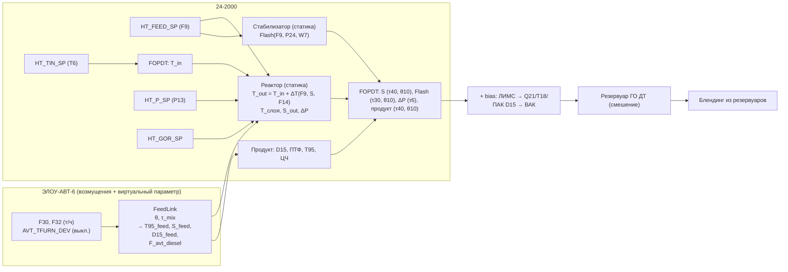
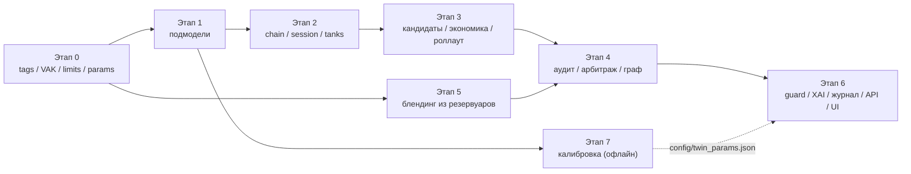

# План реализации v2: цифровой двойник цепочки ЭЛОУ-АВТ-6 → 24-2000 → блендинг

**Статус**: ревизия `agents/implementation_plan.md` (v1). Часть I — факты и критический разбор v1 с доказательствами (§0–§4). Часть II — низкоуровневый план реализации в коде (§5–§10).
**Дата анализа**: 2026-09-16. Базовая линия: `main@07e5193`, 42 теста проходят, `graph.invoke` ≈ 2 мс.

### Источники истины

| Официальные (используются как факты) | Не источник фактов (сгенерировано LLM → только гипотезы) |
| :--- | :--- |
| `initial_data/ТЗ_нефтекод.docx` | `artifacts/*` (включая `tz_neftecode_full.md`, `System_Design.md`) |
| `new_data/теги АВТ_24-2000.xlsx` — **заменяет** лист КИП в `Теги_хакатон.xlsx` | `agents/DOMAIN_KNOWLEDGE.md` (метки «[Норматив ТЗ / ПАЗ]» не подтверждены) |
| `new_data/формулы_ВАК.xlsx` — **заменяет** лист ВАК, содержит примеры расчёта | `initial_data/АВТ_схемы/реактор_242000_схема.jpg` |
| `new_data/Ustanovka_AVT_merged (1).pdf` — управляемые параметры (У), лабораторный контроль (ЛК), контроль продукта | |
| `initial_data/Теги_хакатон.xlsx` (листы ЛА, ПАК), CSV-архивы, ЛИМС, ПАК, `ABT_схема1..3.jpeg` | |

Метки статуса параметров:
- **NORM** — ГОСТ 32511, ТЗ или официальная PDF;
- **REGISTRY** — официальный реестр тегов или формулы ВАК;
- **DATA** — получено из архивов (воспроизводится скриптом этапа 7);
- **ASSUMPTION** — допущение. По «правилу границ» ТЗ такие значения обязательно показываются оператору как допущения.

Все DATA-числа ниже посчитаны на рабочих периодах (`HT_F9 > 120 т/ч`, `AVT_F65 > 400 т/ч`), значения 307/313 исключены.

---

# Часть I. Факты и критика

## 0. Карта официальных данных

### 0.1. Ключевые теги 24-2000 по официальному реестру (медиана q50, DATA)

| Тег | Официальный смысл | Ед. | q05 / q50 / q95 |
| :--- | :--- | :--- | :--- |
| `F9` | Расход сырья на установку, массовый | т/ч | 158.7 / 219.6 / 252.8 |
| `F15` | Расход сырья на установку, объёмный | «м³/ч» ⚠ | 2997 / 3402 / 3611 (F15/F9 = 15.4 — единица не сходится) |
| `F26` | Расход ГО ДТ в цех №8, объёмный | м³/ч | 186.7 / 258.3 / 297.4 (F26/F9 = 1.176 ± 0.003 — пересчёт того же расхода) |
| `F17` | Расход ГО ДТ в цех №8, массовый | т/ч ⚠ | 191 / 265.5 / 306 (F17/F9 = 1.21: масса продукта > массы сырья) |
| `T5` | Р-201, температура ГСС на выходе | °C | 353.2 / 370.3 / 384.6 |
| `T6` | **Р-202, температура ГСС на входе** | °C | 346.5 / 363.3 / 380.5 |
| `T11` | Выход Р-202, температура ГСС/продукта | °C | 349.2 / 364.0 / 379.1 (T11−T6: −2.1 / +0.7 / +3.3) |
| `P13` | Р-202, давление на входе | МПа | 3.755 / 3.922 / 4.009 |
| `P8` | **Р-202, перепад давления** | МПа | 0.117 / 0.177 / 0.221 (q99 = 0.236) |
| `F14` | **Расход квенча в Р-202** | т/ч | 3.36 / 6.05 / 10.15 |
| `F2` | Газ от ЦК-201 (циркулирующий ВСГ) | нм³/ч | 83 026 / 93 309 / 103 009 |
| `F25` | Свежий ВСГ с КЦА | нм³/ч | 10 955 / 13 199 / 14 912 |
| `Q20` | Поточный анализатор серы в ДТ, Н-202 (сырьё) | ppm | 5593 / 8116 / 10 640 |
| `Q21` | **Поточный анализатор серы в г/о ДТ** | ppm | 5.31 / 8.43 / 10.98 |
| `T18` | **ВАК: температура вспышки ГОДТ** | °C | 60.3 / 68.3 / 81.3 |
| `W7` / `F22` | К-201, газ поддува (масс. / объём.) | т/ч / нм³/ч | 0.173 / 11 134 |
| `T23` / `P24` / `T12` | К-201: низ / давление на выходе / верх | °C / МПа / °C | 235.5 / 0.585 / 186.6 |
| `W10` | **Расход бензина с установки, массовый** | т/ч | 0.86 / 2.81 / 4.51 |

Производная величина — ВСГ/сырьё: `F2 / (F9/0.847)` = 313 / 360 / 490 нм³/м³.

АВТ (официальный реестр совпадает по смыслу со старым, но расходы указаны в **т/ч**):
- `F30` = фр. 290–350 (128.3 т/ч), `F32` = фр. 240–290 (81.6), `F34` = фр. 150–250 (керосин), `F65` = производительность К-2 (924.5);
- `F31` = нефтепродукт в П-3 (540.5), `T55` = выход П-3 (381.7), `T33` = низ К-2 (338.3), `T71` = фр. 290–350 из К-2 (304.4);
- `P21`/`P22`/`P23`/`P67` = давление верха К-2, заявлено «МПа», но значения 1.00–1.21 ⚠ (для верха атмосферной колонны похоже на кгс/см²);
- `D10` = плотность нефти (значение 307 в 99.99% строк), `F26` = пар в К-6 (< 0 в 62% строк).

### 0.2. Управляемые параметры по официальной PDF и их привязка к CSV

| PDF-переменная | Роль | Тег CSV | Статус привязки |
| :--- | :--- | :--- | :--- |
| `ht_feed_flow_m3h` | У | `HT_F9` (т/ч) ↔ `HT_F26`/1.176 | однозначно |
| `ht_inlet_temp_c` | У | `HT_T6` (вход Р-202) | вероятно; у реального блока 2 реактора (Q2) |
| `ht_pressure_mpa` | У | `HT_P13` | однозначно |
| `ht_gas_oil_ratio_m3m3` | У | `HT_F2 / (HT_F9/ρ_feed)` | производная |
| `ht_bed_mean_temp_c` | T | `(HT_T6 + HT_T11)/2` | производная |
| `ht_delta_pressure_kpa` | ΔP | `HT_P8 × 1000` | однозначно |
| `ht_sulfur_in_mgkg` / `ht_sulfur_out_mgkg` | ЛК | ЛИМС ГО т.1 / т.2; онлайн `HT_Q20` / `HT_Q21` | однозначно |
| `ht_h2_purity_mol_pct`, `ht_nitrogen_in_mgkg` | ЛК | — | **нет в данных** |
| `avt_furnace_outlet_temp_c` | У | — (печи П-1/2, П-1/3 без тега; `T55` — это П-3 вакуумного блока) | **нет в данных** (Q3) |
| `avt_column_pressure_mpa_abs` | У | `AVT_P22`/`AVT_P23` | единицы под вопросом (Q4) |
| `avt_diesel_flow_tph` | F | `AVT_F30 + AVT_F32` | производная |
| `crude_feed_rate_tph` / `crude_sulfur_wt_pct` / `crude_density` | F / ЛК | `AVT_F65` / — / `AVT_D10` (залип) | частично |
| `blend_component_share_pct` (3 компонента), `blend_component_stock_t`, `additive_dose_kg_t` (A, B) | У | — | **модельные** |
| `product_sulfur_mgkg ≤ 10`, `product_t95_c ≤ 360`, `product_cetane ≥ 51`, `product_density_kgm3`, `product_cfpp_c` | ЛК | ЛИМС ГО т.2 (сера, T95, ЦЧ n=42, D15, CFPP) | однозначно |

**Квенч `F14`, `AVT_F31`, орошение `AVT_F19` и параметры К-201 в PDF управляемыми не отмечены.**

### 0.3. Смысловые ошибки текущего кода относительно официального реестра

| Место | Как в коде | Факт | Исправление |
| :--- | :--- | :--- | :--- |
| `auditors.py` `MAX_W10`, `fopdt.py` `W10` | `W10` = перепад Р-202, кгс/см² | `W10` = бензин с установки, т/ч | перепад = `HT_P8`, МПа → кПа |
| `state.py` `RawTelemetry.F15`, `fopdt.py` `F15`, `narrative.py`, `ui/app.py` | `F15` = квенч, нм³/ч (значения 400) | `F15` = объёмный расход сырья; квенч = `HT_F14`, т/ч | переименовать, текст XAI поправить |
| `fopdt.py` `T6` | температура слоя 2 | `T6` = вход Р-202 | вход; средняя температура слоя = (T6+T11)/2 |
| `state.py` `F26`, `ui/app.py` | `F26` = сырьё (т/ч) и одновременно пар в К-6 | 24-2000: ГО ДТ, м³/ч; АВТ: пар в К-6 | сырьё = `HT_F9` |
| `blending.py`, `main.py` `Sulfur` | сера без источника | онлайн `HT_Q21`, ЛИМС ГО т.2 | канонический `HT_Q21` / `LIMS_HT_S` |
| `vak.py` | 8 из 17 формул расходятся с официальными (§1 A9) | `формулы_ВАК.xlsx` | заменить + эталонные тесты |

---

## 1. Критический разбор плана v1

Серьёзность: 🔴 блокер, 🟠 неверное поведение, 🟡 улучшение.

### 1.A. Данные, теги, официальная постановка

| ID | Проблема | Доказательство | Последствие |
| :--- | :--- | :--- | :--- |
| A1 🔴 | **Коллизия имён тегов двух установок.** 8 общих имён: `T6, F9, T11, F14, T18, F19, F25, F26`; код хранит телеметрию плоским словарём. | АВТ `T6` — низ К-1, ГО `T6` — вход Р-202; АВТ `F9` — нефть (2-й ход), ГО `F9` — сырьё; АВТ `F26` — пар в К-6, ГО `F26` — ГО ДТ; АВТ `T18` — 1-е ЦО, ГО `T18` — ВАК вспышки. | `VakCalculator` считает ВАК АВТ и ГО из одних чисел; `DataGuard` обрабатывает `F26` как пар, UI/API — как сырьё; v1 добавляет `F19` как орошение К-2 (у ГО `F19` — бензин в К-201). |
| A2 🔴 | **Перепутаны дизельные фракции.** | Реестр: `F30` = 290–350 (тяжёлая), `F32` = 240–290 (лёгкая, К-9 на `ABT_схема3`). В v1 наоборот. | Обратный знак влияния отбора. |
| A3 🔴 | **Неверная топология АВТ.** | `ABT_схема2`: П-3 греет мазут из куба К-2 перед вакуумной К-10; `F31` — расход в П-3, `T55` — выход П-3. Нефть для К-2 греют П-1/2 и П-1/3. | В v1 цепочка «нефть → П-3 → К-2», и ΔF31 — рычаг дизеля. На дизель он не влияет. Коэффициент `T33←F31` в `fopdt.py` физически не обоснован. |
| A4 🔴 | **Смысловые ошибки тегов 24-2000 в v1 и в коде** (§0.3). | Официальный реестр: `W10` — бензин, `F15` — сырьё, `T6` — вход Р-202, `P8` — перепад, `F14` — квенч, `T18` — ВАК вспышки. | Барьер «W10 ≤ 4.635» стоит на расходе бензина; тепловой баланс v1 построен на неверных тегах; квенч в UI указан в нм³/ч, хотя это т/ч. |
| A5 🟠 | **ADR-1 «горячая струя»: баланс подтверждён, динамическая связь — нет.** | По массе `HT_F9/(AVT_F30+AVT_F32)` = 1.04 (q05–q95: 0.81–1.26) — дизель АВТ ≈ всё сырьё ГО. Корреляция приращений ≈ 0 на лагах 0–60 мин (10-мин ряд); по часам 0.14 / 0.03 / 0.001 на лагах 0 / 1 / 2 ч. Сера сырья `Q20` не связана с долей тяжёлой фракции γ = F30/(F30+F32): r уровней −0.21, приращений ≈ 0 на лагах 0–24 ч; с `T71` (температура вывода 290–350) r = +0.38. По PDF расход сырья ГО — **самостоятельный** управляемый параметр. | Расход ГО не является запаздывающей копией отбора АВТ. АВТ передаёт на ГО **качество** сырья (утяжеление, сера), а сера сырья определяется в первую очередь нефтью (её сера `crude_sulfur` в данных отсутствует). Динамику связи нужно параметризовать. |
| A6 🟠 | **ADR-5 «White-Box без данных» противоречит ТЗ** («качество прогноза», «проверять на данных, отделённых по времени»); чистая регрессия тоже не подходит. | Данные собраны в замкнутом контуре: МНК `ln Q21` по часам даёт −0.0028 на °C средней температуры слоя, а кинетический приор (E/R = 14 000 K) — около −0.051 на °C, то есть в данных чувствительность ослаблена примерно в 18 раз регулированием и шумом. Прочие знаки физичны: r(Q21, T_слоя) = −0.36, r(Q21, P13) = −0.30, r(ln Q21, F9) = +0.18, r(ln Q21, ВСГ/сырьё) = −0.17. | Нужна grey-box модель: структура и знаки из физики, уровень и смещения — из данных, чувствительности — приор с проверкой на отложенном периоде. |
| A7 🟠 | **Реальные данные сразу переводят систему в Safe Hold.** | 307/313 — значения насыщения: `AVT_D10` 99.99%, `HT_Q20` 11.7%, `AVT_F26` 37.6% строк; `AVT_P52` ≈ 0 (медиана −0.0). | Если Data Guard бракует все пришедшие теги, система на реплее не работает. Нужен список критичных тегов. |
| A8 🟡 | **Допущения выданы за нормативы; у некоторых пределов не те теги и единицы.** | В `initial_data`/`new_data` жёстко заданы: сера ≤ 10 и T95 ≤ 360 в товарном ДТ, ЦЧ ≥ 51, баланс 100%, отказ при отсутствии решения, правило границ. `T55 ≤ 386.4`, `ВСГ/сырьё ≥ 300`, `T_слоя ≤ 390` — допущения. `W10 ≤ 4.635 кгс/см²` стоит не на том теге; перепад `P8` в истории ≤ 236 кПа при пределе 454.5 кПа (ограничение не активно). `F31 ≥ 362.5` задано в «м³/ч», а тег — в т/ч. | Все такие пределы пометить ASSUMPTION с долей нарушений в истории: T55 > 386.4 — 0.8%; ВСГ/сырьё < 300 — 1.5%. |
| A9 🔴 | **Формулы ВАК в коде расходятся с официальными в 8 моделях из 17.** | `AVT6:240-350:D15` (в коде F30/(F32+F30), официально F65/(F32+F30)); `AVT6:350:T50` (другая формула целиком); `AVT6:350:I350` (+0.76664·T6 вместо −); `GODT:T90` (59.57·F15/2000 вместо 59.57·F15); `GODT:T50` (0.471·T6 вместо 0.8052); `GODT:CloudPoint` (0.0002·F22 вместо F22); `GODT:CFPP` (0.22088·**T23** вместо ·T6); `GODT:T95` (0.50·T6 вместо 0.62259). | ВАК считаются неверно. В официальном файле есть примеры на строке 0 CSV — готовые эталонные тесты. |
| A10 🔴 | **Набор управляющих параметров v1 не совпадает с официальным.** | v1: `F15` (как «квенч»), `F31`, `F19`, пар К-201 — ни один не является официальным управляемым параметром. Официальные: ГО — расход сырья, температура входа, давление, ВСГ/сырьё; АВТ — температура печи, давление колонны; блендинг — **доли 3 компонентов из резервуаров** (ГО ДТ, керосин, газойль) с остатками + **2 присадки** (кг/т). Контроль продукта: сера ≤ 10, **T95 ≤ 360**, **ЦЧ ≥ 51**, плотность, ПТФ. | v1 игнорирует T95, ЦЧ, газойль, остатки и резервуары, а блендинг моделирует «поточным», хотя официально он идёт из резервуаров. |
| A11 🔴 | **Поточный анализатор серы слабо согласуется с лабораторией; буферы сложены дважды.** | ЛИМС ГО т.2 против `Q21` (±30 мин): r = 0.20; робастно медиана невязки +0.13 ppm, σ = IQR/1.349 = **1.19 ppm**, \|невязка\| > 5 ppm в 3.1% пар. ЛИМС против файла ПАК: r ≈ 0. Метки ЛИМС номинальные (80% ровно в 10:00), сдвиг ±12 ч корреляцию не улучшает. По ЛИМС сера ГО ДТ > 10 ppm в **15.7%** проб, > 9.5 — в 25.6%. Вспышка ЛИМС против `T18`: r = 0.62, σ = 3.85 °C. | В `lims.py` σ = 0.3 ppm — занижено примерно в 4 раза. Буфер 9.5 ppm плюс UCB складываются. Решение по сере должно быть статистическим, с одним буфером (ADR-12), а цена риска — явным бизнес-решением (Q8). |

### 1.B. Физика и математика

| ID | Проблема | Доказательство |
| :--- | :--- | :--- |
| B1 🔴 | **Кинетика с параметрами v1 не даёт Евро-5.** | $k_0=1.85\cdot10^7$, $E_a/R=12500$ K, WABT = 365 °C, LHSV = 258/120 = 2.15 ч⁻¹, $S_{feed}$ = 9470 ppm (ЛИМС ГО т.1) → $S_{out}$ ≈ **1770 ppm**. Чтобы получить 8.6 ppm (медиана ЛИМС ГО т.2), $k_0$ нужно увеличить в **24.5 раза**. Единицы $k$ не указаны. |
| B2 🔴 | **AC-2 недостижим при ADR-2.** | В режиме глубокой очистки $S_{out}$ почти не зависит от $S_{feed}$: откалиброванная модель 1.5 порядка даёт 8.60 → **8.70 ppm** при +50% серы сырья. Реальная чувствительность — через долю трудноудаляемых соединений (растёт с утяжелением, T95 сырья). Двухкомпонентная модель: доля refractory +30% → 11.2 ppm; +5 °C → 6.5 ppm. |
| B3 🔴 | **Квенч как «лекарство от серы».** | Физически рост квенча снижает температуру 2-го слоя, и сера растёт. В данных влияние `F14` на `T11−T6` ≈ 0 (МНК: −0.012 °C на т/ч; определяющий фактор — `F9`: −0.032 °C на т/ч, r = −0.45). Квенч не является официальным управляемым параметром. Главный рычаг — **температура входа** (официальный параметр) — в v1 отсутствует. |
| B4 🟠 | **Тепловой баланс по неверным тегам и с ошибкой размерности.** | `F26` [м³/ч]·Cp складывается с `F15`·ρ_gas·Cp без плотности; `F15` — это сырьё, а не квенч; отсутствует циркулирующий ВСГ `F2`. Тегов слоёв нет. Данные дают прямую зависимость `T11 − T6` от режима (медиана +0.7 °C) — межслойный баланс не нужен. |
| B5 🟠 | **Нестандартный WABT.** | Веса (1,2,2,1)/6. В официальной PDF измеряемая величина — `ht_bed_mean_temp_c`; её и используем: $(T6+T11)/2$. |
| B6 🟠 | **Экзотерма без обратной связи.** | $\Delta T \propto S_{feed}$ — гидрирование олефинов и ароматики игнорируется, петля «экзотерма ↔ конверсия» не оговорена. Замена — регрессия `T11−T6` по режиму (B4). |
| B7 🔴 | **ADR-3 (вспышка от пара К-201) не соответствует данным.** | (a) Пара в К-201 в реестре нет; есть газ поддува `W7`/`F22`, но его влияние на ВАК вспышки мало (r = −0.07 / +0.02). (b) Сильнейший фактор — нагрузка: r(`T18`, `F9`) = −0.585, r(ЛИМС-вспышка, `F9`) = −0.53; МНК: −0.136 °C на т/ч сырья, −19.9 °C на МПа давления К-201 `P24`. (c) Внутренние числа v1 не сходятся: при 1.0–1.2 т/ч пара формула даёт 58.3–58.8 °C, а не 50–52. (d) База 63 °C против медианы ЛИМС 68 °C. |
| B8 🟠 | **Блендинг.** | (1) Плотность из ВАК **сырья** (ЛИМС: 847.2 → 836.1 после ГО) — LP ложно infeasible. (2) Сера смешивается по массе, а в LP её нет вовсе. (3) «Прямогонный ТС-1» с серой 2 ppm — противоречие (прямогонная фр. 150–250 °C, `AVT_F34`, содержит сотни–тысячи ppm). (4) Вспышка керосина: 42 °C в коде, 38 °C в DOMAIN_KNOWLEDGE. (5) Цены в руб/т умножаются на объёмные доли. (6) Нет T95 (ЛИМС: 3.8% проб ГО ДТ > 360), ЦЧ (медиана 53.75, q05 52.0), газойля, остатков, доз в кг/т (A10). |

### 1.C. Архитектура управления

| ID | Проблема | Доказательство / последствие |
| :--- | :--- | :--- |
| C1 🔴 | **Горизонт H = 3 (30 мин) и проверка «в точке [H]».** | Для серы θ(10) + τ(40): к 30 мин проявляется ≈39% установившегося отклика на ход реактора, для ходов АВТ ещё меньше. Кандидат, выводящий серу за 10 ppm через 2–3 ч, будет одобрен. Длинный горизонт почти бесплатен: 25 кандидатов × 18 шагов = 3.3 мс. |
| C2 🔴 | **Вето по траектории отсекает исправляющие действия.** | Если сера уже выше порога (по ЛИМС > 9.5 в 25.6% проб), у всех кандидатов начало траектории выше порога → полное вето → Safe Hold именно в сценарии ТЗ «риск ухудшения качества». |
| C3 🔴 | **Нет модели маржи и точки отсчёта.** | «Margin» не определён и не отсчитывается от hold → требование ТЗ «в нормальном режиме не создавать лишних действий» не проверяется. |
| C4 🔴 | **Deadband по марже блокирует исправление качества.** | Подъём температуры всегда стоит денег → Net Utility < 1000 руб/ч → DEADBAND → сера уходит за спецификацию. |
| C5 🟠 | **Состояние двойника между циклами теряется.** | `initialize()` обнуляет буферы задержек; нет коррекции по измерениям (bias). |
| C6 🟠 | **«Парето-сетка» — не Парето и не 15–25 точек.** | 4 параметра × 5 уровней = 625. |
| C7 🟠 | **Причины вето теряются.** | Аудиторы возвращают только id → оператору нельзя объяснить «почему не альтернативы» (требование ТЗ). |
| C8 🟠 | **UCB по ЛИМС не подключён и откалиброван неверно** (A11). | Компенсатор не используется ни Агентом Качества, ни v1; σ занижена. |
| C9 🟠 | **Тест 2 v1 не соответствует графу.** | Вето ведёт в Safe Hold, блендинг не вызывается; `QualityAgent` вспышку не проверяет. |
| C10 🟡 | **Ложные вето по плотности.** | Ветируется плотность промежуточного продукта, хотя блендинг её исправляет. Ветировать нужно недопустимость рецепта. Исключение — сера (Dilution Loophole). |
| C11 🟡 | **Deadband-норма смешивает единицы.** | $\lVert\Delta u\rVert_2$ складывает °C, т/ч и МПа — нужна норма по нормированным шагам. |

### 1.D. Интеграция и тесты

| ID | Проблема |
| :--- | :--- |
| D1 🔴 | «Все 42 теста без изменений» несовместимо с официальной семантикой и настоящим оптимизатором. Нужно осознанно мигрировать **5 тестов** (§8.3): эвристику D10, `cand_baseline_01`, два теста «SUCCESS на произвольной телеметрии» и текст XAI «квенча F15». |
| D2 🟠 | «8D» внутри `DiscreteMIMOFOPDTTwin` смешивает линейную динамику и нелинейную статику и ломает 8 тестов двойника → композиция (§5). |
| D3 🟡 | API и UI передают около 7 полей → нужен номинальный режим (§7.1) с пометкой подставленных значений. |
| D4 🟡 | CSV в `.gitignore` → калибровка офлайн, результат — закоммиченный JSON. |

### 1.E. Требования ТЗ, которые v1 не покрывает

1. Синхронизация источников строго по времени, без утечки будущего; валидация на отложенном периоде.
2. Блок «Уверенность» и предупреждения о старых или пропущенных данных.
3. Альтернативы и объяснение, «чем выбранный вариант лучше».
4. Журнал: входные данные, оценки агентов, итоговая рекомендация.
5. Демонстрация: норма без лишних действий, риск качества, деградация данных, полный цикл агентов.
6. Сера ≤ 10, T95 ≤ 360, ЦЧ ≥ 51 — в **товарном** ДТ после блендинга (PDF).

---

## 2. Пересмотренные решения (ADR v2)

| № | Было (v1) | Стало (v2) | Основание |
| :--- | :--- | :--- | :--- |
| ADR-1 | Горячая подача, $F26[k]=F_{avt}[k-d]$ | Расход сырья ГО — **самостоятельный** параметр `HT_FEED_SP`. От АВТ к ГО передаётся **качество** сырья (T95, сера, D15) через `FeedLink` с `mode ∈ {buffered, hot}`; по умолчанию `buffered` (θ = 10, τ_mix = 120 мин, ASSUMPTION). Материальная связь — ограничение запаса: $0.81 \le F9/(F30+F32) \le 1.26$ (DATA q05–q95). | A5, A10 |
| ADR-2 | Кинетика 1.5 порядка по общей сере | Двухкомпонентная кинетика псевдопервого порядка (easy + refractory). Доля refractory растёт с T95 сырья. Температура = средняя температура слоя (T6+T11)/2; множители давления `P13` и ВСГ/сырьё; LHSV — относительно номинала. Уровень — по ЛИМС. | B1, B2, B5 |
| ADR-3 | Вспышка = f(пар К-201) | Вспышка = f(нагрузка `F9`, давление К-201 `P24`, газ поддува `W7`), линейно в рабочем диапазоне. Коэффициенты: по умолчанию из МНК по `T18`, калибровка по ЛИМС. Не управляемый параметр, а **ограничение** на расход сырья. | B7 |
| ADR-4 | Роллаут H = 3 по неофициальным параметрам | Официальные параметры: `HT_FEED_SP`, `HT_TIN_SP`, `HT_P_SP`, `HT_GOR_SP`; `AVT_TFURN_DEV` (виртуальный, выключен до Q3). Горизонт $\lceil(\sum\theta+3\tau_{max})/dt\rceil \in [6, 48]$. Проверка: установившийся режим + «на переходе не хуже hold». Маржа на установившемся режиме относительно hold. ≤ 25 кандидатов. | C1–C6, A10 |
| ADR-5 | White-Box | Grey-box, офлайн-калибровка (train ≤ 2025-06-30, test ≥ 2025-07-01), отчёт «приор против данных». | A6 |
| ADR-6 | LP + плотность, поточный блендинг | **Блендинг из резервуаров** (PDF): 3 компонента (ГО ДТ, керосин, газойль) + присадки A (ПТФ) и B (ЦЧ) в кг/т + остатки. Ограничения: сера по массе, плотность, вспышка, ПТФ, **T95**, **ЦЧ**. Резервуар ГО ДТ — идеальное смешение. Старый `solve_recipe` остаётся обёрткой. | A10, B8 |
| ADR-7 (новый) | — | Канонические теги `AVT_*`/`HT_*` по официальному реестру, legacy-алиасы, статусы (включая несходящиеся единицы). | A1, A4 |
| ADR-8 (новый) | — | Двойник живёт между циклами (`TwinSessionStore`), коррекция bias по измерениям; разовый вызов API — с предупреждением `STATELESS_NO_PENDING_MOVES`. | C5 |
| ADR-9 (новый) | — | Если hold нарушает ограничение, deadband по марже не применяется; статус `SUCCESS_CORRECTIVE`. | C2, C4 |
| ADR-10 (новый) | — | Единый модуль пределов и параметров со статусом источника; ASSUMPTION-параметры попадают в XAI; журнал решений JSONL. | A8, 1.E |
| ADR-11 (новый) | — | ВАК строго по `new_data/формулы_ВАК.xlsx`; примеры из файла — эталонные тесты. | A9 |
| ADR-12 (новый; **обновлено v5.1**: z = 2 по tz:598, σ_S0 = 0.83, σ_T95 = 3.27, σ_flash = 4.78 — методика ТЗ, `scripts/estimate_quality_uncertainty.py`; T95 — через рецепт товарного топлива; см. `agents/ASSUMPTIONS.md` §2.2) | Сера ≤ 9.5 + UCB(σ = 0.3) | Один статистический буфер: вето, если $\hat S + z\,\sigma_S(age) > 10.0$; $z$ = 1.645 (α = 5%, Q8); $\sigma_{S0}$ = 1.19 ppm (DATA). Так же для вспышки (≥ 55, σ = 3.85) и T95 (≤ 360). Буферы 9.5 / 56 / 358 остаются только в LP блендинга, где свойства компонентов берутся из анализа резервуаров. | A11 |

---

## 3. Открытые вопросы

У каждого вопроса есть значение по умолчанию, поэтому работа не блокируется.

| ID | Вопрос | По умолчанию | Что зависит |
| :--- | :--- | :--- | :--- |
| Q1 | Единицы `HT_F15` (3402 «м³/ч» при F9 = 220 т/ч); почему `HT_F17` (масса ГО ДТ) > `HT_F9` (масса сырья); `HT_F26` — отдельный прибор или пересчёт `F9` (отношение постоянно 1.176)? | Расход сырья = `HT_F9`; `F15`, `F17` не используются | Материальный баланс |
| Q2 | `ht_inlet_temp_c` соответствует `HT_T6` (вход Р-202) или температуре выхода печи перед Р-201 (тега нет)? | `HT_T6` | Параметр температуры |
| Q3 | Тег температуры выхода атмосферных печей П-1/2, П-1/3? | Нет → `AVT_TFURN_DEV` выключен; включается только в демо «координация АВТ↔ГО». **Обновлено v5.1:** уставка `AVT_T55_SP` (тег `AVT_T55` = `avt_furnace_outlet_temp_c` из PDF), `ASSUMPTIONS.md` §2.10 | Сторона АВТ |
| Q4 | Единицы `AVT_P21..P23/P67` («МПа», значения 1.0–1.2)? | кгс/см² изб., параметр давления АВТ выключен | Сторона АВТ |
| Q5 | Компоненты блендинга: тип газойля, керосин прямогонный или гидроочищенный, остатки, типы и отклики присадок A/B? | §7.5 (ASSUMPTION) | LP блендинга |
| Q6 | Сорт продукта (целевая ПТФ), сезон? | Сорт E: ПТФ ≤ −15 °C | LP |
| Q7 | Стоимостные прокси (цены ГО ДТ и прямогона, топливо, компримирование, водород КЦА, катализатор)? | §7.6 (ASSUMPTION) | Абсолютная маржа |
| Q8 | Допустимый риск $P(S>10)$ (значение z) и нужен ли дополнительный фиксированный буфер? | **Обновлено v5.1:** z = 2 (tz:598). Исходное решение: z = 1.645 без фиксированного буфера. **Следствие**: при медианной работе $P(S>10)\approx 11\%$ (ЛИМС: 15.7%), поэтому система будет систематически повышать жёсткость. | Поведение Агента Качества |
| Q9 | Safe Hold при ЛИМС > 24 ч сам по себе или только при одновременном отказе ПАК? | Текущее (ЛИМС > 24 ч → Safe Hold), в конфиг | Data Guard |
| Q10 | Какой сигнал считать «ПАК серы»: CSV `Q21` (r = 0.20 с ЛИМС) или файл ПАК `24-2000:Mg.Sulfur` (r ≈ 0)? | `HT_Q21`; файл ПАК — только для D15 | Коррекция bias |

---

## 4. Целевая архитектура

### 4.1. Карта модулей

```
src/
  agents/
    limits.py          НОВЫЙ  пределы + источник (NORM/ASSUMPTION) + доля нарушений в истории
    constraints.py     НОВЫЙ  assess_limit(): установившийся режим + «не хуже hold»; stat_margin()
    candidates.py      НОВЫЙ  MVSpec (официальные параметры), generate_candidates()
    economics.py       НОВЫЙ  MarginModel (Δ к hold, руб/ч)
    optimization.py    НОВЫЙ  RolloutOptimizationAgent, node_optimization (замена stub)
    tanks.py           НОВЫЙ  ComponentTank (идеальное смешение, остаток)
    decision_log.py    НОВЫЙ  append_decision() → JSONL
    auditors.py        ИЗМ.   траектории, статистическая сера/вспышка/T95, допустимость рецепта, отчёты
    arbitration.py     ИЗМ.   SUCCESS_CORRECTIVE, альтернативы, нормированная норма
    blending.py        ИЗМ.   solve_blend (3 компонента + A/B + остатки + T95/ЦЧ); solve_recipe — обёртка
    data_guard.py      ИЗМ.   канонические теги, критичный набор, номинальное заполнение, уверенность
    state.py           ИЗМ.   новые поля
    graph.py           ИЗМ.   node_optimization, маршрут по SUCCESS*
    optimization_stub.py      удалить после переключения
  twin/
    tags.py            НОВЫЙ  TagSpec по официальному реестру, normalize_tags(), NOMINAL_OPERATING_POINT
    params.py          НОВЫЙ  dataclass-параметры + load_params(json)
    fopdt.py           ИЗМ.   + FirstOrderDeadTime; DiscreteMIMOFOPDTTwin без изменения поведения
    vak.py             ИЗМ.   официальные формулы, канонические теги
    feed_link.py       НОВЫЙ  FeedLink (качество сырья АВТ → ГО)
    kinetics.py        НОВЫЙ  ReactorKineticsCalculator (T_out, средняя температура слоя, HDS, ΔP)
    stabilizer.py      НОВЫЙ  StabilizerColumnCalculator (вспышка)
    product.py         НОВЫЙ  D15 / ПТФ / T95 / ЦЧ ГО ДТ
    chain.py           НОВЫЙ  FullChainTwin
    session.py         НОВЫЙ  TwinSessionStore
config/twin_params.json       НОВЫЙ  результат калибровки (коммитится)
scripts/calibrate_twin.py     НОВЫЙ  офлайн-калибровка + отчёт на отложенном периоде
scripts/replay_scenarios.py   НОВЫЙ  реплей 4 окон архива через граф (демо)
requirements-dev.txt          НОВЫЙ  pandas, openpyxl (только для scripts/)
```

### 4.2. Потоки двойника (один шаг `FullChainTwin.step`)



### 4.3. Граф

`data_guard` → *(норма)* → **`optimization` (роллаут)** → [`reliability_agent` ‖ `quality_agent`] → `arbitration` → *(`SUCCESS*`)* → `blending` → END. Ветки `safe_hold` и `DEADBAND` → END не меняются. Журнал решений пишется в API/UI после `invoke`.

---

# Часть II. Низкоуровневый план

Трудоёмкость: S ≈ до 0.5 дня, M ≈ 1 день, L ≈ 2 дня. Параллельность работ — в §10.

## 5. Этапы и задачи

### Этап 0. Контракт данных (M)

#### T0.1 — `src/twin/tags.py`

```python
class SemanticStatus(str, Enum):
    CONFIRMED = "CONFIRMED"                  # официальный реестр + правдоподобные значения
    UNIT_INCONSISTENT = "UNIT_INCONSISTENT"  # официальный смысл, единица не сходится с данными (HT_F15, HT_F17, AVT_P21..P23, AVT_P67)
    VIRTUAL = "VIRTUAL"                      # расчётная или модельная величина

@dataclass(frozen=True)
class TagSpec:
    name: str                                  # "HT_F9", "AVT_F30", "LIMS_HT_S", "PAK_D15", "HT_GOR", "HT_BED_MEAN"
    unit_code: Literal["AVT6", "24-2000", "PAK", "LIMS", "MODEL"]
    raw: str | None                            # "F9"
    description: str                           # verbatim из new_data/теги АВТ_24-2000.xlsx
    unit: str                                  # verbatim из колонки «Физическая величина»
    kind: Literal["flow", "temperature", "pressure", "dp", "level", "density", "analyzer", "vak", "other"]
    status: SemanticStatus
    model_range: tuple[float, float] | None    # q05–q95 рабочих периодов, ASSUMPTION (не промышленный предел)

AVT_RAW: frozenset[str]     # 71 имя
HT_RAW: frozenset[str]      # 26 имён
AMBIGUOUS_RAW = frozenset({"T6", "F9", "T11", "F14", "T18", "F19", "F25", "F26"})   # == AVT_RAW & HT_RAW
LEGACY_ALIASES: dict[str, str] = {        # имена, которые сегодня шлют API, UI и тесты
    "F15": "HT_F15", "T55": "AVT_T55", "P52": "AVT_P52", "D10": "AVT_D10", "F5": "AVT_F5",
    "F26": "HT_F26", "Sulfur": "HT_Q21", "flash_diesel": "LIMS_HT_FLASH",
}
DERIVED = {
    "HT_BED_MEAN": lambda t: (t["HT_T6"] + t["HT_T11"]) / 2,
    "HT_GOR": lambda t: t["HT_F2"] / (t["HT_F9"] / RHO_FEED_T_M3),    # RHO_FEED_T_M3 = 0.847 (ЛИМС ГО т.1 D15)
    "HT_DP_KPA": lambda t: t["HT_P8"] * 1000.0,
    "AVT_DIESEL_TPH": lambda t: t["AVT_F30"] + t["AVT_F32"],
}
NOMINAL_OPERATING_POINT: dict[str, float]  # §7.1

def normalize_tags(raw: Mapping[str, Any]) -> tuple[dict[str, float], list[str]]:
    """Правила по порядку:
    1) канонический ключ → как есть;
    2) LEGACY_ALIASES → переименовать;
    3) неоднозначный raw → записать в AVT_x и HT_x, предупреждение "AMBIGUOUS_TAG:x" (совместимость фикстур);
    4) однозначный raw → префикс по AVT_RAW / HT_RAW;
    5) ключи ВАК ("AVT6:...", "24-2000:...") и LIMS ("LIMS:...") → как есть;
    6) служебные поля (timestamp, lims_age_hours, ...) в числовые теги не попадают;
    7) DERIVED считаются, если все входы конечны.
    NaN и Inf сохраняются как nan для DataGuard."""

def fill_from_nominal(tags: dict[str, float], required: Iterable[str]) -> tuple[dict[str, float], list[str]]:
    """Подставляет номинал для отсутствующих required; возвращает предупреждения FILLED:<tag>."""
```

Готово, когда:
- `AMBIGUOUS_RAW == AVT_RAW & HT_RAW`;
- описания 97 тегов совпадают с официальным xlsx (тест читает xlsx, если файл доступен, иначе `skip`);
- `TAGS["HT_W10"].description` содержит «бензина», `TAGS["HT_P8"].kind == "dp"`.

#### T0.2 — `src/twin/vak.py`: официальные формулы (ADR-11)

- Переписать 17 формул по `new_data/формулы_ВАК.xlsx` на канонических тегах (`AVT_*` для АВТ, `HT_*` для ГО). Изменения — по списку A9.
- `LIMS.D15` → ключ `"LIMS:24-2000.Pipeline.D15"`, `LIMS.95%.T` → `"LIMS:24-2000.Pipeline.95%.T"`: старые ключи сохраняются, тест `test_vak_lims_autoregression` не меняется, коэффициенты 0.15417 и 0.48321 те же.
- В начале `calculate()`: `tags, _ = normalize_tags(tags)`.
- Добавить `VAK_REFERENCE_EXAMPLES: dict[str, tuple[dict[str, float], float]]` — входы и ожидаемые значения из колонки «Пример расчёта» (например, `AVT6:240-350:D15` → 849.83, `24-2000:GODT:T95` → 343.54).

#### T0.3 — `src/agents/limits.py`

```python
@dataclass(frozen=True)
class Limit:
    key: str; lo: float | None; hi: float | None; unit: str
    source: Literal["NORM", "ASSUMPTION"]; note: str

# Товарное ДТ (PDF + ГОСТ 32511)
SULFUR_PRODUCT_MAX = Limit("S", None, 10.0, "мг/кг", "NORM", "PDF, ТЗ")
T95_PRODUCT_MAX    = Limit("T95", None, 360.0, "°C", "NORM", "PDF, ГОСТ 32511")
CETANE_PRODUCT_MIN = Limit("CN", 51.0, None, "", "NORM", "PDF, ГОСТ 32511")
DENSITY_PRODUCT    = Limit("D15", 820.0, 845.0, "кг/м3", "NORM", "ГОСТ 32511")
FLASH_PRODUCT_MIN  = Limit("Flash", 55.0, None, "°C", "NORM", "ГОСТ 32511: «выше 55» — сверить с текстом")
CFPP_BY_GRADE      = {"C": -5.0, "E": -15.0, "F": -20.0}   # NORM

# Буферы в LP блендинга (свойства компонентов из анализа резервуаров)
BLEND_SULFUR_MAX = 9.5;  BLEND_DENSITY = (821.25, 843.75);  BLEND_FLASH_MIN = 56.0
BLEND_T95_MAX = 358.0;   BLEND_CETANE_MIN = 51.5            # все ASSUMPTION

# Статистика качества гидрогенизата (ADR-12)
QUALITY_Z = 1.645                                                    # ASSUMPTION, Q8
SIGMA_S0_PPM = 1.19; SIGMA_FLASH_C = 3.85; SIGMA_T95_C = 4.0         # DATA, DATA, ASSUMPTION
SULFUR_LEGACY_VETO = 9.5                                             # скалярный путь старых кандидатов

# Оборудование (все ASSUMPTION, с долей нарушений в истории)
HT_DP_MAX_KPA  = Limit("HT_DP_KPA", None, 454.5, "кПа", "ASSUMPTION", "=4.635 кгс/см2; история q99=236 → не активен")
HT_T_OUT_MAX   = Limit("HT_T11", None, 390.0, "°C", "ASSUMPTION", "история q95=379")
HT_GOR_MIN     = Limit("HT_GOR", 300.0, None, "нм3/м3", "ASSUMPTION", "история: <300 в 1.5%")
FEED_TO_AVT    = Limit("HT_FEED_TO_AVT", 0.81, 1.26, "", "ASSUMPTION", "q05–q95 F9/(F30+F32): запас")
T55_MAX        = Limit("AVT_T55", None, 386.4, "°C", "ASSUMPTION", "история: >386.4 в 0.8%")
P52_MAX        = Limit("AVT_P52", None, 0.077, "кгс/см2", "ASSUMPTION", "тег в МПа, в архиве ≈0 — датчик под вопросом")
F31_MIN        = Limit("AVT_F31", 362.5, None, "т/ч", "ASSUMPTION", "было «м3/ч»; тег в т/ч")
LEGACY_W10_MAX = 4.635   # только для старых скалярных кандидатов (expected_w10); помечено deprecated
```

`ReliabilityAgent` и `QualityAgent` берут константы отсюда; значения для старых скалярных проверок не меняются.

#### T0.4 — `src/twin/params.py`

```python
def P(default, source: str, note: str = ""):
    return field(default=default, metadata={"source": source, "note": note})

@dataclass
class FeedLinkParams: ...     # §7.2
@dataclass
class ReactorParams: ...      # §7.3
@dataclass
class StabilizerParams: ...   # §7.4
@dataclass
class ProductParams: ...      # §7.2
@dataclass
class BlendParams: ...        # §7.5
@dataclass
class EconomicsParams: ...    # §7.6
@dataclass
class DynamicsParams: ...     # §7.7

@dataclass
class TwinParams:
    feed: FeedLinkParams; reactor: ReactorParams; stabilizer: StabilizerParams
    product: ProductParams; blend: BlendParams; economics: EconomicsParams
    dynamics: DynamicsParams
    dt_min: float = 10.0
    def assumptions(self) -> list[str]: ...

def load_params(path: str | Path = "config/twin_params.json") -> TwinParams:
    """Значения по умолчанию + перекрытие из JSON; поля из JSON получают source="DATA"."""
```

#### T0.5 — документация и существующие описания (S)

- `state.py`: описания `RawTelemetry.F15` («объёмный расход сырья 24-2000») и `F26` («устаревшее имя; для 24-2000 — ГО ДТ, м³/ч»).
- `fopdt.py`: пометить `DEFAULT_GAIN_MATRIX` строки `T6/W10/Sulfur` и вход `F15` как legacy-демо (цепочкой не используются).
- `agents/DOMAIN_KNOWLEDGE.md`: «[Норматив ТЗ / ПАЗ]» → «[Допущение]», где значения нет в официальных файлах; добавить ссылку на `new_data`.

---

### Этап 1. Статические подмодели (M)

Все подмодели — чистые функции без состояния: выходы конечны при любых входах, деление защищено `max(x, eps)`.

#### T1.1 — `src/twin/feed_link.py`

```python
@dataclass(frozen=True)
class FeedState:
    avt_diesel_tph: float; t95_feed_c: float; s_feed_ppm: float; d15_feed: float

class FeedLink:
    def __init__(self, p: FeedLinkParams, dt_min: float): ...
    def reset(self, f30: float, f32: float, tfurn_dev: float = 0.0) -> None
    def step(self, f30: float, f32: float, tfurn_dev: float = 0.0) -> FeedState
    def steady_state(self, f30: float, f32: float, tfurn_dev: float = 0.0) -> FeedState
```

Уравнения:
1. $F_{avt}=F30+F32+Y_T\cdot u_{furn}$ [т/ч].
2. $T95_{in}=T95_{ref}+2.66463\,(F30-F30_{ref})+c_{T95,T}\,u_{furn}$. Коэффициент 2.66463 — чувствительность официальной ВАК `AVT6:240-350:EBP` по F30 (REGISTRY).
3. $S_{in}=S_{ref}\,[1+s_{T95}\,(T95_{in}-T95_{ref})]$ (ASSUMPTION, знак подтверждает r(Q20, T71) = +0.38).
4. $D15_{in}=D15_{ref}+d_{T95}\,(T95_{in}-T95_{ref})$.
5. Задержка $d=\mathrm{round}(\theta/dt)$ и смешение $x_{mix}[k]=a\,x_{mix}[k-1]+(1-a)\,x_{in}[k-d]$, $a=e^{-dt/\tau_{mix}}$ (в режиме `hot` $a=0$) — для $T95$, $S$, $D15$. $F_{avt}$ не фильтруется: он нужен только для ограничения запаса.

#### T1.2 — `src/twin/kinetics.py`

```python
@dataclass(frozen=True)
class ReactorInputs:
    t_in_c: float; feed_tph: float; p_mpa: float; gor_nm3m3: float
    s_feed_ppm: float; t95_feed_c: float; d15_feed: float; quench_tph: float

@dataclass(frozen=True)
class ReactorOutputs:
    t_out_c: float; bed_mean_c: float; lhsv_rel: float; vsg_nm3h: float
    f_refractory: float; s_out_ppm: float; dp_kpa: float

class ReactorKineticsCalculator:
    def __init__(self, p: ReactorParams): ...   # в __init__: bed_ref и k_h_ref по якорям (п. 2, 7)
    def evaluate(self, x: ReactorInputs) -> ReactorOutputs
```

Уравнения:
1. $V=1000\cdot F9/D15_{feed}$ [м³/ч]; $\text{LHSV}_{rel}=V/V_{ref}$; $F2=\text{GOR}\cdot V$ [нм³/ч].
2. $T_{out}=T_{in}+c_0+c_F\,F9+c_S\,(0.878\,S_{feed})/1000+c_Q\,F14$. МНК по часовым данным: $c_0$ = 8.194, $c_F$ = −0.032, $c_S$ = −0.069, $c_Q$ = −0.012 (DATA). Коэффициент 0.878 переводит серу из базиса ЛИМС в базис Q20, на котором построена регрессия. Номинал даёт $T_{out}-T_{in}$ ≈ +0.53 °C (медиана данных +0.69).
3. $T_{bed}=(T_{in}+T_{out})/2$; $T_{bed,ref}$ = $T_{bed}$ в номинале.
4. $\phi_P=(P/P_{ref})^{\alpha_P}$, $\phi_G=(\text{GOR}/\text{GOR}_{ref})^{\alpha_G}$.
5. $k_j=k_{j,ref}\exp\!\left[-\frac{E_j}{R}\left(\frac{1}{T_{bed}+273.15}-\frac{1}{T_{bed,ref}+273.15}\right)\right]\phi_P\,\phi_G$, $j\in\{e,h\}$ ($k$ безразмерны при $\text{LHSV}_{ref}$).
6. $f_h=\text{clip}\big(f_{h,ref}\,e^{\,b_{T95}(T95_{feed}-T95_{ref})},\,0,\,0.05\big)$.
7. $S_{out}=S_{feed}\left[(1-f_h)e^{-k_e/\text{LHSV}_{rel}}+f_h\,e^{-k_h/\text{LHSV}_{rel}}\right]$; якорь $k_{h,ref}=\ln\dfrac{f_{h,ref}S_{ref}}{S_{out,ref}-(1-f_{h,ref})S_{ref}e^{-k_{e,ref}}}$ ≈ 1.49.
8. $\Delta P=\Delta P_{ref}\left[(1-g)(V/V_{ref})^{n}+g\,(F2/F2_{ref})^{n}\right]$ [кПа].

Контрольные значения при параметрах по умолчанию:
- номинал → 8.60 ppm;
- $T_{bed}$ +5 °C → ≈6.5;
- F9 ×1.1 → ≈9.8;
- T95 сырья +10 °C → ≈11.6;
- P13 +0.05 МПа → ≈8.43;
- GOR +30 → ≈8.3.

#### T1.3 — `src/twin/stabilizer.py`

```python
class StabilizerColumnCalculator:
    def __init__(self, p: StabilizerParams): ...
    def evaluate(self, feed_tph: float, p24_mpa: float, w7_tph: float) -> float   # вспышка, °C
```

$\text{Flash}=\text{clip}\big(\text{Flash}_{ref}+a_F(F9-F9_{ref})+a_P(P24-P24_{ref})+a_W(W7-W7_{ref}),\ 40,\ 90\big)$.

По умолчанию $a_F$ = −0.136 °C/(т/ч), $a_P$ = −19.9 °C/МПа, $a_W$ = +1.0 °C/(т/ч) (DATA по ВАК `T18`); $\text{Flash}_{ref}$ = 68.0 (ЛИМС). На этапе 7 коэффициенты перекалибровываются по ЛИМС. `P24` и `W7` в роллауте держатся на текущих значениях.

#### T1.4 — `src/twin/product.py`

```python
def product_properties(feed: FeedState, p: ProductParams) -> dict[str, float]:
    dt95 = feed.t95_feed_c - p.t95_feed_ref
    return {
        "HT_D15_PRODUCT":  feed.d15_feed - p.delta_d15_hdt,     # 11.1, DATA
        "HT_T95_PRODUCT":  feed.t95_feed_c - p.delta_t95_hdt,   # 6.0,  DATA (353 → 347)
        "HT_CFPP_PRODUCT": p.cfpp_ref + p.dcfpp_dt95 * dt95,    # −6 DATA; 0.3 ASSUMPTION
        "HT_CN_PRODUCT":   p.cn_ref + p.dcn_dt95 * dt95,        # 53.75 DATA (n=42); 0.05 ASSUMPTION
    }
```

---

### Этап 2. Динамика и двойник цепочки (L)

#### T2.1 — `src/twin/fopdt.py`

```python
class FirstOrderDeadTime:
    """y[k] = a*y[k-1] + (1-a)*u_ss[k-d]; a = exp(-dt/tau); d = round(theta/dt).
    На вход подаётся статическое (установившееся) значение."""
    def __init__(self, tau_min: float, theta_min: float, dt_min: float, y0: float): ...
    def reset(self, y0: float) -> None
    def step(self, u_ss: float) -> float
    @property
    def value(self) -> float
```

`DiscreteMIMOFOPDTTwin` и его значения по умолчанию не меняются (8 тестов step2).

#### T2.2 — `src/twin/chain.py`

```python
MV_NAMES = ("HT_FEED_SP", "HT_TIN_SP", "HT_P_SP", "HT_GOR_SP", "AVT_TFURN_DEV")
OUTPUTS = (
    "AVT_DIESEL_TPH", "HT_FEED_TO_AVT", "HT_T95_FEED", "HT_S_FEED",
    "HT_T_IN", "HT_T_OUT", "HT_BED_MEAN", "HT_DP_KPA", "HT_GOR", "HT_VSG",
    "HT_S_PRODUCT", "HT_FLASH", "HT_D15_PRODUCT", "HT_T95_PRODUCT", "HT_CFPP_PRODUCT", "HT_CN_PRODUCT",
    "AVT_T55",        # мониторинг (legacy FOPDT без входов от параметров ГО)
)
BIAS_SOURCES = {      # выход → источники по приоритету ТЗ: ЛИМС → ПАК/онлайн → ВАК
    "HT_S_PRODUCT":   ("LIMS_HT_S", "HT_Q21"),
    "HT_FLASH":       ("LIMS_HT_FLASH", "HT_T18"),
    "HT_D15_PRODUCT": ("LIMS_HT_D15", "PAK_D15", "24-2000:GODT:D15"),
    "HT_T95_PRODUCT": ("LIMS_HT_T95", "24-2000:GODT:T95"),
    "HT_S_FEED":      ("LIMS_HT_FEED_S", "HT_Q20"),   # Q20 ≈ 0.878·ЛИМС → коэффициент DATA
    "HT_T_OUT":       ("HT_T11",),
    "HT_DP_KPA":      ("HT_DP_KPA",),
}
REQUIRED_TAGS = ("AVT_F30", "AVT_F32", "HT_F9", "HT_T6", "HT_T11", "HT_P13", "HT_F2",
                 "HT_F14", "HT_P24", "HT_W7", "HT_Q21", "HT_Q20")

class FullChainTwin:
    def __init__(self, params: TwinParams): ...
    def initialize(self, tags: Mapping[str, float]) -> list[str]:
        """fill_from_nominal(REQUIRED_TAGS) → u_current:
           HT_FEED_SP←HT_F9, HT_TIN_SP←HT_T6, HT_P_SP←HT_P13, HT_GOR_SP←HT_GOR, AVT_TFURN_DEV←0
           → все фильтры и буферы = steady_state(u_current) → assimilate(tags). Возвращает предупреждения."""
    def steady_state(self, u_abs: Mapping[str, float]) -> dict[str, float]
    def step(self, u_abs: Mapping[str, float]) -> dict[str, float]
    def predict(self, u_abs: Mapping[str, float], horizon: int) -> dict[str, list[float]]   # clone + H шагов
    def assimilate(self, measured: Mapping[str, float]) -> dict[str, float]
        # bias_i = y_meas − y_model по первому доступному источнику; bias постоянен на горизонте
    def clone(self) -> "FullChainTwin"
    @property
    def u_current(self) -> dict[str, float]
    @property
    def disturbances(self) -> dict[str, float]   # F30, F32, F14, P24, W7 на момент initialize
```

Порядок вычислений в `step(u)`:
1. `FeedLink.step(F30, F32, u_TFURN)`.
2. $T_{in}$ = FOPDT($u_{TIN}$).
3. `ReactorKineticsCalculator.evaluate(T_in, u_FEED, u_P, u_GOR, S_feed, T95_feed, D15_feed, F14)` → фильтры: $T_{out}$ и $T_{bed}$ (τ20), $S$ (τ40, θ10), ΔP (τ6).
4. `StabilizerColumnCalculator.evaluate(u_FEED, P24, W7)` → фильтр вспышки (τ30, θ10).
5. `product_properties` → фильтры (τ40, θ10).
6. `HT_FEED_TO_AVT = u_FEED / F_avt`.
7. Добавить bias.

#### T2.3 — `src/twin/session.py`

```python
class TwinSessionStore:
    def __init__(self, params: TwinParams): ...
    def get(self, session_id: str | None, tags: Mapping[str, float]) -> tuple[FullChainTwin, list[str]]:
        """None → новый двойник + "STATELESS_NO_PENDING_MOVES".
           Первый вызов с id → initialize; последующие → twin.step(u_current) и assimilate(tags)."""
    def commit_applied_move(self, session_id: str, u_abs: Mapping[str, float]) -> None   # «ОДОБРИТЬ» в HITL
    def reset(self, session_id: str) -> None

TWIN_STORE: TwinSessionStore   # синглтон модуля
```

#### T2.4 — `src/agents/tanks.py`

```python
@dataclass
class ComponentTank:
    name: str
    stock_t: float
    props: dict[str, float]            # S_ppm, D15, T95, CN, CFPP, Flash
    prop_sources: dict[str, str]
    def receive(self, flow_tph: float, props_in: Mapping[str, float], dt_h: float) -> None:
        """Идеальное смешение: S — по массе; D15 — по объёму; T95, CN, CFPP — линейно по объёму;
           Flash — через индекс FBI. ASSUMPTION."""
    def withdraw(self, mass_t: float) -> None
    def forecast(self, flow_tph: float, props_in: Mapping[str, float], horizon_h: float) -> dict[str, float]
```

---

### Этап 3. Кандидаты, экономика, оптимизатор (L)

#### T3.1 — `src/agents/candidates.py`

```python
@dataclass(frozen=True)
class MVSpec:
    name: str; tag: str | None; unit: str
    step: float; max_move: float; lo: float; hi: float
    enabled: bool = True
    source: str = "PDF «У»; диапазон q05–q95 рабочих периодов — ASSUMPTION, не промышленный предел"

DEFAULT_MVS = (
    MVSpec("HT_FEED_SP",    "HT_F9",  "т/ч",    step=5.0,  max_move=10.0, lo=158.7, hi=252.8),
    MVSpec("HT_TIN_SP",     "HT_T6",  "°C",     step=2.0,  max_move=3.0,  lo=346.5, hi=380.5),
    MVSpec("HT_P_SP",       "HT_P13", "МПа",    step=0.03, max_move=0.05, lo=3.755, hi=4.009),
    MVSpec("HT_GOR_SP",     "HT_GOR", "нм3/м3", step=15.0, max_move=30.0, lo=313.0, hi=490.0),
    MVSpec("AVT_TFURN_DEV", None,     "°C",     step=2.0,  max_move=3.0,  lo=-5.0,  hi=5.0, enabled=False),  # Q3
)
COUPLED_MOVES = (
    {"HT_FEED_SP": +1, "HT_TIN_SP": +1},   # больше сырья + компенсация жёсткостью
    {"HT_FEED_SP": -1, "HT_TIN_SP": -1},   # разгрузка + экономия топлива
    {"HT_TIN_SP": -1, "HT_P_SP": +1},      # температуру заменяем давлением
)

def generate_candidates(u_current: Mapping[str, float], mvs=DEFAULT_MVS,
                        max_candidates: int = 25) -> list[tuple[str, dict[str, float]]]:
    """1) ("cand_hold", {}) первым;
       2) ±step для каждого включённого параметра (клиппинг [lo, hi], |Δ| ≤ max_move, Δ≠0);
       3) COUPLED_MOVES;
       4) дедупликация, детерминированный порядок, обрезка.
       id = "cand_{i:02d}_" + "_".join(f"{k}{v:+g}")."""

def move_scales(mvs=DEFAULT_MVS) -> dict[str, float]    # {name: step}
```

#### T3.2 — `src/agents/economics.py`

```python
@dataclass(frozen=True)
class MarginBreakdown:
    throughput: float; furnace: float; compressor: float; pressure: float
    hydrogen: float; catalyst: float
    @property
    def total(self) -> float    # throughput − furnace − compressor − pressure − hydrogen − catalyst

class MarginModel:
    def __init__(self, p: EconomicsParams): ...
    def evaluate(self, ss, ss_hold, u, u_hold) -> MarginBreakdown
```

Слагаемые — разность с hold на установившемся режиме, руб/ч (все цены — ASSUMPTION, §7.6):
- throughput: $(P_{ГОДТ}-P_{прямогон})\cdot y_{liq}\cdot\Delta F9$;
- furnace: $C_{fuel}\cdot\dfrac{F9\cdot1000\cdot c_{p,oil}\cdot\Delta T_{in}}{3.6\cdot10^{6}\,\eta}$ (≈1000 руб/ч на +2 °C);
- compressor: $C_{comp}\cdot\Delta F2$;
- pressure: $C_P\cdot\Delta P13$;
- hydrogen: $C_{H2}\cdot F25_{ref}\cdot\left[\frac{V}{V_{ref}}\frac{P}{P_{ref}}-\frac{V_{hold}}{V_{ref}}\frac{P_{hold}}{P_{ref}}\right]$;
- catalyst: $C_{cat}\cdot\Delta T_{bed}$.

#### T3.3 — `src/agents/optimization.py`

```python
class RolloutOptimizationAgent:
    def __init__(self, params: TwinParams, mvs=DEFAULT_MVS, max_candidates: int = 25,
                 horizon_steps: int | None = None): ...
    def horizon(self) -> int   # ceil((θ_feed + θ_S + 3*max(τ_mix, τ_S, τ_flash)) / dt), ограничение [6, 48]
    def propose(self, twin: FullChainTwin) -> tuple[list[ControlCandidate], dict[str, list[float]]]:
        """u0 = twin.u_current; hold = twin.predict(u0, H); hold_ss = twin.steady_state(u0)
           для (cid, du) из generate_candidates(u0):
             u = u0 + du; traj = twin.predict(u, H); ss = twin.steady_state(u)
             m = MarginModel.evaluate(ss, hold_ss, u, u0)
             ControlCandidate(candidate_id=cid, delta_u=du, is_hold=(du == {}), horizon_steps=H,
               trajectory=traj, steady_state=ss, expected_margin=m.total, margin_breakdown=asdict(m),
               expected_sulfur=max(S), expected_flash=min(Flash), expected_t95=max(T95),
               expected_dp_kpa=max(ΔP), expected_t_out=max(T_out), expected_gor=min(GOR),
               expected_feed_to_avt=max(ratio), expected_density=ss D15, expected_cfpp=ss CFPP,
               expected_cetane=ss CN)
           (max/min берутся по траектории ∪ установившемуся режиму)"""

def node_optimization(state: MasGraphState) -> dict[str, Any]:
    """Непустой state["candidates"] → вернуть как есть (совместимость).
       Иначе: twin, warn = TWIN_STORE.get(state.get("session_id"), state["tags"]);
              cands, hold = AGENT.propose(twin)
              → {"candidates", "hold_prediction", "twin_warnings"}.
       final_recommendation не выставлять."""
```

---

### Этап 4. Контракты, аудиторы, арбитраж (L)

#### T4.1 — `src/agents/state.py`

```python
class ControlCandidate(BaseModel):           # extra="allow"; новые поля с дефолтами
    is_hold: bool = False
    horizon_steps: int = 0
    trajectory: Dict[str, List[float]] = {}
    steady_state: Dict[str, float] = {}
    margin_breakdown: Dict[str, float] = {}
    expected_dp_kpa: Optional[float] = None
    expected_t_out: Optional[float] = None
    expected_gor: Optional[float] = None
    expected_feed_to_avt: Optional[float] = None
    expected_t95: Optional[float] = None
    expected_cetane: Optional[float] = None
    # expected_w10 остаётся как deprecated (старые тесты)

class SafetyAuditReport(BaseAgentProtocol):  # frozen, extra="forbid" сохраняются
    agent: Literal["reliability", "quality", "unknown"] = "unknown"
    violated_limits: List[str] = []
    limit_margins: Dict[str, float] = {}

class MasGraphState(TypedDict, total=False):
    tags: Dict[str, float]
    session_id: Optional[str]
    hold_prediction: Dict[str, List[float]]
    audit_reports: Annotated[List[SafetyAuditReport], operator.add]
    twin_warnings: Annotated[List[str], operator.add]
    alternatives: List[Dict[str, Any]]
    confidence: Dict[str, Any]
```

#### T4.2 — `src/agents/constraints.py`

```python
@dataclass(frozen=True)
class LimitAssessment:
    key: str; vetoed: bool; violates_ss: bool; worsens_transient: bool
    margin: float; worst_value: float; reason: str | None

def assess_limit(key, traj, ss, hold_traj, limit, sense: Literal["max", "min"],
                 offset: float = 0.0, tol: float = 1e-6) -> LimitAssessment:
    """y' = y + offset (max) или y − offset (min) — статистический запас;
       g = y' − limit (max) или limit − y' (min);
       violates_ss = g(ss) > 0;
       worsens_transient = ∃k: g(y_k) > 0 и g(y_k) > g(hold_k) + tol;
       vetoed = violates_ss or worsens_transient.
       Нет траектории → скаляр: vetoed = g(scalar) > 0."""

def stat_offset(sigma0: float, age_h: float, z: float, t_sigma_h: float = 12.0) -> float:
    """z · sigma0 · sqrt(1 + age_h / t_sigma_h); age_h — возраст использованного источника (0 для валидного онлайн-сигнала)."""
```

#### T4.3 — `ReliabilityAgent`

- `audit(cand, hold) -> SafetyAuditReport`:
  - через `assess_limit`: `HT_DP_MAX_KPA`, `HT_T_OUT_MAX`, `HT_GOR_MIN`, `FEED_TO_AVT` (обе границы);
  - скалярно: `T55_MAX`, `P52_MAX`, `F31_MIN`, `LEGACY_W10_MAX` (если заданы старые поля).
- Штраф: лог-барьер по T55 (как сейчас) и такой же по `HT_T_OUT` в зоне [375, 390) и `HT_DP_KPA` в зоне [400, 454.5) (μ = 1000, ASSUMPTION).
- `audit_candidate(cand)` — прежняя сигнатура для тестов step4.
- Узел возвращает `{"vetoed_candidates", "risk_penalties", "audit_reports"}`.

#### T4.4 — `QualityAgent` (ADR-12)

1. **Сера.** Смещение $z\,\sigma$ через `stat_offset(SIGMA_S0_PPM, age, QUALITY_Z)`, где age = 0, если `HT_Q21` валиден, иначе возраст ЛИМС. Проверка `assess_limit(HT_S_PRODUCT, 10.0, "max", offset)`.
2. **Вспышка.** `assess_limit(HT_FLASH, 55.0, "min", stat_offset(SIGMA_FLASH_C, …))`.
3. **T95.** `assess_limit(HT_T95_PRODUCT, 360.0, "max", stat_offset(SIGMA_T95_C, …))`.
4. **Допустимость рецепта** через горизонт. `ComponentTank("GODT").forecast(u_FEED·y_liq, ss_props, H·dt)` → `solve_blend(...)` с остальными резервуарами. Если рецепт недопустим → `GOST_VETO_BLEND_INFEASIBLE: <причина>`.
5. Плотность гидрогенизата отдельно не ветируется (C10). Скалярный путь старых кандидатов — прежний (сера 9.5, плотность).

#### T4.5 — `ArbitrationNode.execute(...)`

Новые параметры: `scales: dict | None = None`, `audit_reports: list | None = None`.

1. **Стадия 1.** `u_adm = [c for c if not vetoed and not c.is_hold]`.
2. **Стадия 1b.** `hold_offspec` = пределы, которые hold нарушает на установившемся режиме (из `audit_reports` по `cand_hold`).
   - Непустой `hold_offspec` и пустой `u_adm` → `SAFE_HOLD_EMPTY_ADMISSIBLE`; объяснение = дословный текст ТЗ + перечень нарушенных пределов.
   - Непустой `hold_offspec` и непустой `u_adm` → максимум Net Utility **без** deadband по марже → `SUCCESS_CORRECTIVE`.
3. **Стадия 2** без изменений.
4. **Стадия 3.** Норма $\sqrt{\sum(\Delta u_i/s_i)^2}$, $s_i$ = `scales.get(i, 1.0)`.
5. **Альтернативы.** До 3 лучших допустимых и до 3 отвергнутых с причинами → `state["alternatives"]`.

`graph.route_after_arbitration`: `status.startswith("SUCCESS")` → `blending`.

---

### Этап 5. Блендинг из резервуаров (M, можно параллельно с этапами 1–4)

#### T5.1 — `solve_blend`

```python
@dataclass(frozen=True)
class BlendComponent:
    name: str; price_rub_t: float; stock_t: float; v_min: float; v_max: float
    s_ppm: float; d15: float; flash_c: float; cfpp_c: float
    t95_c: float | None; cn: float | None; props_source: dict[str, str]

@dataclass(frozen=True)
class AdditiveSegment:
    name: str; max_kg_t: float; effect_per_kg_t: float; price_rub_t: float
    target: Literal["cfpp", "cn"]

@dataclass(frozen=True)
class BlendProblem:
    components: tuple[BlendComponent, ...]
    additives: tuple[AdditiveSegment, ...]
    batch_t: float
    target_cfpp: float
    sulfur_max: float = 9.5; density_bounds: tuple[float, float] | None = (821.25, 843.75)
    flash_min: float = 56.0; t95_max: float | None = 358.0; cn_min: float | None = 51.5
    rho_ref: float = 836.0

def solve_blend(problem: BlendProblem) -> BlendingResult
```

Переменные: $v_c$ (объёмные доли компонентов) и $a_s$ (дозы по сегментам присадок, кг/т).

| Ограничение | Строка LP |
| :--- | :--- |
| Баланс (eq) | $\sum v_c = 1$ |
| Loophole | компонент с $S_c > 10.0$ → $v_{max}=0$ и причина в `blocked_components` |
| Сера (по массе) | $\sum v_c\rho_c(S_c-S_{max})\le0$ |
| Плотность | $\sum v_c\rho_c\le\rho_{hi}$; $-\sum v_c\rho_c\le-\rho_{lo}$ |
| Вспышка | $\sum v_c\,\text{FBI}(\text{flash}_c)\le\text{FBI}(\text{flash}_{min})$ |
| ПТФ | $\sum v_c\,\text{CFPP}_c-\sum_{s\in A}e_s a_s\le\text{target}$ |
| T95 (если задано) | $\sum v_c\,T95_c\le T95_{max}$ (линейно по объёму, ASSUMPTION) |
| ЦЧ (если задано) | $-\sum v_c\,CN_c-\sum_{s\in B}e_s a_s\le-CN_{min}$ |
| Остатки | $v_c\cdot\text{batch}\cdot\rho_c/\rho_{ref}\le\text{stock}_c$ |
| Границы | $v_c\in[v_{min},v_{max}]$, $a_s\in[0,\text{max}_s]$ |

Цель (руб/м³ смеси): $\sum v_c\rho_cP_c/1000+\sum a_s\,\rho_{ref}P_s/10^6$; далее `cost_per_ton = fun·1000/ρ_mix`.

`BlendingResult` дополняется полями `shares: Dict[str, float]`, `additive_doses_kg_t: Dict[str, float]`, `expected_density`, `expected_t95`, `expected_cetane`, `binding_constraints: List[str]`, `blocked_components: List[str]`.

#### T5.2 — `OptimizerBlending.solve_recipe` как обёртка (обратная совместимость)

- Компоненты: ГО ДТ (`v ∈ [min_diesel_vol, 1]`, `d15 = density_diesel or 836`) и керосин (`v ≤ max_kerosene_vol`).
- Добавка A — два сегмента: 0.5 кг/т с эффектом 12 °C/(кг/т) и 1.0 кг/т с эффектом 3.76 °C/(кг/т) (это прежние 500 и 1000 ppm).
- Без газойля, присадки B, T95 и ЦЧ; `density_bounds = None`, если `density_diesel` не задан.
- Возврат: `v_diesel`, `v_kerosene`, `v_ddp_ppm = доза_A·1000`; формат ошибок прежний («LP Solver failed … Невозможно …»).

#### T5.3 — `node_blending_agent`

- Резервуары из `state["tanks"]` или `BlendParams.default_tanks()`.
- ГО ДТ берётся из `ComponentTank.forecast` по `selected_candidate.steady_state`; при отсутствии — ЛИМС → онлайн → ВАК → старые атрибуты `RawTelemetry` (`Sulfur`, `flash_diesel`, `24-2000:GODT:CFPP`).
- Происхождение каждого свойства пишется в `props_source`.

---

### Этап 6. Data Guard, XAI, журнал, API/UI (M)

#### T6.1 — `node_data_quality_guard`

- Прежняя очистка `RawTelemetry` (дрейф нуля `F5`/`F26`) сохраняется.
- `tags, warn = normalize_tags(...)`; отрицательные значения тегов с `kind == "flow"` → 0.
- `CRITICAL_TAGS = {"AVT_P52", "AVT_T55", "HT_F9", "HT_T6", "HT_T11", "HT_P13", "HT_F2", "HT_P8"}`. Клампинг или NaN **присутствующего** критичного тега → `SAFE_HOLD_REFUSAL`.
- Некритичный клампинг (например, `D10`) → только `clamped_tags` и предупреждение.
- Отсутствующий критичный тег → номинал + `FILLED:*`.
- `HT_Q21` NaN **и** ЛИМС > 24 ч → отказ; просто ЛИМС > 24 ч → отказ (текущее поведение, Q9).
- Уверенность: `score = 1 − 0.15·n_filled_critical − 0.2·[HT_Q21 недоступен] − min(0.3, lims_age_h/80)` → HIGH (≥ 0.75), MEDIUM (≥ 0.5), LOW.

#### T6.2 — `src/xai/narrative.py`

1. Разделы:
   - «Прогноз»: hold против выбранного кандидата по S, Flash, T95, T_out в точках +30 мин, +3 ч и на установившемся режиме;
   - «Почему не альтернативы»;
   - «Уверенность»;
   - «Допущения модели» (`TwinParams.assumptions()` по участвующим параметрам и пределам);
   - «Рецепт блендинга» (доли, дозы, активные ограничения).
2. Обоснования для официальных параметров (`HT_FEED_SP`, `HT_TIN_SP`, `HT_P_SP`, `HT_GOR_SP`).
3. Legacy-ключ `F15` → текст «Изменение объёмного расхода сырья F15 … нагрузка на реакторы Р-201/Р-202» (текст «квенча F15» удалить). Ключ `T55` → текст про П-3 сохраняется.

#### T6.3 — `src/agents/decision_log.py`

```python
def append_decision(result: Mapping[str, Any], inputs: Mapping[str, Any],
                    path: str | Path | None = None) -> Path:
    """JSONL: ts, session_id, inputs, warnings, confidence, candidates (id, Δu, margin, worst-case,
       steady_state), audit_reports, alternatives, final status/explanation/Δu, blending_recipe.
       Путь: path | env NEFTEKOD_DECISION_LOG | "data/decisions/decisions.jsonl"; "off" — не писать."""
```

#### T6.4 — API и UI

- `main.py`: `TelemetryPayload.session_id: Optional[str] = None`; в ответе `confidence`, `warnings`, `alternatives`, `predictions`; `append_decision` после `invoke`.
- `src/ui/app.py`:
  - поля боковой панели по официальным тегам с номиналом §7.1: `HT_F9` (т/ч), `HT_T6`, `HT_P13`, `HT_GOR`, `HT_Q21`, `HT_P8`, `AVT_T55`, возраст ЛИМС;
  - убрать «Квенч F15 (нм³/ч)» и «Сырьё F26 (т/ч)»;
  - график прогноза S и Flash (hold против выбранного);
  - таблица альтернатив и рецепт;
  - кнопка «ОДОБРИТЬ» вызывает `TWIN_STORE.commit_applied_move`.

---

### Этап 7. Калибровка и валидация на архиве (M, офлайн, параллельно с этапом 2)

`scripts/calibrate_twin.py`:

1. **Загрузка.** CSV (`usecols`) с переименованием в `AVT_*`/`HT_*`. ЛИМС и ПАК переводятся в длинный формат со своими метками времени; присоединение через `pd.merge_asof(direction="backward")` (без утечки будущего). Метки ЛИМС номинальные (80% в 10:00) — в отчёте указать это ограничение.
2. **Очистка.** 307/313 → NaN; рабочие периоды `HT_F9 > 120`, `AVT_F65 > 400`.
3. **Разбиение.** train: 2023-01-01…2025-06-30 (125 753 рабочих строк ГО); test: 2025-07-01…2026-08-07 (54 178).
4. **Номинал.** Медианы train → `nominal`.
5. **Подмодели:**
   - (a) `FeedLink`: квантили `F9/(F30+F32)`; кросс-корреляция часовых приращений `F9` и `Q20` с F30, F32, T71 на лагах 0–24 ч → оценка θ и τ_mix (или фиксация «не наблюдается»).
   - (b) `T_out − T_in`: МНК по F9, Q20, F14 (часовые данные).
   - (c) Сера: $\ln Q21$ с приором ($E_h/R$ фиксирован, $b_{T95}$ в границах [0, 0.08]); подбирается уровень $k_{h,ref}$. В отчёте — чувствительности по данным и приору.
   - (d) Вспышка: $a_F, a_P, a_W$ по ЛИМС (asof ±1 ч; n ≈ 1515) с проверкой знаков; сравнение с МНК по `T18`.
   - (e) Продукт: $\Delta D15$, $\Delta T95$, $CFPP_{ref}$, $CN_{ref}$ по медианам ЛИМС т.1/т.2.
   - (f) Статистика качества: ЛИМС − `Q21` (медиана, IQR/1.349, доля выбросов), ЛИМС − `T18`, ЛИМС − ВАК `GODT:T95` → `SIGMA_*`; ЛИМС т.1 против `Q20` → коэффициент базиса.
   - (g) Проверка официальных примеров ВАК на строке 0 CSV.
6. **Отчёт** `data/processed/calibration_report.md` на test-периоде:
   - MAE и смещение каждой подмодели против наивной медианы train;
   - recall/precision часов с ЛИМС-серой > 10 по правилу ADR-12;
   - таблица знаков.
7. **Результат** `config/twin_params.json` (только DATA) коммитится.

`scripts/replay_scenarios.py`: 4 окна test-периода — норма; рост серы по ЛИМС; деградация (клампинг `Q20`/ЛИМС > 24 ч); конфликт (высокий T_out при росте серы). Прогон через граф с `session_id`, результат в JSONL, сводка. Цель для нормального окна: ≤ 5% тактов с рекомендацией.

---

## 7. Параметры по умолчанию

### 7.1. Номинальный режим (DATA, медианы рабочих периодов)

| Тег | Значение | Тег | Значение |
| :--- | :--- | :--- | :--- |
| `HT_F9` | 219.6 т/ч | `AVT_F30` / `AVT_F32` | 128.3 / 81.6 т/ч |
| `HT_T6` / `HT_T11` / `HT_T5` | 363.3 / 364.0 / 370.3 °C | `AVT_F65` | 924.5 т/ч |
| `HT_P13` / `HT_P8` | 3.922 / 0.177 МПа | `AVT_T55` / `AVT_T33` / `AVT_T71` | 381.7 / 338.3 / 304.4 °C |
| `HT_F2` / `HT_GOR` | 93 309 нм³/ч / 360 нм³/м³ | `HT_Q20` / `HT_Q21` | 8116 / 8.43 ppm |
| `HT_F14` / `HT_F25` | 6.05 т/ч / 13 199 нм³/ч | `HT_T18` | 68.3 °C |
| `HT_P24` / `HT_W7` / `HT_T23` | 0.585 МПа / 0.173 т/ч / 235.5 °C | `PAK_D15` | 835.2 кг/м³ |

### 7.2. FeedLink и продукт

| Параметр | Значение | Статус |
| :--- | :--- | :--- |
| `mode`, `theta_min`, `tau_mix_min` | `buffered`, 10, 120 | ASSUMPTION (калибруется в 7a) |
| `feed_to_avt_bounds` | [0.81, 1.26] | DATA |
| `t95_ref` / `dT95_dF30` | 353 °C / 2.66463 °C на т/ч | DATA (ЛИМС ГО т.1) / REGISTRY |
| `s_ref` / `s_t95` | 9470 ppm / 0.01 на °C | DATA / ASSUMPTION |
| `d15_ref` / `d_t95` | 847.2 / 0.3 кг/м³ на °C | DATA (n=43) / ASSUMPTION |
| `Y_T`, `c_T95_T` (печь АВТ) | 0.5 т/ч на °C, 0.8 °C на °C | ASSUMPTION (Q3) |
| `delta_d15_hdt`, `delta_t95_hdt` | 11.1 кг/м³, 6.0 °C | DATA |
| `cfpp_ref`, `dcfpp_dt95` | −6 °C, 0.3 | DATA (n=418) / ASSUMPTION |
| `cn_ref`, `dcn_dt95` | 53.75, 0.05 | DATA (n=42) / ASSUMPTION |
| `q20_to_lims` | 1/0.878 | DATA (n=122) |

### 7.3. Реактор

| Параметр | Значение | Статус |
| :--- | :--- | :--- |
| `c0, cF, cS, cQ` (T_out − T_in) | 8.194, −0.032, −0.069, −0.012 | DATA |
| `E_e_R`, `E_h_R` | 11 000 K, 14 000 K | ASSUMPTION (литература) |
| `k_e_ref`, `f_h_ref`, `b_t95` | 12, 0.004, 0.03 на °C | ASSUMPTION |
| `s_out_ref` | 8.6 ppm | DATA (ЛИМС ГО т.2, n=1463) |
| `alpha_P`, `alpha_G` | 1.0, 0.3 | ASSUMPTION |
| `dp_ref_kpa`, `n_dp`, `g_gas` | 177, 1.8, 0.5 | DATA / ASSUMPTION / ASSUMPTION |
| `rho_feed_t_m3` | 0.847 | DATA |

### 7.4. Стабилизатор

| Параметр | Значение | Статус |
| :--- | :--- | :--- |
| `flash_ref` | 68.0 °C | DATA (ЛИМС) |
| `a_F`, `a_P`, `a_W` | −0.136 °C на т/ч, −19.9 °C на МПа, +1.0 °C на т/ч | DATA (МНК по `T18`), перекалибровка по ЛИМС |

### 7.5. Блендинг (ASSUMPTION, Q5)

| Компонент | Цена, руб/т | Запас, т | v | S, ppm | D15 | Flash | CFPP | T95 | ЦЧ |
| :--- | :--- | :--- | :--- | :--- | :--- | :--- | :--- | :--- | :--- |
| ГО ДТ (резервуар) | 60 000 | 5 000 | [0.5, 1] | прогноз/ЛИМС (8.6) | 836.1 | 68 | −6 | 347 | 53.75 |
| Керосин (гидроочищенный) | 85 000 | 800 | [0, 0.2] | 2.0 | 785 | 42 | −45 | 240 | 42 |
| Газойль (гидроочищенный) | 50 000 | 1 500 | [0, 0.2] | 8.0 | 860 | 90 | 0 | 365 | 45 |

- Присадка A (депрессорная): сегменты 0.5 и 1.0 кг/т с эффектом 12 и 3.76 °C на кг/т; 1 500 000 руб/т.
- Присадка B (цетаноповышающая): сегменты 0.5 и 1.0 кг/т с эффектом +6 и +2 ЦЧ на кг/т; 1 200 000 руб/т.
- Партия — 2000 т.

### 7.6. Экономика (ASSUMPTION, Q7)

| Параметр | Значение |
| :--- | :--- |
| `price_godt` / `price_straight_run` / `y_liq` | 60 000 / 45 000 руб/т / 0.98 |
| `fuel_rub_mwh`, `eta_furnace`, `cp_oil` | 2 500, 0.85, 2.8 кДж/(кг·К) |
| `compressor_rub_per_nm3` | 0.30 |
| `pressure_rub_h_per_mpa` | 20 000 |
| `h2_rub_per_nm3` | 15 |
| `catalyst_rub_h_per_degC` | 400 |
| `min_margin_improvement` | 1 000 руб/ч |

### 7.7. Динамика (мин, ASSUMPTION, кроме отмеченного)

| Звено | τ | θ |
| :--- | :--- | :--- |
| `HT_T_IN` | 15 | 0 |
| `HT_T_OUT`, `HT_BED_MEAN` | 20 | 0 |
| `HT_S_PRODUCT` | 40 | 10 (как в `fopdt.py`) |
| `HT_DP_KPA` | 6 | 0 |
| `HT_FLASH` | 30 | 10 |
| D15 / T95 / CFPP / ЦЧ продукта | 40 | 10 |
| `AVT_T55` (мониторинг) | 18 | 10 (как в `fopdt.py`) |

---

## 8. Тесты

### 8.1. Новые файлы

Фикстуры в `tests/conftest.py`:
- `nominal_tags` (§7.1);
- `quality_risk_tags`: `HT_Q21=9.8`, `LIMS_HT_S=10.2`, `AVT_F30=140`;
- `degraded_tags`: `HT_Q20=307`, `HT_Q21=NaN`, `lims_age_hours=26`;
- `NEFTEKOD_DECISION_LOG=off`.

**`test_step7_tags.py`**
1. `AVT_RAW & HT_RAW == AMBIGUOUS_RAW` (8 имён).
2. Legacy: `{"F26": 258, "F15": 3400, "T55": 381, "Sulfur": 8.4}` → `HT_F26`, `HT_F15`, `AVT_T55`, `HT_Q21`.
3. `{"T6": 360}` → `AVT_T6 == HT_T6` и предупреждение `AMBIGUOUS_TAG:T6`.
4. Официальная семантика: `HT_W10` — «бензин», `HT_P8.kind == "dp"`, `HT_F14` — «квенч», `HT_T18.kind == "vak"`; `HT_F15.status == UNIT_INCONSISTENT`.
5. `DERIVED`: `HT_GOR` = 360 ± 1 на номинале; `HT_BED_MEAN` = 363.65.
6. Статический скан: в `src/` (кроме `tags.py`, `vak.py`, legacy-путей `blending.py`, `narrative.py`) нет литералов из `AMBIGUOUS_RAW` в роли ключей телеметрии.

**`test_step7_vak_official.py`**
1. Для каждой из 17 моделей `VakCalculator.calculate(example_inputs)` совпадает с примером из `формулы_ВАК.xlsx` с точностью ±0.05 (например, `AVT6:240-350:D15` → 849.83, `24-2000:GODT:CFPP` → −17.33).
2. `AVT6:350:I350` возрастает по `AVT_T6` (знак +).
3. `GODT:CFPP` зависит от `HT_T23`, но не от `HT_T6`.

**`test_step7_kinetics.py`**
1. Номинал → `s_out ∈ [8.5, 8.7]`; `t_out − t_in ∈ [0.3, 1.0]`.
2. Знаки (параметризованный тест): ∂S/∂T_in < 0; ∂S/∂F9 > 0; ∂S/∂P13 < 0; ∂S/∂GOR < 0; ∂S/∂T95_feed > 0; ∂S/∂S_feed > 0; ∂ΔP/∂F9 > 0.
3. $T_{bed}$ +5 °C → S ≤ 0.8·S_nom.
4. T95 сырья +10 °C → S > 10.
5. Граничные входы (`F9 = 1e-3`, `GOR = 0`, `P = 0`) → выходы конечны.

**`test_step7_stabilizer.py`**
1. Номинал → 68 ± 0.5.
2. F9 +30 т/ч → вспышка ниже на 3.5–4.7 °C.
3. ∂Flash/∂P24 < 0.
4. Ограничение [40, 90] соблюдается.

**`test_step7_chain_twin.py`**
1. Неподвижная точка: 50 шагов с `u_current` → выходы неизменны (±1e-6).
2. `hot`: F30 +10 т/ч → `HT_T95_FEED` не меняется на шагах 1..d и меняется на d+1.
3. `buffered`: через 1 шаг изменение < 10% установившегося; через 3·τ_mix ≥ 90%.
4. `HT_TIN_SP −3` → S не меняется на шаге 1 (θ = 10), затем растёт; к концу горизонта отличается от `steady_state()` не более чем на 2%.
5. Для 10 случайных малых Δu (seed = 0) 60 шагов симуляции совпадают с `steady_state()` с точностью 0.5%.
6. Bias: `HT_Q21 = модель + 0.7` → прогноз S сдвинут на +0.7; при наличии `LIMS_HT_S` берётся он (приоритет ТЗ).
7. `clone()` изолирован.

**`test_step7_rollout.py`**
1. `cand_hold` первый, маржа 0.
2. Кандидатов ≤ 25; позиции в [lo, hi]; |Δ| ≤ max_move; id детерминированы; ни у одного кандидата нет ключей `HT_F14`, `AVT_F31`, `AVT_F19`.
3. `expected_sulfur == max(trajectory S ∪ ss S)`; `expected_flash == min(...)`.
4. `H·dt ≥ θ + 3·τ_max` (с учётом ограничения 48).
5. Маржа: `HT_TIN_SP +2` → < 0; `HT_FEED_SP +5` → `throughput > 0`.
6. p95 `propose()` за 20 запусков < 100 мс.

**`test_step7_audit_arbitration.py`**
1. `quality_risk_tags` → hold нарушает серу на установившемся режиме; есть допустимый кандидат с `HT_TIN_SP > 0`, `HT_P_SP > 0` или `HT_FEED_SP < 0`; статус `SUCCESS_CORRECTIVE`.
2. Кандидат, ухудшающий переходный процесс сверх предела относительно hold, ветируется с причиной.
3. Статистический буфер: $\hat S$ = 8.43, σ = 1.19, z = 1.645 → 10.39 > 10 → hold нарушает. При z = 1.0 → 9.62 → не нарушает.
4. Смещение растёт с возрастом ЛИМС при недоступном `HT_Q21`.
5. `HT_FEED_SP +25` (сверх `max_move` — через прямой вызов) → вспышка или `FEED_TO_AVT` дают вето с причиной.
6. `audit_reports` содержит причину для каждого id из `vetoed_candidates`.
7. Резервуар ГО ДТ с CFPP = +10 → `GOST_VETO_BLEND_INFEASIBLE`.
8. Нормированная норма: `{"HT_TIN_SP": 2.0}` при `scales={"HT_TIN_SP": 2.0}` → 1.0 (проходит); `{"HT_TIN_SP": 0.05}` → `DEADBAND_REJECT_SMALL_STEP`.

**`test_step7_blending_tanks.py`**
1. Три компонента: газойль ограничен T95 или плотностью (`binding_constraints` содержит соответствующее ограничение).
2. ЦЧ ГО ДТ = 50 → присадка B > 0 и ЦЧ смеси ≥ 51.5.
3. Остаток керосина 50 т при партии 2000 т → `v_kerosene ≤ 50/2000 · 836/785`.
4. Газойль с S = 15 ppm → попадает в `blocked_components`, его доля = 0.
5. Свойства: на 200 случайных входах (seed = 0) у каждого успешного рецепта баланс = 1 ± 1e-6, сера (по массе) ≤ 9.5, D15 ∈ [821.25, 843.75], вспышка ≥ 56, T95 ≤ 358, ЦЧ ≥ 51.5.
6. `ComponentTank.receive`: сера смешивается по массе (пример 1000 т при 8 ppm + 100 т при 12 ppm → 8.36 ± 0.02).

**`test_step7_graph_e2e.py`** — четыре демо-режима ТЗ
1. **Норма без лишних действий.** Замкнутый цикл симуляции от `nominal_tags` до первого hold (при z из конфига), затем 50 тактов с шумом (seed = 0) → не более 2 тактов `SUCCESS*`.
2. **Риск качества.** `quality_risk_tags` → `SUCCESS_CORRECTIVE`; рецепт успешен; сера продукта ≤ 9.5; T95 ≤ 358; ЦЧ ≥ 51.5.
3. **Деградация.** `degraded_tags` → `SAFE_HOLD` с дословным текстом ТЗ. Отдельно: один `D10=307` → не Safe Hold.
4. **Полный цикл.** В результате есть `candidates`, `audit_reports`, `alternatives`, `confidence`; в `markdown_report` есть разделы «Прогноз», «Почему не альтернативы», «Допущения модели», «Рецепт блендинга».
5. p95 `graph.invoke` за 100 вызовов < 150 мс.

### 8.2. Существующие тесты без изменений (37)

step1 — 6 из 8, step2 — 8, step3 — 7, step4 — 7 из 8, step5 — 5, step6 — 4 из 6. Совместимость обеспечивают T0.1 (алиасы и дублирование неоднозначных ключей), T0.2 (ключи и коэффициенты LIMS в ВАК), T4.3/T4.4 (скалярный путь), T4.5 (`scales=None`), T5.2 (обёртка `solve_recipe`), T6.1 (очистка `RawTelemetry`).

### 8.3. Осознанная миграция (5 тестов; причина указывается в PR)

| Тест | Было | Стало | Причина |
| :--- | :--- | :--- | :--- |
| `test_step1::test_data_guard_clamping` (часть D10) | `not is_valid` при `D10=313` | `"D10" in clamped_tags` и `is_valid` | D10 = 307 в 99.99% архива, моделями не используется (A7) |
| `test_step1::test_langgraph_normal_route` | `candidate_id == "cand_baseline_01"` | `candidates[0].is_hold`; статус ∈ {`DEADBAND*`, `SUCCESS*`} | Stub удалён |
| `test_step4::test_langgraph_step4_full_pipeline` | `SUCCESS` на произвольной телеметрии | `quality_risk_tags` → `startswith("SUCCESS")`, рецепт успешен | В норме ТЗ требует отсутствия лишних действий (C3, D1) |
| `test_step6::test_fastapi_optimize_endpoint_success` | payload `F15=400`, `F26=80` | payload из `quality_risk_tags` | То же + официальная семантика тегов (A4) |
| `test_step6::test_xai_generator_success_report` | `"квенча F15" in report` | `"сырья F15" in report` (строки «Р-202», «П-3» остаются) | `F15` — расход сырья, а не квенч (A4) |

---

## 9. Критерии приёмки v2

| AC | Критерий | Проверка |
| :--- | :--- | :--- |
| AC-1 | Теги и ВАК соответствуют официальным файлам; коллизии разрешены | `test_step7_tags`, `test_step7_vak_official` |
| AC-2 | Физика: якоря и знаки верны, NaN/Inf отсутствуют | `test_step7_kinetics`, `test_step7_stabilizer` |
| AC-3 | Причинность: отклики не раньше θ; `buffered` сглаживает | `test_step7_chain_twin` 2–4 |
| AC-4 | Управление: только официальные параметры; при риске качества — `SUCCESS_CORRECTIVE`; в норме ≤ 2 действий из 50 тактов; при отсутствии допустимых — Safe Hold с перечнем пределов | `test_step7_rollout` 2, `test_step7_audit_arbitration`, `test_step7_graph_e2e` 1–3 |
| AC-5 | Блендинг: успешный рецепт никогда не нарушает серу, D15, вспышку, T95, ЦЧ, баланс и остатки | `test_step7_blending_tanks` 5 |
| AC-6 | Производительность: p95 `propose` < 100 мс, `graph.invoke` < 150 мс | `test_step7_rollout` 6, `test_step7_graph_e2e` 5 |
| AC-7 | Данные (офлайн): на test-периоде подмодели не хуже наивной медианы по MAE; знаки совпадают; отчёт с σ и доверием закоммичен | `scripts/calibrate_twin.py` |
| AC-8 | Регрессия: 37 старых + 5 мигрированных + все `test_step7_*` проходят | `pytest -q` |
| AC-9 | Прозрачность: ASSUMPTION-параметры, повлиявшие на решение, есть в XAI; каждый вызов API пишет строку в журнал | `test_step7_graph_e2e` 4 + JSONL |

---

## 10. Порядок работ и разбиение на PR



| PR | Содержимое | Тесты |
| :--- | :--- | :--- |
| PR-1 | Этап 0: `tags.py`, официальные ВАК, `limits.py`, `params.py`, описания | `tags`, `vak_official`; 42 старых проходят |
| PR-2 | Этапы 1–2: подмодели, `FirstOrderDeadTime`, `FullChainTwin`, `TwinSessionStore`, `ComponentTank` | `kinetics`, `stabilizer`, `chain_twin` |
| PR-3 | Этап 5: `solve_blend`, обёртка `solve_recipe` | `blending_tanks`; step3 проходят |
| PR-4 | Этапы 3–4 + переключение графа + миграция 5 тестов | `rollout`, `audit_arbitration` |
| PR-5 | Этап 6 | `graph_e2e`; step6 проходят |
| PR-6 | Этап 7 + `replay_scenarios.py` | AC-7 (офлайн) |

**Вне рамок v2** (остаются TODO Post-MVP): EKF/MHE, ADMM-арбитраж, LLM-XAI, нелинейное смешение ПТФ и T95, дезактивация катализатора на масштабе месяцев, чистота ВСГ и азот (нет в данных), модель АВТ по температуре печи (нет тега, Q3).
