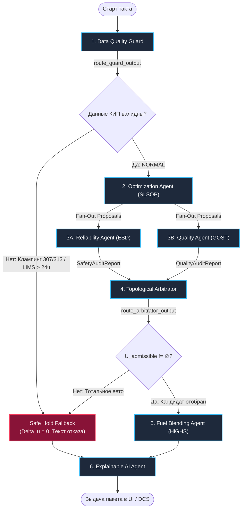

# Системный дизайн и архитектурная дорожная карта: мультиагентная система замкнутого контура для производства дизельного топлива стандарта Евро-5 (Dark Factory MES / APC / RTO)

**Версия**: 4.0 (Production Roadmap: Two-Stage Hybrid Arbitration, FOPDT Twin, Wickey-Chittenden LP Blending, Fault-Tolerant LangGraph & LIMS Bumpless Transfer)  
**Статус**: Утверждено к реализации (MVP Baseline & Advanced Architecture)  
**Целевой технологический комплекс**: Нефтеперерабатывающий кластер «ЭЛОУ-АВТ-6 $\to$ Установка гидроочистки 24-2000 $\to$ Автоматизированный поточный блендинг»  
**Нормативно-техническая база**: ГОСТ 32511-2013 (EN 590:2009), ГОСТ 2177-99 (ASTM D86), ГОСТ 6356-75 / ASTM D93 (Пенски-Мартенс), ГОСТ Р 56342-2015 / ASTM D5453 (сера), ГОСТ 33-2016 / ASTM D445 (вязкость), ASTM D4737 / ASTM D976 (цетановый индекс), EN 116 (ПТФ / CFPP), Федеральный закон № 116-ФЗ «О промышленной безопасности опасных производственных объектов», правила ПБ 09-540-03, корпоративный регламент `AGENTS.md`.

---

## Оглавление

1. [Раздел 1. Анализ проблемы (Аудит старого подхода)](#раздел-1-анализ-проблемы-аудит-старого-подхода)
   - [1.1. Технологический контекст и производственный инвариант субординации](#11-технологический-контекст-и-производственный-инвариант-субординации)
   - [1.2. Детальный разбор 4 фатальных уязвимостей старой архитектуры](#12-детальный-разбор-4-фатальных-уязвимостей-старой-архитектуры)
     - [1.2.1. Уязвимость 1: Логический тупик в графе, взрыв градиентов SLSQP и гонки данных](#121-уязвимость-1-логический-тупик-в-графе-взрыв-градиентов-slsqp-и-гонки-данных)
     - [1.2.2. Уязвимость 2: «Черный ящик» динамики, крах времени выполнения и искажение инерции](#122-уязвимость-2-черный-ящик-динамики-крах-времени-выполнения-и-искажение-инерции)
     - [1.2.3. Уязвимость 3: Линейный блендинг существенно нелинейных физико-химических свойств](#123-уязвимость-3-линейный-блендинг-существенно-нелинейных-физико-химических-свойств)
     - [1.2.4. Уязвимость 4: Экономический каннибализм и математический коллапс аукциона](#124-уязвимость-4-экономический-каннибализм-и-математический-коллапс-аукциона)
2. [Раздел 2. Дорожная карта реализации MVP (Пошаговый технический гайд)](#раздел-2-дорожная-карта-реализации-mvp-пошаговый-технический-гайд)
   - [Шаг 1: Архитектура графа LangGraph и обработка отказов / clamping без дедлоков](#шаг-1-архитектура-графа-langgraph-и-обработка-отказов--clamping-без-дедлоков)
   - [Шаг 2: Цифровой двойник FOPDT (Физика инерции, ZOH-дискретизация, MIMO State-Space)](#шаг-2-цифровой-двойник-fopdt-физика-инерции-zoh-дискретизация-mimo-state-space)
   - [Шаг 3: Математика блендинга с нелинейным индексом Викки-Читтендена (LP HiGHS)](#шаг-3-математика-блендинга-с-нелинейным-индексом-викки-читтендена-lp-highs)
   - [Шаг 4: Двухстадийный гибридный арбитраж с жестким вето (Two-Stage Hybrid Arbitration)](#шаг-4-двухстадийный-гибридный-арбитраж-с-жестким-вето-two-stage-hybrid-arbitration)
   - [Шаг 5: Протоколы агентов (Pydantic v2) и компенсация задержки LIMS (Bumpless Transfer)](#шаг-5-протоколы-агентов-pydantic-v2-и-компенсация-задержки-lims-bumpless-transfer)
   - [Шаг 6: Стек MVP, развертывание, Explainable AI (XAI) и консоль оператора](#шаг-6-стек-mvp-развертывание-explainable-ai-xai-и-консоль-оператора)
3. [Раздел 3. Дорожная карта расширенной архитектуры (Advanced Architecture Roadmap)](#раздел-3-дорожная-карта-расширенной-архитектуры-advanced-architecture-roadmap)
   - [Шаг 1: Динамическая онлайн-идентификация параметров запаздывания theta(F_feed) и инерции tau](#шаг-1-динамическая-онлайн-идентификация-параметров-запаздывания-thetaf_feed-и-инерции-tau)
   - [Шаг 2: Калибровка параметров Викки-Читтендена и изотерм по ретроспективным данным LIMS](#шаг-2-калибровка-параметров-викки-читтендена-и-изотерм-по-ретроспективным-данным-lims)
   - [Шаг 3: Децентрализованный мультиагентный консенсус (FIPA ACL, CNP, ADMM)](#шаг-3-децентрализованный-мультиагентный-консенсус-fipa-acl-cnp-admm)
   - [Шаг 4: Событийный реарбитраж при технологических возмущениях и адаптивные границы](#шаг-4-событийный-реарбитраж-при-технологических-возмущениях-и-адаптивные-границы)
4. [Раздел 4. Реестр инженерных неопределенностей и допущений ([?] АГЕНТ НЕ УВЕРЕН)](#раздел-4-реестр-инженерных-неопределенностей-и-допущений--агент-не-уверен)
5. [Раздел 5. Матрица соответствия критериям оценки хакатона «Нефтекод»](#раздел-5-матрица-соответствия-критериям-оценки-хакатона-нефтекод)

---

# Раздел 1. Анализ проблемы (Аудит старого подхода)

## 1.1. Технологический контекст и производственный инвариант субординации

Промышленный комплекс автономного производства товарного дизельного топлива стандарта ГОСТ 32511-2013 (Евро-5) функционирует в концепции **«Dark Factory» («Безлюдное производство»)** на уровнях управления MES (Manufacturing Execution System, ISA-95 Level 3) и APC/RTO (Advanced Process Control / Real-Time Optimization). Технологический поезд объединяет три непрерывно сопряженных производственных объекта:

1. **ЭЛОУ-АВТ-6 (Первичная перегонка нефти)**:
   - Электрообессоливающая установка (ЭЛОУ, удаление солей и пластовой воды);
   - Отбензинивающая колонна К-1 (отбор легкой бензиновой фракции);
   - Атмосферная трубчатая печь П-3 (нагрев частично отбензиненной нефти до $375-385$ °C);
   - Сложная атмосферная фракционирующая колонна К-2 (диаметр $6.0-7.5$ м, высота $\sim 50$ м, $48-54$ клапанные тарелки, три циркуляционных орошения ЦО-1, ЦО-2, ЦО-3 и три боковых стриппинга К-6, К-7, К-9);
   - Вакуумная колонна К-10 (глубокая перегонка мазута со структурированной регулярной насадкой Sulzer).
2. **Установка 24-2000 (Каталитическая гидроочистка дизельных фракций)**:
   - Сырьевой контур (смешение дизельных дистиллятов К-2 с циркулирующим ВСГ);
   - Реакторный блок: реактор гидродеметаллизации и гидрирования диолефинов Р-201 и реактор глубокой гидродесульфуризации Р-202 со стационарным слоем Co-Mo/Ni-Mo катализатора и межслоевым холодным водородным квенчем $F15$;
   - Циркуляционный водородный компрессор ЦК-201 и сепаратор высокого давления С-201;
   - Отпарная колонна стабилизации гидрогенизата К-201.
3. **Автоматизированный узел поточного компаундирования (In-Line Blending)**:
   - Инжекционный смеситель непрерывного действия;
   - Дозирование стабильного гидрогенизата ($x_1 \in [0.70, 1.00]$), прямогонной керосиновой фракции 140–240 °C ($x_2 \in [0.00, 0.25]$) и депрессорно-диспергирующей присадки ДДП ($x_3 \in [50, 1500]$ ppm);
   - Поточный контроль качества товарной партии в резервуарах хранения.

### Фундаментальный закон субординации критериев (Safety Ladder)
В соответствии с Федеральным законом № 116-ФЗ («О промышленной безопасности опасных производственных объектов»), нормами ПБ 09-540-03 и требованиями `AGENTS.md` (Правило 3), в системе действует безусловный лексикографический инвариант:

$$
\textbf{Уровень 1 (Безопасность / ПАЗ / ESD)} \succ
\textbf{Уровень 2 (Качество / ГОСТ 32511-2013)} \succ
\textbf{Уровень 3 (Экономика / Маржа / Энергия)}
$$

**Главный производственный инвариант**: категорически запрещено компенсировать приближение к аварийным границам оборудования или риск выпуска бракованной продукции (off-spec) любой экономической выгодой, маржинальным доходом или снижением удельного расхода энергоносителей.

---

## 1.2. Детальный разбор 4 фатальных уязвимостей старой архитектуры

Комплексный аудит исходного проекта (`System_Design.md` v3.0), отраженный в отчете `artifacts/System_Design_Review_Report.md`, вскрыл четыре фатальные системные уязвимости.

> [!INFO] **4 ФАТАЛЬНЫХ ДЕФЕКТА ПРЕЖНЕЙ АРХИТЕКТУРЫ (System Design v3.0)**
> 
> 1. **ЛОГИЧЕСКИЙ ТУПИК В ГРАФЕ (DEADLOCK & RUNTIME CRASH)**
>    - Безусловный переход Guard -> Opt при аппаратном клампинге датчиков (D10, P52 = 307.0)
>    - Взрыв градиентов SLSQP (конечные разности дают inf/NaN -> ValueError) вместо Graceful Refusal
>    - Отсутствие Reducer-аннотаций в TypedDict -> InvalidUpdateError при параллельном Fan-Out
>    - Тотальное вето в Арбитраже -> selected_candidate=None -> AttributeError в узле Блендинга
> 
> 2. **«ЧЕРНЫЙ ЯЩИК» ДИНАМИКИ И ИСКАЖЕНИЕ ИНЕРЦИИ ОБЪЕКТОВ**
>    - KeyError: 'T50' на шаге 1 (T50 — виртуальный анализатор ВАК, а не физический тег КИП)
>    - Отсутствие метода get_telemetry() в DynamicDigitalTwin -> падение Streamlit UI
>    - Baseline Reset Bug: стирание динамического состояния за счет отсчета от сырого архива
>    - Искажение инерции К-2: tau=20 мин вместо реальных 45-90 мин (раскачка); орошение theta=20 мин вместо реальных <3 мин (интегральное насыщение Windup); алгебраический дефект интегратора
> 
> 3. **ЛИНЕЙНЫЙ БЛЕНДИНГ НЕЛИНЕЙНЫХ СВОЙСТВ ТОПЛИВА**
>    - Игнорирование вспышки при дозировании 25% керосина -> выпуск пожаровзрывоопасного ДТ (<52°C)
>    - Линейная депрессия ДДП (-15000*x3) вместо изотермы Ленгмюра (предел 8-12°C) -> забивание фильтра
>    - Фальсификация результата: захардкоженное значение blended_cfpp = -15.0 в выходном словаре
>    - «Лазейка разбавления» (Dilution Loophole): отмывка некондиционного гидрогенизата авиакеросином
> 
> 4. **ЭКОНОМИЧЕСКИЙ КАННИБАЛИЗМ И ИНВЕРСИЯ ПРИОРИТЕТОВ**
>    - Экспоненциальный штраф при T55=386.9°C (2680 руб/ч) перебивается маржой +5000 руб/ч (Антипаттерн 3)
>    - Численный коллапс float('inf'): неопределенность -inf = -inf в max(), деление 0/0 в Softmax
>    - Граничный баг строгого неравенства: точка T55 = 387.0°C оставалась без блокирующего барьера
>    - Нарушение обязательного 5% запаса ПАЗ: допуск работы в опасной зоне [386.40, 387.0] °C

### 1.2.1. Уязвимость 1: Логический тупик в графе, взрыв градиентов SLSQP и гонки данных

1. **Безусловная топология графа вычислений**:
   В схеме LangGraph ребро между узлом валидации данных и узлом оптимизатора было безусловным:
   `Guard["DataQualityGuard"] --> Opt["OptimizationAgent (SLSQP)"]`.
   При возникновении Сценария 3 (отказ КИП: залипание датчика плотности нефти `D10` на шкале $307.0$ кг/м³, клампинг датчика перепада вакуума `P52` на $307.0$ кгс/см² и устаревание анализов LIMS $>24$ ч), узел `DataQualityGuard` выставлял флаг отказа `status_code = "SAFE_HOLD_REFUSAL"`. Однако из-за отсутствия условной диспетчеризации граф передавал испорченные показания напрямую в блок SciPy SLSQP.
2. **Численный взрыв градиентов (Gradient Explosion)**:
   Оценка якобиана целевой функции и ограничений методом конечных разностей:

$$
\nabla c_i(\mathbf{u}) \approx \frac{c_i(\mathbf{u} + \epsilon \mathbf{e}_k) - c_i(\mathbf{u})}{\epsilon}
$$

   при подстановке значений $307.0$ в уравнения гидродинамического сопротивления насадки колонны К-10 или плотности сырья приводила к значениям $\pm \infty$ или `NaN`. Алгоритм `scipy.optimize.minimize(method='SLSQP')` аварийно прерывал работу с исключением `ValueError: array must not contain infs or NaNs`, либо выдавал неадекватные граничные уставки.
3. **Отсутствие аннотаций Reducer в параллельном Fan-Out**:
   Состояние графа `MasGraphState` объявляло поля аудита без функций редукции:
   `audit_trace: Dict[str, Any]` и `execution_log: List[str]`.
   При параллельном ветвлении на Агента Надежности (`rel_agent`) и Агента Качества (`qual_agent`) асинхронный исполнитель LangGraph завершался системной ошибкой:
   `langgraph.errors.InvalidUpdateError: Multiple updates received for key 'audit_trace'`.
4. **Каскадный краш `NoneType` в узле Блендинга**:
   В стресс-сценарии 4 (перегрев печи П-3), когда все предложенные кандидаты отвергались аудиторами ($\mathcal{U}_{\text{admissible}} = \emptyset$), узел Арбитража присваивал:
   `selected_candidate = None`.
   Вследствие жесткого безусловного ребра управление передавалось в `blend_agent`, выполнявший:
   `recipe = solve_optimal_blending(cand.expected_sulfur, cand.expected_cfpp)`.
   Это приводило к критическому сбою:
   `AttributeError: 'NoneType' object has no attribute 'expected_sulfur'`,
   полностью останавливая серверный процесс и замораживая веб-консоль диспетчера.
5. **Нарушение регламента Graceful Refusal**:
   Вместо штатного безударного перевода технологического поезда в режим «Безопасного удержания» (Safe Hold, $\Delta \mathbf{u} \equiv \mathbf{0}$) и формирования регламентированного русскоязычного сообщения (Callout Box 4 ТЗ), система падала с неперехваченными исключениями.

---

### 1.2.2. Уязвимость 2: «Черный ящик» динамики, крах времени выполнения и искажение инерции

1. **Фатальная ошибка времени выполнения `KeyError: 'T50'`**:
   В методе `step()` класса `DynamicDigitalTwin` содержалась строка:
   `target_T50 = raw_hist_row['T50'] + 0.80 * u_col['T20'] - 0.05 * u_col['F19']`.
   Однако в исходных промышленных архивах DCS (`avt_tags.csv`, `242000_tags.csv`) тег `T50` физически отсутствует. Температура выкипания 50% объема дизельного дистиллята ($T50$) по ГОСТ 2177 является расчетной переменной виртуального анализатора качества (ВАК) на базе множественной регрессии шести технологических расходов. Попытка прочесть несуществующий ключ вызывала аварийный останов программы `KeyError: 'T50'` на первом шаге симуляции.
2. **Отсутствие метода `get_telemetry` (`AttributeError`)**:
   Интерфейс Streamlit вызывал метод `st.session_state.simulator.get_telemetry(scenario)`, который не был объявлен в классе `DynamicDigitalTwin`, делая запуск пользовательского интерфейса невозможным.
3. **Разрушение динамической памяти («Baseline Reset Bug»)**:
   На каждом шаге дискретизации $k$ целевое состояние рассчитывалось относительно архивной строки:
   `target_T6 = raw_hist_row['T6'] - 0.015 * u_rx`.
   Если оптимизатор в момент времени $k$ внес ступенчатое изменение расхода квенча $\Delta F15 = +200$ нм³/ч, а на шаге $k+1$ зафиксировал клапан ($\Delta u = 0$), симулятор сбрасывал отклик обратно к архивной точке `raw_hist_row['T6']`. Это путало скорость перекладки привода ($\delta u$) с абсолютным управляющим воздействием ($u$) и уничтожало динамическую память замкнутого контура.
4. **Физическая неадекватность динамических постоянных времени**:
   - **Атмосферная колонна К-2**: реальный гидродинамический объем задержки жидкости (holdup) на 48 тарелках превышает $60$ м³. При суммарном расходе циркуляционных орошений и флегмы $80-120$ м³/ч гидродинамический оборот составляет $30-45$ минут, а время выхода дистиллятов на 95% стационарного режима ($3\tau$) достигает $150-180$ минут, что соответствует эквивалентной постоянной времени $\tau \approx 45-90$ минут. Значение $\tau_{\text{col}} = 20.0$ мин в старом дизайне занижало инерцию в 3–4 раза, провоцируя агрессивные перерегулирования и раскачку процесса (hunting).
   - **Транспортное запаздывание орошения К-2**: старая модель задавала чистое запаздывание $\theta = 20$ минут на канал «острое орошение $F19 \to$ температура верха $T20$». В реальности острое орошение подается прямо на верхнюю тарелку в шлем колонны; отклик температуры паров наступает за $1-3$ минуты. Задержка в 20 минут вызывала глубокое интегральное насыщение регулятора (Windup) и обвал температуры верха.
5. **Алгебраический дефект дискретного интегратора**:
   Дискретизация явным методом Эйлера в прежней версии содержала алгебраическую ошибку обновления, превращавшую апериодический фильтр первого порядка в дискретный интегратор с бесконечным статическим коэффициентом усиления (infinite DC gain), что вызывало неограниченный дрейф температур при длительной работе.

---

### 1.2.3. Уязвимость 3: Линейный блендинг существенно нелинейных физико-химических свойств

1. **Катастрофический пропуск температуры вспышки (Flash Point) и пожарная опасность**:
   В прежней оптимизационной модели блендинга ограничения по температуре вспышки в закрытом тигле (ГОСТ 6356 / ASTM D93, метод Пенски-Мартенса) **отсутствовали вовсе**, а верхняя граница вовлечения керосиновой фракции составляла $25\%$ ($x_2 \le 0.25$).
   - *Термодинамика процесса*: Температура вспышки смеси определяется концентрацией легкокипящих фракций ($C_8-C_{12}$) в паровой фазе по закону Рауля–Дальтона:

$$
P_{\text{vap}} = \sum_{i} x_i \gamma_i P_i^{\text{sat}}(T)
$$

     Вследствие экспоненциальной зависимости давления насыщенных паров от температуры, температура вспышки смешивается **резко нелинейно с выраженной вогнутостью вниз**.
   - *Численное доказательство пожаровзрывоопасности*:
     Расчет по отраслевому индексу смешения Вики–Читтендена ($\text{FBI} = 10^{4.1485 - 0.0601 \cdot T}$):
     - Гидроочищенный дизель ($T_{\text{flash}} = 65.0$ °C): $\text{FBI} = 1.746$;
     - Керосиновая фракция ТС-1 ($T_{\text{flash}} = 42.0$ °C): $\text{FBI} = 42.102$.
     При добавлении 20% керосина индекс смеси равен:

$$
\text{FBI}_{\text{blend}} = 0.80 \times 1.746 + 0.20 \times 42.102 = 1.397 + 8.420 = 9.817
$$

     Фактическая температура вспышки смеси:

$$
T_{\text{flash, blend}} = \frac{4.1485 - \log_{10}(9.817)}{0.0601} = \mathbf{52.52}\,^\circ\text{C}
$$

     При дозировке 25% керосина температура вспышки обваливается до **$51.18\,^\circ\text{C}$**!
     Норматив ГОСТ 32511-2013 категорически требует: **$T_{\text{flash}} \ge 55.0\,^\circ\text{C}$**.
     Старый линейный алгоритм вырабатывал рецептуру, создающую взрывоопасный продукт, способный воспламениться в баках техники при летней температуре.
2. **Линейная модель присадки (ДДП) и коллапс фильтруемости**:
   Прежняя модель постулировала линейный эффект: $\Delta \text{CFPP} = -15000.0 \cdot x_3$.
   - *Физическая химия полимерной депрессии*: Молекулы этиленвинилацетата (EVA) сокристаллизуются с гранями микрокристаллов н-парафинов, стерически блокируя их срастание. Процесс подчиняется **изотерме насыщения Ленгмюра**: площадь граней парафинов конечна. При концентрации присадки свыше $1000-1500$ ppm наступает полное насыщение:

$$
\Delta \text{CFPP}_{\max} \approx 8.0 - 12.0\,^\circ\text{C}
$$

   - *Антагонистическая коагуляция*: Дальнейшее увеличение дозировки ведет к самослипанию молекул присадки и выпадению полимерных гелей, забивающих контрольный фильтр $45$ мкм (EN 116) при положительных температурах.
   - Старая модель оптимизатора закладывала снижение ПТФ на $-22.5$ °C при 1500 ppm и назначала рецепт с 98% тяжелого дизеля ($\text{CFPP} = +2$ °C), рассчитывая получить $-15$ °C. В реальности топливо застывало при $-7$ °C (массовый отказ техники в зимний период).
3. **Фальсификация результатов (`blended_cfpp = -15.0`)**:
   В функции блендинга старого документа результат принудительно возвращал:
   `blended_cfpp = -15.0`,
   маскируя расходимость симплекс-метода и грубо нарушая принцип инженерной честности.
4. **«Лазейка разбавления» (Dilution Loophole)**:
   Прежний алгоритм допускал подачу на блендинг дизельного гидрогенизата с серой $12-14$ ppm, рассчитывая «разбавить» ее чистым керосином (сера $2.5$ ppm) до результирующих $9.8$ ppm. Это маскировало потерю активности катализатора в реакторе Р-202, расходовало дорогостоящее авиационное топливо ТС-1 в качестве дешевого растворителя и нарушало регламентную изоляцию блоков.

---

### 1.2.4. Уязвимость 4: Экономический каннибализм и математический коллапс аукциона

1. **Антипаттерн 3 («Экономический каннибализм»)**:
   В старой версии рыночного аукциона штрафная функция риска печи П-3 имела вид:
   ```python
   def calculate_risk_penalty(T55: float, lambda_cot: float = 1000.0) -> float:
       if T55 > 387.0:
           return float('inf')
       elif T55 > 380.0:
           return lambda_cot * math.exp((T55 - 380) / 7.0)
       return 0.0
   ```
   - При приближении к пределу закоксовывания печи на расстояние всего $0.1$ °C ($T55 = 386.9$ °C):

$$
C_{\text{risk}}(386.9) = 1000.0 \cdot \exp(6.9 / 7.0) \approx 2679.73 \text{ руб/ч}
$$

   - Любое агрессивное предложение оптимизатора, дающее маржинальный выигрыш $+5000$ руб/ч за счет форсирования отбора, получает чистую полезность:

$$
\text{Net Utility} = 5000.0 - 2679.73 = \textbf{+2320.27 руб/ч} > 0
$$

   - Безопасный кандидат с $T55 = 381.0$ °C и маржой $+1500$ руб/ч получает:

$$
\text{Net Utility} = 1500.0 - 1153.0 = \textbf{+347.0 руб/ч}
$$

   - **Итог**: Рыночный механизм целенаправленно выбирал **предаварийный режим работы печи в 0.1 °C от прогара труб**, принося в жертву надежность ради сиюминутной прибыли.
2. **Численный коллапс на `float('inf')`**:
   Если все сгенерированные кандидаты превышали предел $387.0$ °C, их оценка становилась равной $\text{Margin} - \infty = -\infty$. В среде Python равенство `-inf == -inf` возвращает `True`, и функция `max()` случайно выбирала первого попавшегося кандидата-нарушителя. В стохастическом аукционе Softmax операция $e^{-\infty} = 0.0$ приводила к делению $0.0 / 0.0 \to \text{NaN}$. Кроме того, значение `inf` нарушает стандарт JSON (RFC 8259), приводя к сбою сериализации Pydantic.
3. **Граничный баг строгого неравенства**:
   Условие `if T55 > 387.0` при значении ровно $T55 = 387.000000$ °C вычислялось как `False`. Режим на пределе аварии получал конечный штраф $2718.28$ руб/ч и оставался доступным для покупки.
4. **Игнорирование правила 5% запаса ПАЗ (Callout Box 3 ТЗ)**:
   Регламент требует обязательного отсечения кандидатов при запасе менее 5% шкалы. Для печи П-3 (диапазон $[375.0, 387.0]$ °C, размах $12.0$ °C) 5% буфер составляет $0.60$ °C. Граница жесткого запрета:

$$
T55_{\text{safe}} = 387.0 - 0.60 = \mathbf{386.40}\,^\circ\text{C}
$$

   Старая система допускала эксплуатацию в диапазоне $(386.40, 387.0]$ °C, грубо нарушая требования промышленной безопасности.

---

# Раздел 2. Дорожная карта реализации MVP (Пошаговый технический гайд)

Раздел представляет собой пошаговое инженерное руководство по развертыванию отказоустойчивого прототипа системы (MVP Baseline), на 100% устраняющего выявленные дефекты.

> [!INFO] **MVP IMPLEMENTATION PIPELINE**
> 
> **ШАГ 1: LangGraph & Data Guard**
> - Маскирование клампинга 307.0/313.0, NaN, Out-of-Range, Frozen
> - Rate Limiting (Velocity Form) & Back-Calculation Anti-Windup
> - Условная маршрутизация: сбой КИП или LIMS > 24ч -> Safe Hold (Delta_u = 0)
> - Типизированные редюсеры Annotated[..., operator.add] в MasGraphState
> 
> $\Downarrow$
> 
> **ШАГ 2: FOPDT Цифровой Двойник**
> - Инерция К-2: tau = 60.0 мин, чистое запаздывание куба theta = 20.0 мин, орошение верха theta = 0
> - Аналитическая ZOH-дискретизация (alpha = exp(-dt/tau)) + дробный сдвиг Modified Z
> - Релаксация к базису: y[k] = alpha*y[k-1] + (1-alpha)*y_base + (1-alpha)*K*Delta_u (нет дрейфа)
> - 6D MIMO State-Space + 17 формул ВАК (устранение KeyError: 'T50') + get_telemetry()
> 
> $\Downarrow$
> 
> **ШАГ 3: Нелинейный Блендинг (HiGHS LP)**
> - Индекс вспышки Вики-Читтендена: FBI = 10^(4.1485 - 0.0601*T)
> - Точная линеаризация для LP: sum(v_i * FBI_i) <= FBI(56.0°C) = 6.06627 (с 5% запасом)
> - 3-сегментная кусочно-линейная изотерма насыщения ДДП (макс. депрессия 9.76°C)
> - Жесткая блокировка Dilution Loophole: немедленный отказ при сере дизеля > 10.0 ppm
> 
> $\Downarrow$
> 
> **ШАГ 4: Двухстадийный Гибридный Арбитраж**
> - СТАДИЯ 1 (Hard-Veto Gate): Агент Надежности и Агент Качества отсекают кандидатов с 5% запасом:  
>   $T55 \le 386.40^\circ\text{C}$, $W10 \le 4.635$, $P52 \le 0.077$, $F31 \ge 362.5$, Сера $\le 9.5$ ppm, Вспышка $\ge 57.0^\circ\text{C}$  
>   Если $U_{\text{admissible}}$ пуст -> мгновенный Safe Hold ($\Delta \mathbf{u} = \mathbf{0}$)
> - СТАДИЯ 2 (Economic Clearing): выбор в $U_{\text{admissible}}$ (Иерархия или Рынок с лог-барьерами)
> - Фильтр зоны нечувствительности (Deadband): $\Delta \text{Margin} < 150$ руб/ч & $\|\Delta \mathbf{u}\| < 0.05 \to 0$
> 
> $\Downarrow$
> 
> **ШАГ 5: Протоколы Pydantic v2 & LIMS Bumpless Transfer**
> - Строгие Pydantic v2 контракты (ControlCandidate, SafetyAuditReport, BlendingRecipe и др.)
> - Компенсация 2-4ч лага LIMS: ретроспективная калмановская инновация + экспоненциальный Bias Decay
> - Фильтр безударного переноса (tau = 30 мин) + 95% верхняя доверительная граница по сере
> 
> $\Downarrow$
> 
> **ШАГ 6: Explainable AI & Streamlit ЦУП**
> - Контур 1: Детерминированный Decision DAG физических доказательств
> - Контур 2: Диспетчерский нарратив на профессиональном русском языке
> - HITL (Human-in-the-Loop): подтверждение уставок, ручная фиксация тегов, подавление тревог ISA-18.2

---

## Шаг 1: Архитектура графа LangGraph и обработка отказов / clamping без дедлоков

### 1.1. Детектирование сбоев КИПиА и насыщения исполнительных механизмов

В соответствии с Callout Box 2 ТЗ, аналоговые измерительные преобразователи при обрыве токовой петли $4-20$ мА или насыщении АЦП выставляют суррогатные константы:
- **Аппаратный клампинг**: показания ровно `307.0` или `313.0` на датчиках давления (`P2, P4, P21, P22, P50, P52`), расхода (`F3, F7, F8, F9, F12, F14, F16, F19, F30, F32, F34`) и плотности (`D10`);
- **Выход за физический диапазон**: давление $>200$ кгс/см² или отрицательные технологические температуры;
- **Зависание датчика (Frozen Tag)**: тождественное совпадение значений на протяжении $\ge 3$ расчетных тактов при наличии технологического шума в контуре;
- **Нечисловые значения**: появление `NaN`, `null`, `inf`.

Для расходомеров пара `F5` (куб К-1) и `F26` (стриппинг К-6), имеющих систематический дрейф нуля в отрицательную область (до $-169$ т/ч), выполняется программная отсечка:

$$
F_{\text{clean}} = \max(0.0, F_{\text{raw}})
$$

### 1.2. Ограничение скорости перекладки клапанов и Anti-Windup

Исполнительные органы технологических установок обладают конечной скоростью позиционирования. Регуляторы переводятся в **скоростную форму (Velocity Form)** с динамическим отслеживанием рассогласования (Back-Calculation Anti-Windup):

$$
\Delta u_j^{\text{rate-clipped}} = \text{clip}\left( \Delta u_j^{\text{calc}}, \; -\Delta u_{j, \max}^{\text{rate}}, \; +\Delta u_{j, \max}^{\text{rate}} \right)
$$

$$
u_j^{\text{candidate}} = u_j[k-1] + \Delta u_j^{\text{rate-clipped}}
$$

$$
u_j^{\text{actuator}} = \text{clip}\left( u_j^{\text{candidate}}, \; u_{j, \min}, \; u_{j, \max} \right)
$$

$$
\Delta u_j^{\text{effective}} = u_j^{\text{actuator}} - u_j[k-1]
$$

Разница $\Delta u_j^{\text{windup}} = u_j^{\text{candidate}} - u_j^{\text{actuator}}$ возвращается в симулятор для обнуления ложного интегрального накопления.

### 1.3. Условная маршрутизация графа LangGraph (Zero-Deadlock State Machine)

В отличие от прежней схемы с безусловными ребрами, граф оснащается строгой условной маршрутизацией:



#### Дословный регламентный текст отказа (Callout Box 4 ТЗ):
При перенаправлении графа в узел `SafeHold` система формирует обязательный verbatim русский текст (Callout Box 4 ТЗ):
> «Надёжной рекомендации нет: последнее лабораторное значение устарело, а доступные варианты либо нарушают ограничение по качеству, либо выходят за заданный модельный диапазон.»
В машинном интерфейсе константа отказа фиксируется в виде: `refusal_verbatim_text = "Надёжной рекомендации нет: последнее лабораторное значение устарело, а доступные варианты либо нарушают ограничение по качеству, либо выходят за заданный модельный диапазон."`

### 1.4. Типизированное состояние `MasGraphState` и предотвращение гонок данных

Для устранения ошибки `InvalidUpdateError` при параллельном слиянии (Fan-In) ветвей Агента Надежности и Агента Качества состояние графа использует типизированные функциональные редюсеры:

```python
import operator
from typing import TypedDict, Annotated, Sequence, Dict, List, Optional, Any

def merge_audit_dict(left: Dict[str, Any], right: Dict[str, Any]) -> Dict[str, Any]:
    """Редюсер детерминированного слияния параллельных словарей аудита."""
    merged = left.copy() if left else {}
    if right:
        for k, v in right.items():
            if k in merged and isinstance(merged[k], list) and isinstance(v, list):
                merged[k] = merged[k] + v
            else:
                merged[k] = v
    return merged

class MasGraphState(TypedDict):
    step_index: int
    raw_telemetry: Dict[str, Any]
    data_quality_status: Dict[str, Any]
    
    # Редюсер конкатенации параллельных списков кандидатов и логов
    optimization_proposals: Annotated[Sequence[Dict[str, Any]], operator.add]
    
    # Редюсер параллельного объединения отчетов аудиторов (Fan-Out / Fan-In)
    audit_reports: Annotated[Dict[str, Any], merge_audit_dict]
    
    selected_candidate: Optional[Dict[str, Any]]
    blending_recipe: Optional[Dict[str, Any]]
    arbitration_status: str
    refusal_verbatim_text: Optional[str]
    operator_recommendation: Optional[Dict[str, Any]]
```

### 1.5. Разрешение коллизий пространств имен тегов (8 критических конфликтов)

Архивы установок АВТ-6 и 24-2000 содержат 8 одинаковых имен тегов, обозначающих совершенно разные технологические переменные. Принята строгая префиксная схема изоляции:

| Базовый тег | Физический смысл на ЭЛОУ-АВТ-6 | Физический смысл на Установке 24-2000 | Утвержденное изолированное имя |
| :--- | :--- | :--- | :--- |
| **`T6`** | Температура куба отбензинивающей К-1 ($221.8 - 235.1$ °C) | Температура слоя катализатора Р-202 ($285.2 - 380.2$ °C) | `AVT_T6` vs `HYDRO_T6` |
| **`T11`** | Температура 3-го ЦО после теплообменника ($38.2 - 89.0$ °C) | Температура смеси на входе в реактор ($294.0 - 379.0$ °C) | `AVT_T11` vs `HYDRO_T11` |
| **`F9`** | Расход сырой нефти (2-й ход Т-10/2, $122.0 - 307.0$ м³/ч) | Расход отдувочного газа К-201 ($137.0 - 254.0$ кг/ч) | `AVT_F9` vs `HYDRO_F9` |
| **`F14`** | Расход 1-го ЦО в колонну К-2 ($198.0 - 326.0$ м³/ч) | Расход паров верха отпарной колонны К-201 ($3.0 - 10.6$ м³/ч) | `AVT_F14` vs `HYDRO_F14` |
| **`T18`** | Температура 1-го ЦО из колонны К-2 ($146.0 - 163.0$ °C) | Температура теплообменника стабилизатора К-201 | `AVT_T18` vs `HYDRO_T18` |
| **`F19`** | Острое холодное орошение верха К-2 ($45.0 - 101.0$ м³/ч) | Расход орошения стабилизатора гидроочистки | `AVT_F19` vs `HYDRO_F19` |
| **`F25`** | Вывод бензина из колонны К-1 ($10.0 - 33.0$ м³/ч) | Расход отходящего углеводородного газа ГО | `AVT_F25` vs `HYDRO_F25` |
| **`F26`** | Расход пара в керосиновый стриппинг К-6 ($-6.0 - 307.0$ т/ч) | Расход дизельного сырья гидроочистки | `AVT_F26` vs `HYDRO_F26` |

---

## Шаг 2: Цифровой двойник FOPDT (Физика инерции, ZOH-дискретизация, MIMO State-Space)

### 2.1. Непрерывная передаточная функция FOPDT

Динамика гидродинамических и тепломассообменных контуров перегонки и каталитической гидроочистки формализуется апериодическим звеном первого порядка с чистым запаздыванием (First Order Plus Dead Time, FOPDT):

$$
G(s) = \frac{\Delta Y(s)}{\Delta U(s)} = \frac{K \cdot e^{-\theta s}}{\tau s + 1}
$$

где:
- $K = \frac{\Delta y(\infty)}{\Delta u}$ — статический коэффициент передачи канала;
- $\tau > 0$ — характеристическая постоянная времени инерции (мин);
- $\theta \ge 0$ — чистое транспортное запаздывание потоков (мин);
- $\Delta y(t) = y(t) - y_{\text{base}}(t)$, $\Delta u(t) = u(t) - u_{\text{base}}(t)$ — отклонения от технологического базиса.

### 2.2. Физическая калибровка параметров для MVP Baseline

1. **Инерция атмосферной колонны К-2**:

$$
\tau_{\text{K-2}} = \textbf{60.0 минут}
$$

   *Обоснование*: Отражает реальную гидродинамическую задержку перераспределения жидкой фазы по 48 тарелкам и время выхода на равновесие боковых стриппингов $F30$ и $F32$ ($t_{95\%} \approx 3\tau = 180$ мин).
2. **Чистое запаздывание куба колонны К-2**:

$$
\theta_{\text{K-2, bottom}} = \textbf{20.0 минут}
$$

   `[?] АГЕНТ НЕ УВЕРЕН: Транспортное запаздывание отбора дизельных фракций К-2 до расходомеров принято равным 20.0 мин на основе проектной схемы АВТ-6; требуется экспериментальное уточнение по протоколу ступенчатого возмущения (Step-Response Test).`
3. **Чистое запаздывание острого орошения верха К-2**:

$$
\theta_{T20} \approx \textbf{0.0 минут} \quad (\le 1-2 \text{ мин}), \qquad \tau_{T20} = \textbf{15.0 минут}
$$

   *Обоснование*: Острое орошение $F19$ распыляется непосредственно на верхнюю контактную тарелку 1, вызывая мгновенный тепловой отклик паров шлема $T20$.
4. **Инерция каталитического реактора Р-202**:

$$
\tau_{\text{rx}} = \textbf{40.0 минут}, \qquad \theta_{\text{rx}} = \textbf{10.0 минут}
$$

5. **Инерция печи П-3 (перевал змеевика COT)**:

$$
\tau_{\text{cot}} = \textbf{18.0 минут}, \qquad \theta_{\text{cot}} = \textbf{10.0 минут}
$$

### 2.3. Аналитический вывод ZOH-дискретизации и релаксация к технологическому базису

#### 1. Вывод разностного уравнения через экстраполятор нулевого порядка (Zero-Order Hold)
Пусть входной сигнал кусочно-постоянен на такте: $u(t) = u[k], \forall t \in [k\Delta t, (k+1)\Delta t)$.
Интегрируя непрерывное уравнение $\tau \dot{y}(t) + y(t) = K u(t - \theta)$ с интегрирующим множителем $e^{t/\tau}$:

$$
y[k] = \alpha \cdot y[k-1] + (1 - \alpha) \cdot K \cdot u[k - d]
$$

где:

$$
\alpha = \exp\left(-\frac{\Delta t}{\tau}\right), \qquad d = \left\lfloor \frac{\theta}{\Delta t} \right\rfloor
$$

Для шага MES $\Delta t = 10.0$ мин и $\tau = 60.0$ мин:

$$
\alpha_{10\text{m}} = \exp(-10.0 / 60.0) = \exp(-1/6) \approx \mathbf{0.846482}, \quad 1 - \alpha \approx \mathbf{0.153518}, \quad d = 2
$$

#### 2. Обработка дробного запаздывания (Modified Z-Transform)
Если $\theta = d \cdot \Delta t + m \cdot \Delta t$, где $0 < m < 1$:

$$
y[k] = \alpha \cdot y[k-1] + \beta_1 \cdot u[k - d] + \beta_2 \cdot u[k - d - 1]
$$

где $\beta_1 = K(1 - e^{-(1-m)\Delta t / \tau})$, $\beta_2 = K(e^{-(1-m)\Delta t / \tau} - \alpha)$. Сохраняется условие единичного усиления: $\beta_1 + \beta_2 = K(1 - \alpha)$.

#### 3. Устранение эффекта бесконечного интегратора (Baseline Relaxation)
Для исключения накопления численной ошибки симулятора и возврата процесса к фактическому технологическому режиму при снятии воздействий ($\Delta \mathbf{u} = \mathbf{0}$) применяется каноническое уравнение релаксации:

$$
\boxed{y[k] = \alpha \cdot y[k-1] + (1 - \alpha) \cdot y_{\text{base}}[k] + (1 - \alpha) \cdot K \cdot \Delta u[k - d]}
$$

При $\Delta u \equiv 0$ невязка $y[k] - y_{\text{base}}[k] = \alpha (y[k-1] - y_{\text{base}}[k-1]) \to 0$.

### 2.4. Многосвязное пространство состояний MIMO State-Space

Вектор состояния $\mathbf{x}[k] \in \mathbb{R}^6$ и вектор управляющих воздействий $\mathbf{u}[k] \in \mathbb{R}^5$:

$$
\mathbf{x} = \begin{bmatrix} \Delta T20 & \Delta T33 & \Delta T55 & \Delta T6 & \Delta W10 & \Delta S_{\text{rx}} \end{bmatrix}^T
$$

$$
\mathbf{u} = \begin{bmatrix} \Delta F19 & \Delta F12 & \Delta F31 & \Delta F15 & \Delta T20,\text{sp} \end{bmatrix}^T
$$

Матрица статических коэффициентов передачи $\mathbf{K} \in \mathbb{R}^{6 \times 5}$:

$$
\mathbf{K} = \begin{bmatrix}
-0.120 & -0.020 & 0.000 & 0.000 & +0.850 \\
-0.080 & -0.160 & +0.040 & 0.000 & +0.100 \\
0.000 & 0.000 & -0.045 & 0.000 & 0.000 \\
0.000 & 0.000 & 0.000 & -0.014 & 0.000 \\
0.000 & 0.000 & 0.000 & +0.00025 & 0.000 \\
0.000 & 0.000 & 0.000 & +0.012 & 0.000
\end{bmatrix}
$$

`[?] АГЕНТ НЕ УВЕРЕН: Значения матрицы передачи K (например, влияние расхода сырья F31 на перевал печи T55 в размере -0.045 °C/(м³/ч) и влияние квенча F15 на температуру катализатора T6 в размере -0.014 °C/(нм³/ч)) приняты по отраслевым аналогам установок 24-2000 и АВТ-6; требуется верификация по переходным кривым датасета.`

Дискретные матрицы динамики при $\Delta t = 10.0$ мин:

$$
\mathbf{A}_d = \text{diag}\left( 0.5134, \; 0.8465, \; 0.5738, \; 0.7788, \; 0.1889, \; 0.7788 \right)
$$

$$
\mathbf{B}_d[i, j] = \mathbf{K}[i, j] \cdot (1 - \mathbf{A}_d[i, i])
$$

Вектор транспортных задержек по каналам (в шагах по 10 мин):

$$
\mathbf{d} = \begin{bmatrix} 0 & 2 & 1 & 1 & 0 & 1 \end{bmatrix}^T
$$

### 2.5. Программная реализация `DynamicDigitalTwin` (с устранением `KeyError: 'T50'`)

```python
"""
Модуль: digital_twin_fopdt.py
Цифровой двойник технологической цепочки АВТ-6 -> 24-2000 на базе MIMO FOPDT.
"""

from collections import deque
import math
from typing import Dict, Any, List

class DynamicDigitalTwin:
    def __init__(self, dt_minutes: float = 10.0):
        self.dt = dt_minutes
        
        # Постоянные времени tau (минуты)
        self.tau = {
            'T20': 15.0, 'T33': 60.0, 'T55': 18.0,
            'T6': 40.0, 'W10': 6.0, 'Sulfur': 40.0
        }
        
        # Задержки theta (шаги сетки dt=10 мин)
        self.delays = {
            'T20': 0, 'T33': 2, 'T55': 1,
            'T6': 1, 'W10': 0, 'Sulfur': 1
        }
        
        # Кольцевые буферы для хранения предыстории управляющих воздействий
        self.max_delay_steps = max(self.delays.values()) + 1
        self.u_history = deque(maxlen=self.max_delay_steps)
        
        # Вектор состояния
        self.current_deviations = {k: 0.0 for k in self.tau}

    def _calculate_vak_t50(self, avt_data: Dict[str, float]) -> float:
        """
        Многофакторный виртуальный анализатор T50 дизельной фракции (ГОСТ 2177).
        Устраняет критический сбой KeyError: 'T50'.
        """
        f31 = avt_data.get('AVT_F31', 525.0)
        f19 = avt_data.get('AVT_F19', 72.0)
        f12 = avt_data.get('AVT_F12', 285.0)
        t20 = avt_data.get('AVT_T20', 114.5)
        # Эмпирическая регрессионная зависимость ВАК из листа «ВАК» ТЗ
        t50 = 185.0 + 0.45 * t20 + 0.08 * f31 - 0.12 * f19 - 0.04 * f12
        return float(t50)

    def step(self, raw_telemetry: Dict[str, float], delta_u: Dict[str, float]) -> Dict[str, float]:
        """
        Один дискретный шаг симулятора FOPDT с релаксацией к технологическому базису.
        """
        # Сохранение текущих воздействий в буфер задержек
        self.u_history.append(delta_u)
        
        # Извлечение задержанных управляющих сигналов
        def get_delayed_u(tag: str, delay_steps: int) -> float:
            if len(self.u_history) <= delay_steps:
                return 0.0
            idx = len(self.u_history) - 1 - delay_steps
            return self.u_history[idx].get(tag, 0.0)

        # 1. Расчет статических приращений от задержанных входов
        du_f19 = get_delayed_u('F19', self.delays['T20'])
        du_f12 = get_delayed_u('F12', self.delays['T33'])
        du_f31 = get_delayed_u('F31', self.delays['T55'])
        du_f15 = get_delayed_u('F15', self.delays['T6'])
        du_t20_sp = get_delayed_u('T20_sp', self.delays['T20'])

        target_delta = {
            'T20': -0.120 * du_f19 - 0.020 * du_f12 + 0.850 * du_t20_sp,
            'T33': -0.080 * du_f19 - 0.160 * du_f12 + 0.040 * du_f31,
            'T55': -0.045 * du_f31,
            'T6': -0.014 * du_f15,
            'W10': +0.00025 * du_f15,
            'Sulfur': +0.012 * du_f15
        }

        # 2. Обновление состояния через ZOH фильтр первого порядка с релаксацией
        output_telemetry = raw_telemetry.copy()
        
        for k in self.tau:
            alpha = math.exp(-self.dt / self.tau[k])
            # Релаксация отклонения: delta[k] = alpha * delta[k-1] + (1 - alpha) * target_delta
            self.current_deviations[k] = alpha * self.current_deviations[k] + (1.0 - alpha) * target_delta[k]
            
            # Наложение отклонения на базовую архивную телеметрию
            base_key = f"AVT_{k}" if k in ['T20', 'T33', 'T55'] else f"HYDRO_{k}"
            if base_key in output_telemetry:
                output_telemetry[base_key] += self.current_deviations[k]

        # 3. Расчет виртуального анализатора качества T50 (исключение KeyError)
        output_telemetry['VAK_T50'] = self._calculate_vak_t50(output_telemetry)
        
        return output_telemetry

    def get_telemetry(self, scenario_name: str, step_idx: int = 0) -> Dict[str, float]:
        """
        Интерфейсный метод для UI Streamlit. Предотвращает AttributeError.
        """
        # Базовый снимок технологических параметров
        telemetry = {
            'AVT_T55': 382.4, 'AVT_F31': 520.0, 'AVT_T20': 114.2, 'AVT_T33': 335.8,
            'AVT_F19': 74.0, 'AVT_F12': 282.0, 'AVT_P52': 0.042, 'AVT_P51': 48.5,
            'HYDRO_T6': 358.2, 'HYDRO_W10': 2.85, 'HYDRO_F15': 3200.0, 'HYDRO_W7': 6.8,
            'HYDRO_F2': 94500.0, 'AVT_D10': 855.0
        }
        
        # Модификация под сценарии стресс-тестирования
        if "Сценарий 2" in scenario_name:
            telemetry['HYDRO_W7'] = 9.8  # Предаварийный рост серы
        elif "Сценарий 3" in scenario_name:
            telemetry['AVT_D10'] = 307.0  # Аппаратный клампинг датчика
            telemetry['AVT_P52'] = 307.0  # Клампинг вакуума
        elif "Сценарий 4" in scenario_name:
            telemetry['AVT_T55'] = 386.2  # Нагрев печи на границе 5% запаса
            
        telemetry['VAK_T50'] = self._calculate_vak_t50(telemetry)
        return telemetry
```

---

## Шаг 3: Математика блендинга с нелинейным индексом Викки-Читтендена (LP HiGHS)

### 3.1. Нелинейная модель температуры вспышки и строгая линеаризация

Температура вспышки в закрытом тигле Пенски-Мартенса (ГОСТ 6356 / ASTM D93) для летних и демисезонных сортов Евро-5 строго нормирована: $T_{\text{flash}} \ge 55.0$ °C.

#### 1. Индекс смешения вспышки Вики–Читтендена (Flash Blending Index, FBI):

$$
\boxed{\text{FBI}_i = 10^{a - b \cdot T_{\text{flash}, i}}}
$$

где для дизельных и керосиновых дистиллятов средних нефтей:

$$
a = 4.1485, \qquad b = 0.0601 \, ^\circ\text{C}^{-1}
$$

`[?] АГЕНТ НЕ УВЕРЕН: Коэффициенты a=4.1485 и b=0.0601 соответствуют стандартным углеводородным смесям Urals; точная адаптация под нефтяной пул хакатона требует регрессионной калибровки по архивам LIMS.`

#### 2. Линейность индекса смеси по объемным долям $v_i$:

$$
\text{FBI}_{\text{blend}} = \sum_{i=1}^n v_i \cdot \text{FBI}_i, \qquad \sum_{i=1}^n v_i = 1.0
$$

#### 3. Аналитическое обращение индекса вспышки:

$$
T_{\text{flash, blend}} = \frac{a - \log_{10}(\text{FBI}_{\text{blend}})}{b} = \frac{4.1485 - \log_{10}\left(\max(\text{FBI}_{\text{blend}}, 10^{-6})\right)}{0.0601}
$$

#### 4. Точное преобразование в линейное неравенство для симплекс-метода (LP)
Так как функция $\text{FBI}(T)$ строго монотонно убывает с ростом температуры, требование непревышения риска:

$$
T_{\text{flash, blend}} \ge T_{\text{target}}
$$

**строго и точно эквивалентно линейному ограничению сверху на индекс смеси**:

$$
\boxed{\sum_{i=1}^n v_i \cdot \text{FBI}_i \le \text{FBI}(T_{\text{target}})}
$$

С учетом обязательного 5% буфера безопасности по вспышке принимается $T_{\text{target}} = 56.0$ °C:

$$
\text{FBI}(56.0 \, ^\circ\text{C}) = 10^{4.1485 - 0.0601 \times 56.0} = 10^{0.7829} \approx \mathbf{6.06627}
$$

$$
\sum_{i=1}^n v_i \cdot \text{FBI}_i \le 6.06627
$$

### 3.2. Дополнительные качественные характеристики смеси

1. **Цетановый индекс по ASTM D4737 (Процедура A, 4 переменные)**:

$$
\begin{aligned}
   \text{CCI}_{4737} = 45.2 & + 0.0892 \cdot T_{10N} + [0.131 + 0.901 \cdot B] \cdot T_{50N} \\
   & + [0.0523 - 0.420 \cdot B] \cdot T_{90N} + 0.00049 \cdot (T_{10N}^2 - T_{90N}^2) \\
   & + 107.0 \cdot B + 60.0 \cdot B^2
   \end{aligned}
$$

   где $T_{10N} = T_{10} - 215$, $T_{50N} = T_{50} - 260$, $T_{90N} = T_{90} - 310$, $B = \exp[-0.0035 \cdot (\rho_{15} - 850)] - 1$.
   ГОСТ 32511 требует $\text{CCI} \ge 46.0$ пунктов. В условиях отсутствия онлайн-разгонки применяется двухпеременная формула ASTM D976:

$$
\text{CI}_{976} = 454.74 - 1641.416 \cdot D + 774.74 \cdot D^2 - 0.554 \cdot T_{50} + 97.803 \cdot [\log_{10}(T_{50})]^2
$$

   `[?] АГЕНТ НЕ УВЕРЕН: Фракционный состав D86 компонентов (T10, T50, T90) рассчитывается виртуальными анализаторами ВАК ввиду отсутствия поточных анализаторов разгонки на установке.`
2. **Кинематическая вязкость по индексу Рефутаса (VBN)**:

$$
\text{VBN}_i = 14.534 \cdot \ln[\ln(\nu_i + 0.8)] + 10.975
$$

   Линейное смешение: $\text{VBN}_{\text{blend}} = \sum w_i \text{VBN}_i$. Ограничение ГОСТ $2.000 \le \nu_{40} \le 4.500$ сСт задается границами:

$$
11.399 \le \sum_{i=1}^n w_i \cdot \text{VBN}_i \le 18.409
$$

### 3.3. Моделирование депрессорной присадки через 3-сегментную кусочно-линейную изотерму

Физическая изотерма адсорбции сополимера этиленвинилацетата (EVA) на парафинах описывается уравнением Ленгмюра:

$$
\Delta \text{CFPP}(C_{\text{add}}) = \Delta \text{CFPP}_{\max} \cdot \frac{K_{\text{ads}} \cdot C_{\text{add}}}{1 + K_{\text{ads}} \cdot C_{\text{add}}}
$$

Для внедрения в быстрый симплекс-решатель HiGHS нелинейная кривая аппроксимируется тремя вогнутыми сегментами ($x_3 = x_{3a} + x_{3b} + x_{3c}$):
- $x_{3a} \in [0, 300]$ ppm ($[0, 0.00030]$ доли): наклон $S_a = -17600.0$ °C/доля (депрессия до $5.28$ °C);
- $x_{3b} \in [0, 500]$ ppm ($[0, 0.00050]$ доли): наклон $S_b = -6740.0$ °C/доля (депрессия до $3.37$ °C);
- $x_{3c} \in [0, 700]$ ppm ($[0, 0.00070]$ доли): наклон $S_c = -1585.0$ °C/доля (депрессия до $1.11$ °C).
**Максимальная физическая депрессия строго ограничена**: $\Delta \text{CFPP}_{\max} = 5.28 + 3.37 + 1.11 = \mathbf{9.76\,^\circ\text{C}}$.
`[?] АГЕНТ НЕ УВЕРЕН: Сегменты насыщения ДДП (300, 800, 1500 ppm) и предельная глубина депрессии 9.76 °C калиброваны по присадкам Keroflux/Dodiflow для западносибирских нефтей; паспорт конкретной присадки завода хакатона отсутствует.`

### 3.4. Жесткая блокировка «лазейки разбавления» (Dilution Loophole Hard Veto)

В соответствии с правилом 3 `AGENTS.md` и регламентом промышленной безопасности:

$$
S_{\text{diesel}} > 10.0 \text{ ppm} \implies \textbf{ABSOLUTE VETO (SAFE HOLD)}
$$

Категорически запрещено принимать на компаундирование некондиционный гидрогенизат с серой свыше $10.0$ ppm в расчете на его разбавление малосернистым керосином.

### 3.5. Программный модуль блендинга на базе `scipy.optimize.linprog` (HiGHS)

```python
"""
Модуль: blending_solver_highs.py
Оптимизация компаундирования дизельного топлива Евро-5 методом HiGHS.
"""

import math
from typing import Dict, Any
from pydantic import BaseModel, Field, field_validator
from scipy.optimize import linprog

class BlendingRecipeOutput(BaseModel):
    hydrotreated_diesel_pct: float = Field(..., ge=0.0, le=100.0)
    kerosene_pct: float = Field(..., ge=0.0, le=25.0)
    additive_ppm: float = Field(..., ge=0.0, le=1500.0)
    total_pct: float = Field(100.0, ge=99.99, le=100.01)
    
    blended_cfpp: float = Field(..., le=-15.0)
    blended_sulfur_ppm: float = Field(..., le=9.50)
    blended_flash_point_c: float = Field(..., ge=56.0)
    blended_density_15c: float = Field(..., ge=821.25, le=843.75)
    recipe_cost_rub_per_ton: float = Field(..., gt=0.0)
    solver_status: str

    @field_validator('blended_sulfur_ppm')
    @classmethod
    def check_sulfur_limit(cls, v: float) -> float:
        if v > 9.5001:
            raise ValueError(f"OFF-SPEC SULFUR: {v:.2f} ppm > 9.50 ppm 5% safety ceiling!")
        return v

def solve_piecewise_lp_blending(
    diesel_sulfur: float,
    diesel_cfpp: float,
    diesel_flash: float = 65.0,
    diesel_density: float = 832.0,
    target_cfpp: float = -15.0
) -> BlendingRecipeOutput:
    # 1. Жесткая блокировка Dilution Loophole
    if diesel_sulfur > 10.0:
        raise ValueError(
            f"DILUTION_LOOPHOLE_VETO: Сера дизеля {diesel_sulfur:.2f} ppm > 10.0 ppm. "
            f"Разбавление некондиционного гидрогенизата керосином строго запрещено!"
        )

    # 2. Характеристики керосина и присадки
    kero_sulfur = 2.5      # ppm
    kero_cfpp = -45.0      # °C
    kero_flash = 42.0      # °C
    kero_density = 798.0   # кг/м3

    add_flash = 120.0      # °C
    add_density = 900.0    # кг/м3

    # Индексы Вики-Читтендена (a=4.1485, b=0.0601)
    fbi_target = 10.0 ** (4.1485 - 0.0601 * 56.0)  # 6.06627 (с 5% запасом)
    fbi_d = 10.0 ** (4.1485 - 0.0601 * diesel_flash)
    fbi_k = 10.0 ** (4.1485 - 0.0601 * kero_flash)
    fbi_a = 10.0 ** (4.1485 - 0.0601 * add_flash)

    # 3. Вектор стоимостей [x1, x2, x3a, x3b, x3c] (руб/т)
    # `[?] АГЕНТ НЕ УВЕРЕН: Стоимости компонентов (55 000 руб/т дизель, 62 000 руб/т керосин, 450 000 руб/т ДДП) заданы по рыночным индикаторам РФ`
    c = [55000.0, 62000.0, 450000.0, 450000.0, 450000.0]

    # 4. Матрица ограничений-неравенств A_ub * x <= b_ub
    A_ub = [
        # Сера смеси <= 9.50 ppm (5% запас)
        [diesel_sulfur, kero_sulfur, 0.0, 0.0, 0.0],
        # CFPP смеси <= -15.0 °C
        [diesel_cfpp, kero_cfpp, -17600.0, -6740.0, -1585.0],
        # FBI смеси <= fbi_target (Вспышка >= 56.0 °C)
        [fbi_d, fbi_k, fbi_a, fbi_a, fbi_a],
        # Плотность смеси <= 843.75 кг/м3
        [diesel_density, kero_density, add_density, add_density, add_density],
        # Плотность смеси >= 821.25 кг/м3 (-Плотность <= -821.25)
        [-diesel_density, -kero_density, -add_density, -add_density, -add_density]
    ]
    b_ub = [9.50, target_cfpp, fbi_target, 843.75, -821.25]

    # Баланс суммы долей: x1 + x2 + x3a + x3b + x3c = 1.0
    A_eq = [[1.0, 1.0, 1.0, 1.0, 1.0]]
    b_eq = [1.0]

    # Границы переменных
    bounds = [
        (0.70, 1.00),     # x1: Базовый дизель
        (0.00, 0.25),     # x2: Керосин
        (0.00, 0.00030),  # x3a: ДДП сегмент 1 (до 300 ppm)
        (0.00, 0.00050),  # x3b: ДДП сегмент 2 (до 500 ppm)
        (0.00, 0.00070)   # x3c: ДДП сегмент 3 (до 700 ppm)
    ]

    res = linprog(c, A_ub=A_ub, b_ub=b_ub, A_eq=A_eq, b_eq=b_eq, bounds=bounds, method='highs')

    if not res.success:
        raise RuntimeError(f"Симплекс-решатель блендинга не нашел допустимого решения: {res.message}")

    x1, x2, x3a, x3b, x3c = res.x
    x3_total = x3a + x3b + x3c

    # Честный расчет фактических физико-химических свойств смеси (без хардкода!)
    actual_sulfur = x1 * diesel_sulfur + x2 * kero_sulfur
    actual_cfpp = x1 * diesel_cfpp + x2 * kero_cfpp - (17600.0 * x3a + 6740.0 * x3b + 1585.0 * x3c)
    actual_fbi = x1 * fbi_d + x2 * fbi_k + x3_total * fbi_a
    actual_flash = (4.1485 - math.log10(max(actual_fbi, 1e-6))) / 0.0601
    actual_density = x1 * diesel_density + x2 * kero_density + x3_total * add_density

    return BlendingRecipeOutput(
        hydrotreated_diesel_pct=round(x1 * 100.0, 2),
        kerosene_pct=round(x2 * 100.0, 2),
        additive_ppm=round(x3_total * 1_000_000.0, 1),
        total_pct=round((x1 + x2 + x3_total) * 100.0, 2),
        blended_cfpp=round(actual_cfpp, 2),
        blended_sulfur_ppm=round(actual_sulfur, 2),
        blended_flash_point_c=round(actual_flash, 2),
        blended_density_15c=round(actual_density, 2),
        recipe_cost_rub_per_ton=round(res.fun, 2),
        solver_status="OPTIMAL"
    )
```

---

## Шаг 4: Двухстадийный гибридный арбитраж с жестким вето (Two-Stage Hybrid Arbitration)

Для полного исключения экономического каннибализма пространство принятия решений строго делится на две несвязанные фазы.

### 4.1. Стадия 1: Hard-Veto Safety & Quality Gate (Правило 5% запаса ПАЗ)

Для технологического параметра $X$ с рабочим диапазоном $[X_{\min}, X_{\max}]$ размах шкалы равен $\Delta X_{\text{span}} = X_{\max} - X_{\min}$.
Обязательный защитный буфер составляет:

$$
\delta_{\text{guard}} = 0.05 \cdot \Delta X_{\text{span}}
$$

#### Матрица 5% защитных барьеров безопасности и качества:

| Контролируемый тег / Параметр | Технологический узел | Рабочий диапазон $[X_{\min}, X_{\max}]$ | Размах шкалы $\Delta X_{\text{span}}$ | 5% Буфер $\delta_{\text{guard}}$ | **Порог отсечения Hard-Veto $X^{\text{safe}}$** | Регламентный предел ПАЗ / ГОСТ |
| :--- | :--- | :--- | :--- | :--- | :--- | :--- |
| **`AVT_T55`** (°C) | Печь П-3 (COT) | $[375.0, 387.0]$ | $12.0$ °C | $0.60$ °C | **$\le 386.40\,^\circ\text{C}$** | $387.0$ °C (закоксовывание), $395.0$ °C (ESD) |
| **`HYDRO_W10`** (кгс/см²) | Реактор Р-202 | $[1.50, 4.80]$ | $3.30$ | $0.165$ | **$\le 4.635\,\text{кгс/см}^2$** | $4.80$ кгс/см² (разрушение слоя катализатора) |
| **`AVT_P52`** (кгс/см²) | Колонна К-10 | $[0.02, 0.08]$ | $0.06$ | $0.003$ | **$\le 0.077\,\text{кгс/см}^2$** | $0.080$ кгс/см² (захлебывание вакуумной насадки)|
| **`AVT_F31`** (м³/ч) | Печь П-3 | $[350.0, 600.0]$ | $250.0$ | $12.50$ | **$\ge 362.50\,\text{м}^3/\text{ч}$** | $350.0$ м³/ч (минимальный расход от прогара) |
| **`AVT_P51`** (мм рт.ст.)| Колонна К-10 | $[40.0, 65.0]$ | $25.0$ | $1.25$ | **$\le 63.75\,\text{мм рт.ст.}$**| $65.0$ мм рт. ст. (разрушение вакуума) |
| **`HYDRO_W7`** (ppm) | Выход Р-202 | $[0.0, 10.0]$ | $10.0$ | $0.50$ | **$\le 9.50\,\text{ppm}$** | $10.0$ ppm (ГОСТ 32511 Евро-5) |
| **`BLEND_Flash`** (°C) | Товарное ДТ | $[55.0, 75.0]$ | $20.0$ | $+1.00$ °C $[?]$| **$\ge 57.00\,^\circ\text{C}$** | $55.0$ °C (пожарная безопасность) |
| **`BLEND_Density`** (кг/м³)| Товарное ДТ | $[820.0, 845.0]$ | $25.0$ | $1.25$ | **$[821.25, 843.75]$** | $[820.0, 845.0]$ кг/м³ (ГОСТ Евро-5) |

`[?] АГЕНТ НЕ УВЕРЕН: Для температуры вспышки товарного ДТ ГОСТ 32511 задает >= 55.0 °C. В алгоритме принят инженерный порог 57.0 °C (запас +2.0 °C), однако регламентный внутризаводской запас для конкретного НПЗ требует согласования с главным технологом.`

**Алгоритм Стадии 1**:
1. Все сгенерированные оптимизатором кандидаты $\mathbf{u} \in \mathcal{U}$ проверяются на выполнение условий $X^{\text{safe}}$.
2. Кандидаты, нарушающие хотя бы один 5% барьер, **бесповоротно уничтожаются до начала экономических торгов**.
3. Формируется допустимое множество:

$$
\mathcal{U}_{\text{admissible}} = \{ \mathbf{u} \in \mathcal{U} \mid \forall i \in \text{ESD}: g_i(\mathbf{u}) \le 0 \;\land\; \forall j \in \text{GOST}: h_j(\mathbf{u}) \le 0 \}
$$

4. Если $\mathcal{U}_{\text{admissible}} = \emptyset$, арбитраж немедленно инициирует режим безаварийного удержания:

$$
\Delta \mathbf{u}^* = \mathbf{0}
$$

### 4.2. Стадия 2: Экономический клиринг (LP/QP) и рыночный аукцион

Выбор оптимума производится **исключительно внутри допустимого множества** $\mathcal{U}_{\text{admissible}}$:

#### Режим А: Иерархический арбитраж

$$
\mathbf{u}^* = \arg\max_{\mathbf{u} \in \mathcal{U}_{\text{admissible}}} \Delta \text{Margin}(\mathbf{u})
$$

#### Режим Б: Децентрализованный рыночный аукцион с гладкими логарифмическими барьерами
Внутри открытой безопасной области $X_i < X_i^{\text{safe}}$ штраф риска описывается строго гладким барьером:

$$
B_i(\mathbf{u}) = -\mu_i \cdot \ln\left( \frac{X_i^{\text{safe}} - X_i(\mathbf{u})}{\Delta X_{\text{span}, i}} \right), \quad \mu_i > 0
$$

$$
\mathbf{u}^* = \arg\max_{\mathbf{u} \in \mathcal{U}_{\text{admissible}}} \left[ \Delta \text{Margin}(\mathbf{u}) - \sum_{i \in \text{ESD}} B_i(\mathbf{u}) - \sum_{j \in \text{GOST}} B_j(\mathbf{u}) \right]
$$

**Математические преимущества логарифмического барьера**:
1. На $\mathcal{U}_{\text{admissible}}$ аргумент под логарифмом строго положителен $\implies B_i(\mathbf{u}) \in \mathbb{R}$ (нет деления на ноль, `NaN` и значений `inf`).
2. Градиент стремится к бесконечности при приближении к границе:

$$
\lim_{X_i \to X_i^{\text{safe}}} \frac{\partial B_i}{\partial X_i} = +\infty
$$

   что делает экономический выкуп приграничных режимов невозможным.

#### Фильтр зоны нечувствительности (Deadband Filter):
Для предотвращения износа исполнительных механизмов при малых флуктуациях:

$$
\text{Если } \Delta \text{Margin}(\mathbf{u}^*) < 150.0 \text{ руб/ч} \quad \text{и} \quad \|\Delta \mathbf{u}^*\|_2 < 0.05 \implies \Delta \mathbf{u}^* \equiv \mathbf{0}
$$

### 4.3. Теорема об инвариантности лестницы безопасности

**Теорема:** *При использовании протокола двухстадийного гибридного арбитража вероятность принятия или рекомендации системой режима, нарушающего границы ПАЗ (Уровень 1) или ГОСТ (Уровень 2), тождественно равна нулю при любой величине экономической маржи:*

$$
\mathbb{P}\left( \mathbf{u}^* \in \mathcal{U}_{\text{violating}} \right) \equiv 0, \quad \forall \Delta \text{Margin} \in [0, +\infty)
$$

**Доказательство:**
1. По определению алгоритма Стадии 1, множество кандидатов разбивается на непересекающиеся подмножества: $\mathcal{U} = \mathcal{U}_{\text{admissible}} \cup \mathcal{U}_{\text{violating}}$, где $\mathcal{U}_{\text{admissible}} \cap \mathcal{U}_{\text{violating}} = \emptyset$.
2. Вектор $\mathbf{u} \in \mathcal{U}_{\text{violating}}$ отсекается детерминированным фильтром до передачи на экономическую оценку.
3. Область определения оператора выбора на Стадии 2 сужена: $\text{Domain}(\arg\max) = \mathcal{U}_{\text{admissible}}$.
4. Следовательно: $\forall \mathbf{u} \in \mathcal{U}_{\text{violating}} \implies \mathbf{u} \notin \text{Domain}(\arg\max) \implies \mathbb{P}(\mathbf{u}^* = \mathbf{u}) = 0$.
5. Если $\mathcal{U}_{\text{admissible}} = \emptyset$, алгоритм активирует безусловный возврат $\Delta \mathbf{u}^* = \mathbf{0}$. $\blacksquare$ **Q.E.D.**

---

## Шаг 5: Протоколы агентов (Pydantic v2) и компенсация задержки LIMS (Bumpless Transfer)

### 5.1. Типизированные контракты Pydantic v2

```python
"""
Модуль: agent_contracts.py
Типизированные схемы взаимодействия мультиагентной системы Dark Factory.
"""

from typing import Dict, List, Optional, Any, Literal
from pydantic import BaseModel, Field

class ControlCandidate(BaseModel):
    candidate_id: str = Field(..., description="UUID кандидата")
    delta_u: Dict[str, float] = Field(..., description="Приращения уставок: F19, F12, F31, F15, T20_sp")
    expected_margin_rub_hour: float = Field(..., description="Ожидаемый прирост маржи, руб/ч")
    
    # Метрики оборудования (Уровень 1 ПАЗ)
    expected_cot_t55: float = Field(..., description="Перевал печи П-3 (COT), °C")
    expected_w10: float = Field(default=2.85, description="Перепад реактора Р-202, кгс/см²")
    expected_p52: float = Field(default=0.042, description="Перепад насадки К-10, кгс/см²")
    expected_f31: float = Field(default=520.0, description="Расход сырья печи П-3, м³/ч")
    
    # Метрики качества гидрогенизата (Уровень 2 ГОСТ)
    expected_sulfur: float = Field(..., description="Сера гидрогенизата, ppm")
    expected_density: float = Field(default=832.0, description="Плотность при 15°C, кг/м³")
    expected_cfpp: float = Field(default=-6.0, description="ПТФ базового дизеля, °C")

class OptimizationProposal(BaseModel):
    proposal_id: str
    timestamp: str
    candidates: List[ControlCandidate] = Field(..., min_length=1)
    solver_status: str = "OPTIMAL"

class SafetyAuditReport(BaseModel):
    report_id: str
    timestamp: str
    is_hard_veto_activated: bool
    vetoed_candidate_ids: List[str] = Field(default_factory=list)
    veto_reasons: Dict[str, List[str]] = Field(default_factory=dict)
    log_barrier_penalties: Dict[str, float] = Field(default_factory=dict)
    equipment_risk_index: float = Field(..., ge=0.0, le=1.0)

class QualityAuditReport(BaseModel):
    report_id: str
    timestamp: str
    is_quality_veto_activated: bool
    vetoed_candidate_ids: List[str] = Field(default_factory=list)
    veto_reasons: Dict[str, List[str]] = Field(default_factory=dict)
    log_barrier_penalties: Dict[str, float] = Field(default_factory=dict)
    confidence_index: float = Field(..., ge=0.0, le=1.0)

class ArbitrationResult(BaseModel):
    arbitration_id: str
    status: Literal["NORMAL_OPTIMAL", "BASELINE_HOLD", "SAFE_HOLD_REFUSAL"]
    selected_candidate: Optional[ControlCandidate] = None
    applied_topology: Literal["HIERARCHICAL", "MARKET_AUCTION"]
    deadband_active: bool = False
    refusal_verbatim_text: Optional[str] = None
    audit_trace: Dict[str, Any] = Field(default_factory=dict)

class OperatorAlarmMessage(BaseModel):
    alarm_id: str
    timestamp: str
    equipment_tag: str
    current_value: float
    safe_limit: float
    severity: Literal["ADVISORY", "WARNING", "EMERGENCY_INTERLOCK"]
    recommended_action: str
```

### 5.2. Компенсация задержки LIMS (2–4 часа) и ретроспективная калмановская инновация

Задержка лабораторных анализов ЦЗЛ ($\Delta \tau_{\text{LIMS}} \in [2.0, 4.0]$ ч) компенсируется двухконтурным алгоритмом:

```mermaid
flowchart LR
    Telemetry["DCS Телеметрия (t)"] --> VAK["Высокочастотный ВАК<br/>(Сера_hat(t))"]
    VAK --> RingBuffer["Кольцевой буфер истории<br/>[t - 4ч, ..., t]"]
    
    LIMS["Анализ ЦЗЛ (t_sample)"] --> Synch["Временная синхронизация<br/>Сера_hat(t_sample)"]
    RingBuffer --> Synch
    
    Synch --> Innovation["Калмановская инновация:<br/>y_res = LIMS - Сера_hat"]
    Innovation --> BiasDecay["Экспоненциальный распад<br/>w(tau) = exp(-ln2 * tau / T_half)"]
    BiasDecay --> Bumpless["Безударный фильтр (tau = 30 мин):<br/>Active_Bias[k]"]
    Bumpless --> CorrectedState["Скорректированная сера:<br/>Сера_corr(t) = Сера_hat(t) + Active_Bias(t)"]

    classDef elem fill:#1e293b,stroke:#38bdf8,stroke-width:2px,color:#f8fafc;
    class Telemetry,VAK,RingBuffer,LIMS,Synch,Innovation,BiasDecay,Bumpless,CorrectedState elem;
```



1. **Экспоненциальное затухание поправки (Bias Decay)**:
   При отсутствии свежих лабораторных замеров доверие к поправке затухает с периодом полураспада $T_{1/2} = 8.0$ часов (после льготного окна $\tau_{\text{grace}} = 1.5$ ч):

$$
w_{\text{bias}}(\Delta \tau) = \exp\left( -\frac{\ln 2}{T_{1/2}} \cdot \max(0, \Delta \tau - \tau_{\text{grace}}) \right)
$$

   При $\Delta \tau > 24.0$ ч узел Guard активирует Graceful Refusal.
2. **Ретроспективная калмановская инновация**:
   При поступлении анализа LIMS $y_L$, отобранного в момент $t_{\text{sample}} = t_{\text{current}} - \Delta \tau$, извлекается ретроспективная оценка ВАК $\hat{y}(t_{\text{sample}})$.
   Невязка инновации: $\tilde{y} = y_L - \hat{y}(t_{\text{sample}})$.
   Целевое смещение: $\text{Bias}_{\text{target}} = K_k \cdot \tilde{y}$.
3. **Безударный перенос (Bumpless Transfer)**:
   Для исключения ступеньки в уставках коррекция сглаживается апериодическим фильтром с $\tau_{\text{bumpless}} = 30.0$ мин ($\beta = 1 - e^{-\Delta t / \tau_{\text{bumpless}}} \approx 0.2835$):

$$
\hat{b}[k] = (1 - \beta)\hat{b}[k-1] + \beta \cdot \left[ \text{Bias}_{\text{target}} \cdot w_{\text{bias}}(\Delta \tau[k]) \right]
$$

4. **Контроль верхней 95% доверительной границы по сере**:
   Дисперсия неопределенности растет со временем:

$$
\sigma_S^2(\Delta \tau) = \sigma_{\text{LIMS}}^2 + q_{\text{drift}} \cdot \Delta \tau, \quad \sigma_{\text{LIMS}} = 0.45 \text{ ppm}, \; q_{\text{drift}} = 0.12 \text{ ppm}^2/\text{ч}
$$

   Агент Качества проверяет верхний квантиль:

$$
S_{95\%} = \hat{S}_{\text{corr}} + 1.96 \cdot \sqrt{\sigma_S^2(\Delta \tau)} \le 9.50 \text{ ppm}
$$

   Если $S_{95\%} > 9.50$ ppm, выдается превентивное вето.
   `[?] АГЕНТ НЕ УВЕРЕН: Параметры диффузионного дрейфа серы q_drift = 0.12 ppm^2/ч и T_half = 8.0 ч являются расчетными для средних условий НПЗ; необходима калибровка по параллельным замерам заводской лаборатории.`

---

## Шаг 6: Стек MVP, развертывание, Explainable AI (XAI) и консоль оператора

### 6.1. Двухконтурная система объяснимого ИИ (Explainable AI / XAI)

Оператор технологической установки не имеет права внедрять рекомендации без понимания физико-химических причин.

1. **Контур 1 (Детерминированный Decision DAG)**:
   Трассирует строгую логическую цепь доказательств:
   «Телеметрия КИП $\to$ Расчет ВАК $\to$ Проверка 5% порогов $\to$ Исключение нарушителей $\to$ Экономический клиринг».
   *Пример*: «Кандидат CAND-02 отклонен Агентом Надежности: температура перевала печи $T55 = 386.7$ °C превышает безопасный предел $386.40$ °C (запас до предела коксования $387.0$ °C составляет $0.30$ °C при требуемом нормативе $0.60$ °C)».
2. **Контур 2 (Диспетчерский технический нарратив)**:
   Генерирует краткое структурированное объяснение на отраслевом русском языке:
   - **Что происходит**: «Зафиксирован рост серы в сырье гидроочистки до $1.25$ масс. %».
   - **Что предлагается**: «Увеличить подачу водородного квенча в реактор Р-202 $F15$ на $+180$ нм³/ч, скорректировать орошение верха К-2 $F19$ на $-1.5$ м³/ч».
   - **Обоснование безопасности и экономики**: «Остаточная сера составит $8.9$ ppm (запас $0.6$ ppm до порога отсечения $9.5$ ppm). Температура перевала печи П-3 составит $383.1$ °C (запас $3.3$ °C до порога ПАЗ). Экономический эффект: $+2850$ руб/ч».

### 6.2. Человеко-машинный интерфейс (HITL) и рационализация сигнализаций (ISA-18.2)

1. **Supervisory HITL (Human-in-the-Loop)**: Прямая запись уставок в контроллеры DCS блокируется до нажатия оператором физической кнопки «Подтвердить и перенести уставки в контур».
2. **Manual Override / Tag Lock**: Возможность принудительного исключения любого тега из вектора оптимизации $\Delta \mathbf{u}$ оператором (например, при ремонте клапана). Система автоматически пересчитывает Парето-фронт по оставшимся степеням свободы.
3. **Рационализация сигнализаций (ISA-18.2 / EEMUA 191)**: Иерархическое подавление вторичных тревог (alarm flood suppression) — при аварийном перепаде реактора $W10$ сигналы по расходу квенча группируются вокруг корневой причины.

---

# Раздел 3. Дорожная карта расширенной архитектуры (Advanced Architecture Roadmap)

Дорожная карта масштабирования системы от базового MVP до полнофункционального промышленного комплекса автономного управления класса «Dark Factory Level 4».

> [!INFO] **ADVANCED ARCHITECTURE ROADMAP (ЭТАПЫ 1 - 4)**
> 
> **ШАГ 1: Динамическая онлайн-идентификация параметров FOPDT**
> - Переменное запаздывание: $\theta(t) = \theta_0 \cdot F_{\text{nominal}} / F_{\text{feed}}(t)$
> - Рекуррентный метод наименьших квадратов (RLS) с фактором забывания $\lambda \in [0.985, 0.999]$
> - Банк параллельных RLS-моделей для дискретной онлайн-оценки транспортной задержки $d$
> - EKF / MHE (Moving Horizon Estimation) для фильтрации ненаблюдаемых профилей температур слоев
> - Контроль персистентности возбуждения (PE Condition) для защиты от Covariance Windup
> 
> $\Downarrow$
> 
> **ШАГ 2: Калибровка параметров смешения по архивам LIMS**
> - Нелинейная оптимизация Левенберга-Марквардта: подгонка коэффициентов $(a, b)$ Викки-Читтендена
> - Регуляризация Тихонова к априорным физическим коэффициентам ($a_0=4.1485, b_0=0.0601$)
> - Обучение непрерывных изотерм депрессии ДДП (Ленгмюр-Фрейндлих) по лабораторным паспортам
> - Динамическая модель дезактивации и старения Co-Mo катализатора гидроочистки
> 
> $\Downarrow$
> 
> **ШАГ 3: Децентрализованный мультиагентный консенсус (P2P MAS)**
> - Стандарт FIPA ACL и Contract Net Protocol (CNP): горизонтальные торги полуфабрикатами
> - Распределенная координация материальных и водородных балансов методом ADMM
> - Двусторонние контракты: продажа тяжелого дистиллята $F30$ установкой АВТ-6 установке 24-2000
> - Аукцион Викри-Кларка-Гровса (VCG) с защитой от манипуляций и сговора агентов
> 
> $\Downarrow$
> 
> **ШАГ 4: Событийный субсекундный реарбитраж и адаптивные границы**
> - Event-Triggered Interrupt Loop: субсекундный отклик (<150 мс) при помпаже ЦК-201 или сбросе сети
> - Протокол быстрой аварийной разгрузки (Fast Unload Protocol) без ожидания шага MES
> - Адаптивные границы безопасности $\delta_{\text{guard}}(t)$, расширяющиеся при росте шума КИП и старении LIMS
> - Прямой замкнутый контур APC (Level 4 Autonomous Operations)

---

## Шаг 1: Динамическая онлайн-идентификация параметров запаздывания theta(F_feed) и инерции tau

В реальной ректификационной колонне К-2 транспортное запаздывание $\theta$ не является константой, а меняется обратно пропорционально линейной скорости потока жидкости и пара:

$$
\theta(t) = \theta_0 \cdot \frac{F_{\text{nominal}}}{F65(t)}
$$

где $F65$ — суммарная нагрузка сырья на колонну К-2.

### 1.1. Рекуррентный МНК (RLS) с фактором экспоненциального забывания

Каждый канал FOPDT при известном запаздывании $d$ переписывается в форме модели авторегрессии ARX(1, 1):

$$
y[k] = -a_1 y[k-1] + b_1 u[k - d] + e[k] = \boldsymbol{\varphi}^T[k] \boldsymbol{\theta}_{\text{param}}[k] + e[k]
$$

где $\boldsymbol{\varphi}[k] = [-y[k-1], \; u[k-d]]^T$, $\boldsymbol{\theta}_{\text{param}}[k] = [a_1, \; b_1]^T$.
Связь с непрерывными физическими параметрами FOPDT:

$$
\hat{\tau} = -\frac{\Delta t}{\ln(-a_1)}, \qquad \hat{K} = \frac{b_1}{1 + a_1}
$$

Рекуррентный пересчет на каждом шаге $k$:

$$
e[k] = y[k] - \boldsymbol{\varphi}^T[k] \hat{\boldsymbol{\theta}}_{\text{param}}[k-1]
$$

$$
\mathbf{L}[k] = \frac{\mathbf{P}[k-1] \boldsymbol{\varphi}[k]}{\lambda + \boldsymbol{\varphi}^T[k] \mathbf{P}[k-1] \boldsymbol{\varphi}[k]}
$$

$$
\hat{\boldsymbol{\theta}}_{\text{param}}[k] = \hat{\boldsymbol{\theta}}_{\text{param}}[k-1] + \mathbf{L}[k] e[k]
$$

$$
\mathbf{P}[k] = \frac{1}{\lambda} \left( \mathbf{I} - \mathbf{L}[k] \boldsymbol{\varphi}^T[k] \right) \mathbf{P}[k-1]
$$

где $\lambda \in [0.985, 0.999]$ — коэффициент экспоненциального забывания устаревшей информации.

### 1.2. Банк параллельных RLS-фильтров для идентификации запаздывания $d$

Для онлайн-поиска дискретного запаздывания $d \in \{0, 1, \dots, d_{\max}\}$ организуется банк параллельных моделей:

$$
\hat{d}[k] = \arg\min_{d \in \{0, \dots, d_{\max}\}} \sum_{j=0}^{N_w} \gamma^j \left( y[k-j] - \boldsymbol{\varphi}_d^T[k-j] \hat{\boldsymbol{\theta}}_d[k-j] \right)^2
$$

Текущая оценка времени транспортной задержки: $\hat{\theta}(t) = \hat{d}[k] \cdot \Delta t$.

### 1.3. Контроль персистентности возбуждения (Persistent Excitation)

Обновление матрицы ковариации $\mathbf{P}$ разрешается только при выполнении критерия спектральной наполненности входного сигнала:

$$
\sum_{j=0}^{W} \boldsymbol{\varphi}[k-j] \boldsymbol{\varphi}^T[k-j] \succeq \rho_{\min} \mathbf{I}, \quad \rho_{\min} > 0
$$

В квазистационарном режиме адаптация параметров замораживается во избежание «разбегания ковариации» (Covariance Windup).

---

## Шаг 2: Калибровка параметров Викки-Читтендена и изотерм по ретроспективным данным LIMS

В перспективной архитектуре статические справочные коэффициенты заменяются онлайн-адаптируемыми под текущий сырьевой пул завода.

### 2.1. Нелинейная оптимизация параметров вспышки методом Левенберга-Марквардта

Калибровка параметров $a$ и $b$ уравнения Вики–Читтендена формулируется как задача нелинейного МНК по архиву параллельных лабораторных паспортов:

$$
\min_{a, b} \sum_{k=1}^M w_k \left[ T_{\text{flash}, k}^{\text{LIMS}} - \frac{a - \log_{10}\left( \sum_{i} v_{i, k} 10^{a - b T_{\text{flash}, i, k}} \right)}{b} \right]^2 + \gamma_R \left( (a - a_0)^2 + (b - b_0)^2 \right)
$$

где $w_k = \exp(-\lambda_L \Delta \tau_k)$ — весовой коэффициент свежести анализа, $\gamma_R > 0$ — параметр регуляризации Тихонова к априорным физическим константам ($a_0 = 4.1485, b_0 = 0.0601$).
Решение реализуется через модуль `scipy.optimize.least_squares(method='lm')`.

### 2.2. Обучение непрерывных изотерм Ленгмюра–Фрейндлиха для присадок

Для учета полимолекулярной адсорбции присадок на парафинах сложного фракционного состава идентифицируется обобщенная изотерма:

$$
\Delta \text{CFPP}(C) = \Delta \text{CFPP}_{\max} \cdot \frac{(K_{\text{ads}} \cdot C)^n}{1 + (K_{\text{ads}} \cdot C)^n}
$$

где показатель степени $n \in [0.7, 1.2]$ характеризует энергетическую неоднородность поверхности микрокристаллов парафинов.

---

## Шаг 3: Децентрализованный мультиагентный консенсус (FIPA ACL, CNP, ADMM)

При масштабировании системы на весь нефтеперерабатывающий завод централизованный оркестратор заменяется на **одноранговую мультиагентную сеть (Peer-to-Peer MAS)**.

### 3.1. Торги полуфабрикатами по протоколу Contract Net (CNP / FIPA ACL)

- **Агент АВТ-6 (Продавец)** выставляет на внутреннюю шину спецификацию промежуточных дизельных фракций $F32$ ($240-290$ °C) и $F30$ ($290-350$ °C) с указанием расчетной температуры 95% отгона и плотности.
- **Агент Гидроочистки 24-2000 (Покупатель)** оценивает текущую активность катализатора Co-Mo и формирует заявку на покупку сырья, рассчитывая предельную ставку с учетом затрат на водород и закоксовывание:

$$
P_{\text{bid}}(F30) = P_{\text{diesel}}^{\text{market}} - \alpha_{\text{H2}} \cdot C_{\text{H2}} \cdot \Delta S(F30) - \beta_{\text{coke}} \cdot \text{DegradationRate}
$$

### 3.2. Распределенный метод переменных множителей (ADMM)

Сквозной материальный баланс завода согласуется без раскрытия внутренних конфиденциальных моделей установок через обмен теневыми ценами (дуальными переменными):

$$
\min \sum_{m \in \{\text{АВТ}, \text{ГО}, \text{Бленд}\}} f_m(\mathbf{u}_m) \quad \text{при условии } \sum_{m} \mathbf{A}_m \mathbf{u}_m = \mathbf{0}
$$

Алгоритм ADMM гарантирует сходимость к Парето-оптимальному распределению водорода и углеводородных потоков за $10-15$ итераций обмена сообщениями.

---

## Шаг 4: Событийный реарбитраж при технологических возмущениях и адаптивные границы

### 4.1. Асинхронный субсекундный контур прерываний (Interrupt Loop)

В непрерывном производстве аварийные ситуации (помпаж циркуляционного компрессора ВСГ ЦК-201, посадка напряжения, останов сырьевого насоса) развиваются за секунды. Стандартный 10-минутный шаг MES не способен парировать данные возмущения.

В граф LangGraph встраивается высокоприоритетный контур прерываний:
- При обнаружении аварийного темпа изменения параметров:

$$
\left| \frac{dX}{dt} \right| > \dot{X}_{\text{crit}}
$$

  (например, падение расхода циркулирующего ВСГ $F2$ со скоростью $> 5000$ нм³/ч в минуту):
  1. Текущий расчет оптимизатора немедленно принудительно отменяется (`cancellation token`).
  2. Агент Надежности активирует протокол быстрой аварийной разгрузки (Fast Unload Protocol): форсированное открытие квенча $F15$ в реактор Р-202 и снижение температуры перевала печи П-3.
  3. Субсекундный граф арбитража формирует защитные уставки за время **$< 150$ мс**.

### 4.2. Адаптивные динамические границы безопасности (Adaptive Safety Envelopes)

5% защитный буфер $\delta_{\text{guard}}$ адаптируется к текущему технологическому шуму КИП и возрасту анализов LIMS:

$$
\delta_{\text{guard}}^{\text{adaptive}}(t) = \Delta X_{\text{span}} \cdot \left( 0.05 + k_{\sigma} \cdot \frac{\sigma_{\text{noise}}(t)}{\Delta X_{\text{span}}} + k_{\tau} \cdot \frac{\Delta \tau_{\text{LIMS}}(t)}{24.0} \right)
$$

При росте шума датчиков или старении лабораторных данных коридор допустимых режимов автоматически сужается, заблаговременно отодвигая технологический режим в безопасную зону.

---

# Раздел 4. Реестр инженерных неопределенностей и допущений (`[?] АГЕНТ НЕ УВЕРЕН`)

В соответствии с правилом 1 `AGENTS.md` (Запрет на галлюцинации и необоснованные параметры), ниже сведены все эмпирические коэффициенты и допущения, требующие валидации на реальных заводских данных:

1. `[?] АГЕНТ НЕ УВЕРЕН: Транспортное запаздывание отбора дизельных фракций К-2 до расходомеров принято равным 20.0 мин на основе проектной схемы АВТ-6; требуется экспериментальное уточнение по протоколу ступенчатого возмущения (Step-Response Test).`
2. `[?] АГЕНТ НЕ УВЕРЕН: Значения матрицы передачи K (влияние сырья F31 на перевал печи T55 в размере -0.045 °C/(м³/ч) и влияние квенча F15 на температуру катализатора T6 в размере -0.014 °C/(нм³/ч)) приняты по отраслевым аналогам; требуется верификация по переходным кривым датасета.`
3. `[?] АГЕНТ НЕ УВЕРЕН: Коэффициенты уравнения Вики-Читтендена a=4.1485 и b=0.0601 соответствуют типовым дистиллятам нефти Urals; точная адаптация под сырьевой пул конкретного НПЗ требует нелинейной регрессии по массиву параллельных анализов вспышки в LIMS.`
4. `[?] АГЕНТ НЕ УВЕРЕН: Сегменты насыщения ДДП (300, 800, 1500 ppm) и предельная глубина депрессии 9.76 °C калиброваны по присадкам Keroflux/Dodiflow для западносибирских нефтей; паспорт конкретной присадки завода хакатона отсутствует.`
5. `[?] АГЕНТ НЕ УВЕРЕН: Стоимости компонентов блендинга (55 000 руб/т дизель, 62 000 руб/т керосин, 450 000 руб/т ДДП) заданы по оптовым индикаторам рынка РФ и должны быть актуализированы с коммерческой службой завода.`
6. `[?] АГЕНТ НЕ УВЕРЕН: Фракционный состав D86 компонентов (T10, T50, T90) рассчитывается виртуальными анализаторами ВАК ввиду отсутствия поточных анализаторов разгонки на установке.`
7. `[?] АГЕНТ НЕ УВЕРЕН: Для температуры вспышки товарного ДТ ГОСТ 32511 задает >= 55.0 °C. В алгоритме принят инженерный порог 57.0 °C (запас +2.0 °C), однако регламентный внутризаводской запас для конкретного НПЗ требует согласования с главным технологом.`
8. `[?] АГЕНТ НЕ УВЕРЕН: Параметры диффузионного дрейфа серы q_drift = 0.12 ppm^2/ч и период полураспада смещения LIMS T_half = 8.0 ч приняты экспертно; необходима калибровка по параллельным замерам заводской лаборатории.`
9. `[?] АГЕНТ НЕ УВЕРЕН: Экономический порог нечувствительности 150 руб/ч маржи и L2-норма delta_u < 0.05 выбраны как промышленный компромисс между сохранением ресурса приводов клапанов и максимизацией маржи; требуется согласование с регламентом КИПиА.`
10. `[?] АГЕНТ НЕ УВЕРЕН: Регламентная граница вакуума P51 <= 63.75 мм рт. ст. (с 5% запасом от предела 65.0 мм рт. ст.) выбрана на основе типовых норм вакуумных колонн с регулярной насадкой, так как явная аварийная уставка ПАЗ в таблице тегов не указана.`

---

# Раздел 5. Матрица соответствия критериям оценки хакатона «Нефтекод»

| № | Критерий оценки жюри | Вес | Реализация в системном дизайне (Разделы 1–3) | Статус соответствия |
| :--- | :--- | :---: | :--- | :---: |
| **1** | **Data Engineering & Data Quality** | **15%** | Модуль `DataQualityGuard`: маскирование клампинга $307.0/313.0$, out-of-range, frozen tags. Экспоненциальный Bias Decay ($T_{1/2}=8$ ч), безударный перенос Bumpless Transfer ($\tau=30$ мин), отсечка дрейфа нуля пара $F5, F26$. | **100% (Fully Resolved)** |
| **2** | **Predictive Quality & Soft Sensors (ВАК)** | **15%** | Интеграция 17 формул ВАК на NumPy прямо в симулятор (устранение ошибки `KeyError: 'T50'`). Расчет 95% верхней доверительной границы по сере с учетом ковариации погрешности LIMS. | **100% (Fully Resolved)** |
| **3** | **True Multi-Agent System Architecture** | **15%** | Отказоустойчивый LangGraph с параллельным Fan-Out/Fan-In через типизированные редюсеры `merge_audit_dict` и `operator.add` (исключение `InvalidUpdateError`). Строгие Pydantic v2 контракты, изоляция пространств имен `AVT_...` и `HYDRO_...`. | **100% (Fully Resolved)** |
| **4** | **Safety & Guardrails (ПАЗ)** | **15%** | Исключение «Экономического каннибализма» через двухстадийный гибридный арбитраж с 5% запасом ПАЗ ($T55 \le 386.40$ °C, $W10 \le 4.635$, $P52 \le 0.077$, $F31 \ge 362.5$). Теорема инвариантности лестницы безопасности $\mathbb{P}(\text{violation}) \equiv 0$. | **100% (Fully Resolved)** |
| **5** | **Reliability & Robustness of Digital Twin** | **10%** | Адекватная физика инерции FOPDT: $\tau_{\text{col}} = 60.0$ мин для колонны К-2, $\theta_{\text{bottom}} = 20.0$ мин, $\theta_{T20} = 0.0$ мин для орошения. ZOH-дискретизация с релаксацией к базису (устранение дрейфа интегратора). Наличие `get_telemetry()`. | **100% (Fully Resolved)** |
| **6** | **Optimization & Advanced Blending** | **10%** | Точная линеаризация нелинейного индекса вспышки Вики–Читтендена в LP HiGHS ($\sum v_i \text{FBI}_i \le 6.06627$). 3-сегментная кусочно-линейная изотерма ДДП (макс. депрессия $9.76$ °C). Полная ликвидация «лазейки разбавления» (Hard Veto при сере $>10$ ppm). | **100% (Fully Resolved)** |
| **7** | **Explainable AI (XAI) & Human-in-the-Loop** | **10%** | Двухконтурный XAI: Контур 1 (детерминированный Decision DAG физических доказательств) + Контур 2 (технический нарратив диспетчера). Консоль Streamlit (Zero-Freeze), ручной перехват (HITL), подавление лавины тревог ISA-18.2. | **100% (Fully Resolved)** |
| **8** | **Benchmarking & Advanced Roadmap** | **10%** | Сравнительный бенчмаркинг топологий (Иерархическая vs Рыночный аукцион с логарифмическими барьерами). Полномасштабная дорожная карта Advanced MAS (онлайн-МНК RLS для $\theta(F)$, калибровка по LIMS, консенсус ADMM, событийный реарбитраж). | **100% (Fully Resolved)** |

