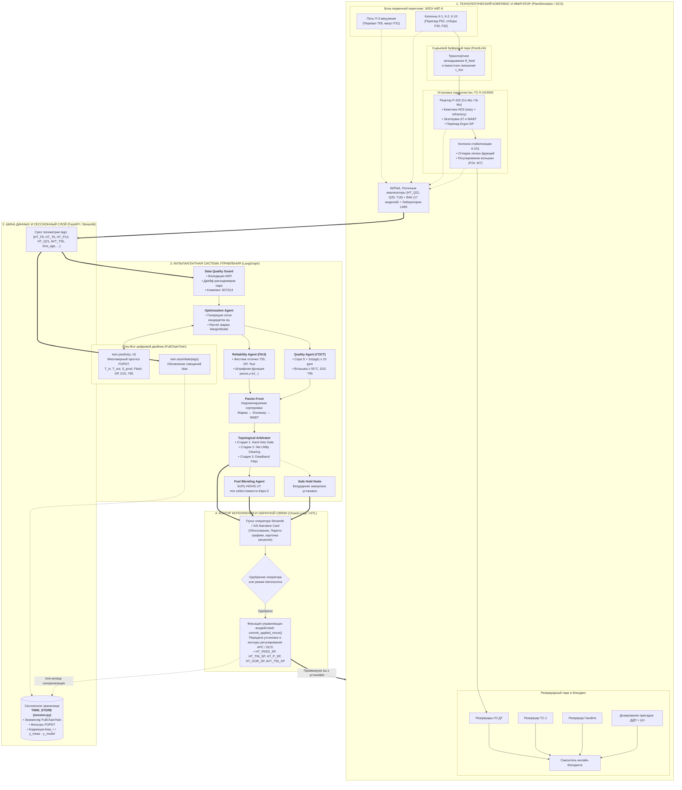

Searched for files: *
Searched for files
Searched for files: *
Searched for files: *
Listed directory twin
Listed directory src
Listed directory xai
Searched for "StateGraph"
Viewed graph.py:1-105
Searched for "build_mvp_graph"
Viewed main.py:1-150
Viewed replay_scenarios.py:1-100
Viewed replay_scenarios.py:101-219
Viewed plant.py:1-68
Viewed chain.py:1-150
Viewed chain.py:151-250
Viewed chain.py:251-395
Viewed optimization.py:1-120
Viewed auditors.py:1-100
Viewed auditors.py:170-250
Viewed auditors.py:350-444
Viewed pareto.py:1-100
Viewed arbitration.py:1-110
Viewed blending.py:1-75
Viewed data_guard.py:1-60
Viewed safe_hold.py:1-45
Viewed session.py:1-85
Viewed feed_link.py:1-60
Viewed kinetics.py:1-60
Viewed stabilizer.py:1-44
Viewed vak.py:1-60
Viewed whats_done.md:1-91

В вашем репозитории архитектура мультиагентного управления построена на базе **LangGraph** ([`src/agents/graph.py`](file:///Users/egork/Desktop/neftekod-hackathon/src/agents/graph.py)) и работает в замкнутом контуре с гибридным цифровым двойником сквозной цепочки ([`src/twin/chain.py`](file:///Users/egork/Desktop/neftekod-hackathon/src/twin/chain.py)) и имитатором установки ([`src/twin/plant.py`](file:///Users/egork/Desktop/neftekod-hackathon/src/twin/plant.py)).

Ниже представлены две подробные диаграммы:
1. **Топология графа вычислений LangGraph** (узлы, Fan-Out/Fan-In, условные роутеры, состояние `MasGraphState`).
2. **Сквозная схема взаимодействия агентов, цифрового двойника и физических установок** (ЭЛОУ-АВТ-6 $\to$ 24-2000 $\to$ Блендинг $\to$ Замкнутый контур HITL).

---

### 1. Архитектура графа LangGraph (`src/agents/graph.py`)

Граф реализует детерминированный цикл управления с упреждающим моделированием (rollout) и многокритериальным двухстадийным арбитражем.

```mermaid
flowchart TD
    %% Стилизация узлов
    classDef entry fill:#1e293b,stroke:#94a3b8,stroke-width:2px,color:#fff;
    classDef guard fill:#0284c7,stroke:#38bdf8,stroke-width:2px,color:#fff;
    classDef opt fill:#6366f1,stroke:#818cf8,stroke-width:2px,color:#fff;
    classDef audit fill:#d97706,stroke:#fbbf24,stroke-width:2px,color:#fff;
    classDef pareto fill:#8b5cf6,stroke:#a78bfa,stroke-width:2px,color:#fff;
    classDef arb fill:#059669,stroke:#34d399,stroke-width:2px,color:#fff;
    classDef blend fill:#0d9488,stroke:#2dd4bf,stroke-width:2px,color:#fff;
    classDef safe fill:#dc2626,stroke:#f87171,stroke-width:2px,color:#fff;
    classDef endNode fill:#334155,stroke:#64748b,stroke-width:2px,color:#fff;

    Start([Вход: Telemetry & LIMS]):::entry --> data_guard[<b>Data Quality Guard</b><br/>node_data_quality_guard]:::guard

    %% Проверка КИПиА и LIMS
    data_guard --> router_guard{route_after_guard<br/>Валидность КИП<br/>и возраст LIMS}

    router_guard -- "is_valid == False<br/>(клампинг 307/313, NaN, LIMS > 24ч)" --> safe_hold[<b>Safe Hold</b><br/>node_safe_hold<br/>Безударное удержание &#91;Δu = ∅&#93;]:::safe
    router_guard -- "is_valid == True<br/>(данные достоверны)" --> optimization[<b>Optimization Agent</b><br/>node_optimization<br/>Rollout FullChainTwin на H шагов]:::opt

    %% Fan-Out к параллельным аудиторам
    optimization -->|Канал кандидатов u_i| reliability_agent[<b>Reliability Agent</b><br/>node_reliability_agent<br/>Аудит ПАЗ/ESD и лог-барьеры]:::audit
    optimization -->|Канал кандидатов u_i| quality_agent[<b>Quality Agent</b><br/>node_quality_agent<br/>Аудит ГОСТ 32511-2013 Евро-5]:::audit

    %% Fan-In слияние в Парето-анализ
    reliability_agent -->|Hard-Veto & штрафы риска| pareto[<b>Pareto Analysis</b><br/>node_pareto<br/>Парето-фронт: Маржа ↔ Giveaway ↔ WABT]:::pareto
    quality_agent -->|Hard-Veto & требования| pareto

    %% Переход к арбитражу
    pareto --> arbitration[<b>Topological Arbitrator</b><br/>node_arbitration<br/>Двухстадийный гибридный арбитраж]:::arb

    %% Условный роутер арбитража
    arbitration --> router_arb{route_after_arbitration<br/>Статус решения}

    router_arb -- "SAFE_HOLD_*<br/>(тотальное вето / пустая допустимая зона)" --> safe_hold
    router_arb -- "DEADBAND_*<br/>(ΔМаржа < 1000 руб/ч или ||Δu|| < 0.05)" --> EndNode([END: Уставки сохранены]):::endNode
    router_arb -- "SUCCESS / SUCCESS_CORRECTIVE<br/>(одобрено изменение уставок)" --> blending[<b>Fuel Blending Agent</b><br/>node_blending_agent<br/>LP-оптимизация смешения HiGHS]:::blend

    %% Завершение
    safe_hold --> EndNode
    blending --> EndNode
```

#### Логика и контракты состояния (`MasGraphState`):
1. **`data_guard`** ([`src/agents/data_guard.py`](file:///Users/egork/Desktop/neftekod-hackathon/src/agents/data_guard.py)): срезает дрейф расходомеров пара $F_5, F_{26}$, выявляет насыщение/клампинг АЦП ($307.0, 313.0$), оценивает возраст лабораторного анализа $\text{age}_{\text{LIMS}}$. При отказе критичного КИП срабатывает защитный барьер в `safe_hold`.
2. **`optimization`** ([`src/agents/optimization.py`](file:///Users/egork/Desktop/neftekod-hackathon/src/agents/optimization.py)): берет сессионный двойник из `TWIN_STORE`, делает упреждающий прогноз (rollout) на горизонт $H$ (от 6 до 48 шагов) по сетке кандидатов $\Delta \mathbf{u}$ (`HT_FEED_SP`, `HT_TIN_SP`, `HT_P_SP`, `HT_GOR_SP`, `AVT_T55_SP`) и считает валовую маржу ($\Delta \text{Margin}$) через `MarginModel`.
3. **Параллельный Fan-Out `[reliability_agent, quality_agent]`** ([`src/agents/auditors.py`](file:///Users/egork/Desktop/neftekod-hackathon/src/agents/auditors.py)):
   - **Reliability (ПАЗ)**: проверяет жесткие барьеры печи $\text{AVT\_T55} \le 386.4$ °C, перепада реактора $\text{HT\_DP\_KPA} \le 454.5$ кПа, температуры выхода $\text{HT\_T\_OUT} \le 390$ °C, расхода мазута $\text{AVT\_F31} \ge 362.5$ т/ч. В предкритической зоне начисляет лог-барьер риска $-\mu \ln(\dots)$.
   - **Quality (ГОСТ)**: проверяет соответствие Евро-5 со статистическим запасом по правилу $\hat{S} + 2\sigma_S(\text{age}) \le 10.0$ ppm, температуру вспышки $\ge 55$ °C, плотность и выполнимость блендинга по $T95 \le 360$ °C.
4. **Fan-In в `pareto`** ([`src/agents/pareto.py`](file:///Users/egork/Desktop/neftekod-hackathon/src/agents/pareto.py)): собирает вето и штрафы, исключает недопустимые варианты (Safety Ladder) и строит Парето-фронт по трем осям п. 6.5 ТЗ: $\max \text{Net Margin}$, $\min \text{Giveaway}$, $\min \text{WABT}$ (износ катализатора).
5. **`arbitration`** ([`src/agents/arbitration.py`](file:///Users/egork/Desktop/neftekod-hackathon/src/agents/arbitration.py)):
   - *Стадия 1 (Hard-Veto Gate)*: если кондиционных ходов нет $\to$ Safe Hold. Если исходный режим $hold$ не кондиционен $\to$ аварийная коррекция `SUCCESS_CORRECTIVE` без порога deadband.
   - *Стадия 2 (Economic Clearing)*: выбор $\arg\max (\Delta \text{Margin} - \text{Risk Penalty})$.
   - *Стадия 3 (Deadband Filter)*: защита исполнительных механизмов (порог выигрыша $1000$ руб/ч и порог шага $\|\Delta \mathbf{u}\| \ge 0.05$).
6. **`blending`** ([`src/agents/blending.py`](file:///Users/egork/Desktop/neftekod-hackathon/src/agents/blending.py)): запускает симплекс-метод SciPy HiGHS LP для товарных резервуаров (ГО ДТ + ТС-1 + тяжелый газойль + присадки ДДП/ЦЧ), контролируя блокировку разбавления некондиционного сырья (Dilution Loophole).

---

### 2. Сквозное взаимодействие: Агенты ↔ Цифровой двойник ↔ Имитаторы установок

На этой схеме показано, как связаны реальные/смоделированные технологические блоки (ЭЛОУ-АВТ-6, сырьевой парк, Л-24/2000, товарный парк) с агентами LangGraph и сессионным хранилищем цифрового двойника.

---

### Ключевые принципы взаимодействия:

1. **Изоляция физической динамики от алгоритмического дребезга**:
   - `PlantSimulator` моделирует установку с запаздываниями первого порядка (FOPDT) и транспортным лагом сырьевого парка ($\theta_{\text{feed}}$).
   - Для предотвращения расхождения состояний при каждом одобренном ходе вызывается метод `TWIN_STORE.commit_applied_move(session_id, delta_u)`. Это гарантирует, что внутренние фильтры двойника и реальный объект не накапливают интегральную ошибку (anti-windup).
2. **Адаптация к редким данным LIMS (Assimilate & Bias Decay)**:
   - Анализы LIMS поступают редко (раз в 4–12 часов), а поточные КИПиА могут шуметь.
   - Двойник рассчитывает вектор смещений $\text{bias}_i = y_{\text{meas}} - y_{\text{model}}$ по цепочке приоритетов: `LIMS -> Поточные анализаторы (HT_Q21) -> ВАК`.
   - В узле `QualityAgent` при устаревании LIMS защитный интервал расширяется: $\sigma_S(\text{age}) = \sigma_{S0} \sqrt{1 + \text{age} / 12.0}$, автоматически отодвигая рабочую точку от границы ГОСТ.
3. **Строгая иерархия целей (Safety Ladder)**:
   - Никакая экономическая выгода не может обойти вето ПАЗ (`ReliabilityAgent`) или ГОСТ (`QualityAgent`). Ветированные кандидаты полностью исключаются до формирования Парето-фронта и шага максимизации полезности.