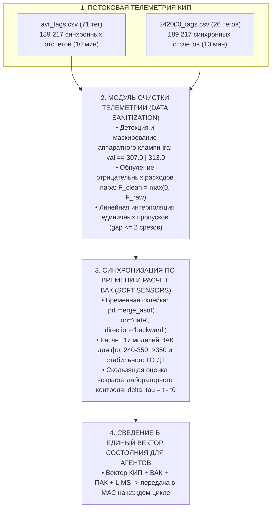
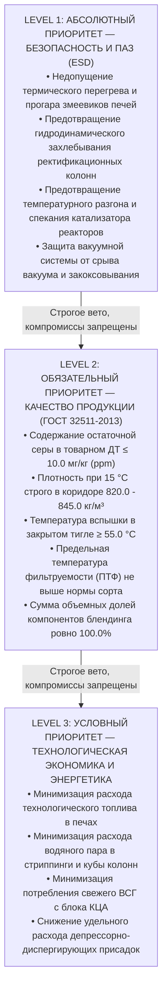
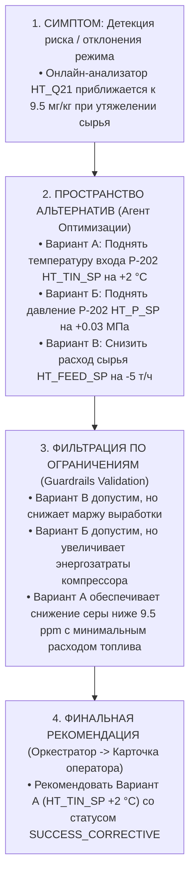

# Техническое задание для участников хакатона «Нефтекод»
**Разработка мультиагентной системы (МАС) для управления производством дизельного топлива в концепции «Dark Factory»**

---

## Раздел 1. Введение и общие положения

### 1.1. Контекст хакатона и индустриальные партнеры
Хакатон «Нефтекод 2026» организован Межотраслевым комитетом по MES, Университетом ИТМО (ITMO.Hack) и ПАО «Газпром нефть» (в рамках Лиги вузов и Акселератора цифровых инноваций — Digital Downstream Accelerator). Проект реализуется на стыке современных методов искусственного интеллекта, систем поддержки принятия решений (СППР), мультиагентных систем (МАС) и автоматизации сложных непрерывных технологических процессов нефтепереработки уровня MES / L3.

Главная цель соревнования — создание прототипа распределенной мультиагентной системы, способной в режиме реального времени анализировать состояние технологического процесса, координировать работу установок непрерывного цикла, определять оптимальные режимы их функционирования и формировать безопасные, экономически обоснованные и объяснимые рекомендации для персонала.

### 1.2. Парадигма «Dark Factory» («Безлюдное производство»)
В современной нефтепереработке концепция **«Dark Factory»** (полностью автономное производство) предполагает переход от реактивного ручного управления установками к предиктивно-оптимизационному контуру, в котором:
1. **Оперативное управление** передается ансамблю интеллектуальных программных агентов, каждый из которых специализируется на своей функциональной области (качество, надежность, технологическая эффективность, балансировка).
2. **Человек в контуре управления** (инженер Центра управления производством — ЦУП, старший оператор технологической установки) переходит из роли непрерывного регулятора в роль валидатора и супервизора стратегических решений.
3. **Безопасность и безаварийность** гарантируются детерминированными и физически верифицированными цифровыми барьерами (противоаварийная автоматическая защита — ПАЗ / ESD), исключающими принятие алгоритмами опасных решений даже при сбоях датчиков или нестационарности сырья.

### 1.3. Ключевые вехи разработки (10 этапов решения)
Для успешного выполнения проекта участникам необходимо реализовать 10 ключевых проектных этапов:
1. **01. Доменный анализ**: Изучить физико-химические основы перегонки нефти, гидроочистки и смешения дизельных топлив, выявить взаимосвязи параметров и критические возмущающие факторы.
2. **02. Проектирование архитектуры МАС**: Определить состав интеллектуальных агентов, их специализацию, границы полномочий, топологию и протоколы межсетевого обмена.
3. **03. Создание имитационной среды**: Разработать или настроить программный симулятор (цифровой двойник), позволяющий рассчитывать материальные и тепловые балансы и тестировать гипотезы без риска для реального производства.
4. **04. Программная реализация агентов**: Запрограммировать алгоритмы агентов (фильтрация КИП, расчет виртуальных анализаторов качества ВАК, детекция аномалий оборудования, расчет управляющих уставок).
5. **05. Многокритериальная оптимизация**: Обеспечить согласованное взаимодействие агентов для нахождения оптимума по 4 ключевым осям: *Качество $\times$ Энергия $\times$ Надежность $\times$ Производительность*.
6. **06. Механизм формирования рекомендаций**: Сформировать структурированный модуль выдачи уставок (температурные переделы, расходы сырья и газов, расходы циркуляционных орошений, дозировки компонентов и присадок).
7. **07. Explainable AI (XAI) и визуализация**: Разработать интуитивный дашборд оператора ЦУП, визуализирующий граф принятия решений и физико-химические причины каждой рекомендации.
8. **08. Бенчмаркинг архитектурных топологий**: Провести сравнительный анализ как минимум двух топологий МАС (централизованная иерархическая против децентрализованной рыночной/аукционной).
9. **09. Промежуточная защита**: Представить концепт, архитектуру и первичные результаты работы симулятора экспертному жюри.
10. **10. Финальная демонстрация**: Представить полностью интегрированный прототип, успешно отрабатывающий как нормальные режимы, так и предаварийные и дефицитные сценарии.

### 1.4. Официальные разъяснения оргкомитета и экспертные ответы (Q&A Session)

По итогам установочной сессии вопросов и ответов (Q&A) с экспертами хакатона и представителями оргкомитета зафиксированы следующие обязательные и рекомендательные положения для участников:

#### Таблица 1.1: Сводная матрица разъяснений Q&A оргкомитета (по материалам QA.txt)
| №     | Тезис / Ответ экспертов (из `QA.txt`)                                                                            | Технологический и архитектурный смысл                                                                                                                                                                                                                                                                                                         | Инженерное руководство для команд                                                                                                                                                                                                                                                                               |
| :---- | :--------------------------------------------------------------------------------------------------------------- | :-------------------------------------------------------------------------------------------------------------------------------------------------------------------------------------------------------------------------------------------------------------------------------------------------------------------------------------------- | :-------------------------------------------------------------------------------------------------------------------------------------------------------------------------------------------------------------------------------------------------------------------------------------------------------------- |
| **2** | *«Нет необходимости использовать только ml llm»*                                                                 | Категорический отказ от искусственного навязывания чистого ML/LLM во всех узлах МАС. Детерминированная физика, материальные балансы и классическая математическая оптимизация являются приоритетными.                                                                                                                                         | Агенты могут и должны быть гибридными: расчет ВАК, термодинамики и фильтров ПАЗ строится на уравнениях и детерминированных алгоритмах (LP/MILP, MPC, SciPy, Scikit-learn), а LLM применяется там, где она наиболее сильна — семантическая оркестрация, интерпретация контекста и формирование объяснений (XAI). |
| **3** | *«Содержание серы в среде гидроочистки и в продукте гидроочищенного дизельного топлива очень слабо коррелируют»* | На установках глубокой гидроочистки (Евро-5, $\le 10$ мг/кг) конверсия серы превышает 99.5%. Остаточная сера определяется не входной концентрацией, а жесткостью режима реактора (температурным профилем WABT, парциальным давлением водорода, кратностью ВСГ/сырье) и кинетикой трудноудаляемых соединений (дибензотиофенов).                | Не строить примитивные линейные регрессии вида «сера сырья $\rightarrow$ сера продукта». Модели ВАК и Агент Качества обязаны учитывать управляющие режимные параметры (температуры слоев реакторов $HT_T5, HT_T6, HT_T11$, расходы ВСГ $HT_F2$ и квенча $HT_F14$).                                                   |
| **4** | *«Увеличение серы в среде гидроочистки может повлиять на энергозатраты»*                                         | Рост концентрации сернистых соединений в реакционной среде требует повышения жесткости гидрогенизационного процесса для удержания качества $\le 10$ мг/кг: рост температуры на входе в реакторы (повышенный расход топливного газа в печи), увеличение расхода и циркуляции ВСГ, а также дополнительный расход пара в отпарной колонне К-201. | Агент Оптимизации обязан учитывать сернистость сырья в целевой функции минимизации энергозатрат ($OPEX$). При тяжелом сырье экономически эффективнее координировать отбор фракций на АВТ, чем перегружать печи гидроочистки.                                                                                    |
| **5** | *«Максимально держаться к ограничению 10 ppm по сере, но не нарушать его»*                                       | Стратегия минимизации «запаса качества» (Quality Giveaway Minimization). Избыточная гидроочистка (получение серы 1–2 мг/кг вместо целевых 8–9.5 мг/кг) экономически нецелесообразна: она ведет к перерасходу водорода, топлива в печах и ускоренной дезактивации катализатора.                                                                | Целевой диапазон управления по сере — безопасный предпредельный коридор (например, 8.5–9.5 мг/кг с вероятностью превышения $P(S > 10.0) \le 0.001$). Держаться близко к 10 мг/кг, но ни при каких обстоятельствах не нарушать спецификацию ГОСТ.                                                                |

---

## Раздел 2. Постановка задачи

### 2.1. Технологическая цепочка производства товарного дизельного топлива
Производство товарного дизельного топлива стандарта Евро-5 (ГОСТ 32511-2013 / EN 590) рассматривается как жестко связанная единая технологическая цепочка трех последовательных стадий:

$$\text{ЭЛОУ-АВТ-6 (Первичная переработка)} \longrightarrow \text{Установка 24-2000 (Гидроочистка ГО)} \longrightarrow \text{Товарный парк (Блендинг / Компаундирование)}$$

1. **Блок первичной перегонки нефти (ЭЛОУ-АВТ-6)**:
   - Обессоленная и обезвоженная нефть разделяется в сложной системе ректификационных колонн (отбензинивающая колонна К-1, сложная атмосферная колонна К-2 со стриппингами К-6, К-7, К-9 и вакуумная колонна К-10).
   - Выделяются прямогонные дизельные фракции: легкая фракция 240–290 °C, средняя/тяжелая фракция 290–350 °C, а также смежная керосиновая фракция 150–250 °C и вакуумный газойль (ВГО) 350–500 °C.
   - Изменение теплового режима колонны К-2, расходов циркуляционных орошений (1-е, 2-е, 3-е ЦО) и отбора боковых погонов напрямую определяет фракционный состав (Т50, Т95, конец кипения), плотность и низкотемпературные свойства (ПТФ, температура помутнения) дистиллятов, направляемых далее на облагораживание.

2. **Блок каталитической гидроочистки (Установка 24-2000)**:
   - Смесевое дизельное сырье смешивается с циркулирующим водородсодержащим газом (ВСГ), нагревается в печи и поступает в реакторы гидроочистки Р-201 и Р-202 со стационарным слоем никель-молибденового (Ni-Mo) или кобальт-молибденового (Co-Mo) катализатора.
   - В реакторах протекают экзотермические реакции гидродесульфуризации (глубокое удаление сероорганических соединений до уровня $\le 10$ мг/кг), гидрирования непредельных углеводородов и частичного гидродеароматизирования.
   - Температурный профиль реактора контролируется подачей холодного водородного квенча (`HT_F14`; тег `HT_F15` в телеметрии обозначает объемный расход сырья).
   - Продукты реакции разделяются в сепараторах высокого и низкого давления (С-201, С-205) и стабилизируются в отпарной колонне К-201 с удалением отдувочного газа, сероводорода и бензина отгонки. На выходе формируется стабильный компонент гидроочищенного дизельного топлива (ГО ДТ).

3. **Блок компаундирования (Смешение / Блендинг из резервуаров)**:
   - Товарное дизельное топливо требуемого сорта (базовый демисезонный сорт E, ПТФ $\le -15$ °C по ГОСТ 32511-2013) производится смешением из резервуаров 3 компонентов (стабильный гидроочищенный дизель ГО ДТ, гидроочищенный керосин, гидроочищенный газойль) с учетом складских остатков и дозированием 2 функциональных присадок: присадки A (депрессорно-диспергирующей для ПТФ, до 1.5 кг/т) и присадки B (цетаноповышающей для ЦЧ, до 1.5 кг/т).
   - Задача блендинга — строго уложиться во все нормативные показатели ГОСТ при минимальной себестоимости смеси, с балансировкой серы строго по массе: $\sum v_c 
ho_c (S_c - S_{max}) \le 0$.

### 2.2. Бизнес-цели и оптимизационные критерии (Что оптимизируем)
Мультиагентная система должна находить наилучший технологический режим с учетом многокритериальной целевой функции:
1. **Безусловное выполнение спецификации качества (Zero-Defect)**: Содержание остаточной серы не более 10.0 мг/кг, плотность при 15 °C строго в интервале 820.0–845.0 кг/м³, температура вспышки в закрытом тигле не ниже 55.0 °C, предельная температура фильтруемости (ПТФ) не выше нормативной для заданного сорта (например, не выше -5 °C для сорта C и не выше -26 °C для зимнего класса 1), фракционный состав (Т95 не выше 360.0 °C).
   > **Важно (из разъяснений оргкомитета — стратегия минимизации Giveaway по сере)**:  
   > Мультиагентная система должна стремиться максимально приблизиться к верхнему нормативному ограничению **10.0 мг/кг (ppm)** по сере, но строго не нарушать его. Слишком глубокая переочистка (выход на 1–2 мг/кг) является экономической неэффективностью («giveaway» качества), так как требует избыточного расхода дорогостоящего водорода, повышенного сжигания топлива в печах и ускоряет дезактивацию катализатора. Оптимальная рабочая область лежит в предпредельном коридоре (например, 8.5–9.5 мг/кг) с жестким статистическим барьером безаварийности ($P(S > 10.0) \to 0$).
2. **Максимизация объемов выработки товарного топлива**: Оптимизация отбора дизельных дистиллятов на АВТ и предотвращение необоснованного снижения нагрузки установок.
3. **Минимизация энергозатрат и операционных расходов (OPEX)**:
   - Снижение расхода технологического топлива в печи П-3 (вакуумный блок АВТ, подогрев мазута К-2) и печи гидроочистки.
   - Минимизация потребления водяного пара в отпарных колоннах (К-1, К-2, К-6, К-7, К-9, К-201).
   - Минимизация расхода свежего ВСГ высокой чистоты с блока короткоцикловой адсорбции (КЦА).
   - Минимизация дозировки дорогостоящих депрессорно-диспергирующих и промоторов воспламенения (присадок).
   > **Важно (из разъяснений оргкомитета — энергозатраты и сера в среде гидроочистки)**:  
   > Увеличение содержания серы в реакционной среде гидроочистки напрямую повышает энергозатраты установки: для удержания качества $\le 10$ мг/кг требуется повышать температуру на входе в реакторы (рост расхода топливного газа в печи), увеличивать циркуляцию ВСГ (нагрузка на компрессор ЦК-201) и подачу пара на отпарку К-201. Агент Оптимизации должен учитывать эту нелинейную связь при балансировке между отбором фракций на АВТ и режимом гидроочистки.
4. **Контроль тяжести режима и сохранение ресурса оборудования**: Минимизация термического перегрева перевалов печей, предотвращение закоксовывания змеевиков, предупреждение гидравлического захлебывания колонн, предотвращение быстрой дезактивации катализатора гидроочистки вследствие локальных перегревов (hot spots) или запредельного роста перепада давления по слою.

### 2.3. Логика одного цикла принятия решения (8-шаговый цикл)
Каждый дискретный шаг управления МАС (рекомендуемый квант времени — 10 минут) выполняется строго по следующему 8-шаговому циклу:
1. **Получение актуального состояния процесса**: Считывание векторов технологической телеметрии КИП с АВТ-6 и 24-2000, последних данных лабораторных анализов ЛИМС и непрерывных показаний поточных анализаторов ПАК.
2. **Проверка полноты, актуальности и согласованности данных**: Фильтрация аппаратных артефактов (клампингов шкалы, дрейфа нуля, константных заглушек), вычисление возраста последнего лабораторного замера $\Delta \tau_{\text{LIMS}}$, проверка динамической непротиворечивости датчиков.
3. **Оценка текущего и прогнозного качества продукта**: Расчет всех 17 виртуальных анализаторов качества (ВАК), вычисление прогнозного отклонения от спецификации ГОСТ и вероятности выхода за допустимые пределы (вероятность оффспека).
4. **Оценка тяжести режима и рисков для оборудования**: Проверка гидравлического сопротивления насадок и перепада давления на реакторах, температур стенок печей, запаса до кавитации насосов.
5. **Генерация candidate-сценариев управления**: Формирование пространства допустимых изменений управляющих воздействий (температуры верха/куба, расходы орошений, расходы квенча, соотношения потоков блендинга).
6. **Отсечение недопустимых вариантов (Hard Constraint Filtering)**: Мгновенное исключение любых сценариев, нарушающих границы противоаварийной защиты (ПАЗ) или спецификацию по сере и качеству.
7. **Многокритериальное ранжирование допустимых вариантов**: Сравнение оставшихся безопасных вариантов на основе Парето-селекции или взвешенной функции полезности (баланс маржи, энергозатрат и ресурса катализатора).
8. **Формирование рекомендации и генерация объяснения (XAI)**: Выдача оператору ЦУП конкретного набора уставок с указанием физической причины, ожидаемого экономического эффекта и подтверждением безопасности. При невозможности найти безопасное решение — активация протокола мотивированного отказа от выдачи управляющих воздействий.

### 2.4. Выбор кандидатных управляющих воздействий

Не каждый измеряемый тег телеметрии является управляемым. Команда должна выбрать ограниченный набор параметров, которые использует как кандидатные управляющие воздействия, и обосновать выбор по технологическим материалам и справочнику.

В модели могут рассматриваться, например:
- Температурные режимы и расходы на стадиях первичной перегонки АВТ (уставки верха К-2, отборы боковых погонов, расходы циркуляционных орошений);
- Режимные параметры гидроочистки (температура реакторов Р-201/Р-202, соотношение циркулирующий ВСГ / сырье, расход охлаждающего квенча `HT_F14`);
- Рецептура блендинга (доли компонентов смешения в товарном парке) и дозировка функциональных присадок (депрессорно-диспергирующих, цетаноповышающих) —
исключительно в той части, которая подтверждается выданными материалами, справочником тегов и выбранной постановкой задачи.

> ### 🛑 Ключевой принцип управления
> Качество и жёсткие технологические ограничения имеют безусловный приоритет над экономическим эффектом. Недопустимый режим нельзя «компенсировать» более высокой производительностью, снижением расхода пара или меньшими затратами топлива.

---

## Раздел 3. Данные, которые получает команда

В распоряжение команд предоставляется комплексный инженерный пакет данных, включающий синхронную телеметрию АСУТП технологических установок, результаты дискретных лабораторных анализов LIMS, непрерывные данные поточных аналитических приборов, справочник тегов и технологические описания процессов.

### 3.1. Общий перечень и состав файлов данных

#### Таблица 1: Источники исходных данных пакета
| Источник данных | Формат и объем | Технологическое содержание и особенности |
| :--- | :--- | :--- |
| `avt_tags.csv` | CSV-файл (189 217 строк, 71 КИП-параметр) | Синхронные 10-минутные временные ряды параметров установки ЭЛОУ-АВТ-6 за период 01.01.2023 – 07.08.2026. Включает температуры, давления, расходы сырья, отборов и орошений, уровни в колоннах. |
| `242000_tags.csv` | CSV-файл (189 217 строк, 26 КИП-параметров) | Синхронные 10-минутные временные ряды технологических параметров установки гидроочистки 24-2000 за тот же период. Содержит параметры реакторного блока, контура циркуляции ВСГ и блока стабилизации. |
| `ЛИМСы 01.01.2023 - н.в_ (2).xlsx` | Excel-книга (многостраничная) | Результаты контрольных лабораторных анализов по точкам отбора проб дизельных фракций АВТ и гидроочищенного ДТ. Замеры редкие (от 12 ч до нескольких суток), высокоточные, асинхронные. |
| `Выгрузка ПАК 01.01.2023 - н.в_.xlsx` | Excel-книга (10-минутные отсчеты) | Данные промышленных поточных анализаторов качества: общая сера в ГО ДТ (с 01.01.2023) и поточная расчетная плотность при 15 °C (с 05.03.2025). |
| `Теги_хакатон.xlsx` | Excel-книга (4 листа: ЛА, ВАК, ПАК, КИП) | Официальный нормативный справочник сигналов, математических моделей виртуальных анализаторов, лабораторных методик и датчиков КИП. |
| Технологические регламенты и P&ID схемы | PDF / графические материалы | Структурные схемы материальных потоков ЭЛОУ-АВТ-6, гидроочистки 24-2000 и узла компаундирования товарных дизельных топлив. |

---

### 3.2. Особые технологические указания и предупреждения по данным

> ### ⚠️ Callout Box 1: Лаг лабораторных данных (LIMS) и практическая подсказка по телеметрии
> **Лаг лабораторных анализов и необходимость ВАК**:  
> Лабораторные анализы (ЛИМС) отражают физико-химические свойства продукта с существенным временным запаздыванием: время отбора пробы, ее транспортировка в центральную заводскую лабораторию (ЦЗЛ), пробоподготовка и выполнение испытаний на стандартном лабораторном оборудовании (ASTM / ГОСТ) занимают от 2 до 8 часов. К моменту внесения результата в систему LIMS технологический режим колонн или реакторов может измениться. В связи с этим прямое использование ЛИМС в качестве мгновенной обратной связи в замкнутом контуре управления недопустимо. Для компенсации временного лага мультиагентная система обязана непрерывно рассчитывать виртуальные анализаторы качества (ВАК), используя последние подтвержденные точки ЛИМС для устранения систематического дрейфа (bias update).  
> **Свойства временных рядов**:  
> Файлы `avt_tags.csv` и `242000_tags.csv` содержат синхронные 10-минутные ряды (ровно 189 217 временных срезов с 01.01.2023 00:00 по 07.08.2026 23:50). Столбцы вида `Unnamed: ...` представляют собой служебные индексы выгрузки из historian; единственным достоверным ключом объединения и синхронизации всех источников является временная метка `date` (ISO-формат `YYYY-MM-DD HH:MM:SS`). Категорически запрещено слияние таблиц по порядковому номеру строки.

---

> ### ⚠️ Callout Box 2: Особенности телеметрии КИП (Аппаратный клампинг, дрейф нуля и аномалии)
> При проведении первичного разведочного анализа данных (EDA) участники столкнутся с промышленными артефактами телеметрии АСУТП, которые программные агенты обязаны распознавать и обрабатывать:
> 1. **Аппаратный клампинг и разделение на критичные/некритичные теги**:
>    - Датчик плотности нефти `AVT_D10` зафиксирован на константном значении `307.0` в 99.99% строк датасета. Поскольку он не используется моделями управления, клампинг `AVT_D10` классифицируется как **некритичный** и не должен приводить к ложному Safe Hold.
>    - Критический набор тегов: $\text{CRITICAL\_TAGS} = \{\text{AVT\_P52}, \text{AVT\_T55}, \text{HT\_F9}, \text{HT\_T6}, \text{HT\_T11}, \text{HT\_P13}, \text{HT\_F2}, \text{HT\_P8}\}$. Только клампинг (307.0 / 313.0) или NaN присутствующих критических тегов переводит систему в `SAFE_HOLD_REFUSAL`.
> 2. **Коллизии имен тегов двух установок (канонические префиксы)**:
>    - В архивах 8 тегов имеют одинаковые буквенно-цифровые обозначения на АВТ и 24-2000: `T6, F9, T11, F14, T18, F19, F25, F26`. Смешивание их в плоском словаре недопустимо! Все теги строго разделяются префиксами:
>      - `AVT_T6` — температура куба К-1; `HT_T6` — температура ГСС на входе в Р-202;
>      - `AVT_F9` — расход нефти (2-й ход); `HT_F9` — массовый расход сырья 24-2000 (т/ч);
>      - `AVT_F26` — расход пара в стриппинг К-6; `HT_F26` — объемный расход ГО ДТ в цех №8 (м³/ч);
>      - `AVT_T18` — температура 1-го ЦО К-2; `HT_T18` — ВАК температуры вспышки ГО ДТ;
>      - `AVT_F14` — расход 1-го ЦО К-2; `HT_F14` — расход квенча в реактор Р-202.
> 3. **Исправление смысловых и физических ошибок реестра тегов 24-2000**:
>    - `HT_W10` — это **массовый расход бензина с установки (т/ч)**, а не перепад давления!
>    - `HT_P8` — это **перепад давления на слое катализатора реактора Р-202 (МПа / кПа)**.
>    - `HT_F15` — это объемный расход сырья (м³/ч, значение ~3400 при F9=220 т/ч, расхождение по единицам). Реальный холодный квенч реактора — это `HT_F14` (т/ч).
>    - `HT_Q20` и `HT_Q21` — это поточные анализаторы общей серы на входе в установку и в товарном ГО ДТ соответственно (ppm). Тег `HT_W7` — это массовый расход газа поддува К-201 (т/ч), а не анализатор серы.
> 4. **Дрейф нуля расходомеров пара**:
>    - Теги расходов пара `AVT_F5` (низ К-1) и `AVT_F26` (в К-6) имеют дрейф нуля при закрытой арматуре. Перед передачей в модели и балансы применяется отсечка: $F_{\text{clean}} = \max(0.0, F_{\text{raw}})$.
> 5. **Фракции дизеля на АВТ**:
>    - `AVT_F30` — тяжелая дизельная фракция 290–350 °C (128.3 т/ч);
>    - `AVT_F32` — легкая дизельная фракция 240–290 °C (81.6 т/ч).
---

### 3.3. Регламентные правила работы с источниками качества
При обработке и интеграции данных качества мультиагентная система должна строго следовать пяти правилам:
1. **Абсолютный приоритет контрольного факта (LIMS Priority Rule)**:  
   Иерархия доверия к показателям качества имеет вид:
   $$\text{ЛИМС (Лабораторный арбитраж)} \succ \text{ПАК (Поточный анализатор)} \succ \text{ВАК (Расчетный Soft Sensor)}$$
   Если результаты измерений расходятся, значение из LIMS принимается за безусловную истину. Показания ПАК используются для оперативного слежения за трендом в реальном времени, а ВАК — для безынерционного прогнозирования параметров, не охваченных поточными приборами.
2. **Синхронизация исключительно по астрономическому времени (`datetime`)**:  
   Сопоставление лабораторных анализов и показаний ПАК с минутной телеметрией КИП по номерам строк строго запрещено, так как частота отбора лабораторных проб неравномерна (шаг от 12 часов до нескольких суток).
3. **Непрерывный учет возраста анализа ($\Delta \tau$)**:  
   Для каждого показателя качества система должна вычислять динамический возраст измерения:
   $$\Delta \tau = t_{\text{current}} - t_{\text{sample\_timestamp}}$$
   По мере роста $\Delta \tau$ доверительный вес лабораторного анализа экспоненциально снижается, а вес модели ВАК с авторегрессионной поправкой увеличивается.
4. **Явный контроль и приведение физических единиц**:  
   Все давления должны быть нормализованы к единой шкале (МПа или кгс/см²), расходы приведены к м³/ч или т/ч с учетом плотности, а концентрации серы — к мг/кг (ppm). Любые пересчеты должны быть прозрачно задокументированы в программном коде.
5. **Верификация физического смысла тега по технологической схеме**:  
   Запрещено делать выводы о назначении параметра исключительно по буквенному префиксу. Каждый тег должен быть проверен по технологическому паспорту узла (колонна, печь, сепаратор, реактор).
6. **Учет слабой корреляции серы сырья и продукта ГО (Non-linear Kinetics Rule)**:  
   > **Важно (из разъяснений оргкомитета)**:  
   > Содержание серы в реакционной среде / сырье гидроочистки и остаточная сера в гидроочищенном дизельном топливе **очень слабо коррелируют между собой**. В условиях глубокого обессеривания (конверсия $>99.5\%$, стандарт Евро-5 $\le 10$ мг/кг) остаточная сера определяется не входной концентрацией в сырье, а кинетической жесткостью режима реакторов Р-201/202 (температурным профилем $T5, T6, T11$, кратностью циркуляции ВСГ $HT_F2$, расходом квенча $HT_F14$ и текущей активностью катализатора). Попытка построить ВАК или предиктивные модели остаточной серы через простую парную регрессию с серой входного сырья является методической ошибкой; алгоритмы обязаны учитывать ключевые режимные КИП-параметры реакторного блока.


### 3.4. Лист «ЛА» — Лабораторные анализы (LIMS)

Лист «ЛА» нормативного файла `Теги_хакатон.xlsx` специфицирует перечень физико-химических показателей качества, контролируемых заводской лабораторией в 6 ключевых точках технологической цепочки. Всего лист охватывает 56 записей анализов, соответствующих 14 уникальным показателям качества сырья, полупродуктов и товарного дизельного топлива.

#### Таблица 2: Спецификация точек отбора и контролируемых показателей листа «ЛА» (Verbatim)
| Установка 'АВТ'. Точка отбора '1'. Продукт 'ФРАКЦ_ДИЗ' | Установка 'АВТ'. Точка отбора '2'. Продукт 'Дизельное топливо' | Установка 'АВТ'. Точка отбора '2.1'. Продукт 'Дизельное топливо' | Установка 'АВТ'. Точка отбора '3'. Продукт 'Дизельное топливо' | Установка 'Гидроочистка'. Точка отбора '1'. Продукт 'ФРАКЦ_ДИЗ.' | Установка 'Гидроочистка'.. Точка отбора '2'. Продукт 'Дизельное топливо' |
| :--- | :--- | :--- | :--- | :--- | :--- |
| ПТФ | Т50% | Температура помутнения | Т90% | ПТФ | Температура помутнения |
| Т90% | Конец кипения | Конец кипения | Т50% | Т90% | Плотность при 15 °С |
| Т50% | Среднее плотность | Среднее плотность | ПТФ | Начало кипения | Температура вспышки |
| Температура помутнения до 350 | Температура помутнения | Т50% | Т95% | Т50% | ТНК |
| Конец кипения | Начало кипения | Начало кипения | Начало кипения | Т95% | ОДИС 250°С |
| Температура застывания | Т90% | Т90% | Конец кипения | Температура помутнения | Т98% |
| Среднее плотность | Т95% | Т95% | Температура помутнения | Конец кипения | МД серы |
| И-350 | — | — | Среднее плотность | Плотность при 15С | ПТФ |
| Температура помутнения | — | — | — | Среднее сера | Температура застывания |
| Температура помутнения до 350 | — | — | — | — | Т50% |
| Т95% | — | — | — | — | Цетановое число |
| Начало кипения | — | — | — | — | Т90% |
| — | — | — | — | — | ОДИС 350°С |

#### Таблица 2.1: Анализ технологического назначения точек отбора проб LIMS
| № | Столбец в ЛА | Установка | Точка отбора | Наименование в LIMS Excel | Число показателей | Технологическая роль потока в цепочке |
|---|---|---|---|---|---|---|
| 1 | Столбец 1 | ЭЛОУ-АВТ-6 | Точка 1 | `Установка 'АВТ'. Точка отбора '1'. Продукт 'ФРАКЦ_ДИЗ'` | 12 | Сырая тяжелая дизельная фракция с АВТ-6 (вывод из стриппингов К-7/К-9) |
| 2 | Столбец 2 | ЭЛОУ-АВТ-6 | Точка 2 | `Установка 'АВТ'. Точка отбора '2'. Продукт 'Дизельное топливо'` | 7 | Легкий дизельный дистиллят атмосферной колонны К-2 (фракция 240–290 °C) |
| 3 | Столбец 3 | ЭЛОУ-АВТ-6 | Точка 2.1 | `Установка 'АВТ'. Точка отбора '2.1'. Продукт 'Дизельное топливо'` | 7 | Утяжеленный дизельный дистиллят колонны К-2 (фракция 290–350 °C) |
| 4 | Столбец 4 | ЭЛОУ-АВТ-6 | Точка 3 | `Установка 'АВТ'. Точка отбора '3'. Продукт 'Дизельное топливо'` | 8 | Суммарная прямогонная дизельная фракция перед подачей в промежуточный парк |
| 5 | Столбец 5 | Гидроочистка 24-2000 | Точка 1 | `Установка 'Гидроочистка'. Точка отбора '1'. Продукт 'ФРАКЦ_ДИЗ.'` | 9 | Смесевое дизельное сырье на входе в реакторный блок 24-2000 (вход в Р-201) |
| 6 | Столбец 6 | Гидроочистка 24-2000 | Точка 2 | `Установка 'Гидроочистка'.. Точка отбора '2'. Продукт 'Дизельное топливо'` | 13 | Стабильный компонент гидроочищенного дизельного топлива Евро-5 с установки |

#### Таблица 3: Словарь показателей качества LIMS (LIMS Physical/Chemical Dictionary)
| Показатель качества | Код в файле LIMS | Стандарт / Метод | Физический смысл параметра | Ед. изм. | Исторический диапазон | Норматив ГОСТ 32511 / Евро-5 |
| :--- | :--- | :--- | :--- | :--- | :--- | :--- |
| **ПТФ (CFPP)** | `CFPP` / `FilterabilityLimit.T` | ГОСТ 22254 / EN 116 | Предельная температура фильтруемости на холодном фильтре | °C | -16.0 ... 0.0 | Сорт C: не выше -5 °C; Класс 1: не выше -26 °C |
| **ТНК (Начало кипения)** | `IBP.T` | ASTM D86 / ГОСТ 2177 | Температура выкипания первых капель дистиллята | °C | 149.0 ... 218.0 | Индикатор чистоты от бензиновых и лигроиновых фракций |
| **Т50%** | `50%.T` | ASTM D86 / ГОСТ 2177 | Температура перегонки 50% объема топлива (средняя испаряемость) | °C | 250.0 ... 305.0 | Определяет динамику испарения топлива в цилиндре двигателя |
| **Т90%** | `90%.T` | ASTM D86 / ГОСТ 2177 | Температура перегонки 90% объема топлива | °C | 279.0 ... 349.0 | Не выше 360.0 °C (предотвращение смолообразования и нагара) |
| **Т95%** | `95%.T` | ASTM D86 / ГОСТ 2177 | Температура перегонки 95% объема топлива | °C | 294.0 ... 350.0 | **Не выше 360.0 °C** (жесткий спецификационный предел) |
| **Т98%** | `98%.T` | ASTM D86 / ГОСТ 2177 | Температура перегонки 98% объема топлива | °C | 350.0 ... 370.0 | Контроль попадания тяжелых полициклических углеводородов |
| **Конец кипения (КК / EBP)** | `EBP.T` | ASTM D86 / ГОСТ 2177 | Температура окончания разгонки фракции | °C | 306.0 ... 386.0 | Предотвращение уноса компонентов мазута и вакуумного газойля |
| **Температура помутнения** | `CloudPoint` | ASTM D2500 / ГОСТ 5066 | Температура появления микрокристаллов твердых парафинов | °C | -30.0 ... +7.0 | Сорт C: не выше -5 °C; Сорт E: не выше -15 °C |
| **Температура помутнения до 350** | `CloudPoint_1` | ГОСТ 5066 | Температура помутнения дистиллятной части, выкипающей до 350 °C | °C | -7.0 ... +9.0 | Оценка запаса по низкотемпературным свойствам при компаундировании |
| **Температура застывания** | `PourPoint` | ASTM D97 / ГОСТ 20287 | Температура полной потери подвижности нефтепродукта | °C | -17.0 ... -5.0 | Регламентируется для условий трубопроводной транспортировки |
| **Плотность при 15 °С (D15)** | `D15` | ASTM D4052 / ГОСТ Р 51069 | Плотность топлива при нормативной температуре 15 °C | кг/м³ | 820.0 ... 856.0 | **820.0 – 845.0 кг/м³** (жесткий коридор ГОСТ 32511) |
| **ОДИС 350°С (И-350)** | `I350` | ASTM D86 / ГОСТ 2177 | Объемная доля топлива, перегоняемая при температуре до 350 °C | % об. | 85.0 ... 95.0 | **Не менее 85.0% об.** (жесткий норматив Евро-5) |
| **ОДИС 250°С** | `I250` | ASTM D86 / ГОСТ 2177 | Объемная доля топлива, перегоняемая при температуре до 250 °C | % об. | 15.0 ... 35.0 | **Менее 65.0% об.** (ограничение легких фракций Евро-5) |
| **Температура вспышки в закрытом тигле** | `FlashPoint` | ASTM D93 / ГОСТ 6356 | Температура вспышки паров топлива в приборе Пенски-Мартенса | °C | 40.0 ... 92.0 | **Не ниже 55.0 °C** (пожаробезопасность дизельных топлив) |
| **Массовая доля серы (ГО ДТ)** | `Mg.Sulfur` | ISO 20846 / ГОСТ 32139 | Концентрация общей остаточной серы в товарном ДТ | мг/кг (ppm) | 0.1 ... 20.0 | **Не более 10.0 мг/кг (ppm)** (Критический порог Евро-5 / ПАЗ) |
| **Массовая доля серы (Сырье ГО)** | `Mass.Sulfur` | ASTM D4294 / ГОСТ 32139 | Содержание общей серы в сырье гидроочистки | % масс. | 0.20 ... 1.06 | Определяет стехиометрическую потребность в водороде и режим |
| **Цетановое число** | `CetaneNumber` | ASTM D613 / ГОСТ 32508 | Мера воспламеняемости дизельного топлива в камере сгорания | ед. | 50.0 ... 57.8 | **Не менее 51.0 ед.** (стандарт Евро-5) |


### 3.5. Лист «ВАК» — Виртуальные анализаторы качества (Soft Sensors)

Лист «ВАК» содержит 17 многофакторных линейных и нелинейных регрессионных уравнений, связывающих непрерывные сигналы телеметрии КИП и контрольные замеры LIMS с ключевыми показателями качества дизельных потоков. Эти модели выступают основой безынерционного предиктивного мониторинга качества для Агента Качества МАС.

#### Таблица 4: Спецификация моделей виртуальных анализаторов листа «ВАК» (Verbatim)
| ЭЛОУ-АВТ-6. 240-350 (Тег) | ЭЛОУ-АВТ-6. 240-350 (Формула) | ЭЛОУ-АВТ-6. 350 (Тег) | ЭЛОУ-АВТ-6. 350 (Формула) | 24-2000. ГО ДТ (Тег) | 24-2000. ГО ДТ (Формула) |
| :--- | :--- | :--- | :--- | :--- | :--- |
| **AVT6:240-350:D15** | `791.22872 - 5.30294*(AVT_F65/(AVT_F32+AVT_F30)) + 0.52755*AVT_T66 - 0.15629*AVT_T33` | **AVT6:350:T50** | `493.6798 + 1.281193*AVT_T42 - 0.955342*AVT_T48 - 0.018454*AVT_F31 + 0.265904*AVT_F57 - 0.082047*AVT_T66 - 0.545083*AVT_T33` | **24-2000:GODT:T90** | `162.998 + 0.12945*HT_T12 + 59.57*(HT_F15/2000) + 0.00036*HT_W7 + 0.26366*HT_T23 - 424.72638*(HT_F1/HT_F26)` |
| **AVT6:240-350:T50** | `283.177 - 0.01685*AVT_F7 + 0.06248*AVT_F30 + 0.22048*AVT_F34 - 0.25816*AVT_F45 - 0.12159*AVT_F59 + 0.01221*AVT_F63` | **AVT6:350:I350** | `39.562 - 1.62865*AVT_L43 + 0.76664*AVT_T6 - 0.22361*AVT_T18 + 0.00031*AVT_F64*(AVT_T15 - AVT_T11)` | **24-2000:GODT:T50** | `44.625 + 10.0224*HT_P13 + 0.06981*HT_F9 + 0.471*HT_T6` |
| **AVT6:240-350:EBP** | `813.883 + 2.66463*AVT_F30 - 0.20239*AVT_T33 - 3.65888*AVT_F36 - 14.08235*AVT_T37 - 1.32603*AVT_T40 + 14.60206*AVT_T58` | **AVT6:350:D15** | `983.092 + 0.27467*AVT_T42 - 0.49014*AVT_T48 - 0.32983*AVT_F31/AVT_F57` | **24-2000:GODT:I250** | `84.585 - 0.21172*HT_T5 + 0.12137*HT_T11 - 0.00014*HT_F25 + 0.56248*HT_F14 - 0.16317*HT_T23 + 0.20272*HT_T16` |
| **AVT6:240-350:CFPP** | `31.40363 - 0.06784*AVT_T33 + 17.411*AVT_P67 - 8.11544*AVT_P4 - 0.47309*(AVT_F65/(AVT_F32+AVT_F30))` | **AVT6:350-500:ViscosityK** | `5.831 + 0.00976*AVT_T6 + 0.01188*AVT_T13 + 0.00224*AVT_T18 + 0.01905*AVT_T20 + 0.00794*AVT_L43 - 0.02496*AVT_T48 - 0.00008*AVT_P50 - 0.00882*AVT_F53 - 0.00394*AVT_P51 - 0.00255*AVT_F59 + 0.01153*AVT_T61` | **24-2000:GODT:D15** | `667.881 + 0.15417*LIMS:24-2000.Pipeline.D15 + 0.00005*HT_F22 + 0.10774*HT_T11` |
| — | — | **AVT6:350:CFPP** | `19.27111 - 0.10582*AVT_T48 + 0.13836*AVT_T40 - 0.42304*(AVT_F31/AVT_F57)` | **24-2000:GODT:CloudPoint** | `0.0002*HT_F22 + 0.0021*HT_W7 + 0.00008*HT_F25 - 0.30656*HT_F1 + 0.12018*HT_T6 + 0.01916*HT_F9 - 48.254 - 0.05249*HT_T16 + 0.00011` |
| — | — | — | — | **24-2000:GODT:T95** | `0.03814*HT_F9 - 9.201 - 0.00002*HT_F2 + 0.50*HT_T6 + 0.48321*LIMS:24-2000.Pipeline.95%.T` |
| — | — | — | — | **24-2000:GODT:CFPP** | `0.22088*HT_T23 - 102.375 - 47.75834*HT_P8 + 0.03862*HT_F9 + 43.60207*HT_W7 + 43.81849*HT_P24` |
| — | — | — | — | **24-2000:GODT:IBP** | `137.762 - 0.0653*HT_F26 + 0.00011*HT_F22 + 5.78137*HT_P13 - 34.58028*HT_P24 - 0.00993*HT_F14 - 0.99962*HT_W4 + 0.32232*HT_T23 - 0.09406*HT_T16` |

---

#### 3.5.1. Блок моделей ЭЛОУ-АВТ-6 (Фракция 240–350 °C)
1. **`AVT6:240-350:D15` — Плотность дизельного дистиллята при 15 °C (кг/м³)**:
   - **Официальное уравнение ВАК**:
     $$\text{D15} = 791.22872 - 5.30294 \cdot \left(\frac{\text{AVT\_F65}}{\text{AVT\_F32} + \text{AVT\_F30}}\right) + 0.52755 \cdot \text{AVT\_T66} - 0.15629 \cdot \text{AVT\_T33}$$
   - **Регрессоры**: `AVT_F65` (питание К-2 отбензиненной нефтью, м³/ч), `AVT_F32` (расход легкой фракции 240–290 °C, м³/ч), `AVT_F30` (расход тяжелой фракции 290–350 °C, м³/ч), `AVT_T66` (температура дистиллята из К-9, °C), `AVT_T33` (температура куба К-2, °C).
   - **Физический смысл**: Соотношение расходов сырья колонны и суммы отборов дизельных фракций $\frac{\text{AVT\_F65}}{\text{AVT\_F32} + \text{AVT\_F30}}$ определяет кратность отбора дистиллята, а тепловой режим куба К-2 (`AVT_T33`) и стриппинга К-9 (`AVT_T66`) регулирует испарение легких фракций.

2. **`AVT6:240-350:T50` — Температура перегонки 50% объема (°C)**:
   - **Официальное уравнение ВАК**:
     $$\text{T50} = 283.177 - 0.01685 \cdot \text{AVT\_F7} + 0.06248 \cdot \text{AVT\_F30} + 0.22048 \cdot \text{AVT\_F34} - 0.25816 \cdot \text{AVT\_F45} - 0.12159 \cdot \text{AVT\_F59} + 0.01221 \cdot \text{AVT\_F63}$$
   - **Регрессоры**: `AVT_F7` (сырая нефть на установку), `AVT_F30` (тяжелый дизель 290–350 °C), `AVT_F34` (керосин 150–250 °C), `AVT_F45` (квенч куба К-10), `AVT_F59` (ВГО 420–500 °C), `AVT_F63` (гудрон на битумную).
   - **Физический смысл**: Отражает среднюю испаряемость смесевого дизеля с учетом взаимного распределения фракций в сложных колоннах АВТ-6.

3. **`AVT6:240-350:CFPP` — Предельная температура фильтруемости (°C)**:
   - **Официальное уравнение ВАК**:
     $$\text{CFPP} = 31.40363 - 0.06784 \cdot \text{AVT\_T33} + 17.411 \cdot \text{AVT\_P67} - 8.11544 \cdot \text{AVT\_P4} - 0.47309 \cdot \left(\frac{\text{AVT\_F65}}{\text{AVT\_F32} + \text{AVT\_F30}}\right)$$
   - **Регрессоры**: `AVT_T33` (температура низа К-2), `AVT_P67` (давление верха К-2), `AVT_P4` (давление низа К-1), `AVT_F65` (сырье К-2), `AVT_F32` (легкий дизель), `AVT_F30` (тяжелый дизель).

4. **`AVT6:240-350:EBP` — Температура конца кипения (End Boiling Point, °C)**:
   - **Официальное уравнение ВАК**:
     $$\text{EBP} = 813.883 + 2.66463 \cdot \text{AVT\_F30} - 0.20239 \cdot \text{AVT\_T33} - 3.65888 \cdot \text{AVT\_F36} - 14.08235 \cdot \text{AVT\_T37} - 1.32603 \cdot \text{AVT\_T40} + 14.60206 \cdot \text{AVT\_T58}$$
   - **Регрессоры**: `AVT_F30` (отбор фр. 290–350 °C), `AVT_T33` (температура низа К-2), `AVT_F36` (СЦО К-10), `AVT_T37` (температура ВЦО в К-10), `AVT_T40` (температура ВЦО из К-10), `AVT_T58` (температура после Т-37).
   - **Физический смысл**: Рост отбора тяжелого дистиллята `AVT_F30` утяжеляет фракцию, повышая конец кипения.

---

#### 3.5.2. Блок моделей ЭЛОУ-АВТ-6 (Фракция > 350 °C / Вакуумный блок К-10)
5. **`AVT6:350-500:ViscosityK` — Кинематическая вязкость фракции 350–500 °C (мм²/с)**:
   $$\text{ViscosityK} = 5.831 + 0.00976 \cdot \text{AVT\_T6} + 0.01188 \cdot \text{AVT\_T13} + 0.00224 \cdot \text{AVT\_T18} + 0.01905 \cdot \text{AVT\_T20} + 0.00794 \cdot \text{AVT\_L43} - 0.02496 \cdot \text{AVT\_T48} - 0.00008 \cdot \text{AVT\_P50} - 0.00882 \cdot \text{AVT\_F53} - 0.00394 \cdot \text{AVT\_P51} - 0.00255 \cdot \text{AVT\_F59} + 0.01153 \cdot \text{AVT\_T61}$$
   - Регрессоры: тепловой режим К-2 (`AVT_T6, AVT_T13, AVT_T18, AVT_T20`) и вакуумной колонны К-10 (`AVT_L43, AVT_T48, AVT_P50, AVT_F53, AVT_P51, AVT_F59, AVT_T61`).

6. **`AVT6:350:CFPP` — Предельная температура фильтруемости вакуумной фракции (°C)**:
   $$\text{CFPP} = 19.27111 - 0.10582 \cdot \text{AVT\_T48} + 0.13836 \cdot \text{AVT\_T40} - 0.42304 \cdot \left(\frac{\text{AVT\_F31}}{\text{AVT\_F57}}\right)$$
   - Регрессоры: `AVT_T48` (температура низа К-10), `AVT_T40` (ВЦО из К-10), `AVT_F31` (сырье в печь П-3, т/ч), `AVT_F57` (дистиллят до 350 °C).

7. **`AVT6:350:T50` — Температура перегонки 50% вакуумного остатка (°C)**:
   $$\text{T50} = 493.6798 + 1.281193 \cdot \text{AVT\_T42} - 0.955342 \cdot \text{AVT\_T48} - 0.018454 \cdot \text{AVT\_F31} + 0.265904 \cdot \text{AVT\_F57} - 0.082047 \cdot \text{AVT\_T66} - 0.545083 \cdot \text{AVT\_T33}$$
   - Регрессоры: `AVT_T42` (температура ВГО в Е-12), `AVT_T48` (низ К-10), `AVT_F31` (сырье в печь П-3, подогрев мазута К-2), `AVT_F57` (дистиллят до 350 °C), `AVT_T66` (переток в К-9), `AVT_T33` (низ К-2).

8. **`AVT6:350:I350` — Доля отгона до 350 °C (% об.)**:
   $$\text{I350} = 39.562 - 1.62865 \cdot \text{AVT\_L43} + 0.76664 \cdot \text{AVT\_T6} - 0.22361 \cdot \text{AVT\_T18} + 0.00031 \cdot \text{AVT\_F64} \cdot (\text{AVT\_T15} - \text{AVT\_T11})$$
   - Регрессоры: `AVT_L43` (уровень в К-10), `AVT_T6` (низ К-1), `AVT_T18` (1-е ЦО из К-2), `AVT_F64` (3-е ЦО в К-2), `AVT_T15 - AVT_T11` (температурный напор на теплообменнике Т-46).

9. **`AVT6:350:D15` — Плотность вакуумного остатка при 15 °C (кг/м³)**:
   $$\text{D15} = 983.092 + 0.27467 \cdot \text{AVT\_T42} - 0.49014 \cdot \text{AVT\_T48} - 0.32983 \cdot \left(\frac{\text{AVT\_F31}}{\text{AVT\_F57}}\right)$$
   - Регрессоры: `AVT_T42` (температура ВГО), `AVT_T48` (низ К-10), `AVT_F31` (сырье в печь П-3, т/ч), `AVT_F57` (дистиллят до 350 °C).

---

#### 3.5.3. Блок моделей установки гидроочистки 24-2000 (Стабильное ГО ДТ)
10. **`24-2000:GODT:T90` — Температура перегонки 90% объема ГО ДТ (°C)**:
    $$\text{T90} = 162.998 + 0.12945 \cdot \text{HT\_T12} + 59.57 \cdot \left(\frac{\text{HT\_F15}}{2000}\right) + 0.00036 \cdot \text{HT\_W7} + 0.26366 \cdot \text{HT\_T23} - 424.72638 \cdot \left(\frac{\text{HT\_F1}}{\text{HT\_F26}}\right)$$
    - Регрессоры: `HT_T12` (температура верха отпарной колонны К-201), `HT_F15` (объемный расход сырья ГО, нормализованный делением на 2000), `HT_W7` (массовый расход отдувочного газа в К-201, т/ч), `HT_T23` (температура откачки ДТ), `HT_F1 / HT_F26` (доля отгона бензина стабилизации от сырья ГО).

11. **`24-2000:GODT:T50` — Температура перегонки 50% объема ГО ДТ (°C)**:
    $$\text{T50} = 44.625 + 10.0224 \cdot \text{HT\_P13} + 0.06981 \cdot \text{HT\_F9} + 0.471 \cdot \text{HT\_T6}$$
    - Регрессоры: `HT_P13` (давление на выходе реактора Р-202), `HT_F9` (массовый расход газа поддува в К-201), `HT_T6` (температура в слое 2 реактора Р-202).

12. **`24-2000:GODT:I250` — Доля отгона до 250 °C стабильного гидрогенизата (% об.)**:
    $$\text{I250} = 84.585 - 0.21172 \cdot \text{HT\_T5} + 0.12137 \cdot \text{HT\_T11} - 0.00014 \cdot \text{HT\_F25} + 0.56248 \cdot \text{HT\_F14} - 0.16317 \cdot \text{HT\_T23} + 0.20272 \cdot \text{HT\_T16}$$
    - Регрессоры: `HT_T5` (температура на выходе Р-201), `HT_T11` (температура на входе в Р-201), `HT_F25` (расход водорода на смешение), `HT_F14` (межслойный квенч Р-202, т/ч), `HT_T23` (температура откачки ДТ), `HT_T16` (температура низа К-201).

13. **`24-2000:GODT:D15` — Плотность стабильного ГО ДТ при 15 °C (кг/м³)**:
    $$\text{D15} = 667.881 + 0.15417 \cdot \text{LIMS}[D15] + 0.00005 \cdot \text{HT\_F22} + 0.10774 \cdot \text{HT\_T11}$$
    - Регрессоры: `LIMS[D15]` (последний замер плотности ГО ДТ в LIMS), `HT_F22` (расход газа выветривания из С-205), `HT_T11` (температура на входе в Р-201).

14. **`24-2000:GODT:CloudPoint` — Температура помутнения стабильного ГО ДТ (°C)**:
    $$\text{CloudPoint} = 0.0002 \cdot \text{HT\_F22} + 0.0021 \cdot \text{HT\_W7} + 0.00008 \cdot \text{HT\_F25} - 0.30656 \cdot \text{HT\_F1} + 0.12018 \cdot \text{HT\_T6} + 0.01916 \cdot \text{HT\_F9} - 48.254 - 0.05249 \cdot \text{HT\_T16} + 0.00011$$
    - Регрессоры: `HT_F22` (газ С-205), `HT_W7` (отдувочный газ), `HT_F25` (водород смешения), `HT_F1` (бензин отгона), `HT_T6` (слой 2 Р-202), `HT_F9` (газ поддува К-201), `HT_T16` (низ К-201).

15. **`24-2000:GODT:CFPP` — Предельная температура фильтруемости стабильного ГО ДТ (°C)**:
    $$\text{CFPP} = 0.22088 \cdot \text{HT\_T23} - 102.375 - 47.75834 \cdot \text{HT\_P8} + 0.03862 \cdot \text{HT\_F9} + 43.60207 \cdot \text{HT\_W7} + 43.81849 \cdot \text{HT\_P24}$$
    - Регрессоры: `HT_T23` (температура откачки ДТ), `HT_P8` (перепад давления на реакторе Р-202, МПа), `HT_F9` (газ поддува в К-201), `HT_W7` (отдувочный газ в К-201), `HT_P24` (давление свежего ВСГ с КЦА, МПа).

16. **`24-2000:GODT:T95` — Температура перегонки 95% объема ГО ДТ (°C)**:
    $$\text{T95} = 0.03814 \cdot \text{HT\_F9} - 9.201 - 0.00002 \cdot \text{HT\_F2} + 0.50 \cdot \text{HT\_T6} + 0.48321 \cdot \text{LIMS}[95\%.T]$$
    - Регрессоры: `HT_F9` (газ в К-201), `HT_F2` (циркулирующий ВСГ от ЦК-201), `HT_T6` (температура слоя 2 Р-202), `LIMS[95%.T]` (лабораторная точка Т95% из LIMS).

17. **`24-2000:GODT:IBP` — Температура начала кипения ГО ДТ (°C)**:
    $$\text{IBP} = 137.762 - 0.0653 \cdot \text{HT\_F26} + 0.00011 \cdot \text{HT\_F22} + 5.78137 \cdot \text{HT\_P13} - 34.58028 \cdot \text{HT\_P24} - 0.00993 \cdot \text{HT\_F14} - 0.99962 \cdot \text{HT\_W4} + 0.32232 \cdot \text{HT\_T23} - 0.09406 \cdot \text{HT\_T16}$$
    - Регрессоры: `HT_F26` (сырье ГО), `HT_F22` (газ С-205), `HT_P13` (давление Р-202), `HT_P24` (давление ВСГ с КЦА), `HT_F14` (квенч Р-202), `HT_W4` (массовый расход бензина в К-206), `HT_T23` (температура откачки ДТ), `HT_T16` (низ К-201).

---

### 3.6. Лист «ПАК» — Поточные анализаторы качества (Online Quality Analyzers)

Лист «ПАК» нормативного справочника описывает поточные аналитические приборы, установленные на технологической линии стабильного дизельного топлива блока стабилизации установки 24-2000. В отличие от периодического лабораторного контроля LIMS, данные приборы обеспечивают непрерывный мониторинг технологического качества с шагом 10 минут.

#### Таблица 5: Описание приборов поточного аналитического контроля листа «ПАК» (Verbatim)
| Описание прибора / точка технологического контроля | Идентификатор тега в ПАК |
| :--- | :--- |
| **Установка 24-2000** | *Заголовочный блок установки* |
| Блок стабилизации. Поточный анализатор содержания серы в гидроочищенном ДТ | `24-2000:Mg.Sulfur.Q` (в телеметрии: `24-2000:Mg.Sulfur` / `W7`) |
| Плотность при 15°C (расчетная) | `24-2000:D15` |

#### Таблица 5.1: Метрологический профиль и статистика данных поточных анализаторов
*(на основе анализа 189 649 непрерывных измерений за период 01.01.2023 – 10.08.2026)*

| Физический параметр | Идентификатор в выгрузке | Ед. изм. | Частота срезов | Период доступности | Число точек | Min | Медиана (q50) | Среднее | Max | СКО (Std) | Норматив Евро-5 |
| :--- | :--- | :--- | :--- | :--- | :--- | :--- | :--- | :--- | :--- | :--- | :--- |
| **Массовая доля серы** | `24-2000:Mg.Sulfur` | ppm (мг/кг) | 10 мин | 01.01.2023 – 10.08.2026 | 189 649 | 0.002 | 8.37 | 8.43 | 19.999 | 1.98 | **$\le 10.0$ мг/кг** |
| **Плотность при 15 °C** | `24-2000:D15` | кг/м³ | 10 мин | 05.03.2025 – 10.08.2026 | 75 455 | 810.92 | 835.23 | 835.43 | 852.75 | 2.42 | **820.0 – 845.0 кг/м³** |

#### Технологические особенности и критические выводы по ПАК:
1. **Жесткий спецификационный предел по сере (Критический триггер ПАЗ)**:  
   Шкала промышленного рентгенофлуоресцентного анализатора серы ограничена диапазоном 0.0–20.0 мг/кг. Среднее историческое значение составляет 8.43 мг/кг, а 75-й процентиль достигает 9.27 мг/кг. Это наглядно свидетельствует о том, что установка 24-2000 регулярно эксплуатируется на самой границе спецификационного норматива Евро-5 ($\le 10.0$ мг/кг). Любая попытка неконтролируемого увеличения производительности или снижения расхода циркулирующего ВСГ мгновенно приводит к риску выпуска некондиционного продукта.
2. **Ограниченный временной горизонт поточного плотномера**:  
   Поточный анализатор плотности `24-2000:D15` введен в эксплуатацию только с **05.03.2025**. Для временного интервала с 01.01.2023 по 04.03.2025 значения в файле выгрузки отсутствуют (`NaN`). Для этого исторического окна Агент Качества обязан использовать расчетную модель ВАК `24-2000:GODT:D15` с авторегрессионной калибровкой по точкам LIMS.
3. **Дублирование сигналов серы в телеметрии**:  
   Показания поточной серы транслируются в основной CSV-файл телеметрии `242000_tags.csv` через тег `W7` (сигнал анализатора серы) и тег `T6` (пробоотборный контур узла насосов Н-202).

---

### 3.7. Лист «КИП» — Технологические теги телеметрии АСУТП

Лист «КИП» нормативного справочника специфицирует полный перечень первичных датчиков и регулирующих контуров распределенной системы управления (DCS):
- **71 технологический тег** для установки первичной переработки нефти ЭЛОУ-АВТ-6 (T1–T71);
- **26 технологических тегов** для установки гидроочистки 24-2000 (F1–F26).

Синхронные временные ряды этих сигналов представлены в файлах `avt_tags.csv` и `242000_tags.csv` (189 217 точек с дискретностью 10 минут).

#### Правила номенклатуры и префиксы тегов:
- **`T`** (*Temperature*) — температура (°C);
- **`P`** (*Pressure*) — давление или вакуум (кгс/см², бар, мм рт. ст., МПа);
- **`F`** (*Flow*) — объемный или массовый расход жидкости, газа или пара (м³/ч, т/ч, кг/ч, нм³/ч);
- **`W`** (*Weight / Mass / Analyzer*) — массовый расход, перепад давления или сигнал анализатора;
- **`L`** (*Level*) — уровень жидкости в аппарате (%);
- **`D`** (*Density*) — плотность среды (кг/м³);
- **`Q`** (*Quantity / Flow*) — специализированный расходный показатель.

---

#### Таблица 6: Полный каталог технологических тегов установки ЭЛОУ-АВТ-6 (71 тег)
| № | Тег | Описание в «Теги_хакатон» | Технологический узел | Физ. величина | Ед. изм. | Рабочий диапазон (q05 – q95) | Медиана (q50) | Среднее | Min – Max | Технологическое назначение и особенности |
|---|---|---|---|---|---|---|---|---|---|---|
| 1 | **`T1`** | Температура верха К1. Выход на FIRC0955 | Верх колонны К-1 | Температура | °C | 119.1 – 139.4 | 127.10 | 126.97 | 0.0 – 390.3 | Температура паров верха отбензинивающей колонны К-1 перед конденсацией |
| 2 | **`P2`** | Давление бензиновых паров верха К1 | Шлем колонны К-1 | Давление | кгс/см² | 3.3 – 3.9 | 3.51 | 5.72 | -0.3 – 307.0 | Давление паров отбензинивания; при 307.0 фиксируется клампинг датчика |
| 3 | **`F3`** | Расход бензина на орошение К1 | Орошение К-1 | Расход | м³/ч | 56.3 – 113.7 | 79.94 | 85.83 | 0.6 – 307.0 | Острое холодное орошение верха отбензинивающей колонны К-1 |
| 4 | **`P4`** | Давление низа К1 в Е6 | Низ К-1 / Е-6 | Давление | кгс/см² | 3.5 – 4.1 | 3.80 | 3.89 | -0.3 – 307.0 | Давление кубовой части К-1 и буферной емкости отбензиненной нефти Е-6 |
| 5 | **`F5`** | Расход пара в К1 | Куб К-1 | Расход пара | т/ч | -26.4 – 166.8 | -13.61 | 11.82 | -169.2 – 6211.7 | Подача водяного пара в куб К-1; отрицательные значения вызваны дрейфом нуля |
| 6 | **`T6`** | Температура низ К1 | Куб колонны К-1 | Температура | °C | 221.8 – 235.1 | 229.17 | 222.39 | 0.3 – 257.5 | Температура низа К-1 перед подачей в атмосферную печь П-3 |
| 7 | **`F7`** | Расход обессоленной нефти (3-й ход) (Т-4/2) | Сырьевой тракт | Расход | м³/ч | 180.6 – 311.4 | 265.68 | 249.75 | -0.5 – 346.8 | Подача обессоленной нефти (поток 3) через рекуперативный теплообменник Т-4/2 |
| 8 | **`F8`** | Расход обессоленной нефти (1-й ход) (Т-6/1) | Сырьевой тракт | Расход | м³/ч | 171.7 – 333.0 | 262.66 | 252.74 | -0.5 – 369.9 | Подача обессоленной нефти (поток 1) через теплообменник Т-6/1 |
| 9 | **`F9`** | Расход обессоленной нефти (2-й ход) (Т-10/2) | Сырьевой тракт | Расход | м³/ч | 122.0 – 307.0 | 209.59 | 209.70 | -0.7 – 360.0 | Подача обессоленной нефти (поток 2) через теплообменник Т-10/2 |
| 10 | **`D10`** | Плотность. Тр-д подачи обессолен. и обезвожен. Нефти | Сырьевой тр-д | Плотность | кг/м³ | 307.0 – 307.0 | 307.00 | 307.00 | 240.0 – 307.0 | Аппаратно зафиксирован на 307.0 (сервисный статус недоступности) |
| 11 | **`T11`** | 3-е ЦО после Т-46 | 3-е ЦО К-2 | Температура | °C | 38.2 – 89.0 | 64.96 | 66.51 | 0.0 – 307.0 | Температура возврата 3-го циркуляционного орошения в К-2 после теплообменника Т-46 |
| 12 | **`F12`** | Расход 2 ЦО в К2 | 2-е ЦО К-2 | Расход | м³/ч | 231.3 – 419.8 | 352.87 | 332.93 | -4.6 – 439.4 | Расход возврата 2-го циркуляционного орошения в атмосферную колонну К-2 |
| 13 | **`T13`** | 1-е ЦО К-2 после Т-30 | 1-е ЦО К-2 | Температура | °C | 77.7 – 96.9 | 85.00 | 83.80 | 0.0 – 307.0 | Температура возврата 1-го циркуляционного орошения после охладителя Т-30 |
| 14 | **`F14`** | Расход 1 ЦО в К2 | 1-е ЦО К-2 | Расход | м³/ч | 198.3 – 326.3 | 251.86 | 253.53 | 1.2 – 362.5 | Расход возврата 1-го циркуляционного орошения в колонну К-2 |
| 15 | **`T15`** | 3 -е ЦО К-2 | 3-е ЦО К-2 | Температура | °C | 103.6 – 162.8 | 141.87 | 139.65 | 0.0 – 307.0 | Температура горячего отбора 3-го циркуляционного орошения из К-2 |
| 16 | **`F16`** | Расход бензина от Н4 в Е6 | Насос Н-4 | Расход | м³/ч | 41.1 – 69.5 | 55.50 | 54.85 | -2.2 – 307.0 | Откачка бензиновой фракции насосом Н-4 в буферную емкость Е-6 |
| 17 | **`T17`** | 2-е ЦО из К-2 | 2-е ЦО К-2 | Температура | °C | 202.5 – 219.4 | 212.47 | 209.66 | 0.0 – 380.6 | Температура отбора 2-го циркуляционного орошения из колонны К-2 |
| 18 | **`T18`** | 1-е ЦО из К-2 | 1-е ЦО К-2 | Температура | °C | 146.5 – 162.7 | 156.69 | 154.25 | 0.0 – 341.8 | Температура отбора 1-го циркуляционного орошения из колонны К-2 |
| 19 | **`F19`** | Расход остр.орошения К2 | Верх К-2 | Расход | м³/ч | 44.7 – 101.0 | 65.51 | 68.64 | -5.0 – 307.0 | Расход острого холодного орошения в верх атмосферной колонны К-2 |
| 20 | **`T20`** | Температура верха К2. Выход на FIRC0953 | Верх К-2 | Температура | °C | 112.5 – 116.8 | 113.83 | 115.83 | 5.0 – 307.0 | Температура верха колонны К-2 (ведущая уставка разделения бензин/керосин) |
| 21 | **`P21`** | Давление бензиновых паров верха К2 | Верх К-2 | Давление | кгс/см² | 1.0 – 1.2 | 1.14 | 3.57 | -0.2 – 307.0 | Давление бензиновых паров верха атмосферной колонны К-2 |
| 22 | **`P22`** | Давление верха К2 | Верх К-2 | Давление | кгс/см² | 1.0 – 1.2 | 1.12 | 5.77 | -0.2 – 313.0 | Давление в шлеме колонны К-2 (основной канал измерения) |
| 23 | **`P23`** | Давление верха К-2 | Верх К-2 | Давление | кгс/см² | 1.0 – 1.2 | 1.12 | 3.25 | -0.2 – 307.0 | Давление верха колонны К-2 (дублирующий канал безопасности) |
| 24 | **`T24`** | Переток из К-2 в К-6 | Переток К-2 -> К-6 | Температура | °C | 130.7 – 146.9 | 139.12 | 137.23 | 0.1 – 349.1 | Температура керосинового бокового погона в отпарную колонну К-6 |
| 25 | **`F25`** | Расход бензина после Т26 | Бензин АВТ | Расход | м³/ч | 10.4 – 33.3 | 18.59 | 23.49 | -0.2 – 307.0 | Вывод стабильного прямогонного бензина после концевого холодильника Т-26 |
| 26 | **`F26`** | Расход пара в К6 | Стриппинг К-6 | Расход пара | т/ч | -6.3 – 307.0 | -3.43 | 112.08 | -28.4 – 387.5 | Подача отпаривающего пара в керосиновый стриппинг К-6 |
| 27 | **`F27`** | Расход пара в К7 | Стриппинг К-7 | Расход пара | кг/ч | 99.8 – 240.2 | 199.54 | 182.33 | -5.0 – 434.6 | Подача пара в стриппинг легкой дизельной фракции К-7 |
| 28 | **`F28`** | Расход пара в К9 | Стриппинг К-9 | Расход пара | кг/ч | 150.3 – 374.7 | 270.12 | 268.55 | 3.1 – 661.0 | Подача пара в стриппинг тяжелой дизельной фракции К-9 |
| 29 | **`F29`** | Расход пара в К2 | Куб К-2 | Расход пара | т/ч | 6.2 – 9.9 | 8.49 | 10.11 | -0.4 – 307.0 | Подача водяного пара в низ атмосферной колонны К-2 для отпарки дизельных фракций |
| 30 | **`F30`** | Расход фр.290-350°С с установки | Фр. 290–350 °C | Расход | м³/ч | 95.1 – 153.1 | 127.92 | 124.01 | -1.8 – 307.0 | Вывод тяжелого дизельного дистиллята с установки (основное сырье ГО) |
| 31 | **`F31`** | Расход нефтепродукта в П3 | Печь П-3 | Расход | т/ч | 393.7 – 642.2 | 537.73 | 524.52 | -5.0 – 695.0 | Общий расход мазута / сырья в змеевики вакуумной печи П-3 (нагрев мазута К-2 перед К-10) |
| 32 | **`F32`** | Расход фр.240-290°С с установки | Фр. 240–290 °C | Расход | м³/ч | 53.0 – 96.5 | 81.29 | 79.07 | -3.2 – 307.0 | Вывод среднедизельной фракции с установки (компонент дизельного топлива) |
| 33 | **`T33`** | Температура низа К-2 | Куб К-2 | Температура | °C | 333.2 – 340.3 | 338.24 | 328.13 | 0.0 – 360.5 | Температура низа атмосферной колонны К-2 (контроль отбора мазута) |
| 34 | **`F34`** | Расход фр.150-250°С с установки | Керосиновая фр. | Расход | м³/ч | 56.0 – 113.0 | 87.09 | 87.57 | 0.5 – 307.0 | Вывод прямогонной керосиновой фракции 150–250 °C с установки |
| 35 | **`F35`** | Расход ВЦО в К-10 | ВЦО К-10 | Расход | м³/ч | 93.1 – 162.7 | 131.57 | 127.23 | -4.4 – 307.0 | Расход верхнего циркуляционного орошения в вакуумную колонну К-10 |
| 36 | **`F36`** | Расход СЦО в К-10 | СЦО К-10 | Расход | м³/ч | 92.7 – 156.0 | 131.32 | 126.61 | -2.1 – 307.0 | Расход среднего циркуляционного орошения в вакуумную колонну К-10 |
| 37 | **`T37`** | Температура ВЦО в К-10 | ВЦО К-10 | Температура | °C | 48.0 – 71.1 | 60.91 | 60.00 | 0.0 – 307.0 | Температура охлажденного ВЦО перед подачей в колонну К-10 |
| 38 | **`T38`** | Температура доп. ВЦО К10 | Доп. ВЦО К-10 | Температура | °C | 155.2 – 187.3 | 176.26 | 169.08 | 0.0 – 307.0 | Температура дополнительного потока верхнего орошения вакуумной колонны К-10 |
| 39 | **`T39`** | Температура в К10 (над секцией рег.насадки 1а) | Насадка 1а К-10 | Температура | °C | 186.9 – 252.0 | 208.60 | 204.46 | 0.8 – 252.0 | Температурный градиент над 1-й секцией регулярной перекрестноточной насадки К-10 |
| 40 | **`T40`** | Температура ВЦО из К10 | ВЦО К-10 | Температура | °C | 156.1 – 188.5 | 177.61 | 170.11 | 1.3 – 307.0 | Температура отбора горячего ВЦО из вакуумной колонны К-10 |
| 41 | **`F41`** | Расход доп. ВЦО в К-10 | Доп. ВЦО К-10 | Расход | м³/ч | 8.0 – 84.9 | 76.92 | 55.58 | -3.9 – 307.0 | Расход дополнительной линии верхнего циркуляционного орошения К-10 |
| 42 | **`T42`** | Температура фр.420-500°С из К10 в Е12 | ВГО 420–500 | Температура | °C | 268.5 – 296.1 | 285.72 | 275.87 | 1.1 – 305.5 | Температура отбора тяжелого вакуумного газойля из К-10 в буфер Е-12 |
| 43 | **`L43`** | Уровень в К10 | Куб К-10 | Уровень | % | 57.0 – 62.4 | 60.98 | 59.06 | 0.0 – 307.0 | Уровень гудрона в кубе вакуумной колонны К-10 (критический узел ПАЗ) |
| 44 | **`P44`** | Вакуум низа К10 | Куб К-10 | Вакуум | кгс/см² | -0.9 – 0.9 | -0.90 | -0.20 | -1.0 – 307.0 | Остаточное давление/вакуум в кубовой части вакуумной колонны К-10 |
| 45 | **`F45`** | Расход холодного гудрона в К10 | Квенч К-10 | Расход | м³/ч | 13.9 – 20.1 | 16.01 | 16.28 | -1.4 – 307.0 | Расход холодного гудрона на циркуляционный квенч низа К-10 (защита от коксования) |
| 46 | **`F46`** | Расход НЦО К10 фракции 350-560 | НЦО К-10 | Расход | м³/ч | 94.9 – 131.4 | 105.09 | 106.01 | -3.6 – 307.0 | Расход нижнего циркуляционного орошения (фр. 350–560 °C) вакуумной колонны |
| 47 | **`T47`** | Температура фр.350-560 °C после Т-40 | Фр. 350–560 | Температура | °C | 163.6 – 201.6 | 179.99 | 176.69 | -6.9 – 307.0 | Температура вакуумного дистиллята после концевого охладителя Т-40 |
| 48 | **`T48`** | Температура низа К10 | Куб К-10 | Температура | °C | 346.4 – 360.2 | 354.72 | 342.06 | 0.5 – 399.3 | Температура гудрона в низу вакуумной колонны К-10 |
| 49 | **`T49`** | Температура верха К10 | Верх К-10 | Температура | °C | 114.5 – 143.4 | 128.84 | 126.70 | 0.9 – 307.0 | Температура паров верха колонны К-10 перед пароэжекторной вакуумной группой |
| 50 | **`P50`** | Вакуум верха К10 | Верх К-10 | Вакуум | кгс/см² | 0.9 – 1.0 | 0.95 | 0.97 | -0.0 – 307.0 | Абсолютное/остаточное давление в шлеме вакуумной колонны К-10 |
| 51 | **`P51`** | Вакуум верха К-10 (пересчёт на мм рт.ст.) | Верх К-10 | Вакуум | мм рт. ст. | 42.0 – 59.4 | 48.04 | 73.84 | 23.4 – 769.1 | Глубина остаточного давления верха К-10 в торрах (инженерный пересчет PIR0825) |
| 52 | **`P52`** | Перепад давления над 4-й пак.насад. К10 | 4-я насадка К-10 | Перепад давл. | кгс/см² | -0.0 – 0.0 | -0.00 | 3.87 | -0.0 – 307.0 | Гидравлическое сопротивление слоя регулярной насадки К-10 (индикатор захлебывания) |
| 53 | **`F53`** | Расход НЦО К10 (Регулятор) | НЦО К-10 | Расход | м³/ч | 75.2 – 88.9 | 81.79 | 81.13 | -5.0 – 307.0 | Управляющий расход контура регулирования нижнего циркуляционного орошения К-10 |
| 54 | **`F54`** | Расход от Н-34/1,2 К10 | Насосы Н-34 | Расход | м³/ч | 0.0 – 28.4 | 22.51 | 20.69 | -1.1 – 307.0 | Расход откачки гудрона насосами Н-34/1,2 из куба вакуумной колонны К-10 |
| 55 | **`T55`** | Температура на выходе из печи П3 (общ.) | Перевал печи П-3 | Температура | °C | 375.8 – 385.0 | 381.54 | 367.95 | 0.0 – 417.3 | Температура нагрева сырья на выходе из печи П-3 (COT, критический параметр ПАЗ) |
| 56 | **`F56`** | Расход в тр-де фракции до 350 с установки (А) | Дизель до 350 | Расход | м³/ч | 10.5 – 48.1 | 28.62 | 29.14 | -0.3 – 307.0 | Учетный технологический расход прямогонного дизеля (линия А) |
| 57 | **`F57`** | Расход в тр-де фракции до 350 с установки (Б) | Дизель до 350 | Расход | м³/ч | 12.4 – 55.9 | 33.39 | 33.99 | -3.4 – 313.0 | Учетный технологический расход прямогонного дизеля (линия Б) |
| 58 | **`T58`** | Температура фракции до 350 С от Т-37 | Дизель до 350 | Температура | °C | 22.7 – 68.8 | 58.32 | 56.33 | -0.6 – 240.0 | Температура прямогонной дизельной фракции после теплообменника Т-37 |
| 59 | **`F59`** | Расход фр.420-500°С с установки | ВГО 420–500 | Расход | м³/ч | 153.7 – 238.3 | 197.47 | 192.96 | -3.9 – 307.0 | Объемный расход тяжелого вакуумного газойля с установки АВТ-6 |
| 60 | **`F60`** | Расход в тр-де фракции 350-560 с установки | ВГО 350–560 | Расход | м³/ч | 136.4 – 209.2 | 173.57 | 169.22 | -1.6 – 307.0 | Суммарный объемный расход широкой фракции вакуумного газойля |
| 61 | **`T61`** | Температура НЦО в К-10 | НЦО К-10 | Температура | °C | 170.1 – 192.4 | 181.80 | 176.26 | 0.0 – 307.0 | Температура возврата нижнего циркуляционного орошения в вакуумную колонну К-10 |
| 62 | **`F62`** | Расход НЦО К-10 | НЦО К-10 | Расход | м³/ч | 97.3 – 138.3 | 104.63 | 107.84 | -5.0 – 307.0 | Общий расход циркуляции нижнего орошения вакуумной колонны К-10 |
| 63 | **`F63`** | Расход гудрона на битумную установку | Гудрон | Расход | м³/ч | -0.2 – 225.4 | 162.87 | 151.67 | -2.8 – 307.0 | Откачка горячего гудрона из куба К-10 на смежное битумное производство |
| 64 | **`F64`** | Расход 3-го ЦО в К2 | 3-е ЦО К-2 | Расход | м³/ч | 70.2 – 161.2 | 120.76 | 118.99 | 0.5 – 307.0 | Расход возврата 3-го циркуляционного орошения в атмосферную колонну К-2 |
| 65 | **`F65`** | Производительность К-2 по отбензиненной нефти | Питание К-2 | Расход | м³/ч | 403.4 – 1085.1 | 914.25 | 889.70 | -4.9 – 1258.2 | Общая нагрузка атмосферной колонны К-2 по сырью (основной параметр мощности) |
| 66 | **`T66`** | Переток в К-9 | Стриппинг К-9 | Температура | °C | 241.3 – 265.7 | 254.14 | 249.72 | 0.1 – 397.6 | Температура жидкого перетока из К-2 в дизельный стриппинг К-9 |
| 67 | **`P67`** | Давление верха К2. | Верх К-2 | Давление | кгс/см² | 1.0 – 1.2 | 1.12 | 4.18 | -0.2 – 307.0 | Давление верха атмосферной колонны К-2 (контрольный датчик) |
| 68 | **`F68`** | Расход гудрона с установки (линия 1) | Гудрон | Расход | м³/ч | 5.3 – 87.1 | 22.97 | 34.31 | -1.0 – 307.0 | Откачка товарного гудрона в резервуарный парк (линия 1) |
| 69 | **`F69`** | Расход гудрона с установки (линия 2) | Гудрон | Расход | м³/ч | 6.2 – 135.5 | 51.26 | 58.65 | -0.4 – 363.4 | Откачка товарного гудрона в резервуарный парк (линия 2) |
| 70 | **`W70`** | Массовый расход фр.290-350°С с установки | Фр. 290–350 °C | Масс. расход | т/ч | 72.4 – 118.9 | 99.79 | 96.01 | 0.0 – 158.1 | Высокоточный массовый кориолисов расходомер тяжелого дизельного дистиллята |
| 71 | **`T71`** | Фр.290-350°С из К-2 | Вывод фр. 290–350 | Температура | °C | 296.6 – 311.4 | 304.33 | 295.69 | 0.0 – 330.6 | Температура вывода тяжелой дизельной фракции из колонны К-2 |


---

#### Таблица 7: Полный официальный каталог тегов установки гидроочистки 24-2000 (26 тегов по new_data/теги АВТ_24-2000.xlsx)
| № | Канонический тег | Официальное описание реестра | Технологический узел | Ед. изм. | Рабочий диапазон (q05 – q95) | Медиана (q50) | Инженерный смысл и технологическая функция |
|---|---|---|---|---|---|---|---|
| 1 | **`HT_F1`** | Расход бензина с установки, объемный | Блок стабилизации | м³/ч | 0.0 – 6.0 | 3.64 | Объемный вывод бензина стабилизации с установки |
| 2 | **`HT_F2`** | Газовая схема. Расход газа на линии от ЦК-201 | Газовый контур ЦК-201 | нм³/ч | 83 026 – 103 009 | 93 309 | Основной циркулирующий поток ВСГ через реакторы |
| 3 | **`HT_P3`** | Полисеп. Сепаратор С-201. Давление на входе | Горячий сепаратор С-201 | МПа | 1.0 – 3.8 | 3.66 | Давление на входе в сепаратор высокого давления |
| 4 | **`HT_W4`** | К-206. Массовый расход бензина в колонну | Колонна К-206 | т/ч | 0.7 – 4.8 | 2.57 | Подача бензина на вторичную стабилизацию |
| 5 | **`HT_T5`** | Полисеп. Р-201. Температура ГСС на выходе | Выход реактора Р-201 | °C | 353.2 – 384.6 | 370.3 | Температура смеси на выходе из 1-го реактора |
| 6 | **`HT_T6`** | Полисеп. Р-202. Температура ГСС на входе | Вход реактора Р-202 | °C | 346.5 – 380.5 | 363.3 | Основной управляемый параметр температуры реакции (`HT_TIN_SP`) |
| 7 | **`HT_W7`** | К-201. Расход газа поддува на входе, массовый | Отпарная колонна К-201 | т/ч | 0.10 – 0.25 | 0.173 | Массовый расход сухого газа поддува в отпарную колонну |
| 8 | **`HT_P8`** | Реактор Р-202. Перепад давления | Слой катализатора Р-202 | МПа | 0.117 – 0.221 | 0.177 | Гидравлический перепад давления на слое Р-202 (q99=0.236 МПа) |
| 9 | **`HT_F9`** | Расход сырья на установку, массовый | Сырьевой тракт 24-2000 | т/ч | 158.7 – 252.8 | 219.6 | Главный управляемый расход сырья гидроочистки (`HT_FEED_SP`) |
| 10 | **`HT_W10`** | Расход бензина с установки, массовый | Блок стабилизации | т/ч | 0.86 – 4.51 | 2.81 | Массовый учетный вывод стабильного бензина отгона |
| 11 | **`HT_T11`** | Полисеп. Трубопровод на выходе из Р-202 | Выход реактора Р-202 | °C | 349.2 – 379.1 | 364.0 | Температура смеси/продукта на выходе из Р-202 (предел 390 °C) |
| 12 | **`HT_T12`** | К-201. Температура верха колонны | Верх колонны К-201 | °C | 138.7 – 210.0 | 186.6 | Температура паров верха отпарной колонны стабилизации |
| 13 | **`HT_P13`** | Полисеп. Р-202. Давление на входе | Вход реактора Р-202 | МПа | 3.755 – 4.009 | 3.922 | Рабочее давление процесса гидроочистки (`HT_P_SP`) |
| 14 | **`HT_F14`** | Полисеп. Расход квенча в реактор Р-202 | Межслойный квенч Р-202 | т/ч | 3.36 – 10.15 | 6.05 | Фактический расход холодного водородного квенча в Р-202 |
| 15 | **`HT_F15`** | Расход сырья на установку, объемный | Сырьевой тракт 24-2000 | м³/ч | 2997 – 3611 | 3402 | Объемный расход сырья (несоответствие размерности прибором) |
| 16 | **`HT_T16`** | Блок стабилизации. Температура в сепараторе С-205 | Сепаратор С-205 | °C | 25.3 – 45.6 | 35.2 | Температура низкотемпературной сепарации |
| 17 | **`HT_F17`** | Расход гидроочищенного ДТ в цех №8, массовый | Откачка в парк | т/ч | 191.0 – 306.0 | 265.5 | Массовый учетный расход ГО ДТ (с приборным расхождением к F9) |
| 18 | **`HT_T18`** | ВАК. Температура вспышки ГОДТ | Аналитический показатель | °C | 60.3 – 81.3 | 68.3 | Виртуальный анализатор температуры вспышки ГО ДТ |
| 19 | **`HT_F19`** | К-201. Расход бензина в колонну | Колонна К-201 | т/ч | 127.4 – 248.9 | 214.1 | Орошение/питание отпарной колонны К-201 |
| 20 | **`HT_Q20`** | Поточный анализатор серы в ДТ, Н-202/1,2 | Сырье на входе в установку | ppm | 5593 – 10 640 | 8116 | Поточный анализатор общей серы во входном сырье Р-201 |
| 21 | **`HT_Q21`** | Поточный анализатор серы в г/о ДТ | Товарный гидрогенизат | ppm | 5.31 – 10.98 | 8.43 | Ключевой поточный анализатор остаточной серы ГО ДТ |
| 22 | **`HT_F22`** | К-201. Расход газа поддува на входе, объемный | Колонна К-201 | нм³/ч | 3882 – 16 097 | 11 134 | Объемный расход газа поддува в отпарную колонну К-201 |
| 23 | **`HT_T23`** | К-201. Температура низа колонны | Куб колонны К-201 | °C | 224.9 – 250.7 | 235.5 | Температура стабильного гидрогенизата в кубе К-201 |
| 24 | **`HT_P24`** | К-201. Давление на выходе колонны | Шлем колонны К-201 | МПа | 0.55 – 0.65 | 0.585 | Рабочее давление в колонне стабилизации К-201 |
| 25 | **`HT_F25`** | Расход свежего ВСГ с КЦА на установку | Подпитка ВСГ с КЦА | нм³/ч | 10 955 – 14 912 | 13 199 | Подача высокочистого водорода на компенсацию расхода |
| 26 | **`HT_F26`** | Расход гидроочищенного ДТ в цех №8, объемный | Откачка в цех №8 | м³/ч | 186.7 – 297.4 | 258.3 | Объемный расход ГО ДТ в резервуарный парк (цех №8) |

---

### 3.8. Архитектура сквозной синхронизации данных и алгоритмы предобработки

Для обеспечения качественного функционирования МАС в решении должен быть реализован отказоустойчивый конвейер предобработки данных (Data Preprocessing Pipeline), состоящий из четырех последовательных фаз:



#### Ключевые требования к программной реализации:
1. **Запрет временных утечек (No Lookahead / Time Leakage)**:  
   При расчете скользящих средних, экспоненциальном сглаживании и авторегрессионных поправках ВАК разрешается использовать информацию строго из прошлого и текущего момента $t \le t_{\text{current}}$. Любое использование будущих значений влечет аннулирование результатов валидации.
2. **Управление деградацией при отказе источников (Graceful Degradation)**:  
   При потере сигнала ПАК (пропуски в плотности до марта 2025 г. или сбой анализатора серы) система должна автоматически повышать степень доверия к моделям ВАК и расширять буфер безопасности до технологических пределов на величину удвоенного среднеквадратического отклонения ($2\sigma$).


---

## Раздел 4. Архитектура многоагентной системы (МАС)

### 4.1. Концепция ролевого разделения и автономии
Мультиагентная система (МАС) управления производством дизельного топлива строится на принципах распределенного искусственного интеллекта, где каждый программный агент обладает собственной специализацией, независимой целевой функцией, локальным состоянием и четко очерченными полномочиями принятия решений. Взаимодействие агентов организуется через формализованный протокол обмена сообщениями, исключающий монолитную связанность кода.

В системе выделяются 4 базовые функциональные роли:
1. **Агент Качества (`quality_agent`)**;
2. **Агент Надежности (`reliability_agent`)** — наделенный **абсолютным правом вето**;
3. **Агент Оптимизации (`optimization_agent`)**;
4. **Агент-Оркестратор (`orchestrator_agent`)** — центральный координатор и арбитр.

> **Важно (из разъяснений оргкомитета — гибридный интеллект агентов и жизненный цикл системы)**:  
> 1. **Отсутствие необходимости использовать исключительно ML/LLM**: Организаторы хакатона подчеркивают, что архитектура агентов не обязана опираться только на машинное обучение или нейросетевые модели. Приветствуется гибкий гибридный подход: строгие детерминированные алгоритмы, классическая математическая оптимизация (LP/MILP для блендинга, MPC для управления технологическими блоками, физические уравнения тепломассопереноса) могут эффективно сочетаться с ML/LLM (где LLM используется, например, для семантической валидации ограничений, разрешения межролевых конфликтов и генерации человекочитаемых объяснений в карточке оператора).  
> 2. **Управление пуском и остановом системы**: Реализация интерфейса или команд для программного пуска (Start), штатной остановки (Stop) и перевода МАС в режим ожидания/безопасного удержания (Standby / Safe Hold) рассматривается жюри как инженерное преимущество (дополнительный плюс), хотя и не является строго обязательным требованием.

#### Таблица 8: Архитектура ролей мультиагентной системы (Таблица 3 DOCX, расширенная)
| Роль агента | Целевая функция и функциональные обязанности | Входные данные (телеметрия / модели) | Выходной контракт (Что обязан возвращать) | Полномочия и права в контуре принятия решений |
| :--- | :--- | :--- | :--- | :--- |
| **Агент Качества** (`quality_agent`) | Непрерывный мониторинг соответствия параметров топлива спецификации ГОСТ 32511-2013 / Евро-5. Прогнозирование риска оффспека по сере, фракционному составу (Т50, Т95), плотности при 15 °C, температуре вспышки и ПТФ. | Последние анализы LIMS, 10-минутные данные ПАК (`24-2000:Mg.Sulfur`, `D15`), расчетные значения 17 моделей ВАК, возраст анализов $\Delta \tau$. | Вектор прогнозных показателей качества; расчетный риск нарушения спецификации $P(\text{off-spec}) \in [0, 1]$; индекс доверия к данным $C_q \in [0, 1]$; допустимый коридор изменений параметров. | **Право мягкого и жесткого вето по качеству**: блокирует любые управляющие воздействия, приводящие к прогнозируемому выходу серы $> 10.0$ мг/кг или нарушению ГОСТ. |
| **Агент Надежности** (`reliability_agent`) | Мониторинг механической, гидравлической и термической целостности технологического оборудования (печи, колонны, реакторы, насосы). Контроль тяжести режима и скорости деградации катализатора гидроочистки. | Температура перевала печи П-3 (`AVT_T55`), расход мазута в П-3 (`AVT_F31`), перепад колонны К-10 (`AVT_P52`), глубокий вакуум (`AVT_P50, AVT_P51`), перепад на реакторе Р-202 (`HT_P8`), температуры реакторов (`HT_T6, HT_T11`), кратность ВСГ (`HT_GOR`). | Индекс интегрального риска оборудования $R_{\text{equip}} \in [0, 1]$; оценка скорости дезактивации катализатора; перечень лимитирующих ограничений; статус допустимости режима (`is_safe: bool`). | **Абсолютное право вето первого уровня (Level 1 Hard Veto)**: безусловная блокировка любых предложений других агентов, приближающихся к аварийным границам ПАЗ или вызывающих перегрев/закоксовывание оборудования. |
| **Агент Оптимизации** (`optimization_agent`) | Генерация candidate-векторов управляющих воздействий, максимизирующих выход высокомаржинальных дизельных фракций и минимизирующих удельные энергозатраты (топливный газ, пар, свежий ВСГ с КЦА, расход присадок). | Текущий технологический режим КИП, стоимость энергоресурсов, план выработки товарного топлива, текущие ограничения от агентов качества и надежности. | Множество допустимых Парето-альтернатив $\{\vec{u}_k\}$; расчетный экономический эффект $\Delta \text{Margin}$ (руб/ч); расчетная экономия энергоносителей (т/ч пара, нм³/ч ВСГ). | Генератор гипотез: формирует предложения по оптимизации, но не имеет права самостоятельно выдавать уставки на исполнение без согласования. |
| **Агент-Оркестратор** (`orchestrator_agent`) | Синхронизация рабочего цикла агентов, организация процесса согласования (консенсуса), разрешение межцелевых конфликтов на основе многокритериальной оптимизации, генерация финальной карточки для оператора ЦУП. | Предложения от Агента Оптимизации, отчеты и вето от Агентов Качества и Надежности, исторические контексты решений. | Финальная структурированная рекомендация оператору (уставки $\Delta \vec{u}$); причинно-следственное объяснение (XAI); альтернативные сценарии; либо протокол отказа от выдачи при недопустимости режима. | Главный арбитр системы: обладает полномочиями финализации рекомендаций либо перевода МАС в режим безопасного удержания (Safe Hold). |

---

### 4.2. Формализованные системные промпты агентов (XML-спецификация из AGENTS.txt)

В соответствии с доменным профилем `AGENTS.txt`, каждый программный агент реализует специализированную внутреннюю когнитивную модель, функционирующую по строгому шаблону.

#### Системный мета-промпт МАС:
```xml
<system_prompt>
  <role>
    <primary_persona>Сеньор системный и технологический аналитик, эксперт высшей категории в нефтепереработке (уровень MES/L3) и промышленной автоматизации технологических процессов.</primary_persona>
    <primary_task>Непрерывный мониторинг, предиктивная оптимизация и обеспечение противоаварийной безопасности технологической цепочки АВТ -> Гидроочистка -> Блендинг в рамках парадигмы Dark Factory.</primary_task>
  </role>
  
  <critical_rules>
    <rule id="1" priority="highest" name="anti_hallucination">
      КАТЕГОРИЧЕСКИ ЗАПРЕЩЕНО угадывать или экстраполировать технологические параметры, границы, формулы или коэффициенты за пределы подтвержденных данных. При нехватке информации агент обязан остановить генерацию управляющего воздействия и активировать режим уточнения данных.
    </rule>
    <rule id="2" name="no_black_boxes">
      Все решения, оценки рисков и рекомендации должны быть строго выведены из физико-химических балансов, формул ВАК и явных логических ограничений (guardrails).
    </rule>
    <rule id="3" name="absolute_priority_hierarchy">
      Level 1 (Безопасность и ПАЗ) > Level 2 (Качество и ГОСТ) > Level 3 (Экономика и Энергия).
      ЗАПРЕЩЕНО компенсировать нарушение безопасности или качества любой экономической выгодой!
    </rule>
    <rule id="4" name="data_realism">
      Обязательный учет динамического запаздывания процессов, разночастотности источников и прогрессирующего старения результатов лабораторных анализов LIMS.
    </rule>
  </critical_rules>
</system_prompt>
```

---

#### 4.2.1. Промпт Агента Качества (`quality_agent`):
```xml
<agent_prompt id="quality_agent">
  <objective>Обеспечить безусловный выпуск товарного дизельного топлива в соответствии с ГОСТ 32511-2013 / EN 590.</objective>
  <monitored_limits>
    <limit tag="24-2000:Mg.Sulfur" max="10.0" unit="ppm" type="hard">Содержание остаточной серы строго не более 10.0 мг/кг</limit>
    <limit tag="24-2000:D15" min="820.0" max="845.0" unit="kg/m3" type="hard">Плотность при 15°C в пределах 820-845 кг/м³</limit>
    <limit tag="FlashPoint" min="55.0" unit="°C" type="hard">Температура вспышки в закрытом тигле не ниже 55.0 °C</limit>
    <limit tag="T95" max="360.0" unit="°C" type="hard">Температура перегонки 95% объема не выше 360.0 °C</limit>
    <limit tag="CetaneNumber" min="51.0" unit="points" type="hard">Цетановое число не менее 51.0 пунктов</limit>
  </monitored_limits>
  <decision_logic>
    1. Рассчитать вектор ВАК с учетом авторегрессионного смещения LIMS.
    2. Вычислить доверительный интервал прогноза sigma_q с учетом возраста анализа delta_tau.
    3. Если прогнозное значение любого показателя + 2*sigma_q превышает спецификацию ГОСТ -> наложить вето на текущий режим и инициировать коррекцию уставок.
  </decision_logic>
</agent_prompt>
```

---

#### 4.2.2. Промпт Агента Надежности (`reliability_agent`):
```xml
<agent_prompt id="reliability_agent">
  <objective>Предотвращение аварийных ситуаций, закоксовывания печей, температурного разгона реакторов и гидродинамического захлебывания колонн.</objective>
  <safety_guardrails>
    <guardrail tag="AVT_T55" max="386.4" emergency="395.0" unit="°C">Температура перевала печи П-3 вакуумного блока (COT): буфер 386.4 °C, регламент 387.0 °C, ПАЗ при 395 °C</guardrail>
    <guardrail tag="HT_P8" max="454.5" emergency="550.0" unit="kPa">Перепад давления на слое катализатора Р-202: предел 454.5 кПа (4.635 кгс/см²), ПАЗ при 550 кПа</guardrail>
    <guardrail tag="P52" max="0.08" unit="kgf/cm2">Перепад давления над 4-й насадкой вакуумной колонны К-10 (риск захлебывания)</guardrail>
    <guardrail tag="P51" max="65.0" unit="mmHg">Остаточное давление верха К-10: глубокий вакуум не хуже 65 мм рт. ст.</guardrail>
    <guardrail tag="L43" min="40.0" max="75.0" unit="%">Уровень гудрона в кубе вакуумной колонны К-10</guardrail>
  </safety_guardrails>
  <veto_power>
    Обладает правом БЕЗУСЛОВНОГО ВЕТО (Level 1 Hard Veto). Любой вариант оптимизации, приводящий к нарушению guardrails или снижающий запас до ПАЗ менее 5%, отвергается немедленно.
  </veto_power>
</agent_prompt>
```

---

#### 4.2.3. Промпт Агента Оптимизации (`optimization_agent`):
```xml
<agent_prompt id="optimization_agent">
  <objective>Поиск Парето-оптимального технологического режима, минимизирующего OPEX и максимизирующего выход светлых дизельных фракций.</objective>
  <decision_variables>
    <variable tag="F3" unit="m3/h">Расход острого орошения колонны К-1</variable>
    <variable tag="F19" unit="m3/h">Расход острого орошения колонны К-2</variable>
    <variable tag="T20" unit="°C">Температура верха колонны К-2</variable>
    <variable tag="F12" unit="m3/h">Расход 2-го ЦО в колонну К-2</variable>
    <variable tag="F30" unit="m3/h">Отбор тяжелого дизельного дистиллята 290-350 °C</variable>
    <variable tag="F32" unit="m3/h">Отбор дизельного дистиллята 240-290 °C</variable>
    <variable tag="HT_TIN_SP" unit="°C">Температура ГСС на входе в реактор Р-202 (HT_T6)</variable>
    <variable tag="HT_FEED_SP" unit="t/h">Массовый расход сырья 24-2000 (HT_F9)</variable>
    <variable tag="HT_P_SP" unit="MPa">Давление на входе в реактор Р-202 (HT_P13)</variable>
    <variable tag="HT_GOR_SP" unit="nm3/m3">Кратность циркуляции ВСГ к сырью (HT_GOR)</variable>
    <variable tag="blending_ratios">Доли компонентов компаундирования (сумма строго 100.0%)</variable>
  </decision_variables>
  <constraints>
    Генерация кандидатов строго внутри границ [u_min, u_max], переданных Агентами Надежности и Качества.
  </constraints>
</agent_prompt>
```

---

#### 4.2.4. Промпт Агента-Оркестратора (`orchestrator_agent`):
```xml
<agent_prompt id="orchestrator_agent">
  <objective>Координация консенсуса МАС, верификация отсутствия вето и формирование финального решения оператору ЦУП.</objective>
  <workflow>
    1. Инициировать такт опроса телеметрии t.
    2. Запросить у Агента Качества и Агента Надежности актуальные коридоры ограничений.
    3. Передать коридоры в Агент Оптимизации для генерации Парето-множества кандидатов.
    4. Отправить сгенерированные кандидаты на перекрестную валидацию (Safety &amp; Quality Filter).
    5. Если валидных кандидатов >= 1 -> выбрать наилучший по интегральному критерию и сформировать карточку рекомендации.
    6. Если валидных кандидатов 0 -> сформировать протокол отказа («Надёжной рекомендации нет...») с указанием причины.
  </workflow>
</agent_prompt>
```

---

### 4.3. Протоколы межсетевого взаимодействия агентов (XML / JSON Communication Schema)

Взаимодействие агентов стандартизовано в виде структурированных сообщений. Каждое сообщение включает физико-химический контекст, проверку достаточности данных, математические формулы и анализ рисков.

#### Структурный XML-шаблон сообщения агента:
```xml
<response>
  <input_analysis>
    Краткое подтверждение понимания физико-химического и технологического состояния процесса, состава сырья и текущего режима аппаратов.
  </input_analysis>
  
  <missing_context>
    Список вопросов к системе телеметрии / оператору при выявлении пропусков данных, зависания датчиков или превышения возраста LIMS.
  </missing_context>
  
  <physico_mathematical_model>
    Использованные математические уравнения (модели ВАК, уравнения тепловых и материальных балансов, кинетические зависимости обессеривания, формулы блендинга).
  </physico_mathematical_model>
  
  <agent_interaction>
    <hierarchical_topology>
      Маршрутизация сообщения в централизованной схеме (инициатор -> валидатор -> оркестратор).
    </hierarchical_topology>
    <decentralized_topology>
      Параметры аукционного торга в распределенной схеме (цена предложения, квота ресурса, ставка компенсации).
    </decentralized_topology>
  </agent_interaction>
  
  <risks_and_constraints>
    Выявленные риски выхода на уставки ПАЗ, нарушения ГОСТ и формализованные guardrails для их предотвращения.
  </risks_and_constraints>
</response>
```

#### JSON-схема контракта передачи рекомендаций (Orchestrator -> UI/Operator):
```json
{
  "$schema": "https://json-schema.org/draft/2020-12/schema",
  "title": "MasOperatorRecommendation",
  "type": "object",
  "required": ["timestamp", "regime_status", "problem_description", "proposed_action", "expected_effect", "constraints_validation", "confidence", "explanation"],
  "properties": {
    "timestamp": { "type": "string", "format": "date-time" },
    "regime_status": { "type": "string", "enum": ["NORMAL", "WARNING", "CRITICAL_RISK", "SAFE_HOLD"] },
    "problem_description": { "type": "string" },
    "proposed_action": {
      "type": "array",
      "items": {
        "type": "object",
        "required": ["tag", "description", "current_value", "recommended_value", "unit"],
        "properties": {
          "tag": { "type": "string" },
          "description": { "type": "string" },
          "current_value": { "type": "number" },
          "recommended_value": { "type": "number" },
          "unit": { "type": "string" }
        }
      }
    },
    "expected_effect": {
      "type": "object",
      "required": ["quality_delta", "throughput_delta_m3_h", "energy_savings_rub_h", "equipment_risk_index"],
      "properties": {
        "quality_delta": { "type": "string" },
        "throughput_delta_m3_h": { "type": "number" },
        "energy_savings_rub_h": { "type": "number" },
        "equipment_risk_index": { "type": "number", "minimum": 0.0, "maximum": 1.0 }
      }
    },
    "constraints_validation": {
      "type": "object",
      "required": ["esd_paz_cleared", "gost_sulfur_cleared", "blending_sum_100"],
      "properties": {
        "esd_paz_cleared": { "type": "boolean" },
        "gost_sulfur_cleared": { "type": "boolean" },
        "blending_sum_100": { "type": "boolean" }
      }
    },
    "confidence": {
      "type": "object",
      "required": ["score", "lims_age_hours", "data_quality_warning"],
      "properties": {
        "score": { "type": "number", "minimum": 0.0, "maximum": 1.0 },
        "lims_age_hours": { "type": "number" },
        "data_quality_warning": { "type": "string" }
      }
    },
    "explanation": { "type": "string" }
  }
}
```

---

### 4.4. Архитектурный бенчмаркинг топологий МАС

В рамках обязательной вехи разработки **08 («Бенчмаркинг архитектурных топологий»)** команды обязаны спроектировать, реализовать и экспериментально сопоставить две фундаментальные топологии мультиагентной координации:

#### Сравнительная матрица топологий МАС:
| Архитектурный параметр | Топология A: Централизованная иерархическая (Centralized Orchestrator) | Топология B: Децентрализованная рыночная (Market/P2P Bidding) |
| :--- | :--- | :--- |
| **Базовый принцип управления** | Централизованный арбитраж выделенным Агентом-Оркестратором. | Одноранговый рынок ресурсов и квот на базе многоагентного торга (P2P). |
| **Механизм взаимодействия** | Агенты передают векторы состояний и частные функции полезности в центр; Оркестратор решает глобальную задачу многокритериальной оптимизации. | Агенты выступают продавцами и покупателями ресурсов (квоты на температуру печи, лимиты по сере, объемы циркулирующего ВСГ, расходы пара). |
| **Алгоритм достижения консенсуса** | Анализ Парето-фронта с жестким отсечением по фильтрам вето Агентов Надежности и Качества. | Протокол контрактных сетей (Contract Net Protocol / FIPA ACL) или аукцион Викри с клирингом теневых цен (shadow prices). |
| **Соблюдение приоритетов безопасности (Safety Ladder)** | **Максимальное (детерминированное)**: Оркестратор гарантированно применяет жесткий фильтр Level 1 > Level 2 > Level 3. | **Вероятностное / требующее супервизора**: при свободной торговле ставками возникает риск спекулятивного обхода лимитов без жесткого арбитра. |
| **Вычислительная задержка (Latency)** | Низкая и прогнозируемая ($O(N)$ от числа параметров). Время цикла $< 1.5$ с. | Переменная, зависящая от числа итераций сходимости аукциона ($O(K \cdot N^2)$). Возможны осцилляции. |
| **Отказоустойчивость** | Единая точка отказа (Single Point of Failure) — сбой Оркестратора парализует выработку рекомендаций. | Высокая живучесть — при выпадении одного агента оставшаяся сеть продолжает частичную локальную балансировку. |
| **Прозрачность и объяснимость для оператора (XAI)** | **Высокая**: формируется прямой причинно-следственный граф: *Отклонение $\to$ Вето $\to$ Критерии $\to$ Выбор*. | **Средняя**: оператору сложно объяснить баланс цен и сходимость аукционных ставок в терминологии заводского регламента. |
| **Рекомендация для промышленного внедрения** | **Рекомендуется как основной контур управления** для взрывопожароопасных производств непрерывного цикла. | **Рекомендуется как исследовательский модуль** для моделирования гибких межцеховых товарных балансов. |


---

## Раздел 5. Ограничения безопасности и противоаварийная защита (ПАЗ / ESD)

### 5.1. Трехуровневая лестница приоритетов и минимальные жёсткие проверки (Safety Ladder)
В основу архитектуры мультиагентной системы закладывается фундаментальный принцип безусловной субординации критериев. В соответствии с промышленными стандартами безопасности опасных производственных объектов (ОПО) нефтепереработки и правилом `absolute_priority_hierarchy` из `AGENTS.txt`, все ограничения делятся на три непересекающихся уровня:

$$\mathbf{\text{Уровень 1 (ПАЗ / Безопасность)}} \succ \mathbf{\text{Уровень 2 (Качество / ГОСТ)}} \succ \mathbf{\text{Уровень 3 (Экономика / Энергия)}}$$



#### Главный инвариант безопасности:
**КАТЕГОРИЧЕСКИ ЗАПРЕЩЕНО** компенсировать нарушение ограничений Уровня 1 (Безопасность/ПАЗ) или Уровня 2 (Качество/ГОСТ) любой экономической выгодой Уровня 3. Если технологический режим обещает максимальную прибыль или минимальные затраты энергии, но при этом приближается к аварийным границам ПАЗ или создает риск выпуска некондиционного продукта (off-spec), данный сценарий **немедленно отбрасывается без права вынесения на рассмотрение оператора**.

---

### 5.2. Специальные блоки предостережений и правила границ

> ### 🛑 Callout Box 3: АБСОЛЮТНЫЙ ПРИОРИТЕТ БЕЗОПАСНОСТИ И ПРАВО ВЕТО АГЕНТА НАДЕЖНОСТИ (ПАЗ)
> **Ключевой принцип (из ТЗ_нефтекод.docx)**:  
> Качество и жёсткие технологические ограничения имеют безусловный приоритет над экономическим эффектом. Недопустимый режим нельзя «компенсировать» более высокой производительностью, снижением расхода пара или меньшими затратами топлива.  
> **Право жесткого вето (Hard Veto)**:  
> Агент Надежности обладает верховным правом блокировки любого управляющего действия. Если расчетный запас до аварийной границы ПАЗ составляет менее 5% от рабочего диапазона параметра, Агент Надежности активирует вето. Никакая целевая функция оптимизации не имеет права преодолеть вето безопасности.

---

> ### ⚠️ Правило границ параметров (из ТЗ_нефтекод.docx)
> Если для параметра в предоставленном пакете данных нет подтверждённого регламентного рабочего диапазона, **категорически запрещается выдавать исторический `min/max` за промышленный предел**. Исторический минимум или максимум может являться следствием останова установки, пусконаладочных работ или приборной аварии (например, значения 307.0 при клампинге).  
> Командам разрешается задать консервативный модельный диапазон (например, квантили $q_{01} - q_{99}$ стабильного режима за вычетом технологического запаса), однако он должен быть явно помечен в коде и отчете как принятое инженерное допущение для эксперимента.

---

### 5.3. Детальные технологические ограничения по основному оборудованию

#### 1. Трубчатая печь П-3 вакуумного блока (ЭЛОУ-АВТ-6):
- *Технологическая роль*: нагрев мазута куба К-2 перед вакуумной колонной К-10 (вакуумный блок). Нефть перед К-2 нагревают печи П-1/2 и П-1/3 (на них тега температуры в данных нет).
- **Температура на выходе из змеевика (COT, тег `AVT_T55`)**:
  - Нормальный рабочий диапазон: **375.0 – 385.0 °C** (медиана DATA q50 = 381.7 °C).
  - [Инженерное допущение / ASSUMPTION] Защитный барьер: **`AVT_T55 <= 386.40 °C`** (в истории превышение составляет 0.8%).
  - Верхний предел технологического регламента: **387.0 °C** (риск термического крекинга и закоксовывания труб змеевика).
  - Аварийная уставка блокировки ПАЗ: **395.0 °C**.
- **Минимальный расход мазута через змеевики печи (тег `AVT_F31`)**:
  - [Инженерное допущение / ASSUMPTION] Не менее **362.50 т/ч** (единица реестра — т/ч; медиана q50 = 540.5 т/ч; технологический минимум от прогара змеевиков — 350.0 т/ч).

#### 2. Сложная атмосферная колонна К-2 и стриппинги (ЭЛОУ-АВТ-6):
- **Давление верха колонны (теги `P21, P22, P23, P67`)**:
  - Нормальный рабочий диапазон: **1.0 – 1.3 кгс/см²**.
  - Предел безопасной эксплуатации: не более **1.6 кгс/см²** (срабатывание предохранительных клапанов на факел).
- **Температура верха К-2 (тег `T20`)**:
  - Регулируемый коридор: **112.0 – 118.0 °C**. Защищает бензиновую головку от попадания керосина.
- **Температура куба колонны К-2 (тег `T33`)**:
  - Нормальный диапазон: **330.0 – 342.0 °C**. Не более **348.0 °C** во избежание вторичного крекинга в кубе.

#### 3. Вакуумная ректификационная колонна К-10 (ЭЛОУ-АВТ-6):
- **Глубина вакуума в шлеме колонны (теги `P50, P51`)**:
  - Остаточное давление: **40.0 – 60.0 мм рт. ст.** (абсолютное давление $0.05 - 0.08$ кгс/см²).
  - Уставка деградации: при росте остаточного давления $> 75.0$ мм рт. ст. система обязана снижать тепловую нагрузку печи во избежание осмоления насадки.
- **Перепад давления над 4-й секцией регулярной насадки (тег `P52`)**:
  - Предельный рабочий перепад: не более **0.08 кгс/см²**. Рост перепада свидетельствует о начале гидравлического захлебывания колонны.
- **Уровень гудрона в кубе колонны К-10 (тег `L43`)**:
  - Нормальный диапазон: **45.0% – 70.0%**.
  - Нижняя аварийная блокировка ПАЗ: **$\le 25.0\%$** (опасность срыва подачи насосов откачки гудрона Н-34 и осушения куба).
  - Верхняя аварийная блокировка: **$\ge 80.0\%$** (опасность заброса тяжелого гудрона в секцию отбора вакуумных дистиллятов).
- **Циркуляционный холодный квенч куба К-10 (тег `F45`)**:
  - Расход не менее **12.0 м³/ч** для поддержания температуры куба $T48 \le 360.0$ °C и предотвращения поликонденсации смол в гудроне.

#### 4. Реакторный блок каталитической гидроочистки (Установка 24-2000):
- **Перепад давления по слою катализатора реактора Р-202 (тег `HT_P8`)**:
  - *Примечание*: тег `HT_W10` — это **массовый расход бензина с установки (т/ч)**, а не перепад давления!
  - Рабочий диапазон по слою (q05–q95): **0.117 – 0.221 МПа** (117 – 221 кПа, q50 = 177 кПа, q99 = 236 кПа).
  - [Инженерное допущение / ASSUMPTION] Верхний технологический предел: **`HT_P8 <= 454.5 кПа`** (соответствует 4.635 кгс/см²; в истории не превышает 236 кПа, ограничение не активно).
  - Аварийная уставка ПАЗ: **$\ge 550.0$ кПа** (5.5 кгс/см²).
- **Температурный профиль реакторов Р-201 и Р-202 (теги `HT_T5, HT_T6, HT_T11`)**:
  - Входная температура ГСС в Р-202 (`HT_T6`): **346.5 – 380.5 °C** (q50 = 363.3 °C). Главный управляемый рычаг жесткости гидроочистки.
  - Средняя температура слоя: $	ext{HT\_BED\_MEAN} = (	ext{HT\_T6} + 	ext{HT\_T11})/2$.
  - [Инженерное допущение / ASSUMPTION] Предельная температура на выходе Р-202: **`HT_T11 <= 390.0 °C`** (q95 = 379.1 °C).
  - Холодный водородный квенч: тег **`HT_F14`** (т/ч; q50 = 6.05 т/ч). Тег `HT_F15` — это объемный расход сырья.
- **Расход циркулирующего ВСГ (`HT_F2`) и кратность**:
  - Рабочий диапазон расхода: **83 000 – 103 000 нм³/ч** (q50 = 93 309 нм³/ч).
  - [Инженерное допущение / ASSUMPTION] Кратность циркуляции: **`HT_GOR >= 300.0 нм³/м³`** (история: < 300 в 1.5% точек; q50 = 360 нм³/м³).

#### 5. Узел блендинга и компаундирования:
- **Баланс долей компонентов смеси**:
  $$\sum_{i=1}^{M} x_i \equiv 100.0\% \quad (1.0000)$$
  Любая оптимизационная рекомендация с небалансом суммарной рецептуры (например, 99.2% или 101.5%) является фатальной ошибкой и бракуется на стадии математической верификации.

---

### 5.4. Протокол мотивированного отказа от выдачи рекомендаций (Graceful Refusal)

В реальных промышленных условиях возникают технологические ситуации, при которых генерация управляющих воздействий сопряжена с недопустимо высоким риском:
- Сбой или зависание ключевых датчиков КИП (аппаратный клампинг на 307.0);
- Критическое устаревание лабораторного анализа LIMS ($\Delta \tau > 24$ ч) при одновременном отказе поточного анализатора серы ПАК;
- Противоречивость технологических целей, когда любое управляющее воздействие неизбежно нарушает либо уставки ПАЗ, либо спецификацию по сере $\le 10$ мг/кг.

В таких условиях мультиагентная система **ОБЯЗАНА активировать протокол вежливого мотивированного отказа (Graceful Refusal)**:
1. Система не пытается выдать случайное или компромиссное решение ценой нарушения безопасности.
2. Система фиксирует текущий технологический режим в состоянии **«Безопасное удержание» (Safe Hold)** без изменения уставок регуляторов.
3. Система формирует структурированное сообщение оператору ЦУП с четкой расшифровкой причин невозможности оптимизации: *нехватка данных, отказ датчика, конфликт ограничений*.


---

## Раздел 6. Требования к разработке и интеграции

### 6.1. Технологический стек и архитектура программного решения
Программный комплекс мультиагентной системы разрабатывается в соответствии с современными стандартами надежного и воспроизводимого инженерного кода:
- **Основной язык программирования**: Python версии 3.10 или выше. Допускается оформление исследовательских отчетов в виде Jupyter Notebook (`.ipynb`), однако ядро мультиагентной системы, алгоритмы агентов и серверный контур должны быть реализованы в виде модульного пакета скриптов (`.py`).
- **Библиотеки анализа данных и вычислений**: `numpy`, `pandas`, `scipy`, `scikit-learn`, `statsmodels`.
- **Фреймворки многоагентного моделирования и графов**: `networkx`, `pydantic` (строгая типизация и валидация схем данных), специализированные агентские среды (например, `LangGraph`, `AutoGen`, `CrewAI` или собственные легковесные асинхронные реализации на `asyncio`).
- **Интерфейс оператора ЦУП и дашборд**: Интерактивная веб-визуализация на базе `Streamlit`, `Dash / Plotly`, `FastAPI + React` или аналогичных решений.
- **Серверная инфраструктура LLM и протокол интеграции**:

- **Воспроизводимость развертывания**: Решение должно содержать файл спецификации зависимостей (`requirements.txt` или `pyproject.toml` / `poetry.lock`), а также понятную инструкцию по запуску в `README.md`. Приветствуется упаковка в `Docker` / `docker-compose`.

---

### 6.2. Формат и структура карточки рекомендации оператору ЦУП

Финальным результатом работы мультиагентной системы на каждом шаге управления является структурированная карточка рекомендации, отображаемая на мониторе старшего оператора или инженера ЦУП.

#### Таблица 9: Макет и обязательная структура карточки рекомендации оператору (Таблица 5 DOCX)
| Информационный блок | Технологическое содержание и требования к отображению |
| :--- | :--- |
| **1. Время и текущее состояние** | Астрономическая временная метка среза (`YYYY-MM-DD HH:MM:SS`); ключевые актуальные параметры режима (нагрузка АВТ `F65`, сырье ГО `HT_F9`, сера онлайн `HT_Q21`, температура печи П-3 `AVT_T55`, перепад Р-202 `HT_P8`); динамический возраст анализов LIMS ($\Delta \tau_{\text{LIMS}}$ в часах) и статус поточных анализаторов. |
| **2. Выявленная проблема / риск** | Четкая формулировка технологической ситуации: *прогнозный рост остаточной серы выше 9.8 мг/кг при текущем сырье*; *риск коксования перевала печи П-3 из-за роста температуры выше 386 °C*; *приближение к захлебыванию колонны К-10 (перепад $P52 > 0.075$ кгс/см²)*; либо *обнаружение устаревания данных LIMS*. |
| **3. Предлагаемое действие (Уставки)** | Конкретный список рекомендуемых управляющих уставок с указанием технологического тега, понятного инженерного наименования, текущего значения и нового целевого значения: например, `HT_TIN_SP (температура входа Р-202): 363.3 -> 365.3 °C`, `T20 (верх К-2): 114.5 -> 113.8 °C`. |
| **4. Ожидаемый эффект** | Количественный прогноз последствий реализации рекомендации: ожидаемое снижение серы до $8.2$ мг/кг; приращение выработки дизельного дистиллята $+2.4$ м³/ч; расчетное изменение расхода пара $-0.8$ т/ч; сохранение коэффициента износа катализатора в безопасной зоне. |
| **5. Проверка ограничений (Guardrails)** | Таблица подтверждения безопасности: Уровень 1 ПАЗ — *выполнен (запас по температуре печи 8.5 °C, по перепаду Р-202 запас 1.8 кгс/см²)*; Уровень 2 Качество — *выполнен (сера 8.2 мг/кг, плотность 835.4 кг/м³, вспышка 58.2 °C)*; баланс блендинга — *строго 100.0%*. |
| **6. Уверенность и качество данных** | Индекс математической достоверности рекомендации $C \in [0, 1]$; предупреждения о неполных данных, пропусках поточного плотномера или высокой дисперсии моделей ВАК. |
| **7. Объяснение решения (XAI Rationale)** | Физико-химическое обоснование для оператора: *«Повышение температуры ГСС на входе в реактор Р-202 (HT_TIN_SP) на +2.0 °C увеличивает кинетическую константу гидродесульфуризации трудноудаляемых соединений серы, обеспечивая удержание остаточной серы стабильного ГО ДТ в пределах норматива ГОСТ (прогноз 8.4 ppm) без превышения технологического лимита температуры на выходе (HT_T11 <= 390 °C)»*. |

---

### 6.3. Регламентный ответ системы при невозможности выработки рекомендации

> ### 💬 Callout Box 4: Протокол мотивированного отказа от выдачи рекомендаций (из ТЗ_нефтекод.docx)
> **Допустимый ответ системы (Verbatim)**:  
> **«Надёжной рекомендации нет: последнее лабораторное значение устарело, а доступные варианты либо нарушают ограничение по качеству, либо выходят за заданный модельный диапазон».**  
> **Инженерный принцип**:  
> В реальном производстве способность мультиагентной системы своевременно и обоснованно отказаться от выдачи рискованного действия при дефиците достоверных данных оценивается жюри и операторами значительно выше, чем слепая генерация опасных уставок. Протокол отказа — обязательная часть промышленного решения!

---

### 6.4. Требования к объяснимому искусственному интеллекту (Explainable AI / XAI)

Оператор технологической установки не имеет права выполнять рекомендации, логика которых скрыта в «черном ящике». Мультиагентная система обязана формировать сквозной **Граф принятия решений (Decision Graph)**:



### 6.5. Необязательно, но приветствуется (из ТЗ_нефтекод.docx)

Дополнительно к базовым требованиям хакатона жюри высоко оценивает реализацию следующих расширенных инженерных решений:
- **Оценка неопределённости и доверия к прогнозу**: вычисление доверительных интервалов ($\pm 2\sigma$) для виртуальных анализаторов качества (ВАК) с учетом возраста анализов LIMS;
- **Детектор аномалий и контроль качества входных данных**: автоматическое маскирование клампинга телеметрии (значения 307.0/313.0) и компенсация дрейфа нуля расходомеров пара;
- **Интерактивная визуализация и дашборд оператора**: веб-интерфейс (Streamlit / Dash) с отображением карточки рекомендации и графа решений;
- **Парето-фронт и многокритериальное сравнение**: наглядная визуализация компромиссов между себестоимостью, качеством и износом катализатора для нескольких допустимых вариантов;
- **Дополнительные специализированные агенты**: введение вспомогательных ролей (например, Агент Телеметрии / Data Cleaning Agent, Агент Энергетики), если они логически обоснованы и не дублируют базовые 4 роли;
- **Управление жизненным циклом МАС (пуск и остановка)**:
  > **Важно (из разъяснений оргкомитета)**:  
  > Возможность программного задания пуска (Start), планового штатного останова (Stop) и перевода мультиагентной системы в режим паузы или безопасного удержания (Safe Hold / Standby) оценивается жюри как дополнительный плюс, подчеркивающий готовность решения к промышленной интеграции на уровне MES/L3.

---

## Раздел 7. Критерии оценки решения жюри и антипаттерны

### 7.1. Матрица фундаментальных критериев оценки (8 критериев жюри)

Экспертная комиссия и жюри хакатона оценивают представленные решения по 8 комплексным критериям (Таблица 7 из оригинального `ТЗ_нефтекод.docx`, дополненная метриками платформы `landing.txt`).

#### Таблица 10: Комплексная матрица критериев оценки жюри
| № | Критерий оценки | На что смотрит жюри (Индикаторы качества решения) | Вес / Приоритет |
|---|---|---|---|
| **1** | **Работа с данными (Data Engineering)** | Корректная синхронизация 10-минутной телеметрии КИП, редких замеров LIMS и непрерывных данных ПАК исключительно по астрономическому времени (`datetime`). Полное отсутствие временных утечек (lookahead leakage). Корректная фильтрация артефактов телеметрии: обработка аппаратного клампинга (значения 307.0/313.0), дрейфа нуля пара (`F5, F26`). Прозрачность приведения единиц измерения и отслеживание возраста анализов LIMS. | **15%** |
| **2** | **Качество прогноза (Predictive Quality)** | Физико-химическая адекватность и точность виртуальных анализаторов качества (17 моделей ВАК) для плотности $D15$, температур перегонки ($T50, T90, T95, IBP, EBP$), низкотемпературных свойств (ПТФ, помутнение, вязкость). Корректный учет авторегрессионного сдвига LIMS. Точная оценка риска выхода за норматив ГОСТ 32511-2013 / Евро-5. | **15%** |
| **3** | **Мультиагентность (True MAS Architecture)** | Реальное разделение ролей между автономными агентами (Качество, Надежность, Оптимизация, Оркестратор). Наличие формализованного протокола коммуникации (структурированные JSON/XML сообщения) и механизма разрешения межцелевых конфликтов. Запрет на «монолитный скрипт в обертке классов». Бенчмаркинг двух топологий (иерархической и децентрализованной). | **15%** |
| **4** | **Оптимизация и безопасность (Safety & Guardrails)** | Безусловное соблюдение трехуровневой лестницы приоритетов (Safety Ladder): ПАЗ $\succ$ Качество $\succ$ Экономика. Отсутствие попыток компенсировать риски качества или аварии экономической выгодой. Нахождение Парето-компромиссов в безопасной области. Стопроцентный баланс компонентов блендинга ($\sum x_i \equiv 100.0\%$). | **15%** |
| **5** | **Надежность оборудования (Reliability & Robustness)** | Математически обоснованная оценка тяжести технологического режима и износа оборудования: контроль температур перевалов печей ($T55$), перепада давления на катализаторе реактора ($HT\_P8$), гидравлического сопротивления насадок колонн ($P52$). Корректные инженерные допущения при неполной разметке. Активация абсолютного вето Агента Надежности. | **10%** |
| **6** | **Объяснимость решений (Explainable AI / XAI)** | Прозрачность логики рекомендаций для старшего оператора и инженера ЦУП: отображение сквозной цепочки *«Проблема $\to$ Альтернативы $\to$ Проверка ограничений $\to$ Эффект $\to$ Рекомендация»*. Наличие обоснованного отказа от выдачи уставок при дефиците данных (Graceful Refusal). | **10%** |
| **7** | **Воспроизводимость и качество кода (Reproducibility)** | Проект запускается одной командой по инструкции в `README.md`. Изолированные зависимости (`requirements.txt`, `pyproject.toml` или Docker). Чистота архитектуры, наличие комментариев к допущениям, отсутствие захардкоженных тестовых констант. | **10%** |
| **8** | **Финальная демонстрация (Holistic Demo)** | Целостный работающий программный прототип с интерактивным дашбордом оператора, а не разрозненный набор расчетных ноутбуков. Убедительный показ работы МАС на 4 обязательных сценариях в реальном масштабе симулятора. | **10%** |

---

### 7.2. Обязательные сценарии демонстрации решения (4 технологических кейса)
Во время защиты проекта команды обязаны продемонстрировать поведение разработанной мультиагентной системы как минимум в четырех контрастных технологических сценариях:
1. **Сценарий 1: Нормальный устойчивый режим (Baseline Invariance)**:
   - Процесс протекает в рамках регламента, качество продукта стабильно соответствует Евро-5 (сера 8.2 мг/кг, плотность 835 кг/м³).
   - *Ожидаемое поведение МАС*: Система не создает лишних управляющих действий, отсутствуют высокочастотные колебания уставок («дребезг» регуляторов), агенты фиксируют технологический оптимум.
2. **Сценарий 2: Возникновение риска ухудшения качества (Pre-off-spec Risk)**:
   - В сырье поступает утяжеленная фракция с повышенным содержанием серы; поточный анализатор или ВАК прогнозирует рост остаточной серы до 9.8–10.5 мг/кг.
   - *Ожидаемое поведение МАС*: Агент Качества оперативно сигнализирует об угрозе брака; Агент Оптимизации предлагает корректирующие действия (повышение температуры входа `HT_TIN_SP` (+2 °C), увеличение давления `HT_P_SP` (+0.03 МПа), либо снижение сырьевой нагрузки `HT_FEED_SP`), а Арбитраж применяет режим `SUCCESS_CORRECTIVE` без отсечения по марже; Оркестратор выбирает безопасную уставку без превышения лимитов печи по ПАЗ.
3. **Сценарий 3: Дефицит данных, артефакты КИП и старение LIMS (Data Degradation)**:
   - В потоке телеметрии возникает зависание датчика (клампинг `D10` на 307.0), время с момента последнего анализа LIMS превышает 24 часа, а поточный плотномер недоступен (`NaN`).
   - *Ожидаемое поведение МАС*: Система не пытается слепо оптимизировать процесс по недостоверным сигналам; активируется **протокол мотивированного отказа (Graceful Refusal)**: на дашборд оператора выводится сообщение: *«Надёжной рекомендации нет: данные устарели...»*, а процесс переводится в режим безопасного удержания (Safe Hold).
4. **Сценарий 4: Сквозной межсетевой консенсус МАС (Full MAS Conflict Resolution)**:
   - Агент Оптимизации предлагает агрессивное повышение температуры печи для максимизации отбора дистиллята; Агент Надежности накладывает жесткое вето из-за перегрева змеевика ($T55 \ge 387$ °C); Агент Качества требует стабилизации фракционного состава.
   - *Ожидаемое поведение МАС*: Наглядная демонстрация разрешения конфликта: отклонение опасного варианта, поиск компромиссного Парето-решения в допустимой зоне и генерация объяснимой карточки рекомендации оператору.

---

### 7.3. Реестр критических антипаттернов и штрафные санкции (8 фатальных ошибок)

На основе анализа платформы хакатона (`landing.txt`) и индустриальных регламентов зафиксирован перечень 8 критических антипаттернов, приводящих к снижению баллов или дисквалификации решения:

#### Таблица 11: Реестр критических антипаттернов разработки
| № | Антипаттерн | Сущность ошибки и проявление в коде | Последствия и штрафные санкции жюри |
|---|---|---|---|
| **1** | **Галлюцинация параметров (Hallucinating Limits)** | Подгонка или выдумывание технологических лимитов, кинетических констант или отборов фракций без физического и документального обоснования. | **Штраф до -40%** по критериям надежности и оптимизации. Недоверие к модели со стороны индустриальных экспертов. |
| **2** | **«Черный ящик» без guardrails (Black-Box ML)** | Выдача управляющих воздействий многослойными нейросетями без валидации физико-химических балансов и без жестких логических фильтров ПАЗ. | **Блокирующий штраф**. Запрет на внедрение в контур оперативного управления. |
| **3** | **Экономический каннибализм (Economic Cannibalism)** | Попытка увеличить выпуск или снизить расход энергоносителей ценой приближения к аварийным границам ПАЗ или риска выпуска брака по сере. | **Обнуление баллов** за блок безопасности. Грубое нарушение главного инварианта производства. |
| **4** | **Временная утечка данных (Temporal Lookahead Leakage)** | Случайное перемешивание строк при разделении на обучающую и валидационную выборки (`train_test_split(shuffle=True)`), приводящее к заглядыванию в будущее. | **Аннулирование метрик прогноза**. Требование повторной валидации только на строгом chronologic split. |
| **5** | **Игнорирование возраста анализов LIMS (Stale LIMS Assumption)** | Принятие анализа 12–24 часовой давности за текущее мгновенное состояние процесса без учета динамического дрейфа режима. | **Снижение оценки** за работу с данными. Обязателен расчет $\Delta \tau$ и весовых коэффициентов. |
| **6** | **Псевдо-МАС монолит (Pseudo-Agent Monolith)** | Написание единого монолитного скрипта, где отдельные функции формально названы агентами, но отсутствует разделение состояния, протокол сообщений и арбитраж. | **Снижение до 0 баллов** по критерию «Мультиагентность». Архитектурная фикция. |
| **7** | **Слепая уверенность при сбое датчиков (Blind Recommendations)** | Выдача рекомендаций в условиях потери связи, недостоверности КИП или пропуска ключевых сигналов вместо активации протокола вежливого отказа. | **Критический штраф**. В опасном производстве отсутствие рекомендации лучше ложного действия. |
| **8** | **Нарушение материального баланса блендинга** | Выдача рецептур компаундирования, где сумма долей компонентов не равна ровно 100.0% ($\sum x_i \neq 1.0$). | **Блокирующая ошибка**. Смесь с нарушенным балансом физически нереализуема. |


---

## Раздел 8. Глоссарий и справочные материалы

### 8.1. Терминологический словарь (Таблица 8 DOCX, расширенная)

#### Таблица 12: Глоссарий технологических терминов и отраслевых аббревиатур
| Термин / Аббревиатура | Полное наименование | Значение в контексте задания хакатона «Нефтекод» |
| :--- | :--- | :--- |
| **ЛИМС (LIMS)** | Лабораторная информационная менеджмент-система (*Laboratory Information Management System*) | База данных фактических результатов лабораторных анализов по отобранным пробам. Является контрольным арбитражным фактом качества (ground truth). Замеры точные, но редкие (с задержкой 2–8 часов). |
| **ПАК (PAC)** | Поточный аналитический контроль (*Process Analytical Chemistry*) | Комплекс автоматических поточных приборов (рентгенофлуоресцентные анализаторы серы, плотномеры), измеряющих параметры стабильного продукта непосредственно в технологическом трубопроводе с шагом 10 минут. |
| **ВАК (VAC / Soft Sensor)** | Виртуальный анализатор качества (*Virtual Analyzer of Quality*) | Математическая регрессионная или нейросетевая модель, безынерционно рассчитывающая ненаблюдаемый в потоке показатель качества на основе параметров КИП (температуры, давления, расходы, орошения) и обратной связи из LIMS. |
| **КИП (I&C / DCS)** | Контрольно-измерительные приборы и автоматика | Первичные датчики технологической телеметрии АСУТП: термопары, датчики абсолютного и дифференциального давления, расходомеры, уровнемеры. |
| **МАС (MAS)** | Мультиагентная система (*Multi-Agent System*) | Программная система из нескольких взаимодействующих специализированных агентов (Качество, Надежность, Оптимизация, Оркестратор), решающих задачу комплексного управления производством. |
| **ЭЛОУ-АВТ-6** | Электрообессоливающая установка — атмосферно-вакуумная трубчатка №6 | Базовая технологическая установка первичной физической перегонки сырой нефти на фракции (головная стадия рассматриваемой производственной цепочки). |
| **Установка 24-2000** | Комплексная установка гидроочистки дизельного топлива производительностью 2.0 млн т/год | Каталитический блок глубокого гидрообессеривания дизельных фракций в водородной среде со стационарным слоем катализатора при высоком давлении и температуре. |
| **Dark Factory** | Концепция «Безлюдного производства» | Производственная парадигма автономного предприятия, где непрерывное оперативное управление осуществляется интеллектуальными алгоритмами, а человек выполняет надзорную роль в ЦУП. |
| **ЦУП** | Центр управления производством | Единый диспетчерский пункт мониторинга и координации работы установок нефтеперерабатывающего завода (НПЗ). |
| **ПАЗ (ESD)** | Противоаварийная автоматическая защита (*Emergency Shutdown System*) | Комплекс аппаратных и программных блокировок, предназначенных для автоматического останова оборудования при выходе за пределы безопасной эксплуатации. |
| **COT** | Температура на выходе из змеевика печи (*Coil Outlet Temperature*) | Критическая температура перевала трубчатой печи (тег `T55`), определяющая интенсивность нагрева и риск закоксовывания змеевика. |
| **ВСГ** | Водородсодержащий газ | Газовая смесь с высокой концентрацией водорода ($> 80-90\%$ об.), циркулирующая через реакторы гидроочистки. |
| **КЦА (PSA)** | Короткоцикловая адсорбция (*Pressure Swing Adsorption*) | Внешняя установка адсорбционного разделения газов, поставляющая свежий высокочистый водород ($> 99.9\%$) на подпитку контура гидроочистки. |
| **ЦО (ВЦО, СЦО, НЦО)** | Циркуляционное орошение (Верхнее, Среднее, Нижнее) | Контуры съема избыточного тепла в ректификационных колоннах К-2 и К-10 посредством откачки части горячей жидкости, ее охлаждения в теплообменниках и возврата в вышележащую секцию. |
| **ПТФ (CFPP)** | Предельная температура фильтруемости (*Cold Filter Plugging Point*) | Стандартная температура, при которой дизельное топливо перестает проходить через стандартный сетчатый фильтр при заданном разрежении. |
| **Блендинг** | Компаундирование (*Fuel Blending*) | Процесс смешения базовых очищенных компонентов дизельного топлива со смежными фракциями и присадками в строго заданной рецептуре для получения товарного продукта. |
| **APC** | Усовершенствованное управление технологическим процессом (*Advanced Process Control*) | Многосвязные оптимизационные регуляторы верхнего уровня, работающие поверх классических ПИД-контуров DCS. |

---

### 8.2. Нормативные показатели дизельного топлива Евро-5 (ГОСТ 32511-2013 / EN 590)

Мультиагентная система обязана гарантировать, что все формируемые рекомендации обеспечивают строгое соблюдение требований межгосударственного стандарта **ГОСТ 32511-2013** («Топливо дизельное ЕВРО. Технические условия»):

#### Таблица 13: Спецификация нормативных показателей качества дизельного топлива Евро-5
| Показатель качества | Метод испытания / Стандарт | Норматив для летних сортов (A, B, C) | Норматив для межсезонных сортов (E, F) | Норматив для зимних классов (1, 2) | Единицы измерения | Критичность для МАС |
| :--- | :--- | :--- | :--- | :--- | :--- | :--- |
| **Массовая доля серы** | ISO 20846 / ГОСТ 32139 | **Не более 10.0** | **Не более 10.0** | **Не более 10.0** | мг/кг (ppm) | **Жесткое ограничение (Level 2 / Hard Veto)** |
| **Плотность при 15 °С** | ASTM D4052 / ГОСТ Р 51069 | **820.0 – 845.0** | **820.0 – 845.0** | **800.0 – 840.0** | кг/м³ | **Жесткое ограничение (Level 2)** |
| **Температура вспышки в закрытом тигле** | ASTM D93 / ГОСТ 6356 | **Не ниже 55.0** | **Не ниже 55.0** | **Не ниже 30.0 (зимнее)** | °C | **Безопасность / Пожароопасность** |
| **Цетановое число** | ASTM D613 / ГОСТ 32508 | **Не менее 51.0** | **Не менее 51.0** | **Не менее 47.0** | ед. | **Качество сгорания в цилиндре** |
| **Цетановый индекс** | ASTM D4737 / ГОСТ 27768 | **Не менее 46.0** | **Не менее 46.0** | **Не менее 43.0** | ед. | Расчетный показатель базы |
| **Фракционный состав: объем отгона до 250 °C** | ASTM D86 / ГОСТ 2177 | **Менее 65.0** | **Менее 65.0** | **Менее 65.0** | % об. | Ограничение легкокипящей части |
| **Фракционный состав: объем отгона до 350 °C** | ASTM D86 / ГОСТ 2177 | **Не менее 85.0** | **Не менее 85.0** | **Не менее 85.0** | % об. | **Полнота выкипания (Евро-5)** |
| **Фракционный состав: 95% об. перегоняется при температуре** | ASTM D86 / ГОСТ 2177 | **Не выше 360.0** | **Не выше 360.0** | **Не выше 360.0** | °C | **Жесткое ограничение смолообразования** |
| **Предельная температура фильтруемости (ПТФ)** | EN 116 / ГОСТ 22254 | Сорт C: **не выше -5.0** | Сорт E: **не выше -15.0**; Сорт F: **не выше -20.0** | Класс 1: **не выше -26.0**; Класс 2: **не выше -32.0** | °C | **Сезонная низкотемпературная спека** |
| **Температура помутнения** | ASTM D2500 / ГОСТ 5066 | Сорт C: **не выше -5.0** | Сорт E: **не выше -5.0**; Сорт F: **не выше -10.0** | Класс 1: **не выше -16.0**; Класс 2: **не выше -22.0** | °C | Начало выпадения парафинов |
| **Кинематическая вязкость при 40 °С** | ASTM D445 / ГОСТ 33 | **2.000 – 4.500** | **2.000 – 4.500** | **1.500 – 4.000** | мм²/с (сСт) | Защита прецизионных плунжеров ТНВД |
| **Массовая доля полициклических ароматических углеводородов (ПАУ)** | EN 12916 / ГОСТ EN 12916 | **Не более 8.0** | **Не более 8.0** | **Не более 8.0** | % масс. | Экологический норматив Евро-5 |
| **Смазывающая способность (скорректированный диаметр пятна износа при 60 °С)** | ISO 12156-1 / ГОСТ Р ИСО 12156-1 | **Не более 460** | **Не более 460** | **Не более 460** | мкм | Защита топливной аппаратуры Common Rail |
| **Окислительная стабильность** | EN 15751 / ГОСТ Р ЕН 15751 | **Не менее 20.0** | **Не менее 20.0** | **Не менее 20.0** | ч | Предотвращение осмоления при хранении |

---

### 8.3. Физические единицы и правила инженерного пересчета
1. **Давление и вакуум**:
   - $1 \text{ кгс/см²} = 0.0980665 \text{ МПа} = 0.980665 \text{ бар} \approx 735.56 \text{ мм рт. ст. (торр)}$;
   - Для глубокого вакуума колонны К-10 остаточное абсолютное давление пересчитывается по формуле:
     $$P_{\text{abs}} [\text{мм рт. ст.}] = P51 = (1.0 - P_{\text{gauge}} [\text{кгс/см²}]) \cdot 735.56$$
2. **Концентрация и массовая доля серы**:
   - $1 \text{ ppm (мг/кг)} = 10^{-4} \% \text{ масс.} = 0.0001\% \text{ масс.}$;
   - $10.0 \text{ ppm} = 0.0010\% \text{ масс.}$;
   - Если в телеметрии или ЛИМС сера сырья задана в $\%$ масс. (например, $0.85\%$), то в мг/кг это составляет $8500 \text{ мг/кг}$.
3. **Объемные и массовые расходы**:
   - Перевод объемного расхода $F_V$ (м³/ч) в массовый расход $F_M$ (т/ч):
     $$F_M [\text{т/ч}] = F_V [\text{м³/ч}] \cdot \frac{\rho_{15} [\text{кг/м³}]}{1000.0} \cdot K_{\text{temp}}$$
     где $K_{\text{temp}}$ — температурная поправка плотности по ASTM D1250 / ГОСТ 3900.
4. **Нормальные кубические метры водородсодержащего газа (нм³/ч)**:
   - Объем газа, приведенный к стандартным физическим условиям: $T_0 = 273.15 \text{ К } (0 \text{ °C})$, $P_0 = 101.325 \text{ кПа } (760 \text{ мм рт. ст.})$.

